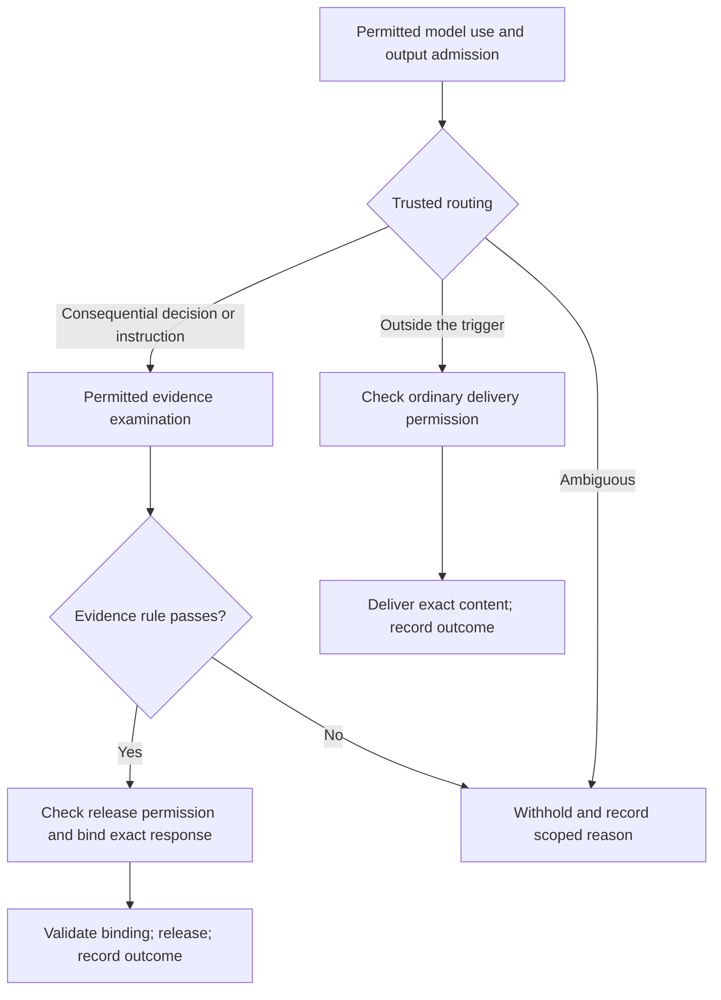
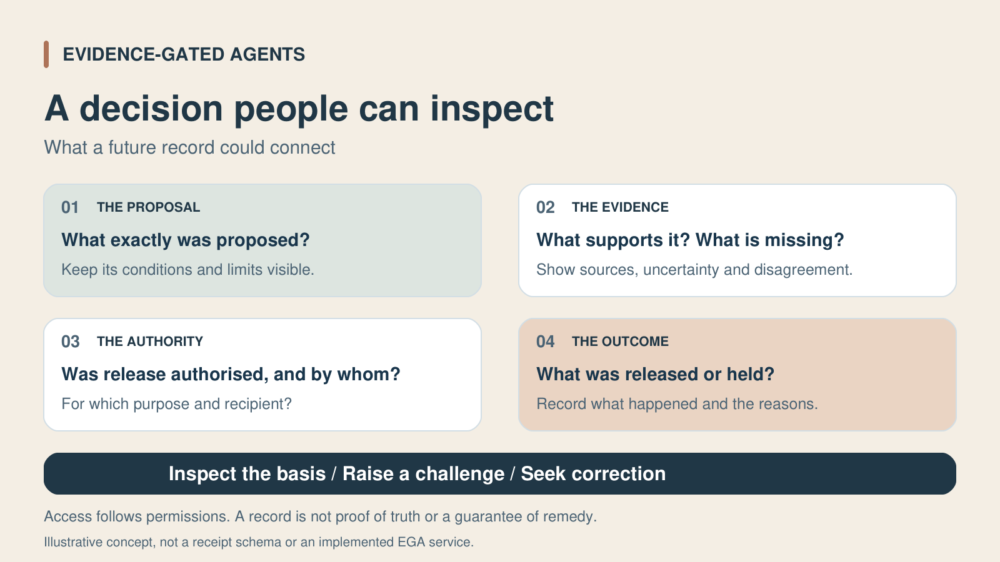

<!-- SPDX-License-Identifier: CC-BY-SA-4.0 -->
> **Status: DRAFT**

# EGA: the first prototype

**Can evidence examination and separate release controls reduce unsupported recommendations while retaining useful answers?** The first Evidence-Gated Agents integration is intended to test that question in one bounded workflow. **It remains unimplemented.** FactHarbor Alpha and the Charter Runtime proof of concept are existing foundations, not evidence that their integration works.

The [EGA overview](evidence-gated-agents.md) explains the wider design. This page describes the proposed prototype's behaviour and limits; [the research page](evidence-requirements-research.md) sets out the wider claims and their evaluation commitments.

## Scope

A normal AI agent answers a free request in a bounded German/English path. Controlled evaluation concerns **one clear decision with human-defined evidence rules**; it does not establish reliable handling of every free request or several independent decision/effect paths. The prototype uses synthetic mandates, which do not establish real-world authority.

The selected effect is **recommendation release to an intended recipient**. Making a checked response available does not mean the recipient read it, and does not execute or authorise a resulting action. A later action needs its applicable checks; an existing mandate may cover it without another human approval.

## Proposed workflow

*On narrow screens, scroll the diagram horizontally. The description below explains its routes.*

This diagram shows the two routes, not every failure exit. Every permission or validation check can stop its step. Examination is submitted only through a permitted route; its result does not itself grant release permission. Ordinary delivery skips consequential-output examination, not disclosure controls. Unknown examination, commitment or delivery outcomes require [reconciliation](#correction-and-uncertain-outcomes), not an automatic retry. A changed response starts a new checked attempt.

| Component | Responsibility |
|---|---|
| Working AI | Prepare the exact response within permitted model/data use; it cannot choose its routing or authorise release. |
| Trusted routing | Apply the preset, versioned trigger to admitted content; stop if routing is ambiguous. |
| Evidence service | Retrieve permitted documents, passages or structured records with provenance and coverage limits; no support/contradiction judgment. |
| EGA analysis | Assess the complete response against the approved checklist, including components, dependencies, counterevidence and gaps. |
| Independent controls | Apply the evidence rule and current authority/disclosure requirements to bound inputs; the analytical verdict is not permission. |
| Release and record services | Request fresh binding of the permitted release, validate its one-use intent and record actual or uncertain availability to the recipient. |

These are logical responsibilities, not selected deployment processes. Planned reuse of FactHarbor capabilities does not make its full analytical API a retrieval-only service. Component separation or a transitional adapter remains an implementation investigation.

### Admission and routing

Before the acting model receives data, checks establish permitted system use, purpose, provider/model and disclosure. Currentness is checked again at output admission. Unusable approval stops processing. Admission does not itself permit submission to retrieval, extraction or analysis processors, or disclosure to the final recipient.

A preset trigger routes consequential decisions and instructions into full examination. **A standalone consequential factual claim can remain outside this trigger.** Broadening that trigger is a separate decision. Misrouting an in-scope decision as ordinary is a failure to measure; ordinary routing is not proof that the response is safe or true.

Ordinary delivery protects exact content, recipient and current permission. It does not universally require consequential Commit or an EGA receipt. Its content-free routing record contains the trigger decision, rule version, request/response fingerprints, timestamp and attempt ID. Uncertain delivery still needs reconciliation.

### Examination and the evidence rule

The examination is bound to the **complete recipient-visible response and approved human-defined checklist**. Analysis assesses every approved requirement and examines identified components, dependencies and gaps. Retrieved content remains evidence to assess, not instructions or authority. Any applicable check may request permitted evidence; broader live authority retrieval is not an additional prerequisite for this synthetic-mandate prototype.

The evidence rule applies a predefined, reviewed mapping to bound assessments; controls make no new semantic judgment. Missing or uninterpretable required fields, known material coverage gaps, unresolved material contradiction, insufficient support or technical error stop release. A qualified decision can pass with counterevidence if the rule is satisfied. **A caveat in the analysis cannot repair an unsupported assertion in the response.** Narrowing that assertion creates a new proposal.

An accepted examination may remain pending within its evaluation window. A complete usable assessment is required by the deadline; late results cannot revive a stopped attempt. A temporary ruling may be refreshed only in a still-open, uncommitted attempt with unchanged valid authority and bindings. This extends neither the deadline nor the mandate, and no protected step relies on an expired ruling.

### Release and recording

Release control adjudicates current release authority and recipient disclosure, then binds the request and permitted context, exact response, recipient and evidence result. Unresolved permission prevents binding. At commitment, the applicable checks are freshly verified; the executor then validates the exact one-use binding, without a second authority adjudication. Error after binding does not erase commitment or prove that nothing was released.

Record established success, confirmed no effect, known failure or uncertainty while preserving commitment history. Availability is not proof of reading. Records and explanations reveal only what their audience may see, with inspection and challenge routes; early stops do not invent objects or receipts that never existed.

### Correction and uncertain outcomes

Prototype stops close the attempt. Where correction work and feedback are permitted, a revised request or response starts at model admission and trusted routing in a **new attempt**, without inherited routing or bound assessment. A model/provider lacking permission cannot receive feedback or perform the revision. Authorised human judgment may address a specific issue where useful; it cannot supply missing evidence or authority or reopen a closed attempt.

Unknown examination acceptance, commitment and delivery remain distinct. Establish the relevant status before any next step that risks duplicate work/effects; a new attempt ID does not remove that risk. The overview's [permitted correction](evidence-gated-agents.md#permitted-correction) and [R1–R3 recovery rules](evidence-gated-agents.md#recovery-routes) apply, including to uncertain ordinary delivery without inventing a consequential receipt.

## What an inspectable receipt could show

**Fictional, shortened display examples, not generated receipts.** Identifiers, times and outcomes are invented; these are not complete receipt schemas.

### Example 01: decision released

| Visible item | Example |
|---|---|
| Decision and authority | “Method A is recommended for the described test; this does not apply to other conditions.” Demo mandate M1 permits release to the test recipient. |
| Evidence examination | FactHarbor job FH-1 found supporting evidence and a limitation on transfer to other conditions; sources and uncertainty are visible. |
| Checks | Authority, disclosure and the simple evidence rule pass at 10:15. Commit binds the exact decision and recipient. |
| Release | The checked decision was released to the specified recipient and the outcome was recorded. |
| Inspect or challenge | Inspect the request, decision fingerprint, evidence result, gate decisions and recorded outcome. A linked view shows how to question it. |

### Example 02: evidence pending at the deadline

| Visible item | Example |
|---|---|
| Decision | The evaluation deadline is reached at 10:15; Verify stops release. |
| Reason | FactHarbor job FH-2 has not reached a terminal result (`evidence-pending`). |
| Effect | No decision was released. A later FactHarbor result does not trigger automatic release. |
| Inspect | The receipt links the request, exact decision, job state and stop reason. A new attempt must pass every check again. |

Links and fingerprints support checking bound versions and recorded steps. They do not prove truth, legitimate authority, independent oversight or recipient reading. Independent review and effective remedy need more than a receipt.

## Evaluation and reporting

The planned prototype evaluation covers:

- Enforcement integrity, including failed or omitted checks, replay and bypass attempts.
- Misrouting of in-scope decisions as ordinary, assessed separately from enforcement.
- Unsupported releases, unjustified stops and useful qualified answers.
- Missed decision components, German/English differences and selected repeat-run variation.
- Failures, cost and delay.

Report successes and failures, producing evidence for deciding whether to **continue, revise or stop**. Co-development agreements would define development scope, comparisons, acceptance criteria, reporting, confidentiality and publication arrangements. Those arrangements **do not replace** the wider research's [public evaluation commitments](evidence-requirements-research.md#evaluation-commitments), including a dated protocol before held-out exposure and preservation of failed attempts.

## Limits and preparation still open

The prototype uses human-defined evidence rules. It does not establish automatic derivation of adequate requirements for unfamiliar decisions or the benefit of a separate requirement reviewer. Those remain [wider research questions](evidence-requirements-research.md#the-research-question).

Model-assisted routing and analysis can miss consequential components. Passing is not proof of truth, completeness or broad deployment readiness. Synthetic mandates, records and separated responsibilities do not demonstrate legitimate real-world authority, independent governance or effective remedy. Confidential-source handling and wider action workflows need their own scope and evaluation.

Exact routing fixtures, schemas, criteria, timing and Runtime compatibility remain open. FactHarbor component separation or a transitional adapter, and grouped versus separate ruling/binding, remain implementation choices. Existing [Runtime contracts and documented limits](https://github.com/robertschaub/ai-charter-runtime#honest-limits--read-this-first) retain their own authority; this proposed description does not implement or amend them.
