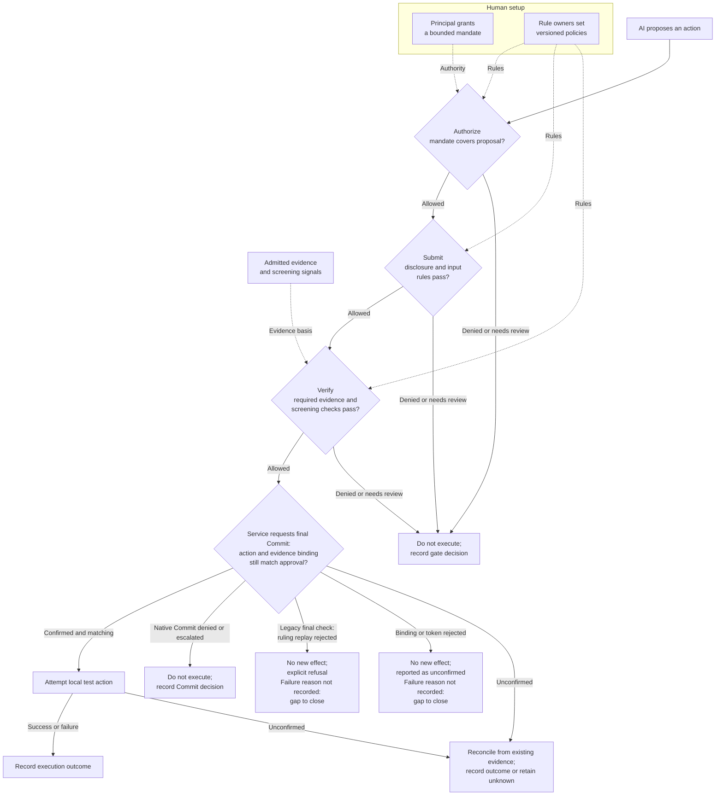
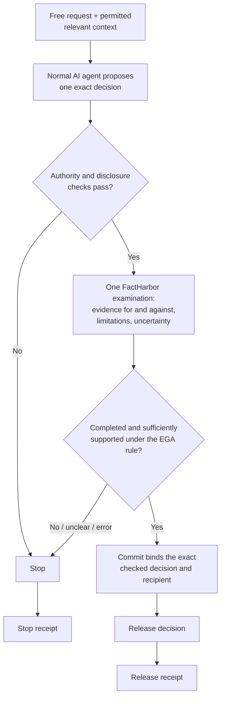

# Evidence-Gated Agents

*Project overview and development direction. EGA is at an early stage; this page explains its goals and does not define implementation obligations.*

Evidence-Gated Agents (EGA) aims to develop AI-assisted decision-making applications and reusable components that keep consequential answers and actions authorised, grounded in evidence, and open to inspection and challenge.

Consequential answers and actions include those affecting people’s rights, access to services or significant resources.

The goal is to help people and organisations make and justify decisions while retaining control over what AI may do and how errors can be corrected. This work serves a broader aim: a free and fair society in which technology supports democracy, justice and well-grounded decisions.

## Who it is for and what it could become

The intended users include people preparing or reviewing decisions, organisations responsible for AI-supported work, and developers integrating controls into their systems. People receiving or affected by the resulting answers and actions also need to understand their basis and have a route to question them.

Two possible development paths are being considered:

- **Applications and services** that organisations could use directly and configure for their needs and working environments.
- **Reusable architecture and components** that software providers or internal development teams could adapt and integrate into existing applications.

Both paths would need evidence of practical usefulness and suitability in their intended settings.

## What the project aims to make possible

The central rule is: **before AI gives a consequential answer or takes a consequential action, it must have permission and enough evidence to justify it.**

The intended approach connects five responsibilities:

1. **Establish authority and limits.** Accountable people define who may do what, for which purpose, using which data and tools. The basis of that authority must itself be reviewable.
2. **Use permitted information and examine the evidence.** Check both whether a source may be used and what it can establish. Make material claims, assumptions, supporting evidence, counterevidence and uncertainty visible. Assess whether that evidence is current and sufficient for the particular proposed use.
3. **Control what proceeds.** Checks outside the acting model govern whether the exact proposal may be released or executed. Before acting, the executing service requests a fresh verification of the approval and checks that the intended action matches it.
4. **Make the outcome inspectable.** Provide an accessible record connecting the answer or action, authority, evidence, decision and actual outcome, with access appropriate to the people involved.
5. **Support challenge and correction.** Let affected people question the basis, route disputes to responsible reviewers, and revisit decisions when evidence or authority changes.

The acting AI cannot authorise itself. Software can enforce recorded rules and decisions, while evidence adequacy and legitimate authority require accountable judgment. Human involvement should focus on decisions where a person can make a meaningful difference; an approval click cannot supply missing evidence.

As an illustrative future use, a procurement team might review an AI-generated supplier recommendation. A claim about guaranteed performance would need evidence addressing that guarantee; a generally positive report would not settle it. If that premise remained unsupported, the recommendation should be held or narrowed and checked again. The record should show the evidence, who authorised the next step and what actually happened.

## Foundations and the selected next step

EGA draws on three related pieces of work:

- **[FactHarbor Alpha](https://github.com/robertschaub/FactHarbor#what-is-factharbor)** assesses claims using supporting and opposing evidence and makes sources and uncertainty inspectable.
- **[Our AI Charter Runtime](https://github.com/robertschaub/ai-charter-runtime#honest-limits--read-this-first)** is a separate, unfinished proof of concept for controls outside the acting model. Its demonstrations use simulated scenarios and a local test action.
- **[Our AI Charter](../Framework/charter-commitments.md)** provides the broader principles for accountable AI use, including authority, evidence, oversight and remedy.

**Selected next step:** build a bounded prototype in which a normal AI agent proposes a decision and FactHarbor examines whether current evidence sufficiently supports that exact decision for the user’s request. The gate then releases the checked decision or stops it. This integration is not yet implemented.

### View 1 — Existing Runtime: control of one proposed action

**Purpose:** show the control mechanism that already exists in the separate Runtime proof of concept and could be reused by EGA. This is not the EGA prototype: it uses admitted evidence and screening signals, does not call FactHarbor, and ends only in a local test action.

**How to read it:** follow the solid arrows from the AI proposal through `Authorize`, `Submit`, `Verify` and `Commit` to a local test action or a recorded stop. Dotted arrows supply the mandate, rules and admitted evidence established outside the acting model. A separate service request starts the final `Commit` check; it does not grant a new mandate.

The legitimacy of the mandate must be established by people; this proof of concept does not establish it. Rulemaker, operator and record keeper are simulated by one person; independent reviewer and remedy decider are absent. See the [runtime's documented limits](https://github.com/robertschaub/ai-charter-runtime#honest-limits--read-this-first).

**Failures need records too.** A refused check and a failed execution are different results; neither should disappear from the record. An unconfirmed outcome must remain unresolved until evidence establishes it. The native runtime records Commit deny/escalate rulings and completed execution outcomes. Separately, [early legacy final-check defects return without transaction operations](https://github.com/robertschaub/ai-charter-runtime/blob/cad927a697814b20c327bf61c49b9d38cfc7470e/packages/gate-core/src/authorizationCore.ts#L2721-L2732); [empty-operation results are not appended to the write-ahead log](https://github.com/robertschaub/ai-charter-runtime/blob/cad927a697814b20c327bf61c49b9d38cfc7470e/packages/gate-core/src/walStore.ts#L360-L361), so those defects have no durable failure record. The services host can also [report some token or binding rejections as unconfirmed without retaining the specific failure reason](https://github.com/robertschaub/ai-charter-runtime/blob/cad927a697814b20c327bf61c49b9d38cfc7470e/packages/services-mock/src/servicesHost.ts#L189-L191). The proposed answer adapter must define those missing failure records separately from the effect ledger. This is a development requirement, not a claim of complete current coverage.

### View 2 — Selected EGA prototype: FactHarbor check before decision release

**Purpose:** show the planned bounded integration of a normal AI agent, FactHarbor and reusable Runtime controls. Unlike View 1, this path releases a checked decision and does not execute a resulting action.

**How to read it:** follow the request to the normal agent's exact decision, through authority and disclosure checks, one FactHarbor examination and the EGA release rule. `Commit` binds the checked version; release and stop both produce a receipt.

The controlled evaluation selects requests expected to yield one clear, non-complex decision. Free requests remain available for exploration. A decision may contain related components, but the prototype does not test several independent decision and effect paths.

FactHarbor does not need to reproduce the agent's wording and does not decide the EGA release. It supplies the evidence record; the gate applies the release rule. A pending FactHarbor job, contradiction, insufficient evidence, ambiguous output or technical error stops the attempt. Completion never causes an automatic later release: a retry is a new attempt through all checks.

**Why Commit?** The service rechecks the bound request, decision, recipient and evidence result immediately before release. A changed or narrower decision cannot reuse an earlier approval. The [release contract](../../wip/evidence-gated-agents-spec.md#spec-1) defines that boundary.

The prototype's real effect is releasing the checked decision. It does not execute a resulting action or check authority for that action. A later EGA would need a new authorization and evidence check at every autonomous action boundary.

**Known limit:** FactHarbor's decomposition is model-assisted and may miss a consequential component. The evaluation compares the complete decision with the components FactHarbor identified and reports omissions, language differences and selected repeat-run variation. A release is not proof that the decision is true or complete.

### What an inspectable receipt could show

**Fictional, shortened display examples, not generated receipts.** All identifiers, times and outcomes below are invented. These excerpts do not replace the full [receipt specification](../../wip/evidence-gated-agents-spec.md#spec-4).

**Example 01, attempt 1: decision released**

| Visible item | Example |
|---|---|
| Decision and authority | “Method A is recommended for the described test; this does not apply to other conditions.” Demo mandate M1 permits release to the test recipient. |
| Evidence examination | FactHarbor job FH-1 found supporting evidence and a limitation on transfer to other conditions; sources and uncertainty are visible. |
| Checks | Authority, disclosure and the simple evidence rule pass at 10:15. Commit binds the exact decision and recipient. |
| Release | The checked decision was released to the specified recipient and the outcome was recorded. |
| Inspect or challenge | Inspect the request, decision fingerprint, evidence result, gate decisions and recorded outcome. A linked view shows how to question it. |

**Example 02, attempt 1: evidence still pending**

| Visible item | Example |
|---|---|
| Decision | Verify stops release at 10:15. |
| Reason | FactHarbor job FH-2 has not reached a terminal result (`evidence-pending`). |
| Effect | No decision was released. A later FactHarbor result does not trigger automatic release. |
| Inspect | The receipt links the request, exact decision, job state and stop reason. A new attempt must pass every check again. |

Links and fingerprints support checking the bound versions and recorded steps. They do not prove the answer true, the authority legitimate, the oversight independent or the answer read by its recipient. Complete independent review and remedy require more than a receipt.

## Longer-term development and open research

Later work could extend the same approach to permitted organisational sources and further agent, tool and action workflows. Each extension would need suitable authority, privacy controls, evidence requirements and evaluation. Effective independent review and remedy would also require institutions with the power to act.

One research strand asks whether AI can identify adequate evidence requirements for unfamiliar questions, discover overlooked assumptions and have those requirements critically reviewed, without people writing a separate checklist for every question. This could broaden reuse; its reliability remains to be demonstrated.

Success means useful, supported answers and actions with fewer unjustified releases, understandable records and workable correction routes. Testing must also expose unnecessary blocking, missed claims, cost and practical limitations. Enforcing a gate does not establish that an answer is true, and agreement between AI reviewers does not establish that their judgment is adequate.

The [user needs and requirements](../../wip/evidence-gated-agents-requirements.md) and [technical specification](../../wip/evidence-gated-agents-spec.md) describe the proposed capabilities and their limits. Both are working drafts; an implementation baseline remains to be adopted.

## Research detail

-  [AI-derived evidence requirements](evidence-requirements-research.md#aspiration-mostly-generic-evidence-gated-agents)
-  [Research questions and evaluation](evidence-requirements-research.md#test-of-the-aspiration)
-  [Prototype-to-research coverage](evidence-requirements-research.md#path-from-the-prototype-to-wider-use)
