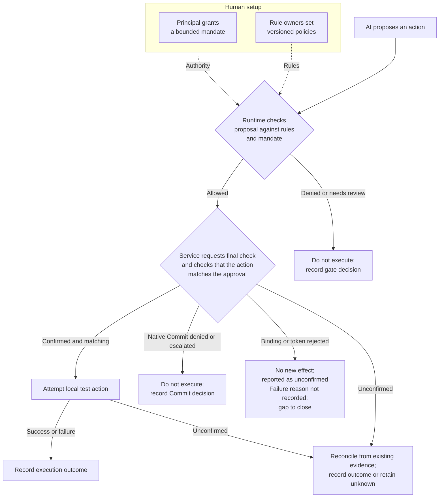
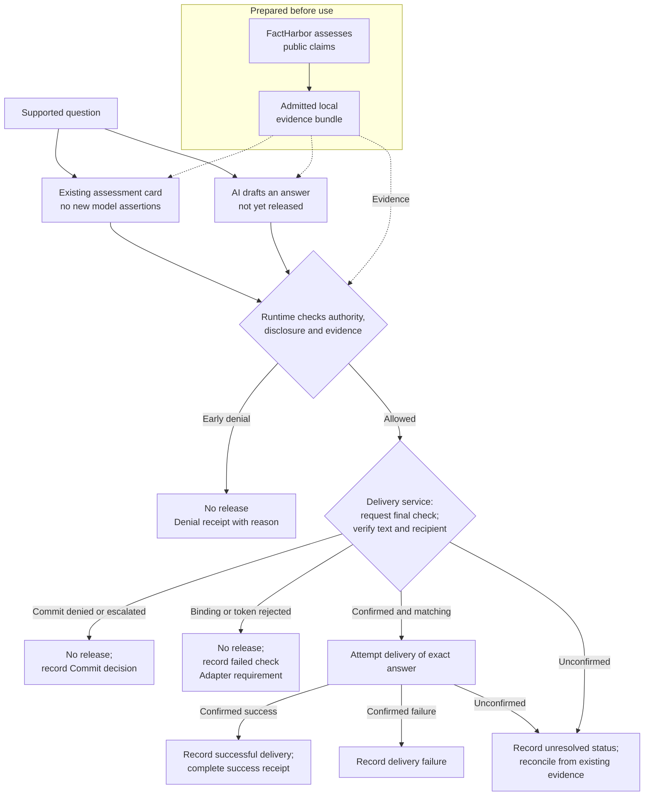

# Evidence-Gated Agents

*Project overview and development direction. EGA is at an early stage; this page explains its goals and does not define implementation obligations.*

Evidence-Gated Agents (EGA) aims to develop AI-assisted decision-making applications and reusable components that keep consequential answers and actions authorised, grounded in evidence, and open to inspection and challenge.

Consequential answers and actions include those affecting people’s rights, access to services or significant resources.

The goal is to help people and organisations make and justify decisions while retaining control over what AI may do and how errors can be corrected. This work serves a broader aim: a free and fair society in which technology supports democracy, justice and well-grounded decisions.

## Who it is for and what it could become

The intended users include people preparing or reviewing decisions, organisations responsible for AI-supported work, and developers integrating controls into their systems. People receiving or affected by the resulting answers and actions also need to understand their basis and have a route to question them.

Two possible development paths are being considered:

- **Applications and services** that organisations could use directly and configure for their needs and working environments.
- **Reusable architecture and components** that software providers or internal development teams could adapt and integrate into existing applications.

Both paths would need evidence of practical usefulness and suitability in their intended settings.

## What the project aims to make possible

The central rule is: **before AI gives a consequential answer or takes a consequential action, it must have permission and enough evidence to justify it.**

The intended approach connects five responsibilities:

1. **Establish authority and limits.** Accountable people define who may do what, for which purpose, using which data and tools. The basis of that authority must itself be reviewable.
2. **Use permitted information and examine the evidence.** Check both whether a source may be used and what it can establish. Make material claims, assumptions, supporting evidence, counterevidence and uncertainty visible. Assess whether that evidence is current and sufficient for the particular proposed use.
3. **Control what proceeds.** Checks outside the acting model govern whether the exact proposal may be released or executed. Before acting, the executing service requests a fresh verification of the approval and checks that the intended action matches it.
4. **Make the outcome inspectable.** Provide an accessible record connecting the answer or action, authority, evidence, decision and actual outcome, with access appropriate to the people involved.
5. **Support challenge and correction.** Let affected people question the basis, route disputes to responsible reviewers, and revisit decisions when evidence or authority changes.

The acting AI cannot authorise itself. Software can enforce recorded rules and decisions, while evidence adequacy and legitimate authority require accountable judgment. Human involvement should focus on decisions where a person can make a meaningful difference; an approval click cannot supply missing evidence.

As an illustrative future use, a procurement team might review an AI-generated supplier recommendation. A claim about guaranteed performance would need evidence addressing that guarantee; a generally positive report would not settle it. If that premise remained unsupported, the recommendation should be held or narrowed and checked again. The record should show the evidence, who authorised the next step and what actually happened.

## Foundations and the next step

EGA draws on three related pieces of work:

- **[FactHarbor Alpha](https://github.com/robertschaub/FactHarbor#what-is-factharbor)** assesses claims using supporting and opposing evidence and makes sources and uncertainty inspectable.
- **[Our AI Charter Runtime](https://github.com/robertschaub/ai-charter-runtime#honest-limits--read-this-first)** is a separate, unfinished proof of concept for controls outside the acting model. Its demonstrations use simulated scenarios and a local test action.
- **[Our AI Charter](../Framework/charter-commitments.md)** provides the broader principles for accountable AI use, including authority, evidence, oversight and remedy.

### How the runtime controls a proposed action

The principal grants a bounded mandate; rule owners set versioned policies outside the acting model. These specify permitted actions and limits. The legitimacy of that authority must be established by people; this proof of concept does not establish it. Rulemaker, operator and record keeper are simulated by one person; independent reviewer and remedy decider are absent. See the [runtime's documented limits](https://github.com/robertschaub/ai-charter-runtime#honest-limits--read-this-first).

**Both figures are flowcharts:** solid arrows show the path and its branches; dotted arrows supply rules or prepared evidence. Several gates are condensed. In the native runtime, a separate user request starts the final check without granting authority. Granting a mandate is not a step repeated for every proposal.

**Failures need records too.** A refused check and a failed execution are different results; neither should disappear from the record. An unconfirmed outcome must remain unresolved until evidence establishes it. The native runtime records Commit deny/escalate rulings and completed execution outcomes, but some [token or binding rejections return without a durable failure record and are reported to the caller as unconfirmed](https://github.com/robertschaub/ai-charter-runtime/blob/cad927a697814b20c327bf61c49b9d38cfc7470e/packages/services-mock/src/servicesHost.ts#L189-L191). The proposed answer adapter must define that missing failure record separately from the effect ledger. This is a development requirement, not a claim of complete current coverage.

### Proposed prototype: the answer-delivery path

The proposed first EGA prototype, subject to funding and an agreed scope, would connect FactHarbor and the runtime in a bounded German/English answer-delivery path. It would use a prepared bundle of public evidence, check an answer before release, provide an inspectable receipt and support bounded challenges and correction. Answer delivery would be its only real action type; other actions would remain simulated.

This prototype checks the evidence dependencies the drafting model declares. Unsupported assertions it fails to declare can escape those checks; evaluation must examine that limitation.

The user selects a supported question. An existing assessment can be shown as a card without new model assertions, or used to draft a new answer. [Both paths need release checks](../../wip/evidence-gated-agents-requirements.md#req-1). Selecting a question does not start a new FactHarbor analysis. See [answer behaviour and declared dependencies](../../wip/evidence-gated-agents-spec.md#spec-3).

**Why check again?** Approval and execution are separate steps. The service requests a fresh check of the approval and its bound values, then verifies the exact text and recipient before delivery. This catches a changed answer or an approval invalidated before commitment; it does not repeat FactHarbor's research. The [release contract](../../wip/evidence-gated-agents-spec.md#spec-1) defines the binding point and retry rules. A Commit denial here is recorded after the service has been called; the early-denial receipt below does not describe that later failure.

An authorised operator may narrow a request only when evidence is insufficient or not established and the unsupported premise can safely be removed. The revised answer must pass all checks again; a visible narrowing flag remains where required. The diagram omits that review loop and the recovery steps. An unresolved outcome must not be labelled as no delivery or retried as a new delivery without resolving the earlier attempt.

### What an inspectable receipt could show

**Fictional, shortened display examples, not generated receipts.** All identifiers, times and outcomes below are invented. These excerpts do not replace the full [R7 receipt requirements](../../wip/evidence-gated-agents-spec.md).

**Example 01, revision 1: answer released**

| Visible item | Example |
|---|---|
| Answer and authority | “In the reported test, method A used less electricity.” Demo principal permits this answer for the test recipient under mandate M1. |
| Evidence | Assessment EN-1, version 2 supports this limited claim; its evidence is current at the check. Links expose sources and limitations. |
| Checks and oversight | Authority, disclosure and evidence pass at 10:15. No narrowing; no flag or stop (Silent). |
| Execution | The approved answer was delivered to the specified recipient; the outcome is recorded. Technical references: commitment CMT-1, consumed token and service acceptance. |
| Inspect or challenge | Inspect the mandate, exact answer fingerprint, assessment versions, gate decisions and recorded outcome. A linked challenge view shows the route and resolution status. |

**Example 02, revision 1: early refusal**

| Visible item | Example |
|---|---|
| Decision | Evidence check denies release at 10:15; oversight state: Stop. |
| Reason | The referenced assessment EN-2, version 1 expired at 10:00 that day. |
| Effect | No commitment, token, delivery-service call or answer release was created for this early refusal. |
| Inspect | Reference to the assessment and recorded gate decision. The refusal does not establish that the proposed claim is false. |

Links and fingerprints support checking the bound versions and recorded steps. They do not prove the answer true, the authority legitimate, the oversight independent or the answer read by its recipient. Complete independent review and remedy require more than a receipt.

## Longer-term development and open research

Later work could extend the same approach to evidence gathered when needed, permitted organisational sources, and further agent, tool and action workflows. Each extension would need suitable authority, privacy controls, evidence requirements and evaluation. Effective independent review and remedy would also require institutions with the power to act.

One research strand asks whether AI can identify adequate evidence requirements for unfamiliar questions, discover overlooked assumptions and have those requirements critically reviewed, without people writing a separate checklist for every question. This could broaden reuse; its reliability remains to be demonstrated.

Success means useful, supported answers and actions with fewer unjustified releases, understandable records and workable correction routes. Testing must also expose unnecessary blocking, missed claims, cost and practical limitations. Enforcing a gate does not establish that an answer is true, and agreement between AI reviewers does not establish that their judgment is adequate.

The [user needs and requirements](../../wip/evidence-gated-agents-requirements.md) and [technical specification](../../wip/evidence-gated-agents-spec.md) describe the proposed capabilities and their limits. Both are working drafts; an implementation baseline remains to be adopted.

## Research detail

-  [AI-derived evidence requirements](evidence-requirements-research.md#aspiration-mostly-generic-evidence-gated-agents)
-  [Research questions and evaluation](evidence-requirements-research.md#test-of-the-aspiration)
-  [Prototype-to-research coverage](evidence-requirements-research.md#path-from-the-prototype-to-wider-use)
