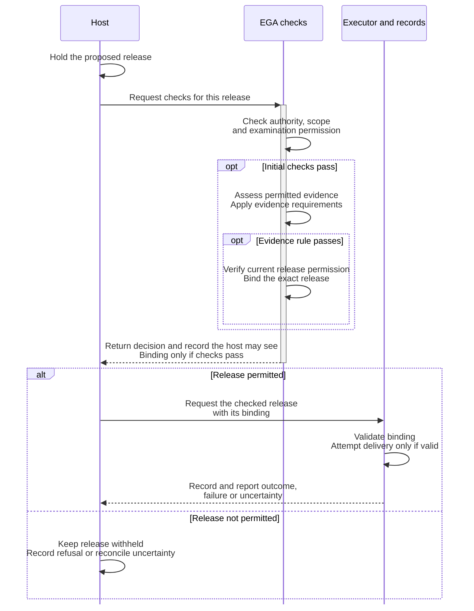

# Evidence-Gated Agents

**Before we rely on an AI recommendation, does the evidence justify it—for this purpose?**

An AI assistant recommends a supplier, citing satisfied customers and strong average performance. Neither establishes the contractual response-time guarantee your organisation needs. A useful answer identifies that gap; a consequential recommendation should not pass simply because it sounds convincing.

**Evidence-Gated Agents (EGA) is a proposed design connecting evidence examination with controls outside the acting AI.** It checks the evidence and authority needed before a consequential claim, decision or action instruction may proceed, and preserves a basis for inspection, challenge and correction. The wider design includes authorised actions; the first integration targets recommendation release.

Start with the concepts below, the [first prototype](evidence-gated-agents-prototype.md), or [what the research needs to demonstrate](evidence-requirements-research.md). The [short illustrated introduction](../../Published/evidence-gated-agents-before-we-rely.md) explains the motivation.

## Who it is for and what it could become

EGA is intended for people preparing or reviewing decisions, organisations responsible for AI-supported work, and developers integrating controls into their systems. People receiving or affected by results need to understand their basis and have a route to question them. The work could support configurable applications or reusable components; both remain development directions.

## Foundations and the selected next step

| Foundation | What exists today |
|---|---|
| **[FactHarbor Alpha](https://github.com/robertschaub/FactHarbor#what-is-factharbor)** | Searches and analyses supporting and opposing evidence, with sources and uncertainty visible. It remains an [invite-gated Alpha with quality limitations](https://github.com/robertschaub/FactHarbor/blob/main/CONTRIBUTING.md#known-limits). |
| **[Our AI Charter Runtime](https://github.com/robertschaub/ai-charter-runtime#honest-limits--read-this-first)** | A runnable proof of concept demonstrates controls outside the acting model, using synthetic scenarios and local test effects. It does not yet call FactHarbor. |
| **[Our AI Charter](../Framework/charter-commitments.md)** | The principles connecting authority, evidence, privacy, independent oversight and remedy. |

**The next milestone is one bounded recommendation workflow integrating and evaluating these foundations. The integration remains to be built.** It would use human-defined evidence rules, examine the exact proposed decision and control its release. It would not execute or authorise the resulting action.

## How the design works

**The working AI proposes an answer or action; the host controls whether it can be released or executed.** The host is the application or runtime in which the AI operates. When trusted rules route a check to EGA, the host calls it and withholds the requested operation. EGA controls the checking procedure until it returns a decision; the host then enforces that decision outside the acting AI. Returning control is not permission to proceed.

### Where checks apply—and who chooses them

Accountable people establish permissions, disclosure rules and acceptance policy. **Trusted rules select the applicable checks; the working AI cannot exempt its own proposal.** The first prototype uses human-defined evidence requirements. Automatically deriving adequate requirements for unfamiliar decisions remains a [research question](evidence-requirements-research.md#the-research-question).

For recommendation release, enforcement means the host holds the answer and permits delivery only under the required checks. An unchecked alternative delivery path would defeat that boundary. This is a design requirement to test against [omitted checks, bypass and replay](evidence-gated-agents-prototype.md#evaluation-and-reporting), not an established guarantee. Wider tool and action workflows need their own scope and evaluation.

The prototype's [preset routing rule](evidence-gated-agents-prototype.md#admission-and-routing) sends consequential decisions and instructions through full evidence examination. Ordinary responses still need delivery permission; ambiguous routing withholds the response. Applying that rule to content can be wrong: misrouting must be measured separately from enforcement failure. Standalone consequential factual claims can remain outside the trigger.

### One EGA call before recommendation release

In the supplier example, the host withholds the recommendation while EGA checks whether the permitted evidence establishes the required response-time guarantee and whether this exact answer may be released. Customer satisfaction alone does not establish that guarantee.

A **binding** ties permission to one exact release—including its answer, recipient, permitted context and evidence result—and is valid for one use. The executor validates it before attempting delivery. The diagram groups these checking responsibilities to explain the handoff, rather than specifying the service calls used to request commitment. Whether ruling and binding use grouped or separate calls remains an [open integration choice](evidence-gated-agents-prototype.md#limits-and-preparation-still-open).

```mermaid
%%{init: {"sequence": {"mirrorActors": false, "actorMargin": 35, "width": 145, "messageMargin": 30}}}%%
sequenceDiagram
    participant H as Host
    participant G as EGA checks
    participant X as Executor and records
    H->>H: Hold the proposed release
    H->>+G: Request checks for this release
    G->>G: Check authority, scope<br/>and examination permission
    opt Initial checks pass
        G->>G: Assess permitted evidence<br/>Apply evidence requirements
        opt Evidence rule passes
            G->>G: Verify current release permission<br/>Bind the exact release
        end
    end
    G-->>-H: Return decision and record the host may see<br/>Binding only if checks pass
    alt Release permitted
        H->>X: Request the checked release<br/>with its binding
        X->>X: Validate binding<br/>Attempt delivery only if valid
        X-->>H: Record and report outcome,<br/>failure or uncertainty
    else Release not permitted
        H->>H: Keep release withheld<br/>Record refusal or reconcile uncertainty
    end
```

*Read downward for time; the columns show responsibility. The bar in EGA's column marks control from call to return. “opt” means continue only if its condition holds; “alt” and “else” show the two possible results. On narrow screens, scroll horizontally.*

Permission to prepare an answer does not authorise disclosing it to another service. The host needs permission for any disclosure made by the gate call; EGA checks permission for examination before involving retrieval or analysis processors. The final authority check protects the exact release. These are distinct checks, and an existing mandate can cover them without another human approval. [Authority and disclosure checks](evidence-requirements-research.md#what-goes-into-a-checkand-what-comes-out) apply before model use, examination and release.

In the prototype, an accepted examination can remain pending within its evaluation window. If no usable assessment is available by the deadline, the attempt stops without release; a late result cannot reopen it. If submission, commitment or delivery status is unknown, follow the [recovery rules](#recovery-routes) before anything that could duplicate work or effects.

The diagram describes logical responsibilities in the proposed integration, not deployed services. EGA includes evidence analysis and independent controls; their different roles are set out below. Its checks can use permitted evidence to establish authority, but later evidence cannot authorise an earlier disclosure. A changed proposal starts a new attempt through applicable checks; permitted revision and human review cannot bypass them.

### Evidence for the particular decision

Any check may request evidence, including evidence of permission, authority or delegation. **Finding material and judging what it establishes are different responsibilities.**

| Responsibility | Contribution to the design |
|---|---|
| Working AI | Prepares an exact proposal within existing permission. |
| Evidence service | Retrieves permitted material, source references and search limits; it does not judge support or contradiction. |
| EGA analysis | Assesses support, contradiction, uncertainty, dependencies and gaps for the intended use. |
| Independent controls | Apply the applicable authority, evidence and disclosure rules; an analytical verdict is an input, not permission. |
| Executor and records | Perform the checked step within its binding and preserve the actual outcome for scoped inspection. |

Evidence supporting a recommendation cannot substitute for permission to release it or act on it.

When a summary contains consequential content

A summary can contain a decision or instruction. **Faithfulness to a source, support for its factual claims and sufficiency for a decision require separate examination.** Accurately reporting what someone said does not establish that their claims are true. A recommendation must not silently become an approved decision, or a forecast an established fact; conditions, risks, dissent and unresolved questions remain relevant.

Permission to release a report does not establish authority for the decision it describes. Where essential judgment is missing, human review identifies the particular unresolved issue rather than supplying missing evidence by sign-off.

### Authority, binding and actual outcomes

Accountable people establish authority and its basis, purpose, delegation and limits. A signed grant alone does not prove its issuer held that authority. Permission may expire, change or be revoked; its basis remains reviewable.

In the wider action design, authority is freshly verified at the commitment boundary and bound to the exact proposal. The executor then validates the one-use binding; this is not another authority adjudication after commitment. Record confirmed success, confirmed no effect, known failure or uncertainty, preserving commitment history. An error does not prove that nothing happened. Each later protected step faces its own applicable checks; an existing mandate may cover it without another human approval.

Routine checks run within agreed limits. Human judgment is conditional: the stakes justify interruption, an authorised person can resolve a specific issue, and existing authority is insufficient to resolve it automatically. It cannot supply missing evidence or authority or reopen a closed attempt. The [operational gates and lifecycle responsibilities](user-workflow-governance.md) remain distinct from this common check pattern.

### Data protection and accountability

**Access, processing and disclosure are separate permissions.** Permission to consult a record does not automatically permit sending it to a retrieval, extraction or analysis service, or revealing it to a recipient. Retrieval uses an already-permitted route; evidence found later cannot retroactively authorise the request that exposed it.

Data protection covers requests, search results, released output and record views. Records need bounded content, access and retention; accountability must not become an unrestricted copy of confidential evidence. The [Charter's privacy commitments](../Framework/charter-commitments.md) apply throughout, including using only the information needed for the permitted purpose.

The design connects five responsibilities: establish authority; examine permitted evidence; control what proceeds; make outcomes inspectable; support challenge, correction and review of reliance when evidence or authority changes. The [governance model](../../Published/when-vs-who-ai-governance.md) separates rulemaking, operation, record custody, independent review and remedy—not five approvals for every answer. The design calls for independent custody so the operator cannot control the whole record/review chain; sealed records must be protected against unilateral access. Binding remedies require legal or contractual authority. Records support scrutiny; they do not themselves establish truth, legitimate authority or effective remedy. Confidential-source handling and effective wider governance remain to be implemented and evaluated.

### Correction after a known refusal

Remaining stopped is a valid endpoint. Where feedback and correction work are permitted, Working AI may prepare a corrected or narrower proposal within its current permission. This **REV** route grants no extra access, processing or disclosure. An unpermitted model or provider cannot receive the feedback or perform the revision.

In the wider design, revision returns to permitted preparation and applicable boundary checks. In the [first prototype](evidence-gated-agents-prototype.md#correction-and-uncertain-outcomes), a revised request or response starts at model admission and trusted routing, with no inherited routing or bound assessment. The rejected step stays withheld and closed attempts stay closed. REV describes no automatic retry policy.

### When the outcome is unknown

Unknown status requires reconciliation rather than treating the step as a known refusal. These are distinct routes, not consecutive stages:

| Route | What is unknown | What needs establishing |
|---|---|---|
| **R1** | Examination acceptance | Submission/job status: work may already be running. |
| **R2** | Commitment | Binding status: the effect may already be committed. |
| **R3** | Effect or delivery | Actual outcome: the effect may already have occurred. |

**No blind resubmission, new token or resend.** Resolve the relevant status before a next step that could duplicate work or effects; a new attempt ID does not remove that risk. Preserve commitment history, inspection, challenge and correction. Closing an attempt does not end reconciliation of possibly running work. Late results never automatically release or reopen a closed attempt; each next step follows its applicable contract and checks.

Records are stage-appropriate and restricted. Early stops do not invent a decision, examination or receipt that never existed. Reasons and previews reveal only what their recipient may see.

## First prototype

The selected integration examines one clear decision against human-defined evidence rules and controls recommendation release. Model-assisted analysis can miss consequential components; passing is not proof of truth or completeness. Standalone consequential factual claims can remain outside the retained decision/instruction trigger.

The [First prototype page](evidence-gated-agents-prototype.md) explains the bounded German/English workflow, component responsibilities, current limits and planned evaluation.

-  [Admission and trusted routing](evidence-gated-agents-prototype.md#admission-and-routing)
-  [Examination of the exact response](evidence-gated-agents-prototype.md#examination-and-the-evidence-rule)
-  [Release permission, binding and outcomes](evidence-gated-agents-prototype.md#release-and-recording)
-  [Fictional receipt examples](evidence-gated-agents-prototype.md#what-an-inspectable-receipt-could-show)

## The next development milestone

**Does the combined approach reduce unsupported recommendations while retaining useful answers?** Build and evaluate the bounded release/stop path, report successes and failures, and use the results to decide whether to continue, revise or stop. The [prototype evaluation and reporting commitments](evidence-gated-agents-prototype.md#evaluation-and-reporting) define what to measure and preserve the wider research's public-protocol commitments.

## Co-development and funding

We are looking for **experienced co-developers** to build and evaluate the first integration, and **sponsors and funders** to support that work.

Contact [Robert Schaub on LinkedIn](https://www.linkedin.com/in/robertschaub/) or [info@factharbor.ch](mailto:info@factharbor.ch). Initial discussions need no confidential records. Private organisational evidence requires separately agreed access, handling and evaluation. FactHarbor association stewards the work under its public [funding and independence commitments](../../About.md#stewardship-and-governance).

## Longer-term development and open research

Configurable applications and reusable components both need evidence of usefulness in their intended settings. Later work could extend the approach to permitted organisational sources and further agent, tool and action workflows. Each extension needs suitable authority, privacy controls, evidence requirements and evaluation; effective independent review and remedy also require institutions able to act.

The wider research asks whether AI can derive adequate evidence requirements for unfamiliar questions and critically review them. That capability is not established by the first prototype. Success means useful, supported results with fewer unjustified releases, understandable records and workable correction, while exposing unjustified stops, missed claims, cost and practical limits. Model agreement and gate enforcement alone do not establish adequacy or truth.

## Research detail

-  [AI-derived evidence requirements](evidence-requirements-research.md#aspiration-mostly-generic-evidence-gated-agents)
-  [Research questions and evaluation](evidence-requirements-research.md#test-of-the-aspiration)
-  [What the first prototype can tell us](evidence-requirements-research.md#path-from-the-prototype-to-wider-use)

Related context: [when runtime governance should interrupt](../../Published/when-should-runtime-ai-governance-interrupt.md), [who provides independent oversight](../../Published/when-vs-who-ai-governance.md), and [what the runtime layer adds](../Background/what-the-runtime-layer-adds.md).
