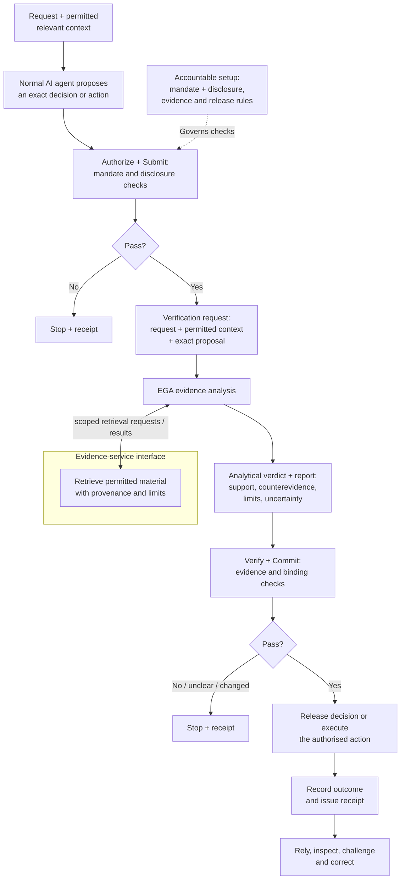
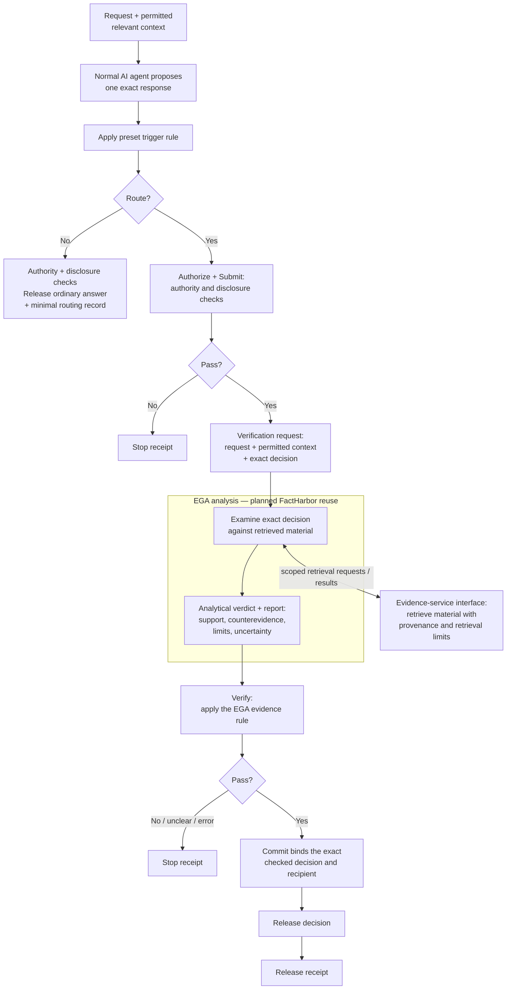

# Evidence-Gated Agents

**Before we rely on an AI recommendation, does the evidence justify it—for this purpose?**

[Read the short introduction](../../Published/evidence-gated-agents-before-we-rely.md), or explore the foundations, next milestone and design below.

An AI assistant recommends a supplier, citing satisfied customers and strong average performance. Neither establishes the contractual response-time guarantee your organisation needs. A useful answer identifies that gap; a consequential recommendation should not pass simply because it sounds convincing.

**Evidence-Gated Agents (EGA) connects active evidence examination with controls outside the acting AI.** The design searches for supporting and contradicting evidence, checks authority and governs release of consequential AI output: a claim, decision or action instruction. The broader aim includes authorised actions, inspectable records and routes to challenge and correct decisions.

## Foundations and the selected next step

| What exists | What it contributes |
|---|---|
| **[FactHarbor Alpha](https://github.com/robertschaub/FactHarbor#what-is-factharbor)** | Searches and analyses supporting and opposing evidence, with sources and uncertainty visible. It remains an [invite-gated Alpha with documented quality limitations](https://github.com/robertschaub/FactHarbor/blob/main/CONTRIBUTING.md#known-limits). |
| **[Our AI Charter Runtime](https://github.com/robertschaub/ai-charter-runtime#honest-limits--read-this-first)** | A runnable proof of concept demonstrates controls outside the acting model, using synthetic scenarios and local test effects. It does not yet call FactHarbor. |
| **[Our AI Charter](../Framework/charter-commitments.md)** | The principles connecting authority, evidence, privacy, independent oversight and remedy. |

**The next milestone is to integrate and evaluate these foundations in one bounded recommendation workflow.** EGA analyses the exact proposed decision using retrieved material; separate controls apply human-defined evidence rules and check permission to release it. FactHarbor provides existing retrieval and analytical capabilities for this integration. This integration remains to be built. Releasing a recommendation does not authorise or execute the resulting action.

The selected prototype routes consequential decisions and instructions into evidence examination. Ordinary answers retain authority and disclosure checks and a minimal routing record, without full evidence examination or an EGA receipt. Automatically deriving adequate evidence requirements for unfamiliar decisions is [wider research](evidence-requirements-research.md), not an established capability of this first integration.

**The cooperation opportunity:** bring a workflow, contribute engineering or evaluation expertise, or support the integration and its assessment. [See the milestone and how to contribute](#where-to-contribute).

*Wider EGA design. The first integration governs recommendation release. Confidential-source integration and the wider governance arrangements remain to be implemented and evaluated.*

## How the design works

*The output-release design. The first integration targets consequential recommendations and instructions, without executing resulting actions. Integration and confidential-source handling remain to be built.*

The output being gated is a **claim, decision or action instruction**. Releasing an instruction makes it available to an authorised recipient; it does not authorise or execute the resulting action. The first prototype retains the consequential-decision/instruction trigger described above.

The design places checks outside the acting AI at [two points](../../Published/when-should-runtime-ai-governance-interrupt.md#the-when-has-two-clocks): **before use**, whether the chosen model or tool may process the information for the stated purpose; **before release**, whether the exact proposal has adequate support, current authority and disclosure permission. Evidence supporting a recommendation and evidence establishing authority answer different questions. Neither replaces the other; the acting AI cannot authorise itself.

Evidence gathering is active: EGA searches through an evidence service or requests missing material before release. The service returns what it finds, with sources and search coverage; EGA analyses whether it supports or contradicts the exact output and identifies gaps. Its analytical verdict and reasons inform the release controls, alongside authority and disclosure checks. If the supplier guarantee is unsupported, the recommendation is held. A qualified alternative needs its own check.

The evidence-service interface can have a general public-source implementation and specialised implementations for company/private sources. Query-relevance ranking and faithful extraction are permitted, with traceable sources and visible selection limits; the service does not judge support or contradiction. Permission to retrieve remains distinct from permission to send material to a retrieval, extraction or analysis processor and to disclose it to a recipient.

Routine checks run automatically within agreed limits. Human judgment is called for when the stakes justify interruption, someone with the necessary authority can make a difference, and the issue cannot be resolved within existing authority. The request identifies the unresolved decision. Human approval cannot replace missing evidence or authority.

### Data protection and accountability

Data protection applies throughout the system, including every outgoing request, search result, released output and record view. Permission to consult a confidential record does not automatically permit sending it to an external AI service or revealing it in an answer. **Access, processing and disclosure are separate permissions.** The [privacy commitments](../Framework/charter-commitments.md) call for using only the information needed for the permitted purpose. Decision records also need limited content, access and retention; accountability must not become an unrestricted copy of confidential evidence.

The [governance design](../../Published/when-vs-who-ai-governance.md) separates rulemaking, operation, record custody, independent review and remedy, so the operator does not control the whole chain. These are continuing responsibilities, not five approvals for every answer. A custodian preserves a sealed record without unilateral access; binding remedies require legal or contractual authority. Records support scrutiny, but do not themselves establish truth, legitimate authority or effective remedy.

## The next development milestone

**Does the combined approach reduce unsupported recommendations while retaining useful answers?** A bounded integration and evaluation would deliver:

- A working path demonstrating when a consequential recommendation is released or stopped.
- An assessment of unsupported releases, unnecessary stops, useful qualified answers, missed decision components, cost and delay.
- Evidence for deciding whether to continue, revise or stop that line of work.

The cooperation agreement would define the workflow, comparison, acceptance criteria and how successes and failures are reported, with confidentiality and publication arrangements suited to the cooperation. Those arrangements do not replace the wider research's [evaluation commitments](evidence-requirements-research.md#evaluation-commitments), including a published protocol before held-out testing and preservation of failed attempts.

## Where to contribute

Workflow owners and domain specialists can define a useful recommendation and the evidence it needs. Engineers can connect the foundations. Researchers can shape and critically assess the evaluation. Funding enables focused development and assessment of this milestone.

**Start with a brief workflow description or your area of contribution.** Contact [Robert Schaub on LinkedIn](https://www.linkedin.com/in/robertschaub/) or [info@factharbor.ch](mailto:info@factharbor.ch). A first conversation can use synthetic examples; no confidential records are needed. Work with private organisational evidence requires separately agreed access, handling and evaluation.

The work is stewarded by the FactHarbor association under its public [funding and independence commitments](../../About.md#stewardship-and-governance). Its purpose is to help people and organisations make and justify decisions while retaining control over AI and correcting errors: technology serving a free and fair society, democracy and justice.

## Who it is for and what it could become

The intended users include people preparing or reviewing decisions, organisations responsible for AI-supported work, and developers integrating controls into their systems. People receiving or affected by the resulting answers and actions also need to understand their basis and have a route to question them.

Two possible development paths are being considered:

- **Applications and services** that organisations could use directly and configure for their needs and working environments.
- **Reusable architecture and components** that software providers or internal development teams could adapt and integrate into existing applications.

Both paths would need evidence of practical usefulness and suitability in their intended settings.

## What the project aims to make possible

### Design responsibilities and consequential content in summaries

The central rule is: **before AI gives a consequential answer or takes a consequential action, it must have permission and enough evidence to justify it.**

The intended approach connects five responsibilities:

1. **Establish and verify authority.** Accountable people define and document who may authorise what, on which basis and through which delegation. Examine evidence that the issuer has the relevant authority and that the mandate covers the exact proposal, purpose, data, tools and limits. Check whether permission has expired, changed or been revoked. The authority basis itself must remain reviewable.
2. **Use permitted information and examine the evidence.** Check both whether a source may be used and what it can establish. Make material claims, assumptions, supporting evidence, counterevidence and uncertainty visible. Assess whether that evidence is current and sufficient for the particular proposed use.
3. **Control what proceeds.** Checks outside the acting model govern whether the exact proposal may be released or executed. Before acting, the executing service requests a fresh verification of the approval and checks that the intended action matches it.
4. **Make the outcome inspectable.** Provide an accessible record connecting the answer or action, authority, evidence, decision and actual outcome, with access appropriate to the people involved.
5. **Support challenge and correction.** Let affected people question the basis, route disputes to responsible reviewers, and revisit decisions when evidence or authority changes.

Authority checks are evidence checks too. Evidence supporting a proposal and evidence establishing permission to release or execute it answer different questions; neither can substitute for the other. The acting AI cannot authorise itself. Software can enforce recorded rules and decisions, while evidence adequacy and legitimate authority require accountable judgment. Human involvement should focus on decisions where a person can make a meaningful difference; an approval click cannot supply missing evidence.

Consequential decisions and instructions can also appear inside summaries or other apparently descriptive outputs. The intended checks would examine whether an output preserves the source’s meaning, including conditions, material risks, dissent and unresolved questions. A recommendation must not silently become an approved decision, or a forecast an established fact.

Faithfulness to a source and support for its factual claims require separate examination. Accurately reporting what someone stated or agreed does not establish that the underlying claims are true. Permission to release the report also does not establish authority for the decision it describes. Where essential judgment or approval is missing, a request for human review should identify the specific unresolved issue.

### View 1 — EGA target model: evidence and authority before release or action

Open the wider design flow and current foundation

**Purpose:** show the complete intended EGA pattern, not current end-to-end functionality. The evidence service retrieves material through a defined interface. EGA analysis interprets support, contradiction, uncertainty and gaps and produces the analytical verdict/report. Release controls apply evidence, authority and disclosure rules. FactHarbor offers existing retrieval and analysis capabilities; their integration behind these logical boundaries remains to be specified and implemented.

```mermaid
flowchart TD
    SET["Accountable setup:<br/>mandate + disclosure,<br/>evidence and release rules"]
    U["Request + permitted<br/>relevant context"] --> A["Normal AI agent proposes<br/>an exact decision or action"]
    A --> PRE["Authorize + Submit:<br/>mandate and disclosure checks"]
    SET -. Governs checks .-> PRE
    PRE --> P{"Pass?"}
    P -->|No| N1["Stop + receipt"]
    P -->|Yes| Q["Verification request:<br/>request + permitted context<br/>+ exact proposal"]
    subgraph ES["Evidence-service interface"]
        SEA["Retrieve permitted material<br/>with provenance and limits"]
    end
    Q --> EA["EGA evidence analysis"]
    EA <-->|scoped retrieval requests / results| SEA
    EA --> VR["Analytical verdict + report:<br/>support, counterevidence,<br/>limits, uncertainty"]
    VR --> POST["Verify + Commit:<br/>evidence and binding checks"]
    POST --> D{"Pass?"}
    D -->|No / unclear / changed| N2["Stop + receipt"]
    D -->|Yes| O["Release decision or execute<br/>the authorised action"]
    O --> R["Record outcome<br/>and issue receipt"]
    R --> Y["Rely, inspect, challenge<br/>and correct"]
```

**Current foundation:** FactHarbor Alpha already performs evidence search and analysis and produces an inspectable verdict and report. Separately, the unfinished Runtime demonstrates gates and receipts outside the acting model using simulated scenarios and a local test action. It does not implement the complete View 1 path or call FactHarbor. See the [Runtime's documented limits](https://github.com/robertschaub/ai-charter-runtime#honest-limits--read-this-first).

### View 2 — Selected EGA prototype: FactHarbor check before decision release

**Scope and limits:** one clear decision, human-defined evidence rules, recommendation release only. The integration is unimplemented. Model-assisted evidence analysis may miss consequential components; release is not proof of truth or completeness.

Open the selected prototype flow and release rules

**Purpose:** show the planned bounded integration: EGA analysis examines an exact proposed decision using retrieved material, then reusable Runtime controls apply the evidence rule and check release permission. FactHarbor is a foundation for retrieval and analysis, but its complete analysis API is not the retrieval-only service. Component separation or a transitional analytical adapter remains an implementation investigation. Unlike View 1, this path does not execute a resulting action.

The controlled evaluation selects requests expected to yield one clear, non-complex decision. Free requests remain available for exploration. A decision may contain related components, but the prototype does not test several independent decision and effect paths.

A preset trigger rule routes only a response containing a consequential decision or an instruction to act into the gate. An ordinary answer retains authority and disclosure checks, bypasses evidence examination and leaves a minimal routing record — trigger decision, rule version, request and response fingerprints, timestamp and attempt ID — without retaining the request or response content. This routing record is not a receipt. Making the trigger judgment itself evidence-based and reviewable is a later extension.

```mermaid
flowchart TD
    U["Request + permitted<br/>relevant context"] --> A["Normal AI agent proposes<br/>one exact response"]
    A --> T["Apply preset trigger rule"]
    T --> R{"Route?"}
    R -->|No| OA["Authority + disclosure checks<br/>Release ordinary answer<br/>+ minimal routing record"]
    R -->|Yes| PRE["Authorize + Submit:<br/>authority and disclosure checks"]
    PRE --> P{"Pass?"}
    P -->|No| N1["Stop receipt"]
    P -->|Yes| Q["Verification request:<br/>request + permitted context<br/>+ exact decision"]
    ES["Evidence-service interface:<br/>retrieve material with<br/>provenance and retrieval limits"]
    subgraph EA["EGA analysis — planned FactHarbor reuse"]
        F["Examine exact decision<br/>against retrieved material"] --> FR["Analytical verdict + report:<br/>support, counterevidence,<br/>limits, uncertainty"]
    end
    Q --> F
    F <-->|scoped retrieval requests / results| ES
    FR --> V["Verify:<br/>apply the EGA evidence rule"]
    V --> D{"Pass?"}
    D -->|No / unclear / error| N2["Stop receipt"]
    D -->|Yes| C["Commit binds the exact<br/>checked decision and recipient"]
    C --> O["Release decision"]
    O --> RR["Release receipt"]
```

*Status on 19 September 2026: this integration is not implemented. The trigger fixtures and routing-record schema, FactHarbor API contract, release rule and Runtime compatibility are open preparation work; the homepage's [where the work stands](../../index.md#where-the-work-stands) carries the current status.*

EGA analysis does not need to reproduce the agent's wording and does not authorise release. A predefined EGA evidence rule evaluates its bound verdict and component assessments through an explicitly reviewed mapping. The controls infer no new semantic conclusion; missing or uninterpretable required fields stop release. A pass proceeds to Commit; a pending job, material unresolved contradiction, insufficient evidence, ambiguous output or technical error stops the attempt. Counterevidence can coexist with a supported, already qualified exact decision when its significance is addressed under the rule; a report caveat cannot repair an unsupported assertion. Passing this rule does not replace authority or disclosure checks, establish the legitimacy of the mandate, or authorise a resulting action. Completion never causes an automatic later release: a retry is a new attempt through all checks.

**Why Commit?** The service rechecks the bound request, decision, recipient and evidence result immediately before release. A changed or narrower decision cannot reuse an earlier approval; it must start a new attempt through every check.

The gated path's real effect is releasing the checked decision. It does not execute a resulting action or check authority for that action. A later EGA would need a new authorization and evidence check at every autonomous action boundary.

**Known limit:** FactHarbor's decomposition is model-assisted and may miss a consequential component. The evaluation compares the complete decision with the components FactHarbor identified and reports omissions, language differences and selected repeat-run variation. A release is not proof that the decision is true or complete.

### What an inspectable receipt could show

Open fictional receipt examples

**Fictional, shortened display examples, not generated receipts.** All identifiers, times and outcomes below are invented. These examples illustrate visible outcomes; they are not a complete receipt schema.

**Example 01, attempt 1: decision released**

| Visible item | Example |
|---|---|
| Decision and authority | “Method A is recommended for the described test; this does not apply to other conditions.” Demo mandate M1 permits release to the test recipient. |
| Evidence examination | FactHarbor job FH-1 found supporting evidence and a limitation on transfer to other conditions; sources and uncertainty are visible. |
| Checks | Authority, disclosure and the simple evidence rule pass at 10:15. Commit binds the exact decision and recipient. |
| Release | The checked decision was released to the specified recipient and the outcome was recorded. |
| Inspect or challenge | Inspect the request, decision fingerprint, evidence result, gate decisions and recorded outcome. A linked view shows how to question it. |

**Example 02, attempt 1: evidence still pending**

| Visible item | Example |
|---|---|
| Decision | Verify stops release at 10:15. |
| Reason | FactHarbor job FH-2 has not reached a terminal result (`evidence-pending`). |
| Effect | No decision was released. A later FactHarbor result does not trigger automatic release. |
| Inspect | The receipt links the request, exact decision, job state and stop reason. A new attempt must pass every check again. |

Links and fingerprints support checking the bound versions and recorded steps. They do not prove the answer true, the authority legitimate, the oversight independent or the answer read by its recipient. Complete independent review and remedy require more than a receipt.

## Longer-term development and open research

Later work could extend the same approach to permitted organisational sources and further agent, tool and action workflows. Each extension would need suitable authority, privacy controls, evidence requirements and evaluation. Checking private records and organisational evidence would require authorised access and additional checking processes, still to be defined and tested. Effective independent review and remedy would also require institutions with the power to act.

One research strand asks whether AI can identify adequate evidence requirements for unfamiliar questions, discover overlooked assumptions and have those requirements critically reviewed, without people writing a separate checklist for every question. This could broaden reuse; its reliability remains to be demonstrated.

Success means useful, supported answers and actions with fewer unjustified releases, understandable records and workable correction routes. Testing must also expose unnecessary blocking, missed claims, cost and practical limitations. Enforcing a gate does not establish that an answer is true, and agreement between AI reviewers does not establish that their judgment is adequate.

## Research detail

-  [AI-derived evidence requirements](evidence-requirements-research.md#aspiration-mostly-generic-evidence-gated-agents)
-  [Research questions and evaluation](evidence-requirements-research.md#test-of-the-aspiration)
-  [What the first prototype can tell us](evidence-requirements-research.md#path-from-the-prototype-to-wider-use)

For related context: [when runtime governance should interrupt](../../Published/when-should-runtime-ai-governance-interrupt.md), [who provides independent oversight](../../Published/when-vs-who-ai-governance.md), and [what the runtime layer adds](../Background/what-the-runtime-layer-adds.md).
