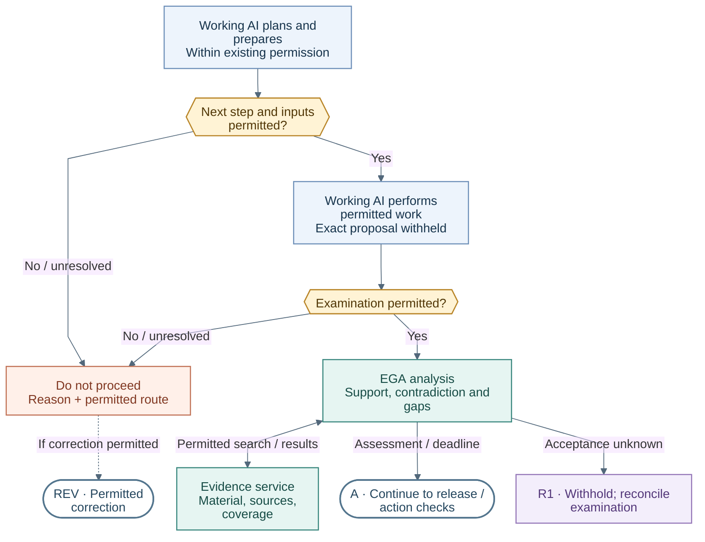
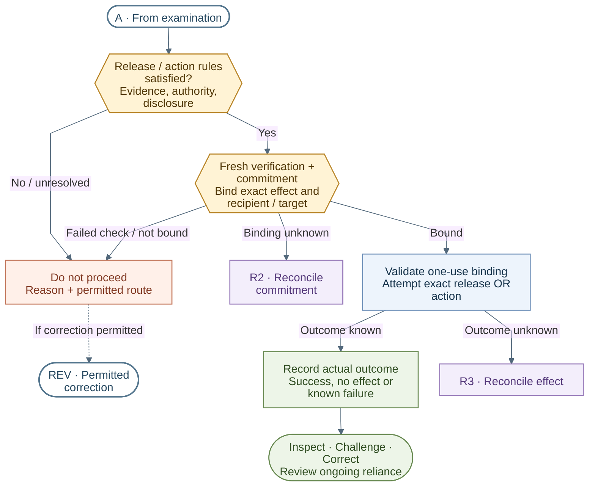
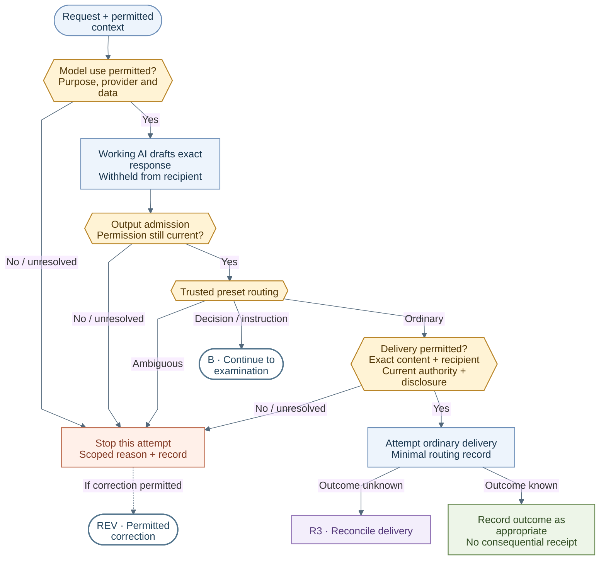
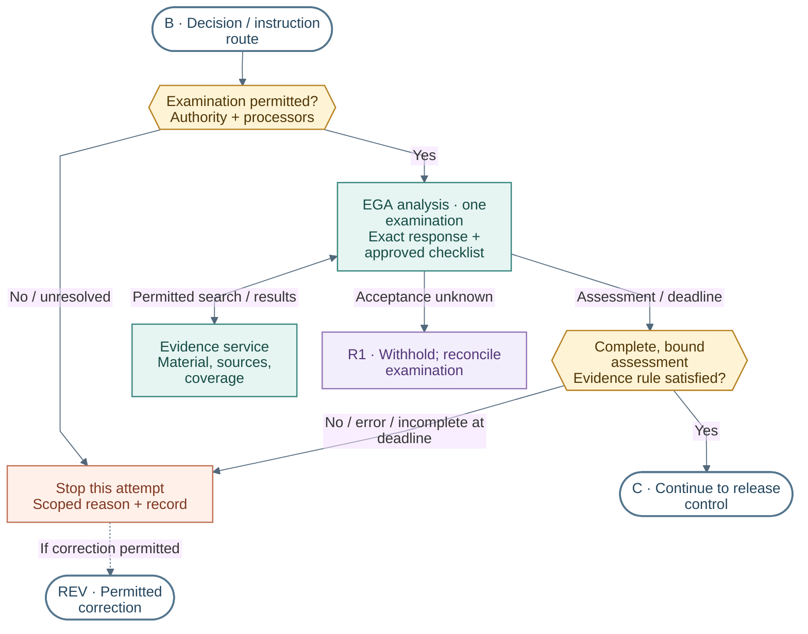
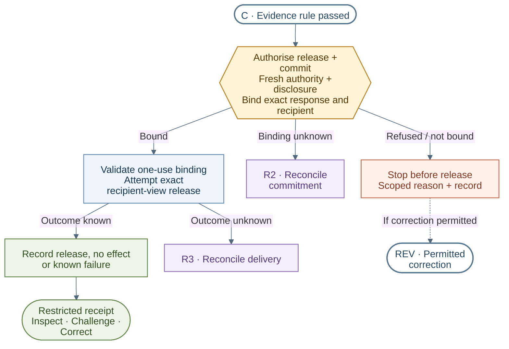
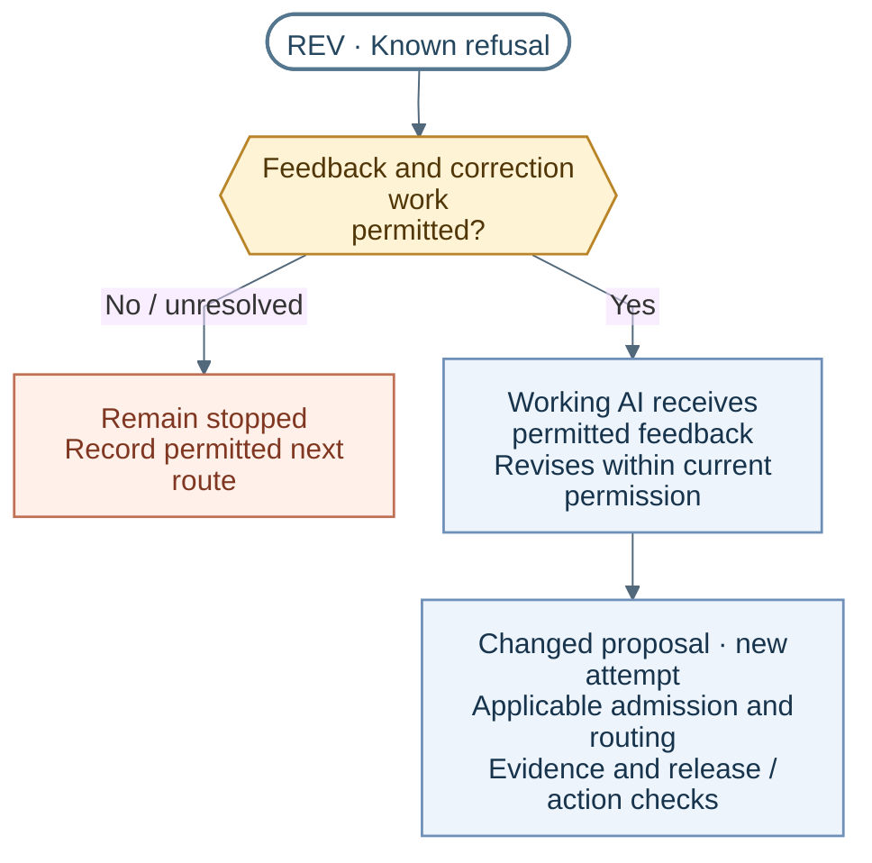
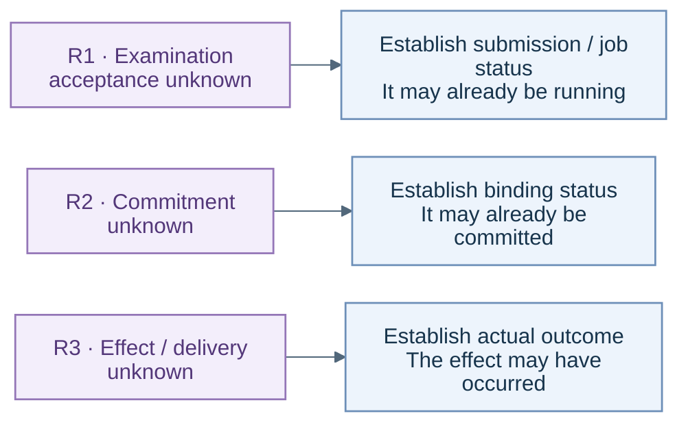

# Evidence-Gated Agents

**Before we rely on an AI recommendation, does the evidence justify it—for this purpose?**

[Read the short introduction](../../Published/evidence-gated-agents-before-we-rely.md), or explore the foundations, next milestone and design below.

An AI assistant recommends a supplier, citing satisfied customers and strong average performance. Neither establishes the contractual response-time guarantee your organisation needs. A useful answer identifies that gap; a consequential recommendation should not pass simply because it sounds convincing.

**Evidence-Gated Agents (EGA) connects active evidence examination with controls outside the acting AI.** The design searches for supporting and contradicting evidence, checks authority and governs release of consequential AI output: a claim, decision or action instruction. The broader aim includes authorised actions, inspectable records and routes to challenge and correct decisions.

## Foundations and the selected next step

| What exists | What it contributes |
|---|---|
| **[FactHarbor Alpha](https://github.com/robertschaub/FactHarbor#what-is-factharbor)** | Searches and analyses supporting and opposing evidence, with sources and uncertainty visible. It remains an [invite-gated Alpha with documented quality limitations](https://github.com/robertschaub/FactHarbor/blob/main/CONTRIBUTING.md#known-limits). |
| **[Our AI Charter Runtime](https://github.com/robertschaub/ai-charter-runtime#honest-limits--read-this-first)** | A runnable proof of concept demonstrates controls outside the acting model, using synthetic scenarios and local test effects. It does not yet call FactHarbor. |
| **[Our AI Charter](../Framework/charter-commitments.md)** | The principles connecting authority, evidence, privacy, independent oversight and remedy. |

**The next milestone is to integrate and evaluate these foundations in one bounded recommendation workflow.** EGA analyses the exact proposed decision using retrieved material; separate controls apply human-defined evidence rules and check permission to release it. FactHarbor provides existing retrieval and analytical capabilities for this integration. This integration remains to be built. Releasing a recommendation does not authorise or execute the resulting action.

The selected prototype routes consequential decisions and instructions into evidence examination. Ordinary answers retain authority and disclosure checks and a minimal routing record, without full consequential-output evidence examination or an EGA receipt. Automatically deriving adequate evidence requirements for unfamiliar decisions is [wider research](evidence-requirements-research.md), not an established capability of this first integration.

**The cooperation opportunity:** bring a workflow, contribute engineering or evaluation expertise, or support the integration and its assessment. [See the milestone and how to contribute](#where-to-contribute).

[![Full EGA design: Working AI prepares within existing permission, passes a before-use check, carries out permitted work and submits a step for a release or action check. Both checks can request evidence. After the checked step, a continuation loop returns to preparation for further work and applicable checks. Refusals lead to Do not proceed, conditional human judgment and permitted revision before renewed checks. People receiving or affected by results, five oversight roles, restricted records and system-wide data protection are shown.](evidence-gated-agents-release-workflow.png)](evidence-gated-agents-release-workflow.png)

*Wider EGA design. The same EGA check pattern recurs for new inputs, processors, recipients and effects. Working AI plans and prepares within existing permission before the first illustrated check. Every check may request evidence, including evidence of permission and authority. Proceed and Do not proceed describe the gate decision. After the checked step, Working AI may plan further work within current permission; new protected transitions require their applicable checks. If permitted, Working AI revises and submits a new proposal for applicable checks; the rejected step stays withheld and closed attempts stay closed. Human judgement is requested where needed, within the person’s authority. [Lifecycle governance](../../Published/when-should-runtime-ai-governance-interrupt.md#the-when-has-two-clocks) surrounds this path. The first integration remains recommendation release only; integration, confidential-source handling and wider governance remain to be implemented and evaluated.*

## How the design works

[![Simplified EGA design: Working AI proposes a step within existing permission. An EGA check can request evidence and applies evidence, authority and permission requirements. Proceed stays within checked scope; Do not proceed gives a reason and permitted route. A continuation loop returns to Working AI after the checked step to plan further work; a separate revision loop permits correction and renewed checks. Human judgment, people receiving or affected by results, restricted records and oversight are visible.](../../Published/evidence-gated-agents-before-we-rely.png)](../../Published/evidence-gated-agents-before-we-rely.png)

*Simplified view of the same recurring check. After the checked step, Working AI may plan the next step; the continuation loop does not authorise a retry when an outcome is uncertain. Requirements depend on the proposed step; permitted revision returns a changed proposal through applicable checks in a new attempt. The first integration targets consequential recommendation release, without executing resulting actions. Integration and confidential-source handling remain to be built.*

The output being gated is a **claim, decision or action instruction**. Releasing an instruction makes it available to an authorised recipient; it does not authorise or execute the resulting action. The first prototype retains the consequential-decision/instruction trigger described above.

The design repeats an **EGA check** outside the acting AI whenever a proposed step crosses a relevant boundary: **may this step proceed under its applicable requirements?** Trusted rules select the checks for that transition, such as authority, input integrity, evidence adequacy and data protection. Before-use and before-release/action checks are instances of this pattern, not the only two points at which it runs. This preserves the [operational gates](user-workflow-governance.md#five-steps) and their distinct responsibilities; the acting AI cannot select an easier check or authorise itself.

Any EGA check may request evidence through the evidence service, including material establishing permission, authority or delegation. Retrieval itself requires an already-permitted access and processing route; it cannot retroactively authorise its own disclosure. The service returns found material with sources and search coverage; EGA assesses what it establishes, including validity, support, contradiction and gaps. Its analytical verdict and reasons inform the applicable gate controls. Evidence supporting a recommendation and evidence establishing authority answer different questions; neither substitutes for the other. If the supplier guarantee is unsupported, the recommendation does not proceed. Where permitted, Working AI can prepare a qualified alternative; the changed proposal starts a new attempt through all applicable checks.

The evidence-service interface can have a general public-source implementation and specialised implementations for company/private sources. Query-relevance ranking and faithful extraction are permitted, with traceable sources and visible selection limits; the service does not judge support or contradiction. Permission to retrieve remains distinct from permission to send material to a retrieval, extraction or analysis processor and to disclose it to a recipient.

Routine checks run automatically within agreed limits. Human judgment is called for when the stakes justify interruption, someone with the necessary authority can make a difference, and the issue cannot be resolved within existing authority. The request identifies the unresolved decision. Human approval cannot replace missing evidence or authority, or reopen a stopped attempt.

### Data protection and accountability

Data protection applies throughout the system, including every outgoing request, search result, released output and record view. Permission to consult a confidential record does not automatically permit sending it to an external AI service or revealing it in an answer. **Access, processing and disclosure are separate permissions.** The [privacy commitments](../Framework/charter-commitments.md) call for using only the information needed for the permitted purpose. Decision records also need limited content, access and retention; accountability must not become an unrestricted copy of confidential evidence.

The [governance design](../../Published/when-vs-who-ai-governance.md) separates rulemaking, operation, record custody, independent review and remedy, so the operator does not control the whole chain. These are continuing responsibilities, not five approvals for every answer. A custodian preserves a sealed record without unilateral access; binding remedies require legal or contractual authority. Records support scrutiny, but do not themselves establish truth, legitimate authority or effective remedy.

## The next development milestone

**Does the combined approach reduce unsupported recommendations while retaining useful answers?** A bounded integration and evaluation would deliver:

- A working path demonstrating when a consequential recommendation is released or stopped.
- An assessment of unsupported releases, unnecessary stops, useful qualified answers, missed decision components, cost and delay.
- Evidence for deciding whether to continue, revise or stop that line of work.

The cooperation agreement would define the workflow, comparison, acceptance criteria and how successes and failures are reported, with confidentiality and publication arrangements suited to the cooperation. Those arrangements do not replace the wider research's [evaluation commitments](evidence-requirements-research.md#evaluation-commitments), including a published protocol before held-out testing and preservation of failed attempts.

## Where to contribute

Workflow owners and domain specialists can define a useful recommendation and the evidence it needs. Engineers can connect the foundations. Researchers can shape and critically assess the evaluation. Funding enables focused development and assessment of this milestone.

**Start with a brief workflow description or your area of contribution.** Contact [Robert Schaub on LinkedIn](https://www.linkedin.com/in/robertschaub/) or [info@factharbor.ch](mailto:info@factharbor.ch). A first conversation can use synthetic examples; no confidential records are needed. Work with private organisational evidence requires separately agreed access, handling and evaluation.

The work is stewarded by the FactHarbor association under its public [funding and independence commitments](../../About.md#stewardship-and-governance). Its purpose is to help people and organisations make and justify decisions while retaining control over AI and correcting errors: technology serving a free and fair society, democracy and justice.

## Who it is for and what it could become

The intended users include people preparing or reviewing decisions, organisations responsible for AI-supported work, and developers integrating controls into their systems. People receiving or affected by the resulting answers and actions also need to understand their basis and have a route to question them.

Two possible development paths are being considered:

- **Applications and services** that organisations could use directly and configure for their needs and working environments.
- **Reusable architecture and components** that software providers or internal development teams could adapt and integrate into existing applications.

Both paths would need evidence of practical usefulness and suitability in their intended settings.

## What the project aims to make possible

### Design responsibilities and consequential content in summaries

The central rule is: **before AI gives a consequential answer or takes a consequential action, it must have permission and enough evidence to justify it.**

The intended approach connects five responsibilities:

1. **Establish and verify authority.** Accountable people define and document who may authorise what, on which basis and through which delegation. Examine evidence that the issuer has the relevant authority and that the mandate covers the exact proposal, purpose, data, tools and limits. Check whether permission has expired, changed or been revoked. The authority basis itself must remain reviewable.
2. **Use permitted information and examine the evidence.** Check both whether a source may be used and what it can establish. Make material claims, assumptions, supporting evidence, counterevidence and uncertainty visible. Assess whether that evidence is current and sufficient for the particular proposed use.
3. **Control what proceeds.** Checks outside the acting model govern whether the exact proposal may be released or executed. Before acting, the executing service requests a fresh verification of the approval and checks that the intended action matches it.
4. **Make the outcome inspectable.** Provide an accessible record connecting the answer or action, authority, evidence, decision and actual outcome, with access appropriate to the people involved.
5. **Support challenge and correction.** Let affected people question the basis, route disputes to responsible reviewers, and revisit decisions when evidence or authority changes.

Authority checks are evidence checks too. Evidence supporting a proposal and evidence establishing permission to release or execute it answer different questions; neither can substitute for the other. The acting AI cannot authorise itself. Software can enforce recorded rules and decisions, while evidence adequacy and legitimate authority require accountable judgment. Human involvement should focus on decisions where a person can make a meaningful difference; an approval click cannot supply missing evidence.

Consequential decisions and instructions can also appear inside summaries or other apparently descriptive outputs. The intended checks would examine whether an output preserves the source’s meaning, including conditions, material risks, dissent and unresolved questions. A recommendation must not silently become an approved decision, or a forecast an established fact.

Faithfulness to a source and support for its factual claims require separate examination. Accurately reporting what someone stated or agreed does not establish that the underlying claims are true. Permission to release the report also does not establish authority for the decision it describes. Where essential judgment or approval is missing, a request for human review should identify the specific unresolved issue.

### View 1 — EGA target model: evidence and authority before release or action

Open the wider design flow and current foundation

**Purpose:** follow one consequential output or action through the wider target design. This is a proposed flow, not implemented end-to-end functionality. The two panels join at **A**; the split introduces no additional gate.

#### 1. Prepare and examine

The request and context are already permitted. New inputs, processors or uses still require applicable checks. The first check covers authority, input origin/integrity and permitted processing; examination permission covers current authority and processor permissions.

```mermaid
%%{init: {"theme":"base","themeCSS":".edgeLabel .label rect{fill:#fff!important;opacity:1!important}","themeVariables":{"fontFamily":"Arial, sans-serif","fontSize":"16px","lineColor":"#52687b"},"flowchart":{"curve":"linear","nodeSpacing":28,"rankSpacing":38,"padding":14,"wrappingWidth":190},"htmlLabels":false}}%%
flowchart TD
 P["Working AI plans and prepares<br/>Within existing permission"]:::work
 P --> I{{"Next step and inputs<br/>permitted?"}}:::gate
 I -->|Yes| W["Working AI performs permitted work<br/>Exact proposal withheld"]:::work
 I -->|No / unresolved| S["Do not proceed<br/>Reason + permitted route"]:::stop
 W --> X{{"Examination permitted?"}}:::gate
 X -->|No / unresolved| S
 X -->|Yes| A["EGA analysis<br/>Support, contradiction and gaps"]:::evidence
 A <-->|Permitted search / results| ES["Evidence service<br/>Material, sources, coverage"]:::evidence
 A -->|Assessment / deadline| C(["A · Continue to release / action checks"]):::link
 A -->|Acceptance unknown| U["R1 · Withhold; reconcile examination"]:::uncertain

 S -.->|If correction permitted| REV(["REV · Permitted correction"]):::link

classDef work fill:#edf4fc,stroke:#6d8fb8,color:#17344c,stroke-width:1.4px
classDef gate fill:#fff3d5,stroke:#b98528,color:#513707,stroke-width:1.5px
classDef evidence fill:#e6f5f2,stroke:#39877e,color:#174c46,stroke-width:1.4px
classDef stop fill:#fff0e9,stroke:#c07155,color:#803721,stroke-width:1.4px
classDef result fill:#edf5e8,stroke:#678950,color:#304d22,stroke-width:1.4px
classDef uncertain fill:#f3eefb,stroke:#9476b7,color:#533779,stroke-width:1.4px
classDef link fill:#fff,stroke:#54768e,color:#24465e,stroke-width:2px
```

**Evidence service:** returns found material, sources and search coverage. EGA analysis interprets support, contradiction, uncertainty and gaps. The illustrated exchange is available to **any EGA check**, including checks of permission and authority, through an already permitted retrieval route.

#### 2. Control release or action, then record the outcome

```mermaid
%%{init: {"theme":"base","themeCSS":".edgeLabel .label rect{fill:#fff!important;opacity:1!important}","themeVariables":{"fontFamily":"Arial, sans-serif","fontSize":"16px","lineColor":"#52687b"},"flowchart":{"curve":"linear","nodeSpacing":28,"rankSpacing":38,"padding":14,"wrappingWidth":190},"htmlLabels":false}}%%
flowchart TD
 A(["A · From examination"]):::link --> G{{"Release / action rules satisfied?<br/>Evidence, authority, disclosure"}}:::gate
 G -->|No / unresolved| S["Do not proceed<br/>Reason + permitted route"]:::stop
 G -->|Yes| C{{"Fresh verification + commitment<br/>Bind exact effect and recipient / target"}}:::gate
 C -->|Failed check / not bound| S
 C -->|Binding unknown| U["R2 · Reconcile commitment"]:::uncertain
 C -->|Bound| E["Validate one-use binding<br/>Attempt exact release OR action"]:::work
 E -->|Outcome known| O["Record actual outcome<br/>Success, no effect or known failure"]:::result
 E -->|Outcome unknown| V["R3 · Reconcile effect"]:::uncertain
 O --> R(["Inspect · Challenge · Correct<br/>Review ongoing reliance"]):::result

 S -.->|If correction permitted| REV(["REV · Permitted correction"]):::link

classDef work fill:#edf4fc,stroke:#6d8fb8,color:#17344c,stroke-width:1.4px
classDef gate fill:#fff3d5,stroke:#b98528,color:#513707,stroke-width:1.5px
classDef evidence fill:#e6f5f2,stroke:#39877e,color:#174c46,stroke-width:1.4px
classDef stop fill:#fff0e9,stroke:#c07155,color:#803721,stroke-width:1.4px
classDef result fill:#edf5e8,stroke:#678950,color:#304d22,stroke-width:1.4px
classDef uncertain fill:#f3eefb,stroke:#9476b7,color:#533779,stroke-width:1.4px
classDef link fill:#fff,stroke:#54768e,color:#24465e,stroke-width:2px
```

**Do not proceed:** withhold the proposed step and record a scoped reason and permitted next route. Where correction is permitted, Working AI may receive a permitted explanation and prepare a corrected or narrower proposal within its current permission. The [REV correction route](#permitted-correction) returns the changed proposal through all applicable checks as a new attempt. An eligible held issue can receive authorised human judgment where useful. A closed attempt stays closed; neither revision, human judgment nor an analytical verdict bypasses required evidence or authority.

**Commitment and outcome are different.** Authority is freshly checked at the commitment boundary. The executor then validates the exact one-use binding; this is not a promise of another authority adjudication after commitment. Record confirmed no effect or known failure as such, preserving any commitment history. R1–R3 use the distinct recovery routes below.

**Current foundation:** FactHarbor Alpha supplies existing retrieval and analysis capabilities. The unfinished Runtime demonstrates controls and receipts using simulated scenarios and a local test action. Their EGA integration remains to be specified and implemented; see the [Runtime's documented limits](https://github.com/robertschaub/ai-charter-runtime#honest-limits--read-this-first).

### View 2 — Selected EGA prototype: FactHarbor check before decision release

**Scope and limits:** one clear decision, human-defined evidence rules, recommendation release only. The integration is unimplemented. Model-assisted analysis can miss consequential components; release is not proof of truth or completeness.

Open the selected prototype flow and release rules

**Purpose:** follow the selected prototype from admission of a new model call to controlled release. Earlier planning may already have occurred within existing permission, as in View 1. Panels join at **B** and **C**; these are continuation points, not new gates.

#### 1. Admit and route the response

```mermaid
%%{init: {"theme":"base","themeCSS":".edgeLabel .label rect{fill:#fff!important;opacity:1!important}","themeVariables":{"fontFamily":"Arial, sans-serif","fontSize":"16px","lineColor":"#52687b"},"flowchart":{"curve":"linear","nodeSpacing":28,"rankSpacing":38,"padding":14,"wrappingWidth":190},"htmlLabels":false}}%%
flowchart TD
 U(["Request + permitted context"]):::work --> I{{"Model use permitted?<br/>Purpose, provider and data"}}:::gate
 I -->|No / unresolved| S["Stop this attempt<br/>Scoped reason + record"]:::stop
 I -->|Yes| W["Working AI drafts exact response<br/>Withheld from recipient"]:::work
 W --> A{{"Output admission<br/>Permission still current?"}}:::gate
 A -->|No / unresolved| S
 A -->|Yes| T{{"Trusted preset routing"}}:::gate
 T -->|Ambiguous| S
 T -->|Decision / instruction| B(["B · Continue to examination"]):::link
 T -->|Ordinary| O{{"Delivery permitted?<br/>Exact content + recipient<br/>Current authority + disclosure"}}:::gate
 O -->|No / unresolved| S
 O -->|Yes| D["Attempt ordinary delivery<br/>Minimal routing record"]:::work
 D -->|Outcome unknown| R["R3 · Reconcile delivery"]:::uncertain
 D -->|Outcome known| K["Record outcome as appropriate<br/>No consequential receipt"]:::result

 S -.->|If correction permitted| REV(["REV · Permitted correction"]):::link

classDef work fill:#edf4fc,stroke:#6d8fb8,color:#17344c,stroke-width:1.4px
classDef gate fill:#fff3d5,stroke:#b98528,color:#513707,stroke-width:1.5px
classDef evidence fill:#e6f5f2,stroke:#39877e,color:#174c46,stroke-width:1.4px
classDef stop fill:#fff0e9,stroke:#c07155,color:#803721,stroke-width:1.4px
classDef result fill:#edf5e8,stroke:#678950,color:#304d22,stroke-width:1.4px
classDef uncertain fill:#f3eefb,stroke:#9476b7,color:#533779,stroke-width:1.4px
classDef link fill:#fff,stroke:#54768e,color:#24465e,stroke-width:2px
```

**Ordinary routing bypasses full evidence examination only.** Delivery still protects the exact content, recipient and current permission. It does not require consequential Commit universally. Established delivery outcomes are recorded as appropriate; uncertain delivery uses R3 without adding a consequential receipt. Its content-free routing record contains the trigger decision, rule version, request/response fingerprints, timestamp and attempt ID; it is not a consequential receipt.

**Retained trigger limitation:** full examination is selected for a consequential decision or instruction to act. A standalone consequential factual claim can remain outside this trigger. Broadening that scope is a separate decision; ambiguous routing stops the attempt.

#### 2. Examine the exact response

```mermaid
%%{init: {"theme":"base","themeCSS":".edgeLabel .label rect{fill:#fff!important;opacity:1!important}","themeVariables":{"fontFamily":"Arial, sans-serif","fontSize":"16px","lineColor":"#52687b"},"flowchart":{"curve":"linear","nodeSpacing":28,"rankSpacing":38,"padding":14,"wrappingWidth":190},"htmlLabels":false}}%%
flowchart TD
 B(["B · Decision / instruction route"]):::link --> P{{"Examination permitted?<br/>Authority + processors"}}:::gate
 P -->|No / unresolved| S["Stop this attempt<br/>Scoped reason + record"]:::stop
 P -->|Yes| A["EGA analysis · one examination<br/>Exact response + approved checklist"]:::evidence
 A <-->|Permitted search / results| ES["Evidence service<br/>Material, sources, coverage"]:::evidence
 A -->|Acceptance unknown| U["R1 · Withhold; reconcile examination"]:::uncertain
 A -->|Assessment / deadline| G{{"Complete, bound assessment<br/>Evidence rule satisfied?"}}:::gate
 G -->|No / error / incomplete at deadline| S
 G -->|Yes| C(["C · Continue to release control"]):::link

 S -.->|If correction permitted| REV(["REV · Permitted correction"]):::link

classDef work fill:#edf4fc,stroke:#6d8fb8,color:#17344c,stroke-width:1.4px
classDef gate fill:#fff3d5,stroke:#b98528,color:#513707,stroke-width:1.5px
classDef evidence fill:#e6f5f2,stroke:#39877e,color:#174c46,stroke-width:1.4px
classDef stop fill:#fff0e9,stroke:#c07155,color:#803721,stroke-width:1.4px
classDef result fill:#edf5e8,stroke:#678950,color:#304d22,stroke-width:1.4px
classDef uncertain fill:#f3eefb,stroke:#9476b7,color:#533779,stroke-width:1.4px
classDef link fill:#fff,stroke:#54768e,color:#24465e,stroke-width:2px
```

The examination is bound to the complete recipient-visible response and approved checklist. EGA analysis assesses every approved checklist requirement and examines the identified components, dependencies and gaps; the evidence service retrieves material without judging support or contradiction. Every applicable check may request permitted evidence. This prototype uses synthetic mandates; wider authority retrieval is not an additional prerequisite.

**The evidence rule evaluates the bound analysis; it does not authorise release.** Missing or uninterpretable required fields, known material coverage gaps, unresolved material contradiction, insufficient evidence or technical error stop release. A qualified decision may pass with counterevidence if the rule's requirements are met; a caveat in the analysis cannot repair an unsupported assertion in the response.

An accepted examination may remain pending within its evaluation window. A complete usable assessment is required by the deadline; late results never revive a stopped attempt. A temporary ruling may be refreshed only in a still-open, uncommitted attempt with unchanged valid authority and bindings, without extending the deadline or renewing a mandate. No protected step relies on an expired ruling.

#### 3. Authorise and bind release, then record the outcome

```mermaid
%%{init: {"theme":"base","themeCSS":".edgeLabel .label rect{fill:#fff!important;opacity:1!important}","themeVariables":{"fontFamily":"Arial, sans-serif","fontSize":"16px","lineColor":"#52687b"},"flowchart":{"curve":"linear","nodeSpacing":28,"rankSpacing":38,"padding":14,"wrappingWidth":190},"htmlLabels":false}}%%
flowchart TD
 C(["C · Evidence rule passed"]):::link --> F{{"Authorise release + commit<br/>Fresh authority + disclosure<br/>Bind exact response and recipient"}}:::gate
 F -->|Refused / not bound| S["Stop before release<br/>Scoped reason + record"]:::stop
 F -->|Binding unknown| U["R2 · Reconcile commitment"]:::uncertain
 F -->|Bound| E["Validate one-use binding<br/>Attempt exact recipient-view release"]:::work
 E -->|Outcome known| O["Record release, no effect<br/>or known failure"]:::result
 E -->|Outcome unknown| V["R3 · Reconcile delivery"]:::uncertain
 O --> R(["Restricted receipt<br/>Inspect · Challenge · Correct"]):::result

 S -.->|If correction permitted| REV(["REV · Permitted correction"]):::link

classDef work fill:#edf4fc,stroke:#6d8fb8,color:#17344c,stroke-width:1.4px
classDef gate fill:#fff3d5,stroke:#b98528,color:#513707,stroke-width:1.5px
classDef evidence fill:#e6f5f2,stroke:#39877e,color:#174c46,stroke-width:1.4px
classDef stop fill:#fff0e9,stroke:#c07155,color:#803721,stroke-width:1.4px
classDef result fill:#edf5e8,stroke:#678950,color:#304d22,stroke-width:1.4px
classDef uncertain fill:#f3eefb,stroke:#9476b7,color:#533779,stroke-width:1.4px
classDef link fill:#fff,stroke:#54768e,color:#24465e,stroke-width:2px
```

The release control adjudicates current release authority and disclosure permission, then binds the request and permitted context, exact response, recipient and evidence result. Unresolved release permission prevents binding; unknown binding status uses R2. Grouped or separate ruling and binding remains an implementation choice. A different or narrower response starts a new attempt through all checks. Binding and later validation follow the commitment boundary described in View 1; an error after binding does not erase the commitment or prove that nothing was released.

Release means making the checked response available to the intended recipient. It does not mean that the recipient read it, and does not execute or authorise a resulting action. A later action needs its applicable checks; an existing mandate may cover it without another human approval.

**Prototype stops close this attempt.** Keep stage-appropriate records and disclose only a permitted explanation. Where correction is permitted, [REV](#permitted-correction) returns a revised request or response to model admission and trusted routing in a new attempt, not directly to examination or release. Authorised human judgment can resolve a specific issue where useful. R1–R3 remain separate recovery obligations, even after an attempt closes.

**Preparation still open:** exact routing fixtures, schemas, criteria, timing and Runtime compatibility. FactHarbor's complete analytical API is not a retrieval-only service; component separation or a transitional adapter remains an implementation investigation. Controlled evaluation uses one clear decision, not several independent decision/effect paths. Component detection remains fallible; evaluation must measure omissions and variation.

Permitted correction — REV: revise and check a new proposal

REV is an optional route from a refusal whose status is known. The rejected step remains withheld. It does not authorise the correction work or any additional access, processing or disclosure.

```mermaid
%%{init: {"theme":"base","themeVariables":{"fontFamily":"Arial, sans-serif","fontSize":"16px","lineColor":"#52687b"},"flowchart":{"curve":"linear","nodeSpacing":28,"rankSpacing":38,"padding":14,"wrappingWidth":190},"htmlLabels":false}}%%
flowchart TD
 F(["REV · Known refusal"]):::link --> P{{"Feedback and correction work<br/>permitted?"}}:::gate
 P -->|No / unresolved| S["Remain stopped<br/>Record permitted next route"]:::stop
 P -->|Yes| W["Working AI receives permitted feedback<br/>Revises within current permission"]:::work
 W --> N["Changed proposal · new attempt<br/>Applicable admission and routing<br/>Evidence and release / action checks"]:::work

classDef work fill:#edf4fc,stroke:#6d8fb8,color:#17344c,stroke-width:1.4px
classDef gate fill:#fff3d5,stroke:#b98528,color:#513707,stroke-width:1.5px
classDef stop fill:#fff0e9,stroke:#c07155,color:#803721,stroke-width:1.4px
classDef link fill:#fff,stroke:#54768e,color:#24465e,stroke-width:2px
```

In View 1, revision returns to permitted preparation and the applicable boundary checks. In View 2, a revised request or response starts at model admission and trusted routing; it cannot inherit the old response's routing or bound assessment. If the original model or provider is not permitted, it cannot receive the feedback or perform the revision. In View 2, refreshing a temporary ruling within an unchanged, still-open attempt remains subject to the existing deadline, authority and binding limits.

Unknown examination, commitment or delivery status follows **R1–R3**, not REV. Establish the relevant status before a next step that could duplicate work or effects; a new attempt ID does not remove that risk. This correction route specifies no automatic retry policy or expanded authority.

Recovery routes used by both views — R1, R2 and R3

Each route is entered from its matching labelled uncertainty exit above; they are not sequential steps.

```mermaid
%%{init: {"theme":"base","themeCSS":".edgeLabel .label rect{fill:#fff!important;opacity:1!important}","themeVariables":{"fontFamily":"Arial, sans-serif","fontSize":"16px","lineColor":"#52687b"},"flowchart":{"curve":"linear","nodeSpacing":28,"rankSpacing":38,"padding":14,"wrappingWidth":190},"htmlLabels":false}}%%
flowchart LR
 J["R1 · Examination acceptance unknown"]:::uncertain --> JR["Establish submission / job status<br/>It may already be running"]:::work
 C["R2 · Commitment unknown"]:::uncertain --> CR["Establish binding status<br/>It may already be committed"]:::work
 E["R3 · Effect / delivery unknown"]:::uncertain --> ER["Establish actual outcome<br/>The effect may have occurred"]:::work

classDef work fill:#edf4fc,stroke:#6d8fb8,color:#17344c,stroke-width:1.4px
classDef gate fill:#fff3d5,stroke:#b98528,color:#513707,stroke-width:1.5px
classDef evidence fill:#e6f5f2,stroke:#39877e,color:#174c46,stroke-width:1.4px
classDef stop fill:#fff0e9,stroke:#c07155,color:#803721,stroke-width:1.4px
classDef result fill:#edf5e8,stroke:#678950,color:#304d22,stroke-width:1.4px
classDef uncertain fill:#f3eefb,stroke:#9476b7,color:#533779,stroke-width:1.4px
classDef link fill:#fff,stroke:#54768e,color:#24465e,stroke-width:2px
```

**No blind resubmission, new token or resend.** A new attempt ID does not remove duplication risk. Record established status or remaining uncertainty, preserve existing commitment history, and retain inspection, challenge and correction routes. Closing an attempt does not end reconciliation of a possibly running job. Recovery never makes a late result an automatic release or reopens a closed attempt; any next step must follow its applicable contract and checks.

Records are restricted and stage-appropriate; early stops do not invent a decision, examination or receipt that never existed. Explanations reveal only what their recipient may see. Data protection applies throughout processing, retrieval, release and records.

### What an inspectable receipt could show

Open fictional receipt examples

**Fictional, shortened display examples, not generated receipts.** All identifiers, times and outcomes below are invented. These examples illustrate visible outcomes; they are not a complete receipt schema.

**Example 01, attempt 1: decision released**

| Visible item | Example |
|---|---|
| Decision and authority | “Method A is recommended for the described test; this does not apply to other conditions.” Demo mandate M1 permits release to the test recipient. |
| Evidence examination | FactHarbor job FH-1 found supporting evidence and a limitation on transfer to other conditions; sources and uncertainty are visible. |
| Checks | Authority, disclosure and the simple evidence rule pass at 10:15. Commit binds the exact decision and recipient. |
| Release | The checked decision was released to the specified recipient and the outcome was recorded. |
| Inspect or challenge | Inspect the request, decision fingerprint, evidence result, gate decisions and recorded outcome. A linked view shows how to question it. |

**Example 02, attempt 1: evidence still pending**

| Visible item | Example |
|---|---|
| Decision | Verify stops release at 10:15. |
| Reason | FactHarbor job FH-2 has not reached a terminal result (`evidence-pending`). |
| Effect | No decision was released. A later FactHarbor result does not trigger automatic release. |
| Inspect | The receipt links the request, exact decision, job state and stop reason. A new attempt must pass every check again. |

Links and fingerprints support checking the bound versions and recorded steps. They do not prove the answer true, the authority legitimate, the oversight independent or the answer read by its recipient. Complete independent review and remedy require more than a receipt.

## Longer-term development and open research

Later work could extend the same approach to permitted organisational sources and further agent, tool and action workflows. Each extension would need suitable authority, privacy controls, evidence requirements and evaluation. Checking private records and organisational evidence would require authorised access and additional checking processes, still to be defined and tested. Effective independent review and remedy would also require institutions with the power to act.

One research strand asks whether AI can identify adequate evidence requirements for unfamiliar questions, discover overlooked assumptions and have those requirements critically reviewed, without people writing a separate checklist for every question. This could broaden reuse; its reliability remains to be demonstrated.

Success means useful, supported answers and actions with fewer unjustified releases, understandable records and workable correction routes. Testing must also expose unnecessary blocking, missed claims, cost and practical limitations. Enforcing a gate does not establish that an answer is true, and agreement between AI reviewers does not establish that their judgment is adequate.

## Research detail

-  [AI-derived evidence requirements](evidence-requirements-research.md#aspiration-mostly-generic-evidence-gated-agents)
-  [Research questions and evaluation](evidence-requirements-research.md#test-of-the-aspiration)
-  [What the first prototype can tell us](evidence-requirements-research.md#path-from-the-prototype-to-wider-use)

For related context: [when runtime governance should interrupt](../../Published/when-should-runtime-ai-governance-interrupt.md), [who provides independent oversight](../../Published/when-vs-who-ai-governance.md), and [what the runtime layer adds](../Background/what-the-runtime-layer-adds.md).
