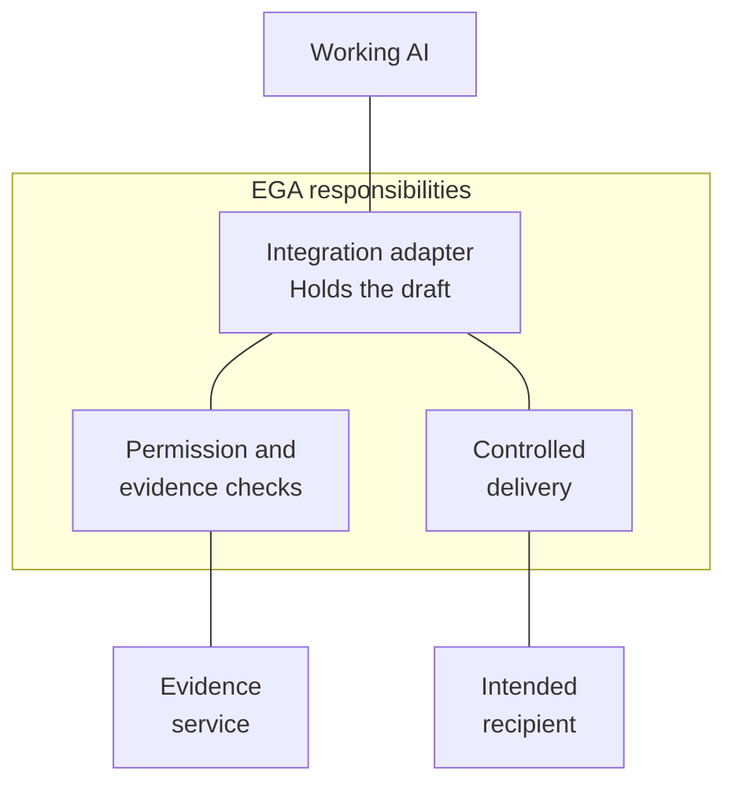
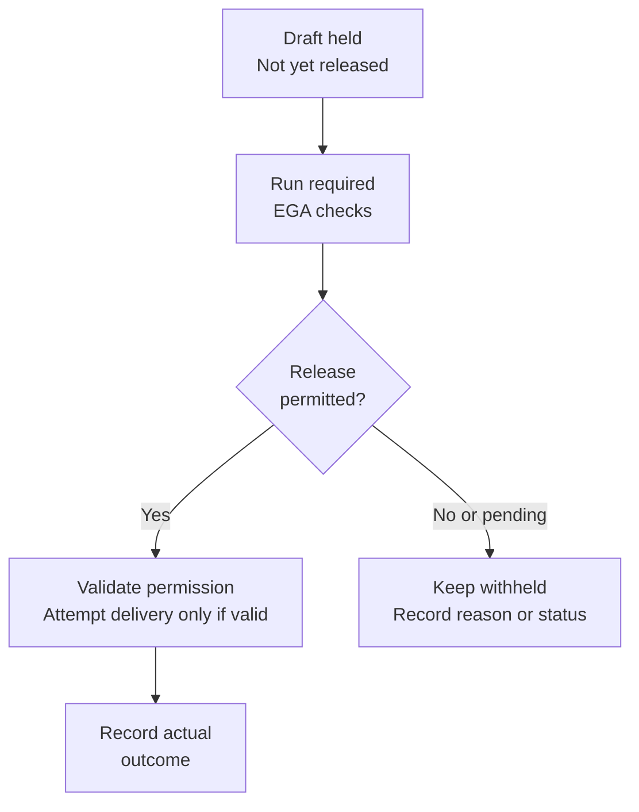
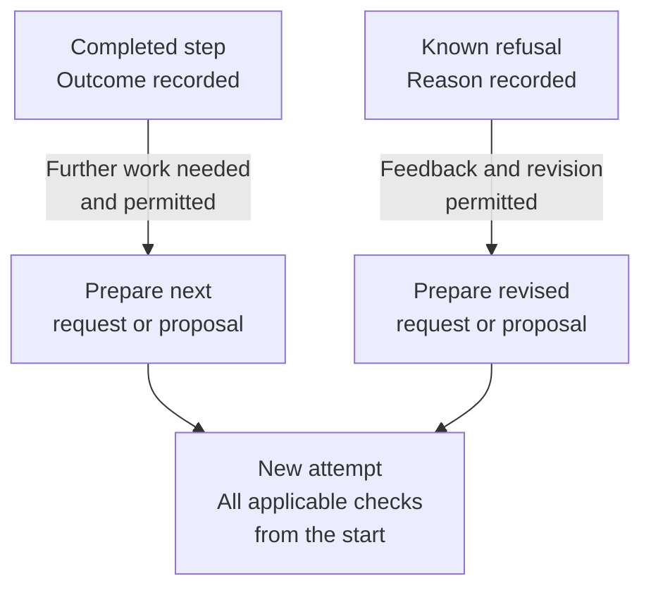

# Evidence-Gated Agents

**Before we rely on an AI recommendation, does the evidence justify it—for this purpose?**

AI can produce a convincing recommendation without establishing the facts or permissions needed to rely on it. EGA asks whether the exact proposed step meets the requirements for its intended use before it proceeds.

**Evidence-Gated Agents (EGA) is a design connecting evidence examination with controls outside the acting AI.** It checks the evidence and authority needed before a consequential claim, decision or action instruction may proceed, and preserves a basis for inspection, challenge and correction. The wider design includes authorised actions; the first integration targets recommendation release.

The aim is to help people make well-grounded decisions, retain control over AI and correct errors—technology serving a free and fair society, democracy and justice.

This overview explains the core concepts and host–EGA handoff. Choose a further reading path:

- [Illustrated introduction](../../Published/evidence-gated-agents-before-we-rely.md): motivation, recurring checks and human oversight.
- [First prototype](evidence-gated-agents-prototype.md): proposed behaviour, limitations, receipts and evaluation.
- [Research](evidence-requirements-research.md): open questions and the evidence needed to demonstrate progress.

## Who it is for and what it could become

EGA is intended for people preparing or reviewing decisions, organisations responsible for AI-supported work, and developers integrating controls into their systems. People receiving or affected by results need to understand their basis and have a route to question them. The work could support configurable applications or reusable components; both remain development directions.

## Foundations and the selected next step

| Foundation | What exists today |
|---|---|
| **[FactHarbor Alpha](https://github.com/robertschaub/FactHarbor#what-is-factharbor)** | Searches and analyses supporting and opposing evidence, with sources and uncertainty visible. It remains an [invite-gated Alpha with quality limitations](https://github.com/robertschaub/FactHarbor/blob/main/CONTRIBUTING.md#known-limits). |
| **[Our AI Charter Runtime](https://github.com/robertschaub/ai-charter-runtime#honest-limits--read-this-first)** | A runnable proof of concept demonstrates controls outside the acting model, using synthetic scenarios and local test effects. It does not yet call FactHarbor. |
| **[Our AI Charter](../Framework/charter-commitments.md)** | The principles connecting authority, evidence, privacy, independent oversight and remedy. |

**The next milestone is one bounded recommendation workflow integrating and evaluating these foundations. The integration remains to be built.** It would use human-defined evidence rules, examine the exact proposed decision and control its release. It would not execute or authorise the resulting action.

## How the design works

### One check pattern, applied where needed

**EGA asks the same question at each protected boundary: may this exact step proceed under the requirements that apply to it?** A step might use information, release a recommendation or execute an action. These are examples, not a fixed sequence. Trusted rules determine the checks; the working AI cannot approve its own proposal. Evidence may establish permission and authority as well as support for a claim.

<figure class="ega-pattern" role="region" aria-label="EGA overview, scroll horizontally on narrow screens" tabindex="0" markdown="1">

<figcaption>Wider design — conceptual overview. Solid coloured arrows show progression; the labelled Request and Results paths show permitted evidence exchange. Dashed return paths show conditional continuation or revision, not automatic retries. The evidence service retrieves material; EGA assesses what it establishes. Human judgement is conditional, where an authorised person can resolve a specific issue; it cannot replace missing evidence or authority. The five accountability roles are responsibilities, not consecutive approvals. The first prototype does not demonstrate independent record custody or independent review.</figcaption>
</figure>

On narrow screens, scroll the diagram horizontally or [open the full-size illustration](../../Published/evidence-gated-agents-before-we-rely-cover.svg).

Permission does not establish successful execution. The recipient branch shows confirmed availability of the checked content; releasing it does not authorise acting on it. The records preserve the check decision and any actual or uncertain outcome, with access limited to permitted audiences. Pending checks and closed refusals remain distinct; unknown commitment or execution status requires [reconciliation](#recovery-routes), not an assumed refusal or proof that nothing was released. The return paths permit [further work or revision](#permitted-correction) only where authorised, as a **new attempt through fresh applicable checks**. They do not restart a closed attempt or authorise a retry while duplication risk remains unresolved.

The wider design repeats this pattern wherever needed. Every applicable check may request evidence from public or permitted private sources through an already-permitted route; this need not mean a new search at every check. **The first prototype uses synthetic mandates and one consequential-output examination, controlling recommendation release without authorising the recommended action.** Live authority retrieval and private-source integration are not demonstrated capabilities.

### How EGA connects to the application

**The working AI proposes; EGA checks and controls the protected step.** The **host** is the surrounding application—for example, a supplier-selection assistant containing an AI model, software that runs it and connections to other services. The working AI is one part of that application, not the whole host.

An **EGA integration adapter** connects EGA to the software running the AI. It holds the proposed recommendation, connects trusted routing to the required checks and requests them. This adapter and the controlled release mechanism are part of EGA's enforcement design, even when they run inside the host. They operate outside the working AI's control; the AI cannot approve its own answer.

**The checking procedure controls its work from request to return.** It returns a decision to the integration adapter; returning control does not itself permit release. Controlled delivery validates permission before attempting the checked release. EGA governs the protected operation, without taking over the application's other work.

### Where checks apply—and who chooses them

Accountable people establish permissions, disclosure rules and acceptance policy. **Trusted rules select the applicable checks; the working AI cannot exempt its own proposal.** The first prototype uses human-defined evidence requirements. Automatically deriving adequate requirements for unfamiliar decisions remains a [research question](evidence-requirements-research.md#the-research-question).

The prototype's [preset routing rule](evidence-gated-agents-prototype.md#admission-and-routing) sends consequential decisions and instructions through full evidence examination. Ordinary responses still need delivery permission; ambiguous routing withholds the response. Applying that rule to content can be wrong: misrouting must be measured separately from enforcement failure. Standalone consequential factual claims can remain outside the trigger.

### What prevents the application from skipping EGA?

**EGA cannot force an arbitrary application to call it.** To make a check mandatory, the integration must put an enforced barrier in front of the protected operation. For a recommendation that requires full evidence examination:

- The EGA integration adapter holds the draft and requests the required checks. The working AI cannot select a weaker route or approve its own answer.
- The delivery component accepts only valid, one-use permission tied to the checked answer and recipient. A missing, invalid or mismatched permission means no delivery—not “send anyway”.
- Neither the working AI nor other application code may have an unchecked route to the recipient. Otherwise they could bypass the check, and that release would not be protected.

For example, the AI may draft “choose Supplier A”, but the recommendation must stay unavailable to its intended recipient until the controlled delivery component accepts permission for that exact release. This includes withholding streamed draft text. A prompt asking the AI to check first is insufficient: the EGA integration must control the delivery path, with credentials and configuration protected from the working AI.

This is an integration requirement to test against [omitted checks, bypass and replay](evidence-gated-agents-prototype.md#evaluation-and-reporting), not an established guarantee. The EGA integration remains to be built; tool and action workflows need their own boundaries and evaluation.

### Components and release workflow

The following views show the component connections and release workflow for a recommendation requiring full evidence examination. Separate views cover [continuation and revision](#permitted-correction) and [human accountability](#protecting-evidence-and-accountability).

#### Component connections

```mermaid
flowchart TB
    A["Working AI"]
    subgraph E["EGA responsibilities"]
        I["Integration adapter<br/>Holds the draft"]
        C["Permission and<br/>evidence checks"]
        D["Controlled<br/>delivery"]
        I --- C
        I --- D
    end
    S["Evidence<br/>service"]
    R["Intended<br/>recipient"]
    A --- I
    C --- S
    D --- R
```

*Lines show connections, not execution order. The host is the application running the working AI; EGA connects through an adapter in that application's execution path. The EGA boundary groups responsibilities, not separate machines. The evidence service retrieves permitted material; EGA assesses it. Only controlled delivery may make the recommendation available to its recipient.*

#### When may the recommendation leave?

```mermaid
flowchart TD
    A["Draft held<br/>Not yet released"]
    B["Run required<br/>EGA checks"]
    C{"Release<br/>permitted?"}
    D["Validate permission<br/>Attempt delivery only if valid"]
    E["Record actual<br/>outcome"]
    F["Keep withheld<br/>Record reason or status"]
    A --> B
    B --> C
    C -->|Yes| D
    C -->|No or pending| F
    D --> E
```

*Arrows show progression and conditions. Both branches preserve a record, visible only to permitted audiences. Pending checks keep release blocked within the evaluation window; refusal or reaching the deadline without a usable assessment closes the attempt. A late result cannot reopen it.*

**Permission is not proof of delivery.** Delivery validation can reject the bound permission; record that outcome without rewriting the earlier commitment as a refusal. Record confirmed release, confirmed no effect, known failure or uncertainty as the evidence permits. An error alone does not prove that nothing was released. Unknown binding or delivery status follows the [recovery routes](#recovery-routes), rather than being labelled a refusal or proof that the recommendation is still withheld.

**Handoff may be asynchronous.** The host routes the model's output through the adapter; this does not rely on the AI volunteering for a check. Other independently permitted work need not wait, but cannot bypass release control or treat the withheld recommendation as released. Handoff itself acknowledges neither acceptance nor permission. Messaging, acknowledgment and recovery details remain integration choices.

Here, **release permission** is tied to one exact release—the request, answer, recipient, permitted context and evidence result—and valid for one use. This is called **binding**; the delivery component is the **executor**. The application cannot create permission merely by labelling an answer “approved”. The release service that manages controlled delivery requests fresh binding from authorization controls. These simplified views preserve that responsibility without specifying service calls; grouped or separate ruling and binding calls remain an [open integration choice](evidence-gated-agents-prototype.md#limits-and-preparation-still-open).

Permission to prepare an answer does not authorise disclosing it to another service. The host needs permission for any disclosure made by the gate call; EGA checks permission for examination before involving retrieval or analysis processors. After the evidence rule passes, release authority is freshly verified at commitment before the exact release is bound. These are distinct checks, and an existing mandate can cover them without another human approval. [Authority and disclosure checks](evidence-requirements-research.md#what-goes-into-a-checkand-what-comes-out) apply before model use, examination and release.

If submission acceptance is unknown, release stays blocked while the job's status is reconciled. Unknown submission, commitment or delivery status must be addressed before anything that could duplicate work or effects.

EGA includes evidence analysis and independent controls; their different roles are set out below. Its checks can use permitted evidence to establish authority, but later evidence cannot authorise an earlier disclosure. A changed proposal starts a new attempt through applicable checks; permitted revision and human review cannot bypass them.

### Connecting EGA to an AI application

For recommendation release, the proposed connection is an application wrapper: receive the model's output into a withheld draft, route it through EGA, then let controlled delivery make the permitted answer available. No modification of the model itself is required. A **hook** is a callback in the software running the AI; for future tool-action protection, it must run before the protected tool executes and be able to stop it.

Existing mechanisms could support that integration: Anthropic's [Agent SDK hooks](https://code.claude.com/docs/en/agent-sdk/hooks) can block tool calls; OpenAI's [Agents SDK guardrails and approvals](https://developers.openai.com/api/docs/guides/agents/guardrails-approvals) provide output checks and tool controls. Apertus can also be wrapped at the application boundary; its [official model documentation](https://huggingface.co/swiss-ai/Apertus-v1.5-70B/blob/main/README.md#how-to-use) describes local serving and tool-call support, but Apertus 1.5 does not support tool calling in thinking mode. **These are candidate mechanisms, not tested EGA integrations.** The selected model, serving mode, streaming behaviour and every delivery path need verification. Hooks alone do not establish evidence sufficiency, valid authority or protection against bypass.

### Evidence for the particular decision

Any check may request evidence, including evidence of permission, authority or delegation. **Finding material and judging what it establishes are different responsibilities.**

| Responsibility | Contribution to the design |
|---|---|
| Working AI | Prepares an exact proposal within existing permission. |
| EGA integration adapter | Holds the proposal, connects trusted routing to required checks and connects their result to controlled release. |
| Evidence service | Retrieves permitted material, source references and search limits; it does not judge support or contradiction. |
| EGA analysis | Assesses support, contradiction, uncertainty, dependencies and gaps for the intended use. |
| Independent controls | Apply the applicable authority, evidence and disclosure rules; an analytical verdict is an input, not permission. |
| Executor and records | Perform the checked step within its binding and preserve the actual outcome for scoped inspection. |

Evidence supporting a recommendation cannot substitute for permission to release it or act on it.

#### When a summary contains consequential content

A summary can contain a decision or instruction. **Faithfulness to a source, support for its factual claims and sufficiency for a decision require separate examination.** Accurately reporting what someone said does not establish that their claims are true. A recommendation must not silently become an approved decision, or a forecast an established fact; conditions, risks, dissent and unresolved questions remain relevant.

Permission to release a report does not establish authority for the decision it describes. Where essential judgment is missing, human review identifies the particular unresolved issue rather than supplying missing evidence by sign-off.

### Authority, binding and actual outcomes

Accountable people establish authority and its basis, purpose, delegation and limits. A signed grant alone does not prove its issuer held that authority. Permission may expire, change or be revoked; its basis remains reviewable.

In the wider action design, authority is freshly verified at the commitment boundary and bound to the exact proposal. The executor then validates the one-use binding; this is not another authority adjudication after commitment. Record confirmed success, confirmed no effect, known failure or uncertainty, preserving commitment history. An error does not prove that nothing happened. Each later protected step faces its own applicable checks; an existing mandate may cover it without another human approval.

Routine checks run within agreed limits. Human judgment is conditional: the stakes justify interruption, an authorised person can resolve a specific issue, and existing authority is insufficient to resolve it automatically. It cannot supply missing evidence or authority or reopen a closed attempt. The [operational gates and lifecycle responsibilities](user-workflow-governance.md) remain distinct from this common check pattern.

### Data protection and accountability

**Access, processing, disclosure and inspection each need permission.** Permission to consult a record does not automatically permit sending it to a retrieval, extraction or analysis service, or revealing it to a recipient. Retrieval uses an already-permitted route; evidence found later cannot retroactively authorise the request that exposed it.

Data protection covers requests, search results, released output and record views. Records need bounded content, access and retention; accountability must not become an unrestricted copy of confidential evidence. The [Charter's privacy commitments](../Framework/charter-commitments.md) apply throughout, including using only the information needed for the permitted purpose.

#### Who is accountable?

- **Rulemaker** Sets criteria and permitted scope.
- **Operator** Oversees operation and follows the rules.
- **Record keeper** Provides independent custody of decision records.
- **Independent reviewer** Examines the basis and handling of decisions.
- **Remedy decider** Decides corrections or remedies within a mandate.

*These are responsibilities in the wider design, not consecutive approvals. The first prototype describes a combined responsible reviewer/operator route; it demonstrates neither independent custody nor independent review.*

People receiving or affected by a result need permitted routes to **inspect, challenge and seek correction**. The [governance model](../../Published/when-vs-who-ai-governance.md) explains the separation of roles. Independent custody aims to prevent the operator controlling the whole record/review chain; sealed records must be protected against unilateral access. Binding remedies require legal or contractual authority. Records support scrutiny; they do not themselves establish truth, legitimate authority or effective remedy. Confidential-source handling and effective wider governance remain to be implemented and evaluated.

### Correction after a known refusal

#### What happens next?

```mermaid
flowchart TD
    A["Completed step<br/>Outcome recorded"] -->|Further work needed<br/>and permitted| C["Prepare next<br/>request or proposal"]
    B["Known refusal<br/>Reason recorded"] -->|Feedback and revision<br/>permitted| D["Prepare revised<br/>request or proposal"]
    C --> E["New attempt<br/>All applicable checks<br/>from the start"]
    D --> E
```

*Continuation is part of the wider design. The first prototype gates one recommendation release; it does not authorise the resulting action. The arrows show permitted routes, not automatic retries. Checks can apply before use, release or action, rather than forming a fixed two-stage pipeline.*

Remaining stopped is a valid endpoint. The correction route, **REV**, grants no extra access, processing or disclosure. An unpermitted model or provider cannot receive feedback or perform the revision. Unknown outcomes require [reconciliation](#recovery-routes) before any potentially duplicating operation; starting a new attempt does not remove that risk.

In the wider design, revision returns to permitted preparation and applicable boundary checks. In the [first prototype](evidence-gated-agents-prototype.md#correction-and-uncertain-outcomes), a revised request or response starts at model admission and trusted routing, with no inherited routing or bound assessment. The rejected step stays withheld and closed attempts stay closed. REV describes no automatic retry policy.

**Review can also be needed after release.** Changed evidence or authority can require review of continued reliance and future permission. Preserve the original record and append any correction; this does not undo a completed effect or guarantee a remedy.

### When the outcome is unknown

Unknown status requires reconciliation rather than treating the step as a known refusal. These are distinct routes, not consecutive stages:

| Route | What is unknown | What needs establishing |
|---|---|---|
| **R1** | Examination acceptance | Submission/job status: work may already be running. |
| **R2** | Commitment | Binding status: the effect may already be committed. |
| **R3** | Effect or delivery | Actual outcome: the effect may already have occurred. |

**No blind resubmission, new token or resend.** Resolve the relevant status before a next step that could duplicate work or effects; a new attempt ID does not remove that risk. Preserve commitment history, inspection, challenge and correction. Closing an attempt does not end reconciliation of possibly running work. Late results never automatically release or reopen a closed attempt; each next step follows its applicable contract and checks.

Records are stage-appropriate and restricted. Early stops do not invent a decision, examination or receipt that never existed. Reasons and previews reveal only what their recipient may see.

## First prototype

The selected integration examines one clear decision against human-defined evidence rules and controls recommendation release. Model-assisted analysis can miss consequential components; passing is not proof of truth or completeness. Standalone consequential factual claims can remain outside the retained decision/instruction trigger.

The [First prototype page](evidence-gated-agents-prototype.md) explains the bounded German/English workflow, component responsibilities, current limits and planned evaluation.

-  [Admission and trusted routing](evidence-gated-agents-prototype.md#admission-and-routing)
-  [Examination of the exact response](evidence-gated-agents-prototype.md#examination-and-the-evidence-rule)
-  [Release permission, binding and outcomes](evidence-gated-agents-prototype.md#release-and-recording)
-  [Fictional receipt examples](evidence-gated-agents-prototype.md#what-an-inspectable-receipt-could-show)

## The next development milestone

**Does the combined approach reduce unsupported recommendations while retaining useful answers?** Build and evaluate the bounded release/stop path, report successes and failures, and use the results to decide whether to continue, revise or stop. The [prototype evaluation and reporting commitments](evidence-gated-agents-prototype.md#evaluation-and-reporting) define what to measure and preserve the wider research's public-protocol commitments.

## Co-development and funding

We are looking for **experienced co-developers** to build and evaluate the first integration, and **sponsors and funders** to support that work.

Contact [Robert Schaub on LinkedIn](https://www.linkedin.com/in/robertschaub/) or [info@factharbor.ch](mailto:info@factharbor.ch). Initial discussions need no confidential records. Private organisational evidence requires separately agreed access, handling and evaluation. FactHarbor association stewards the work under its public [funding and independence commitments](../../About.md#stewardship-and-governance).

## Longer-term development and open research

Configurable applications and reusable components both need evidence of usefulness in their intended settings. Later work could extend the approach to permitted organisational sources and further agent, tool and action workflows. Each extension needs suitable authority, privacy controls, evidence requirements and evaluation; effective independent review and remedy also require institutions able to act.

The wider research asks whether AI can derive adequate evidence requirements for unfamiliar questions and critically review them. That capability is not established by the first prototype. Success means useful, supported results with fewer unjustified releases, understandable records and workable correction, while exposing unjustified stops, missed claims, cost and practical limits. Model agreement and gate enforcement alone do not establish adequacy or truth.

## Research detail

-  [AI-derived evidence requirements](evidence-requirements-research.md#aspiration-mostly-generic-evidence-gated-agents)
-  [Research questions and evaluation](evidence-requirements-research.md#test-of-the-aspiration)
-  [What the first prototype can tell us](evidence-requirements-research.md#path-from-the-prototype-to-wider-use)

Related context: [when runtime governance should interrupt](../../Published/when-should-runtime-ai-governance-interrupt.md), [who provides independent oversight](../../Published/when-vs-who-ai-governance.md), and [what the runtime layer adds](../Background/what-the-runtime-layer-adds.md).
