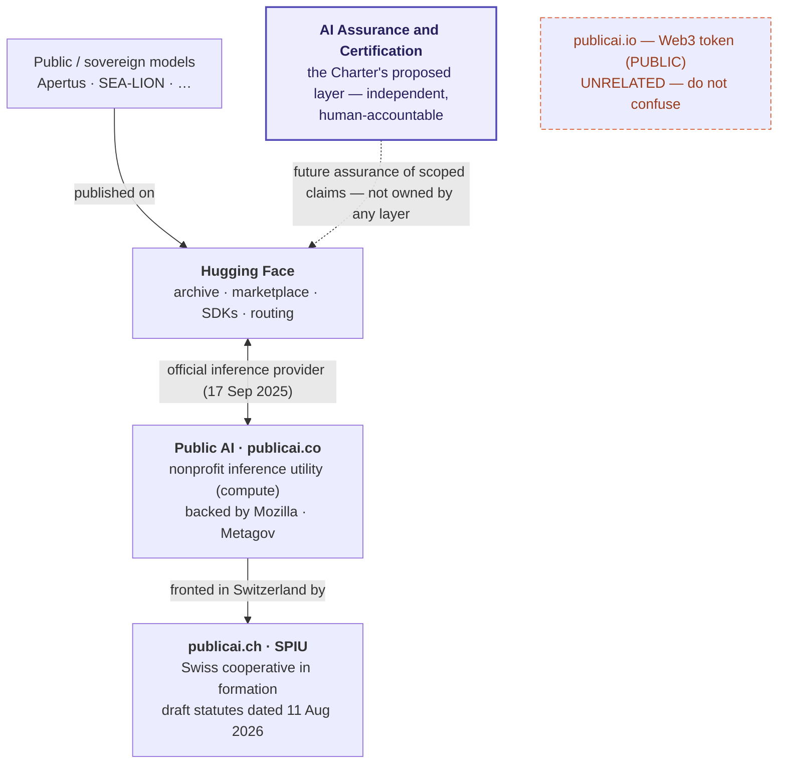

# Public-interest AI — actors & landscape map

Who is already building pieces of an open, accountable, internationally co-stewarded public-AI layer? This map is the stable actor directory: it groups organisations and people by the role their **public work** plays. It is a reading and outreach aid, not an endorsement list. Where an actor publishes an official contact for this work, it is noted; otherwise use the linked public work. The visual relationship map lives in [public-ai-people-and-pathways.md](../wip/public-ai-people-and-pathways.md).

## The public-AI movement & shared infrastructure

- **Public AI / [Metagov](https://metagov.org/projects/public-ai)** — the clearest articulation of AI "provisioned like electricity, water, roads, libraries" ([Public AI: Infrastructure for the Common Good](https://zenodo.org/records/13914560)). Its [Public AI Inference Utility](https://publicai.co/) serves Apertus, SEA-LION and further national/regional open models; the [Switzerland fellowship](https://publicai.network/jobs/fellow-switzerland/) posting (still listed 2026-07-27; no public appointee announcement) is intended to build Swiss institutional relationships and prepare participation in a "Swiss AI Summit (February 2027)" — an event not itself publicly confirmed. Operational deep-dive on what the family builds: [what they build](../wip/public-ai-what-they-build.md).
- **[Hugging Face](https://huggingface.co/) — the model archive/marketplace, complementary to Public AI (not a rival).** The common platform where public and sovereign teams publish models and datasets and developers get the SDKs. Since **17 Sep 2025** the [Public AI Inference Utility](https://publicai.co/) is an **official Hugging Face Inference Provider** ([HF blog](https://huggingface.co/blog/inference-providers-publicai)): a model like Apertus is *found* on HF and *served* by Public AI's nonprofit, distributed compute behind it. Two layers of one stack (HF = archive + tooling + routing; Public AI = inference/compute utility), not competitors. Pricing and availability change; verify them on the [live provider table](https://huggingface.co/inference/models) rather than describing the route as free.
- **[Current AI](https://www.currentai.org/about)** — a multistakeholder public-interest-AI partnership launched at the 2025 Paris AI Action Summit (governments + philanthropies + companies); Switzerland is a Country Partner. Its new [Open Source AI Gap Map](https://map.currentai.org/) evaluates 24,626 projects across openness, capability, adoption and maturity and invites methodological review. Current AI's [11 February 2025 launch release](https://www.currentai.org/blogs/governments-philanthropies-and-companies-unite-for-major-new-global-ai-initiative-in-the-public-interest) describes an initial $400m investment and a $2.5bn five-year goal. A [TechCrunch profile (2026-07-19)](https://techcrunch.com/2026/07/19/nonprofit-current-ai-is-racing-to-build-the-world-wide-web-of-ai-free-for-all/) reports the first grant cohort — $3.2m across four organisations — plus an AlphaChat launch at AI for Good Geneva; it describes total committed funding as $400m, consistent with the live [About page](https://www.currentai.org/about), which states "over $400 million in funds already committed" against the $2.5bn five-year mobilisation goal (read 2026-07-28). **Joshua Tan serves as interim CTO** according to his [current research page](https://www.joshuatan.com/research/) and is listed among [Current AI's employees](https://www.linkedin.com/company/currentaiofficial/) — a verified personnel link to the Public AI network, where he leads product and strategy.
- **[AI Alliance — Project Tapestry](https://thealliance.ai/projects/tapestry)** — shared infrastructure for training open models across institutions.
- **Public AI Switzerland / publicai.ch (SPIU — Swiss Public Inference Utility)** — a self-described customer-owned cooperative distributing Apertus, in formation (draft statutes published naming «Genossenschaft Public AI», seat Liebefeld, dated **11 Aug 2026**; the notarised founding — required for cooperatives since 2023 — and the commercial-register entry are pending, none as of 2026-07-28 (LINDAS/Zefix mirror re-checked) — [deep-dive](../wip/public-ai-what-they-build.md)); linked to the international [Public AI Inference Utility](https://publicai.co/) (shared inbox `hello@publicai.co`). Founding membership held in trust (pending registration) by **[Datalets.ch](https://datalets.ch/)** — Oleg Lavrovsky's open-data consultancy, a sole proprietorship per the Swiss commercial register (**not** a non-profit); the non-profit in this cluster is **[Opendata.ch](https://opendata.ch/)**, where Lavrovsky serves on the advisory board. *(Note: `publicai.io` is an unrelated Web3/crypto project; the relevant family is publicai.network / publicai.co / publicai.ch.)*

**The shared-infrastructure stack at a glance** — and where the Charter's assurance layer sits (orthogonal to all of them):

- **[Open Future](https://openfuture.eu/)** — European digital-commons think tank already cited in this repo (the [EuroHPC-governance critique](https://openfuture.eu/blog/who-controls-europes-ai-future/)); its [*AI and the commons* / Public AI programme](https://openfuture.eu/our-work/ai-and-the-commons/) argues "AI technologies can be built and governed as public infrastructure" — closely aligned with this initiative. **Alek Tarkowski** (Director of Strategy; ex–Creative Commons board; founder of Centrum Cyfrowe; **board member, Wikimedia Europe**) is the connector into the Wikimedia chapters' AI work below.
- **[Wikimedia CH](https://wikimedia.ch/)** — the Swiss chapter of the Wikimedia movement, running a "Wikimedia and AI" mission to *actively shape AI governance*. Its Jan 2026 white paper *Collective intelligence vs artificial intelligence* ([roundtable report](https://wikimedia.ch/en/news/open-knowledge-powers-ai-but-at-what-cost-report-from-the-roundtable-on-wikimedia-and-ai/), with Open Future + IMD Lausanne; the project is led by **Ilario Valdelli**, WMCH Innovation Programme Lead, who co-authored the report with Alek Tarkowski) argues Wikimedia should be "the backbone of a public, human-governed knowledge infrastructure" and backs "active work on standards and governance." **A Geneva-2027 role is proposed, not institutionally confirmed:** the Wikimedia CH-commissioned follow-up white paper *[Wikimedia, the commons, and the new AI knowledge loop](https://openfuture.eu/publication/wikimedia-the-commons-and-the-new-ai-knowledge-loop/)* (Tarkowski & Valdelli, CC BY; §"Space to act: Switzerland and the 2027 Geneva AI Summit", pp. 66–67) expressly says that it does not represent any single organisation's position. It presents an "early mover" opportunity and says Wikimedia CH *can* participate in summit preparation. A [9 July chapter post](https://wikimedia.ch/en/news/insights-from-switzerland-at-the-wikimania-in-paris/) listed a 25 July "Knowledge Commons AI Cluster" session; the [live Wikimania programme](https://wikimedia.eventyay.com/wm/wikimania2026/schedule/nojs) later titled it "Launch of Mosaic", so completed cluster formation is not treated as confirmed. No *Road to Geneva* footprint was identified in the Apr-2026 ICT4Peace consultation record or on genevaaisummit.swiss (checked 2026-07-28). Assessment: a knowledge-commons ally and possible pre-event co-host candidate (Routes A''/D'), not a documented partner or participant.
- **[Zentrum SDS — Souveräne Digitale Schweiz](https://netzwerksds.ch/)** — a Swiss public-sector-led digital-sovereignty coalition, formally launched **28 April 2026** (an informal network since summer 2025): **31 founding members**, >CHF 200k in contributions, initiated by the **Institut Public Sector Transformation (IPST) at Bern University of Applied Sciences**. Members span cantonal/municipal IT (City of Zürich OIZ; Cantons Bern, Basel-Stadt, Solothurn), Swiss Post, Switch, and ~25 IT firms (Infomaniak, VSHN, Adnovum, Bedag, Cloudscale…); four working groups — open-source software, Microsoft-365 alternatives, Swiss cloud, and **artificial intelligence** ([launch report](https://www.swisscybersecurity.net/news/2026-04-29/update-schweizer-zentrum-fuer-digitale-souveraenitaet-startet-mit-31-mitstreitern)). A Swiss sovereignty/resilience ally (building block 1); its AI workstream is new — verify scope before relying on it.
- **[Global South Network for Trustworthy AI](https://www.trustworthyai.network/)** — civil-society-led international network launched at the IndiaAI Impact Summit (20 Feb 2026); ~15 member orgs (Digital Futures Lab, Global Centre on AI Governance, ITS Rio, Derechos Digitales, Masakhane, CeRAI/IIT-Madras, …). Evaluates real-world AI impacts, builds locally-grounded oversight instruments, and elevates Global-South leadership in AI governance; flagship work includes multilingual safety benchmarks and procurement guidance for Global-South governments. A values-aligned Trustworthy-AI ally that the UN/Geneva processes are urged to engage (with MAP-AI) as an inclusion/legitimacy condition.

## Bridges into diplomacy & middle-power framing

- **Alex Krasodomski** — Chatham House Digital Society Programme; Public AI Network fellow. [How middle powers can weather US and Chinese AI dominance](https://www.chathamhouse.org/2026/02/how-middle-powers-can-weather-us-and-chinese-ai-dominance/about-authors) — the "network, not fortress" middle-power framing.
- **Robert Trager** — Co-Director, Oxford Martin AI Governance Initiative. [What Should Be Internationalised in AI Governance?](https://www.oxfordmartin.ox.ac.uk/publications/what-should-be-internationalised-in-ai-governance)

## Evaluation & contestability researchers

- **Kars Alfrink** — TU Delft. [Contestable AI by Design](https://link.springer.com/article/10.1007/s11023-022-09611-z) — formalises the contestability pillar (appeal + third-party oversight).
- **Leon Staufer** — TU Munich. [Audit Cards](https://arxiv.org/html/2504.13839v1) — disclosing scope/access/process-integrity/review per evaluation.
- **Stephen Casper** — MIT. [Black-Box Access is Insufficient](https://arxiv.org/pdf/2401.14446) — what access a real audit needs.
- **Niloufar Salehi** — UC Berkeley. [Contestability on the Margins](https://dl.acm.org/doi/10.1145/3613904.3641898) — whether contestability works for affected people.
- **Theresa Züger** — HIIG Berlin. [Public Interest AI](https://www.hiig.de/en/project/public-interest-ai/) — public-interest criteria; runs a European Public Interest AI Network.
- **Briana Vecchione** — Data & Society. [AI Accountability Infrastructure](https://arxiv.org/abs/2402.17861) — maps audit-tooling gaps.
- **Abeba Birhane** — AI Accountability Lab, Trinity College Dublin. [Can AI be Accountable?](https://arxiv.org/pdf/2510.26057) — independent audit lab.

## International co-governance scholars

- **Michael Veale** — UCL Laws. [AI and Global Governance](https://papers.ssrn.com/sol3/papers.cfm?abstract_id=4605727) — capture- and power-aware.
- **Seán Ó hÉigeartaigh** — Cambridge (CSER/LCFI). Cross-bloc cooperation / inclusive multilateralism.
- **Huw Roberts & Luciano Floridi** — Oxford / Yale. [Global AI governance: barriers and pathways](https://doi.org/10.2139/ssrn.4588040).

## Geneva 2027 conveners & door-openers

- **Daniel Stauffacher · Anne-Marie Buzatu** — [ICT4Peace](https://ict4peace.org/) — co-hosted the official Geneva 2027 prep roundtable (1 Apr 2026) and the written call that fed the government's *Plateforme Tripartite* ([report](https://ict4peace.org/wp-content/uploads/2026/04/Geneva-2027-AI-Summit-Roadmap-Ge-nAI-Zurich-Checkpoint-Report.pdf)); board member **Martin Dahinden** (ex-Swiss Ambassador to the US, ex-Director SDC) adds diplomatic reach.
- **GenAI Zürich** (Denis Samuylov, Eric Anderegg) — Zürich AI-community convener; co-ran the 2027 prep roundtable + written call with ICT4Peace.
- **Ayisha Piotti** — [RegHorizon](https://reghorizon.com/); AI policy (ETH); runs the annual AI Policy Summit — policy convener present in the prep roundtable.
- **AI Hub Switzerland** (Ansuya Ahluwalia, initiator) and **[digitalswitzerland](https://digitalswitzerland.com/)** (Kristof Hertig) — national ecosystem conveners in the prep roundtable.
- **Jérôme Duberry** — [IHEID Geneva Tech Hub](https://www.graduateinstitute.ch/faculty/jerome-duberry) — academic broker for International Geneva; AI & democracy.
- **Nicolas Seidler** — [Geneva Science-Policy Interface](https://www.gspi.ch/about/who-we-are) — brokers research into multilateral policy.
- **ITU AI for Good** (Frederic Werner / Reinhard Scholl) — [AI for Good](https://aiforgood.itu.int/) — the largest recurring multilateral AI convening in Geneva.

## Public-interest funders (landscape)

- **[European AI & Society Fund](https://europeanaifund.org/funding/)** — European public-interest AI funder.
- **[Open Society + co-funders public-interest AI initiative](https://www.opensocietyfoundations.org/newsroom/open-society-and-other-funders-launch-new-initiative-to-ensure-ai-advances-the-public-interest)** — funds responsible international AI governance and norms.
- **[Patrick J. McGovern Foundation](https://www.mcgovern.org/2025-press-release/)** — public-AI architecture / institutions track.
- **[Stiftung Mercator Schweiz](https://www.stiftung-mercator.ch/)** — Swiss public-interest funder; co-funds the Swissnex "Geneva Loading" 2027 fellowship, and portfolio manager **Lukas Grella** submitted to the official prep call — an engaged funder of the 2027 process.

## Contrasting approaches (for contrast, not alignment)

- **EuroStack** — a European *industrial-sovereignty* programme (a full-stack "European alternative"). A useful contrast: this initiative argues for an internationally **co-stewarded** layer rather than national/industrial protectionism. [report](https://papers.ssrn.com/sol3/papers.cfm?abstract_id=5298046) · [Noema](https://www.noemamag.com/reclaiming-europes-digital-sovereignty/)

## Switzerland — people scan (match-rated, June 2026)

Switzerland-based or Switzerland-anchored individuals whose **public work** overlaps with this initiative. **Match = overlap of public work, not personal judgement or endorsement.** Scale: ★★★★★ core · ★★★★ high · ★★★ medium · ★★ adjacent · ★ contrast. Re-verify roles, affiliations, and conflicts before outreach.

### ★★★★★ — Core (Public AI network international + Geneva-2027 bridge)

| Person | Role / org / location | Public work & overlap (2025–26) | Match |
|---|---|---|---|
| Joshua Tan *(US-based; key intl bridge)* | **Interim CTO, [Current AI](https://www.joshuatan.com/research/)**; Product & Strategy, Public AI; Metagov co-founder | Builds the [Public AI Inference Utility](https://publicai.co/) serving Apertus, SEA-LION and further open models; the [Switzerland track](https://publicai.network/jobs/fellow-switzerland/) (posting still listed 2026-07-27) gives a concrete route to test whether a governance-and-evidence contribution complements or duplicates existing work | ★★★★★ |
| Oleg Lavrovsky | [Datalets.ch](https://datalets.ch/); Opendata.ch Advisory Board, Bern; **community manager, EPFL AI Center** (supporting the Swiss AI Initiative — [EPFL page](https://people.epfl.ch/oleg.lavrovsky?lang=en)) | Trustee of founding-member dues for **Public AI Switzerland (publicai.ch / SPIU)**; deploys Apertus at public events — operational Swiss anchor of the network; his EPFL role is a dual-role personnel bridge into the Apertus cluster (no organisational agreement is public) | ★★★★★ |
| Sabine Wildemann | Founding co-host publicai.ch — **no longer on its team page as of 2026-07-28 (the standalone team page now redirects into About), no reason stated**; Opendata.ch board; Liip; pres. aiLights, Zürich | Co-host publicai.ch founding (26–27 Feb 2026); co-initiator Swiss {ai} Weeks — convening node: open data + public sector; re-verify her publicai.ch role before outreach | ★★★★★ |
| Markus Reubi | Special Envoy / Project Lead, [Geneva AI Summit 2027](https://dig.watch/processes/2027-geneva-ai-summit), FDFA/EDA | Leads Switzerland's substantive prep of the 2027 summit — owns the process this initiative aims to dock into | ★★★★★ |
| Thomas Schneider | Ambassador & Deputy Dir., OFCOM/BAKOM; ex-chair Council of Europe CAI | Switzerland's lead international AI-governance diplomat; central to the CoE Framework Convention; shapes 2027 content | ★★★★★ |
| Katharina Frey *(also "Nina" Frey)* | Executive Director, [ICAIN](https://icain.ch/), ETH Zürich | Leads the Swiss-led public-interest AI network (FDFA+ETH) giving the Global South compute/AI access — an existing instance of internationally co-stewarded public AI; first IGAIP projects selected Jun 2026 (four humanitarian-AI pilots, Swiss-MFA-backed) | ★★★★★ |

### ★★★★ — High

| Person | Role / org / location | Public work & overlap (2025–26) | Match |
|---|---|---|---|
| Imanol Schlag | Technical lead, [Apertus](https://www.swiss-ai.org/apertus) / ETH AI Center, Zürich | Tech lead of Apertus ("built for the public good"); Global Swiss AI Award 2025 — the open public model itself | ★★★★ |
| Antoine Bosselut | Co-lead Swiss AI Initiative, EPFL NLP Lab, Lausanne | Co-leads Apertus; "open, trustworthy, sovereign … for the public good worldwide" | ★★★★ |
| Martin Jaggi | Co-lead Apertus, EPFL, Lausanne | Co-leads Apertus; "a blueprint for trustworthy, sovereign, inclusive AI"; open methodology | ★★★★ |
| Marcel Salathé | Professor, co-director EPFL AI Center, Lausanne/Geneva | High-leverage EPFL/SNAI/Apertus ecosystem bridge: AI Center founder/co-director; public Apertus sovereignty/transparency voice; Inside AI host with Bosselut/Jaggi/Schlag; citizen assembly + Geneva AI Initiative link. Not a verified PublicAI/Metagov role-holder — see the [actor note](../wip/public-ai-people-and-pathways.md). | ★★★★ |
| Andreas Krause | Chair, ETH AI Center; SNAI Steering, Zürich | Governs SNAI at steering level; member of the UN High-level Advisory Body on AI (2023–24) | ★★★★ |
| Menna El-Assady | Asst. Professor, ETH Zurich; founding member, [UN Independent International Scientific Panel on AI](https://www.un.org/independent-international-scientific-panel-ai/en) | Links Swiss AI research, human-centred evaluation/ethics and the UN/Geneva governance process; Apertus academic lead | ★★★★ |
| Ricardo Chavarriaga | Head, CLAIRE Office Switzerland; Responsible AI Innovation, ZHAW | Drives responsible-AI innovation + multilateral governance; active in the Council of Europe CAI process — research network ↔ Swiss AI diplomacy | ★★★★ |
| Daniel Stauffacher | President, [ICT4Peace](https://ict4peace.org/), Geneva/Zürich | Hosted the official Geneva 2027 launch (Apr 2026); "principled & inclusive AI governance" | ★★★★ |
| Stephanie Borg Psaila | Director Digital Policy, DiploFoundation / GIP *(Geneva)* | Authored "Ten ways Switzerland can contribute to AI and humanity" — concretest public-interest 2027 roadmap | ★★★★ |
| Jovan Kurbalija | Exec. Director, DiploFoundation / Geneva Internet Platform | Diplo/GIP is the de-facto tracker of the Geneva 2027 process | ★★★★ |
| Frederic Werner | Chief Strategic Engagement, ITU / [AI for Good](https://aiforgood.itu.int/), Geneva | Drives the largest UN AI convening + ITU standards | ★★★★ |
| Robin Geiss | Director, [UNIDIR](https://unidir.org/), Geneva | Built UNIDIR into a "home for AI governance" (Centre of Excellence; Global Conference 2025/26) — security-flavoured | ★★★★ |
| Angela Müller | Executive Director, [AlgorithmWatch CH](https://algorithmwatch.ch/en/), Zürich | Public-interest AI accountability; CoE Convention; parliamentary testimony — capture-resistant, internationalist | ★★★★ |
| Matthias Stürmer | Prof. BFH; head of the Institut Public Sector Transformation (IPST); President CH Open, Bern | Frames open AI models as "Digital Public Goods"; **initiator of [Zentrum SDS — Souveräne Digitale Schweiz](https://netzwerksds.ch/)** (launched Apr 2026) for public-sector digital sovereignty | ★★★★ |
| Gerhard Andrey | National Councillor (Greens, FR); Liip co-founder | Most prominent open-source / public-AI voice in parliament — non-protectionist, pro-openness | ★★★★ |
| Estelle Pannatier | Senior Policy Manager, AlgorithmWatch CH (Romandie) | Lead policy voice on CH/EU AI regulation; fundamental rights, transparency | ★★★★ |
| Florent Thouvenin | Prof. UZH (ITSL); Director DSI, Zürich | Co-leads the project for a legal framework for AI in Switzerland | ★★★★ |
| Nadja Braun Binder | Prof. Univ. Basel (public law) | AI in public administration; "comprehensible algorithms"; public-sector accountability/contestability | ★★★★ |
| Jérôme Duberry | Head, Tech Hub, IHEID, Geneva | "AI for the Global Majority"; "AI and the Democratic Commons" — public interest + democracy + multilateralism | ★★★★ |

### ★★★ — Medium

| Person | Role / org / location | Public work & overlap (2025–26) | Match |
|---|---|---|---|
| Joël Mesot | President, ETH Zurich | Institutional patron of Apertus; argues for an own model + European cooperation; names Geneva 2027 | ★★★ |
| Daniel Dobos | Research Dir. Swisscom; Chair Swiss AI Standardisation Commission; Co-Chair ITU AI-for-Good Impact | Co-authored "The Swiss Approach to AI Sovereignty" (compete on trust/transparency; Apertus as a public good) — commercial affiliation noted | ★★★ |
| Rahel Estermann | Co-Managing Director, Digitale Gesellschaft, Zürich | Digital-sovereignty position paper (Nov 2025); Winterkongress 2026 (AI) — AI-specific overlap partly inferred | ★★★ |
| Alexander Ilic | Exec. Dir. ETH AI Center; SNAI Exec. Committee | Operational lead of the institution behind Apertus | ★★★ |
| Scarlet Schwiderski-Grosche | Exec. Dir. EPFL AI Center *(SNAI co-director per 2024 announcement; current SNAI exec role to verify)* | EPFL-side operational governance of AI | ★★★ |
| Thomas Schulthess | Director, CSCS, Lugano | Provided "Alps" + 10M+ GPU-hours for Apertus — shared public compute | ★★★ |
| Giacomo Persi Paoli | Head, Security & Technology, UNIDIR, Geneva | Operational lead of UNIDIR's AI-governance work | ★★★ |
| Doreen Bogdan-Martin | Secretary-General, ITU, Geneva | UN principal behind AI for Good + ITU standards (very senior, structural) | ★★★ |
| Marilyne Andersen | DG, GESDA; EPFL prof, Geneva | Anticipatory science diplomacy incl. advanced AI | ★★★ |
| André Golliez | President, Swiss Data Alliance; Opendata.ch co-founder | Data policy + digital sovereignty — open-data commons | ★★★ |
| Abraham Bernstein | Director, UZH Digital Society Initiative | Runs UZH-DSI (home of the AlgorithmWatch–UZH AI-&-democracy work) | ★★★ |
| Effy Vayena | Prof. ETH (bioethics); ETH VP since Jan 2026 | WHO AI-ethics group; OECD.AI — accountable-AI authority; Apertus link indirect | ★★★ |
| Heidi Z'graggen | Council of States (Die Mitte, UR) | Motion 26.3221 "Impulsprogramm digitale Souveränität" — adopted by Council of States 9 Jun 2026 (30:7); open source + AI | ★★★ |
| Andrei Kucharavy | Prof./researcher, HES-SO Valais-Wallis | Major Apertus contributor — Romandie/Valais public-model capacity | ★★★ |
| David Rosenthal | Partner, VISCHER; AI/data lawyer; ETH/Basel lecturer | Prolific Swiss AI/data-law practitioner; Apertus paper contributor — legal/compliance & contestability layer | ★★★ |
| Florian Tramèr | Asst. Professor, ETH Zurich (SPY Lab) | AI security & evaluation (AgentDojo); Apertus paper contributor — the evaluation pillar | ★★★ |

### ★★ / ★ — Adjacent & contrast

| Person | Role / org / location | Public work & overlap (2025–26) | Match |
|---|---|---|---|
| Eduardo Belinchon | Head of Digital Innovation, foraus | foraus "Policy Kitchen" / participatory AI-policy framing *(flagship AI campaign dates to 2019)* | ★★ |
| Prathit Singh | Project Coordinator, Geneva Policy Outlook, Geneva | Co-author of the Swiss-AI-sovereignty essay | ★★ |
| Hannes Gassert | Opendata.ch Advisory; Liip co-founder | Open-data / civic-tech organiser; ecosystem adjacency | ★★ |
| Andreas Kellerhals | President, Opendata.ch | Heads the open-knowledge org behind the coop's trustee | ★★ |
| Nicolas Zahn | Managing Director, Swiss Digital Initiative, Geneva | Trust/certification-adjacent; SDI direction uncertain after the Digital Trust Label transfer (2025) | ★★ |
| Nicolas Seidler | Exec. Director, Geneva Science-Policy Interface | General science-policy brokerage; not AI-specific | ★★ |
| Charles Juillard | Council of States (Die Mitte, JU) | Motion 24.3209 sovereign digital infrastructure — adopted by Council of States 19 Mar 2026 (31–11), now before the National Council; infrastructure/national-leaning | ★★ |
| Franz Grüter | National Councillor (SVP, LU); co-president Parldigi | Active on data centres / cloud / sovereignty but market-liberal ("full sovereignty is an illusion") — listed for contrast | ★ |

### Institutional anchors and contacts
- Two publicai.ch founding-circle co-host identifications remain to confirm against a public roster before being listed by name here.
- **publicai.ch** has no formal board or member list published (a board vote was on the Feb 2026 meeting agenda, minutes unpublished; the draft statutes carry an 11 Aug 2026 founding date, with the notarised founding and register entry pending); team as listed 2026-07-27, re-verified 2026-07-28: Sotnikova, Wolfenstädter, Höhener, Tan, Lavrovsky, Kanduri. Shared inbox `hello@publicai.co`.
- **BAKOM/OFCOM** publishes no named operational AI lead beyond Amb. Schneider; CoE-Convention work is run by the office (OFCOM + FDFA + FOJ + Directorate of International Law); `info@bakom.admin.ch`.
- **CNAI (Competence Network for AI)** — central contact point moved to the Federal Chancellery (DTI) ~Feb 2026; no named head public; `ai@bk.admin.ch`.
- **foraus** digital/AI: **Eduardo Belinchon** (Head of Digital Innovation); co-directors Marie Hürlimann & Sereina Capatt.

### Exclusions / disambiguations
- `publicai.io` (Web3/crypto) is unrelated — the relevant family is publicai.network / publicai.co / publicai.ch / Metagov.
- **Martin Vechev** (INSAIT) — separate AI-safety track, not this public-AI cluster.
- **Niniane Paeffgen** — now **Program Lead, [GESDA Foundation](https://gesda.global/)** (confirmed via the Apr 2026 prep call); left the Swiss Digital Initiative in 2022. A science-diplomacy door alongside GESDA DG Marilyne Andersen.
- **Jörg Mäder** — lost his National Council seat in 2023; not a sitting federal parliamentarian.

---

*Method: actors surfaced from public writing and organisational sites, grouped by role in this initiative. Field status changes quickly; re-verify roles, affiliations, and commercial ties before relying on this map.*
