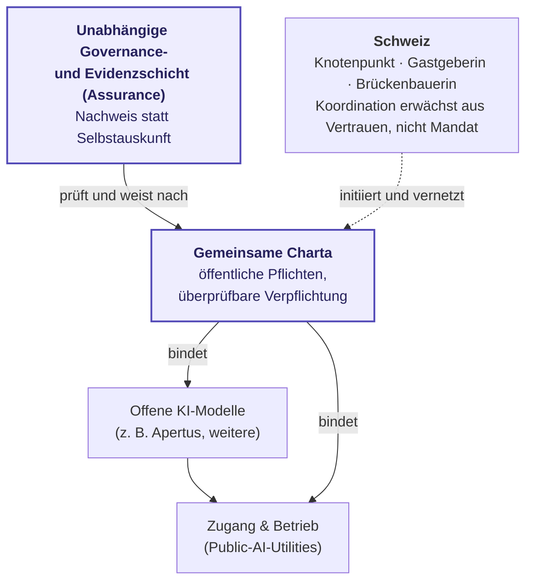

> **Status: DRAFT**

# Nationales Impulsprogramm für ein internationales Netzwerk offener KI-Modelle — Sprint-Präsentation

*Kurzpräsentation und Handout für ein Policy-Sprint-Scoping (z. B. mit einem neutralen Convenor wie Expedition Zukunft). Englische Fassung: [sprint presentation (EN)](impulsprogramm-sprint-presentation.en.md) · projektierbare Folien: [DE](impulsprogramm-sprint-slides.de.html) / [EN](impulsprogramm-sprint-slides.en.html). Knappe Fassung: [1-Pager](impulsprogramm-sprint-1pager.de.md) · ausführliche Rahmung: [Non-Paper](non-paper.de.md).*

Diese Seite dient als roter Faden für ein 30-minütiges Sondierungsgespräch und zugleich als Handout: vom Ziel über die Bausteine bis zur konkreten Bitte.

---

## 1 · Das Ziel

> Ein **nationales Impulsprogramm** für ein **internationales Netzwerk offener KI-Modelle**, dessen Beteiligte sich **überprüfbar auf eine gemeinsame Charta verpflichten**. So schützt und stärkt es **freie und faire Gesellschaften im digitalen Zeitalter** und fördert deren **Resilienz und Selbstbestimmung**. Als **wichtiger internationaler Knotenpunkt, Gastgeberin und Brückenbauerin** dieses Netzwerks gewinnt die **Schweiz** dadurch zugleich an **internationalem Ansehen und wirtschaftlicher Stärke**; **Koordination** erwächst aus Vertrauen und Neutralität, nicht aus einem Mandat.

## 2 · Die Sprint-Frage

> Wie sollte ein nationales Impulsprogramm ausgestaltet und gesteuert werden, damit ein internationales Netzwerk offener KI-Modelle entsteht, dessen Beteiligte sich überprüfbar auf eine gemeinsame Charta verpflichten — und in dem die Schweiz als Knotenpunkt, Gastgeberin und Brückenbauerin wirkt, woraus eine koordinierende Rolle erwächst?

*Zuschnitt-Leiter für das Gespräch: **Mission (Ziel)** → **Programm-Design** (Charta, Governance, Auswahl, Trägerschaft) → **konkreter Baustein** (z. B. ein Apertus-class-Modell im Netzwerk).*

## 3 · Warum jetzt

- **Politisches Fenster:** Der Ständerat hat 2026 zwei einschlägige Motionen angenommen — **26.3221** (Impulsprogramm digitale Souveränität, 10.6.2026) und **24.3209** (souveräne digitale Infrastruktur, 20.3.2026); beide liegen nun beim Nationalrat. Sie stärken den *Aufbau* — Zweck, Governance und internationale Vernetzung bleiben offen.
- **Bausteine vorhanden:** **Apertus** (vollständig offen; EPFL, ETH Zürich, CSCS) als Schweizer Modell im Netzwerk; die Schweiz ist bereits **Partnerland von Current AI**; der **Swiss AI Action Plan** (digitalswitzerland/BAKOM, 23 Actions) liefert die Umsetzungsagenda.
- **Zeitfenster:** der **KI-Gipfel Genf 2027** als internationale Bühne. Im Juli 2026 tagen in Genf zudem der erste **UN Global Dialogue on AI Governance** (6.–7.7.) und die **ITU-AI-for-Good-Woche** (7.–10.7.) — das multilaterale Momentum ist real, ein Jahr vor dem Gipfel.

## 4 · Wo die Charta- und Assurance-Schicht sitzt

Modelle und Zugang existieren bereits. Der eigenständige Beitrag ist die **gemeinsame Charta** und die **unabhängige Nachweisschicht** darüber — orthogonal zu jedem einzelnen Modell oder Anbieter.

## 5 · Bausteine des Programms (Diskussionsgrundlage)

- **Gemeinsame Charta**, auf die sich die Beteiligten **überprüfbar** verpflichten: Zweckbindung, Provenienz, Verantwortlichkeiten, Anfechtbarkeit, Exit-Fähigkeit.
- **Offene Modelle im Verbund** — Interoperabilität, Anbieterwechsel, Betriebskontinuität; ergänzt bestehende offene Modelle (z. B. Apertus), kein Konkurrenzmodell.
- **Gemeinsamer, rechtekonformer Daten-Commons** — im Verbund gebündelte Lizenzierung klärt rechtekompatible Trainingsdaten (auch für offene Nutzung) verhandlungsstärker und günstiger als im Alleingang.
- **Unabhängige Governance & Trägerschaft** — Rollen, Aufsicht ausserhalb einzelner Beteiligter, transparente Finanzierung.
- **Schweizer Knotenpunkt-Rolle** — Gastgeberin und Brückenbauerin; Koordination erwächst aus Vertrauen und Neutralität; Anschluss an Genf 2027.

## 6 · Bereits vieles im Gang — der ergänzende Beitrag

Die eigene Frage soll als **Ergänzung** erkennbar sein, nicht als Doppelspur:

| Läuft bereits | Der ergänzende Beitrag |
|---|---|
| Offene Modelle & Compute (Apertus / Swiss AI Initiative) | die **überprüfbare gemeinsame Charta** darüber |
| Zugang & Netzwerk (Public AI, ICAIN) | **unabhängiger Nachweis** statt Vertrauen allein auf Eigentum/Selbstauskunft |
| Internationale Charta-Ebene (Paris Charter / Current AI; CH beteiligt) | dort benannte **unabhängige Auditing-/Accountability-Tools**; eine konkrete Evidenz-/Assurance-Schicht ist noch nicht sichtbar instanziiert |
| Nationale Agenda (Swiss AI Action Plan, Motionen) | **Governance, Evidenz und internationale Vernetzung** |

Kurz: Modelle, Zugang und politische Absichtserklärungen sind da — was fehlt, ist der **unabhängige, charta-gebundene Nachweis, dass öffentliche KI ihre öffentlichen Versprechen auch hält**. Genau dort liegt der Beitrag.

## 7 · Möglicher Sprint-Output

Programm-Eckwerte · Governance-/Charta-Grundzüge · Auswahl-/Förderkriterien · Postulat/Interpellation oder Vorbereitungsmandat für einen Pre-Sprint.

*Realismus: Eine tatsächliche Umsetzung/Pilotierung bis Genf 2027 ist ein **späterer, koalitionsgetragener** Schritt. Der Beitrag bis dahin ist **Prozess, Blueprint und Charta-Entwurf** — Artefakte, die andere weitertragen können.*

## 8 · Wer dahinter steht

- **Our AI Charter** — ein öffentlicher Governance- und Evidenzrahmen für KI-Systeme, auf die sich Menschen und Institutionen verlassen können sollen (Pflichten, Überprüfbarkeit, Anfechtbarkeit).
- **FactHarbor** — offene, gemeinnützige Plattformidee für strukturierte Evidenzmodelle zu komplexen und umstrittenen Aussagen.
- **FactHarbor Verein** — gemeinnütziger Schweizer Träger, mit Unabhängigkeitsregeln bei Finanzierung und Governance.

Der Anspruch ist **Prozess und Koalition, nicht Deutungshoheit** — kein Anspruch auf eine Zertifizierungs- oder Audit-Behörde, keine fertige Trägerkoalition, keine Behauptung, ein System sei bereits charta-konform.

## 9 · Was ich heute von Ihnen brauche

!!! question "Fragen für die Sondierung"
    - **Prozessfähig?** Trägt das Ziel als Sprint-Thema — oder braucht es zuerst einen engeren Zuschnitt bzw. einen anderen Convenor?
    - **Trägerschaft & Mandat?** Was bräuchte ein tragfähiger Prozess: parlamentarische Gruppe, Bundesamt, Stiftung, institutioneller Convenor?
    - **Echte Lücke?** Wo liegt gegenüber Motionen, Swiss AI Action Plan und dem früheren KI-Policy-Sprint die echte Ergänzung statt Doppelspur?
    - **Nächster kleiner Schritt?** Feedback auf den [1-Pager](impulsprogramm-sprint-1pager.de.md), eine Einführung zur Policy-Design-Seite, oder ein zweites Gespräch.

---

*Öffentliche Quellen und Vertiefung: [1-Pager](impulsprogramm-sprint-1pager.de.md) · [Non-Paper](non-paper.de.md) · [Aktionsplan](action-plan.de.md) · [Verified Findings](../Evidence/verified-findings.md) · [Actors & landscape](../Evidence/actors-and-landscape.md).*
