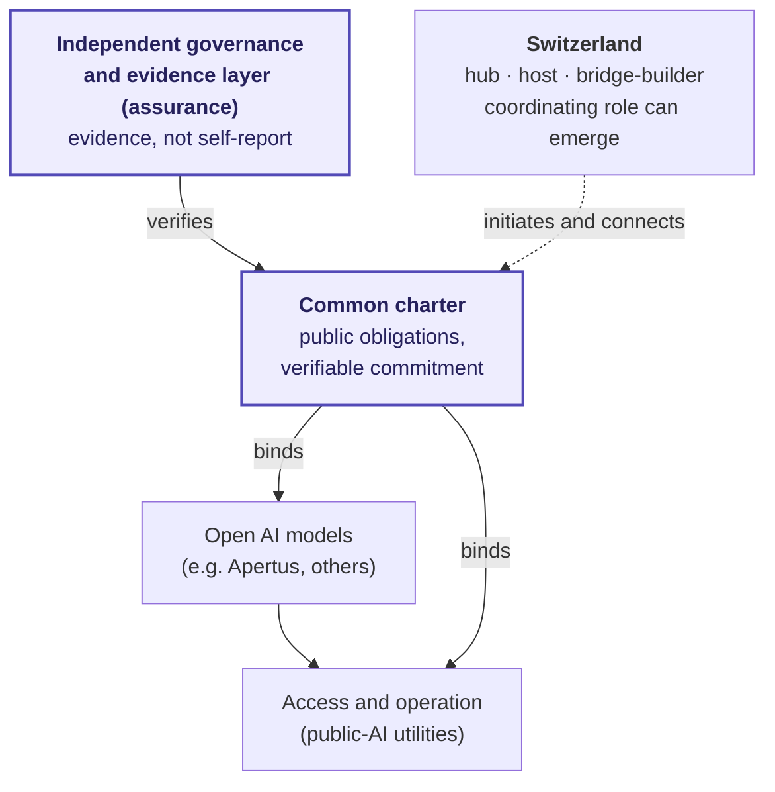

> **Status: DRAFT**

# Policy-sprint presentation: an international network of open AI models with a common charter

*Short presentation and handout for a policy-sprint scoping (e.g. with a neutral convenor). German version: [policy-sprint-praesentation.de.md](policy-sprint-praesentation.de.md). Projectable slides: [Slides (EN, HTML)](policy-sprint-slides.en.html). Brief version: [1-pager (DE)](policy-sprint-1pager.de.md) · fuller framing: [Non-Paper](non-paper.en.md).*

This page is a through-line for a 30-minute scoping conversation and a handout at the same time: from the goal through the building blocks to the concrete ask.

---

## 1 · The goal

> An **international network of open AI models** whose participants **verifiably commit to a common charter**. In doing so, it **protects and strengthens free and fair societies in the digital age** and fosters their **resilience and self-determination**. As the network's **key international hub, host and bridge-builder**, **Switzerland** in turn gains in **international standing and economic strength**; a **coordinating role** can emerge from that. Switzerland can **catalyse this build-up with a national impulse** — by which route (a policy sprint, an impulse programme in the sense of Motion 26.3221, or another) is deliberately left open.

## 2 · The sprint question

> How can Switzerland catalyse the build-up of an international network of open AI models whose participants verifiably commit to a common charter — with what sponsorship, what governance and funding criteria, and what first realistic steps? What role does Switzerland play as hub, host and bridge-builder, and can a coordinating role emerge from that?

*Scoping ladder: **goal** → **route & sponsorship** (charter, governance, selection) → **concrete building block** (e.g. an Apertus-class model in the network).*

## 3 · Why now

- **Political window:** In 2026 the Council of States adopted two relevant motions — **26.3221** (impulse programme for digital sovereignty, 10 Jun 2026) and **24.3209** (sovereign digital infrastructure, 20 Mar 2026); both are now before the National Council. They strengthen the *build* — purpose, governance and international networking remain open.
- **Building blocks in place:** **Apertus** (fully open; EPFL, ETH Zurich, CSCS) as a Swiss model in the network; Switzerland is already a **Current AI Country Partner**; the **Swiss AI Action Plan** (digitalswitzerland/OFCOM, 23 actions) supplies the implementation agenda.
- **Timing:** the **Geneva AI Summit 2027** as the international stage. In July 2026 the first **UN Global Dialogue on AI Governance** (6–7 Jul) and **ITU AI for Good** (7–10 Jul) also meet in Geneva — real multilateral momentum, a year before the summit.
- **Time pressure:** something **tangible** should exist by the summit (**June 2027**) — a process, blueprint and charter draft others can carry; the window is tight.

## 4 · Where the charter and assurance layer sits

Models and access already exist. The distinctive contribution is the **common charter** and the **independent evidence layer** above them — orthogonal to any single model or provider.

## 5 · Building blocks (basis for discussion)

- **Common charter** that participants **verifiably** commit to: purpose limitation, provenance, accountabilities, contestability, exit capability.
- **Open models in a network** — interoperability, provider switching, operational continuity; complements existing open models (e.g. Apertus), not a competing model.
- **Rights-cleared data and provenance commons** — a network clears origin, data protection, opt-outs and usage rights for selected training data. Only legally robust open sub-corpora become openly reusable; protected content runs through research, audit or licensed access. The value: clear once together, reuse lawfully many times.
- **Independent governance and sponsorship** — roles, oversight outside any single participant, transparent financing.
- **Swiss hub role** — host and bridge-builder; a coordinating role can emerge from that.

## 6 · Much already under way — the complementary contribution

The proposal should be recognisable as a **complement**, not a duplicate:

| Already under way | The complementary contribution |
|---|---|
| Open models and compute (Apertus / Swiss AI Initiative) | the **verifiable common charter** above them |
| Access and network (Public AI, ICAIN) | **independent evidence** rather than trust resting on ownership/self-report |
| International charter level (Paris Charter / Current AI; CH is a partner) | the **independent auditing/accountability tools** named there; a concrete evidence/assurance layer is not yet visibly instantiated |
| National agenda (Swiss AI Action Plan, motions) | **governance, evidence and international networking** |

Short: models, access and political declarations exist — what is missing is the **independent, charter-bound evidence that public AI keeps its public promises**. That is where the contribution sits.

## 7 · Possible sprint output

Parameters · sponsorship · governance/charter outline · selection/funding criteria · a postulate/interpellation or a preparatory mandate for a pre-sprint.

*Realism: actual implementation/piloting by Geneva 2027 is a **later, coalition-carried** step. The contribution until then is **process, blueprint and charter draft** — artifacts others can carry.*

## 8 · Who is behind this

- **Our AI Charter** — a public governance-and-evidence framework for AI systems that people and institutions should be able to rely on (obligations, verifiability, contestability).
- **FactHarbor** — an open, non-profit platform idea for structured evidence models on complex and contested claims.
- **FactHarbor association (Verein)** — the non-profit Swiss carrier, with independence rules for financing and governance.

The stance is **process and coalition, not authority** — no claim to a certification or audit body, no ready-made coalition, and no claim that any system is already charter-aligned.

## 9 · What I need from you today

!!! question "Questions for the scoping"
    - **Process-able?** Does the goal work as a sprint topic — or does it first need a narrower scope or a different convenor?
    - **Sponsorship and mandate?** What would a viable process need: a parliamentary group, a federal office, a foundation, an institutional convenor?
    - **A real gap?** Where, against the motions, the Swiss AI Action Plan and the earlier AI policy sprint, is the genuine complement rather than duplication?
    - **Data and rights path?** Which public, scientific, media, cultural, or multilingual data collections could realistically be cleared in a first rights-cleared commons — open, protected, or licensed?
    - **Next small step?** Feedback on the [1-pager (DE)](policy-sprint-1pager.de.md), an introduction to the policy-design side, or a second conversation.

---

*Public sources and depth: [1-pager (DE)](policy-sprint-1pager.de.md) · [Non-Paper](non-paper.en.md) · [Action Plan](action-plan.en.md) · [Verified Findings](../Evidence/verified-findings.md) · [Actors & landscape](../Evidence/actors-and-landscape.md).*
