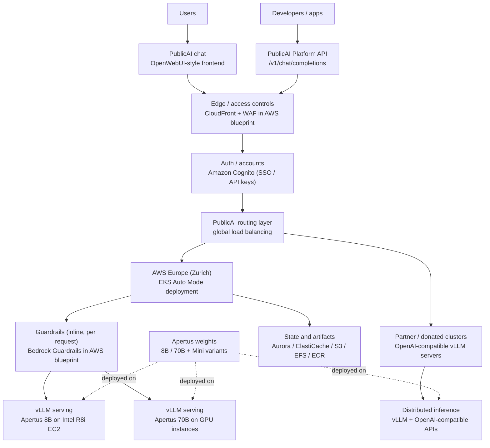
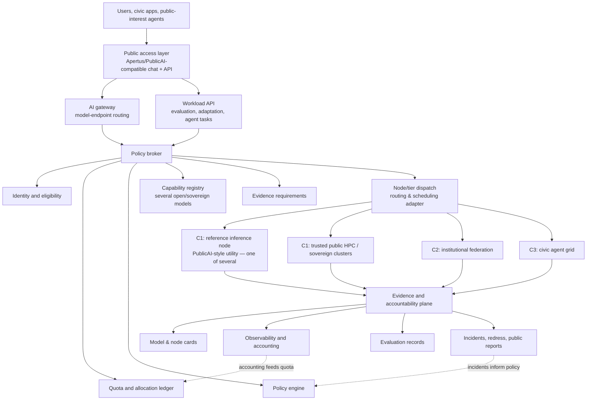

# Federated public compute architecture for the Public AI Network

How to build the Public AI Network's compute pillar as federated, governed public capacity — not a single global GPU pool.

*Naming: throughout, **the Public AI Network** is the umbrella effort; **the federation** (the federated public-compute layer) is the concrete system designed here — see the [overview](network-overview.md).*

_As of June 2026; re-verify figures and program statuses before public citation. Sources at the end._

## Conclusion

The compute pillar should be **federated public compute**: many independently operated nodes — public HPC centres, universities, public-service media, NGOs and cooperatives, sovereign and mission-aligned commercial clouds, and authenticated citizens — exposed through shared rules, with an evidence layer on top. Each node keeps local control; the federation shares identity, policy, accounting, and accountability.

> **Federated public compute** — capacity contributed by public, academic, cooperative, nonprofit, and **mission-aligned commercial or sovereign-cloud** operators, for inference, evaluation, adaptation, and (later) co-training, brokered under common rules for identity, eligibility, quota, routing, jurisdiction, provenance, safety, and accountability, while each node keeps local operational and jurisdictional control. What qualifies a node is the **public-interest terms it accepts** — disclosure, portability, and no control over governance or findings (see §10) — not its tax status.

Homepage form: _federated public compute that no single power can switch off or capture._

1. **Start from what's already live; stay model-plural.** The public-inference-utility pattern (PublicAI — chat, API, distributed inference, public-governance posture) is the closest live access layer to wrap and extend, not compete with. Apertus is the strongest live *fully-open* model to start the first pilot with — Switzerland's contribution — but the network is **model-plural**: no model, and no country, is privileged in the rules.
2. **Lead with what works.** Inference, evaluation, adaptation, and constrained agent execution are feasible now. Cross-border frontier-scale *training* is not — promise "operate, adapt, and govern," not "train at the frontier."
3. **The missing layer is not a GPU scheduler.** Runtimes exist (vLLM, Kubernetes/Kueue, Slurm, Ray, gateways). The gap is the **public-interest control-and-evidence layer** — the Charter's contribution.
4. **Capture is dual and documented.** Compute can be switched off by one state and held by one firm; the architecture defeats **both** by design.

**Local economic benefit is a legitimate driver.** Public compute is also industrial policy: building and operating nodes develops domestic skills, suppliers, and AI-capable firms, and gives each participating country a real economic stake — much of why states fund AI Factories, NAIRR, and national compute programmes. That economic development is a fair reason to invest, and it is fully compatible with a shared, governed network so long as the network stays openly governed and capture-resistant. It also widens access for researchers, startups, SMEs, and public bodies that cannot buy frontier capacity alone. This is how the compute pillar serves the Charter's mission of a public AI network that drives **societal resilience and economic prosperity**.

## Charter fit — the five public obligations

This architecture exists to make compute answer to the Charter's five public obligations (set out in the [Founding Accord](../../AI%20Assurance%20and%20Certification/Framework/founding-accord.md)), not only to run models:

| Obligation | How the architecture serves it |
|---|---|
| **Purpose-bound** | The policy broker binds every workload to a stated purpose and a prohibited-use baseline; the workload spec carries `purpose`, data class, and risk class. |
| **Answerable to people** | Every node has a named operator under a signed agreement (civic peering / PKI); the evidence plane plus an appeal/redress path makes someone accountable; consequential agent actions require human approval. |
| **Safe, secure, private, resilient** | Data-class + jurisdiction routing (PII to the trusted core only); confidential computing/attestation; sandboxed agents; multi-site resilience and an emergency inference reserve; weight escrow for continuity. |
| **Fair in practice** | Transparent, published quota and allocation rules; equitable public tiers; Global-South access on the ICAIN model; no single-actor capture of routing or visibility. |
| **Open to evidence and correction** | The evidence plane records model/node/evaluation cards, incidents, unresolved-risk notes, and public reports; redundant verification lets others check what ran. |

## 1. Trust model: civic peering, not permissionless

It is a federation of **known, accountable entities** that peer like **Eduroam or BGP** — not an anonymous, permissionless swarm. Membership runs on a **PKI / certificate authority with signed participation agreements (not a blockchain)**: every node holds a verifiable certificate, so a misbehaving node can be identified, quarantined, and held to account. This is what lets the federation meet the Charter's accountability and privacy obligations that a trustless token network cannot — and it is why the design avoids crypto/DePIN compute markets (§5).

## 2. What exists, and what is feasible

### Feasibility by workload

| Workload | Feasibility today | Notes |
|---|---|---|
| Public chat / API **inference** | **High** | Proven: the [Public AI Inference Utility](https://publicai.co/stories/utility) already serves public and sovereign models through chat/API access; its developer portal exposes an OpenAI-compatible API (`api.publicai.co/v1`) with `swiss-ai/apertus-8b-instruct` among the listed models ([PublicAI Platform — API endpoints](https://platform.publicai.co/api/~endpoints)). For the Sept 2025 Apertus launch it allocated ~115k GPU-hours across ~20 donated clusters in 5+ countries ([PublicAI, Sep 2025](https://publicai.co/stories/apertus)) — re-verify current standing capacity. |
| **Evaluation / red-team / batch** | **Very high** | Embarrassingly parallel; the natural first public-interest lane. |
| **Agent** workloads | High **with strict controls** | Tools can execute code and access data — needs a tighter safety envelope than plain inference. |
| **Adaptation** (LoRA, RAG, domain tuning) | High | Run near the data, under jurisdiction controls. [FlexOlmo](https://allenai.org/blog/flexolmo) lets owners contribute and **withdraw** experts without centralising data. |
| **Continued pretraining** on bounded models | Medium | Within a region first; cross-site only where justified. |
| **Cross-border frontier-scale training** | **Low–medium** | A research track, not a first deliverable (see frontier caveat). |
| **Emergency inference reserve** | High | Pre-configured failover for civic/public services — a resilience argument in its own right. |

### What already exists (borrow the discipline, not the whole stack)

| Pattern | Examples | What to borrow | Maturity / limit |
|---|---|---|---|
| **Public inference utility** | [Public AI Inference Utility](https://publicai.co/stories/utility), [PublicAI Platform/API](https://platform.publicai.co/docs), [PublicAI chat](https://chat.publicai.co/); the customer-owned cooperative [publicai.ch / SPIU](https://publicai.ch/), in formation | Public API/UI over open & sovereign models; OpenWebUI-style frontend; vLLM + OpenAI-compatible endpoints; global routing/load balancing; national prompts/RAG; public governance posture; the **cooperative ownership** model | Nearest live MVP; PublicAI has a production Apertus deployment blueprint (AWS Zurich / Intel / EKS) but this is not yet the full public broker/evidence layer; publicai.ch/SPIU cooperative in formation (not yet registered) |
| **Research-resource broker** | [NAIRR](https://www.nsf.gov/focus-areas/ai/nairr), [NSF ACCESS](https://access-ci.org/) | Resource catalogue, eligibility, allocations, provider partnerships, reporting discipline | National/research-only; NAIRR funding politically exposed |
| **National public-compute programmes** | [EuroHPC AI Factories](https://www.eurohpc-ju.europa.eu/ai-factories_en) (19 factories + 13 antennas as of Jun 2026) and [AI Gigafactories](https://www.eurohpc-ju.europa.eu/ai-gigafactories_en); CSCS **Alps** (>10M GPU-h for [Apertus](https://ethz.ch/en/news-and-events/eth-news/news/2025/09/press-release-apertus-a-fully-open-transparent-multilingual-language-model.html)); India AI Mission, UK AIRR, Canada, Japan, Korea | Serious public compute, expert support, public mandate; allocation/subsidy and sovereignty-screen ideas | Mostly national/regional; HPC is batch-first; access terms vary; US-silicon dependent |
| **Federated research grid** | [Open Science Grid / PATh](https://path-cc.io/), [EGI](https://www.egi.eu/federation/egi-federation/), WLCG | Federation-before-centralisation: local owners, shared identity, job routing, accounting, monitoring | Not LLM-native; adapt for GPUs/serving/safety |
| **Cloud-native serving & scheduling** | [Kubernetes Gateway API Inference Extension](https://gateway-api-inference-extension.sigs.k8s.io/), [Envoy AI Gateway](https://aigateway.envoyproxy.io/release-notes/v1.0/), [Kueue/MultiKueue](https://kueue.sigs.k8s.io/docs/concepts/multikueue/), [Volcano](https://volcano.sh/), [Slurm federation](https://slurm.schedmd.com/federation.html), [KServe](https://kserve.github.io/website/), [Ray Serve LLM](https://docs.ray.io/en/latest/serve/llm/index.html), [vLLM](https://docs.vllm.ai/) | Don't build a scheduler/runtime/gateway from scratch — use these as node- and gateway-level building blocks | Technical only; no legitimacy, eligibility, redress, or anti-capture; MultiKueue is still beta, but already defines multi-cluster dispatch |
| **Federated model development** | [AI Alliance Project Tapestry](https://thealliance.ai/projects/tapestry); [NVIDIA FLARE](https://developer.nvidia.com/flare), [Flower](https://flower.ai/); low-comm training ([Decoupled DiLoCo](https://deepmind.google/blog/decoupled-diloco/)); modular data-owner contribution ([FlexOlmo](https://allenai.org/blog/flexolmo)) | "Shared base, sovereign derivatives"; data/compute stay local; only weights/modules travel | Later lane; Tapestry is Phase 0 / active-now (Jun 2026) with frontier scale contingent on proof points, partners, compute, data, and funding |
| **Operational federated learning (sensitive data)** | [CERN CAFEIN](https://cafein.web.cern.ch/) — clinical FL platform-as-a-service (stroke prediction under Horizon [TRUSTroke](https://arxiv.org/abs/2410.13869); atrial-fibrillation and cancer-prevention work) | Production cross-silo FL on data that legally cannot move; CERN as a neutral platform host running real federated AI infrastructure today, not only a governance model | Health/science-specific; not LLM-native; cross-silo FL carries real cost/coordination overhead |

### What is in specification or active development

The live specification layer is **model-aware routing and multi-cluster dispatch**: Kubernetes Gateway API Inference Extension defines inference gateways, endpoint pickers, and model-aware routing; Envoy AI Gateway has reached a stable 1.0 release; Kueue/MultiKueue supplies beta multi-cluster batch dispatch. The research layer is **low-communication training and federated contribution**: Decoupled DiLoCo shows resilient cross-region training; Covenant-72B reports a 72B over-the-internet pretraining run on a permissionless blockchain network; Tapestry and FlexOlmo explore institutional co-training and data-owner modules. The trust layer is **attestation and confidential computing**: NVIDIA Attestation and GPU TEEs make C1/C2 confidentiality more plausible, but not sufficient on their own.

Existing co-stewardship precedent worth naming: **[ICAIN](https://icain.ch/)** — Swiss-led (FDFA + ETH/EPFL/CSCS + CSC Finland), giving the Global South access to Alps/LUMI. The closest live model for "Switzerland as host/bridge," though its independent legal entity is **not yet built** — a template *and* a cautionary note.

### Starting from what's live: the PublicAI pattern and the Apertus model

**The access pattern (international): PublicAI.** Its public-inference utility already offers chat/API access, OpenAI-compatible endpoints, distributed inference, national prompts/RAG experiments, and stated public-governance principles — a live, multi-country pattern to wrap and extend, not a Swiss asset. **The first open model: Apertus.** A Swiss AI Initiative family (EPFL, ETH Zurich, CSCS) with open weights, data, code, methods, and documented training/evaluation; current releases include 8B/70B and **Apertus Mini** 0.5B/1.5B/4B. Read it precisely — *strongest fully-open, sovereign* anchor, not *strongest model*: frontier closed models still lead on raw capability, while Apertus leads on transparency, multilinguality, and provenance. It is Switzerland's contribution and the natural first model for a Swiss-anchored pilot — **one of several** open and sovereign families the federation will serve.

That means a clean split: **the federation is model-plural and neutrally governed** — the broker is model-agnostic, the published model list carries several open and sovereign families (e.g. Ai2's OLMo, OpenGPT-X's Teuken, EuroLLM), and no model is privileged in the rules — while **the first pilot starts from what is already live** (the PublicAI pattern, serving Apertus). **Model plurality is itself an anti-capture control**: the same §4 logic that rejects a single off-switch rejects a single-model dependency. The first pilot should not build a parallel public chat service; it should add the missing broker/evidence controls around a public-inference-utility access layer (PublicAI-style, serving Apertus): project eligibility, quota/allocation, node admission, data-class/jurisdiction routing, model/node/evaluation cards, incident/redress paths, and public usage reports. The second proof point is a genuinely independent node/provider — ideally also a second model family — under the same rules.

### The frontier caveat (why "operate/adapt/govern," not "train")

Distributed training is real but bounded, and the boundary is what sets the promise. The decentralised-training field's own leader makes the point: Prime Intellect's ~106B **INTELLECT-3** was trained on a **centralised 512×H200 cluster**, not over the internet ([Prime Intellect, Dec 2025](https://www.primeintellect.ai/blog/intellect-3); confirm against their technical report before citing) — and a standing **~1.5–6× efficiency tax**, with the largest published decentralised pretrains on the order of tens of billions of parameters, keeps over-the-internet training off the frontier. The methods are improving fast: [Decoupled DiLoCo](https://deepmind.google/blog/decoupled-diloco/) cut inter-datacentre bandwidth from 198 Gbps to 0.84 Gbps and trained a 12B model across four US regions, and a 72B over-the-internet run now exists ([Covenant-72B](https://arxiv.org/abs/2603.08163)) — though it ran on a token-incentivised **blockchain** network, exactly the crypto/DePIN substrate §5 says not to anchor on. That all moves **technical feasibility**, not the near-term reality for a public network: Epoch AI still finds the largest decentralised networks far behind frontier datacentres and unlikely to catch frontier training scale this decade ([Dec 2025](https://epoch.ai/gradient-updates/how-far-can-decentralized-training-over-the-internet-scale)). For the Public AI Network, mid-scale continued pretraining, adaptation, evaluation, and resilient inference are the realistic horizon.

## 3. Architecture: PublicAI today, broker/evidence next

### Current Apertus/PublicAI reference architecture

This diagram is a **source-informed map of the current public architecture**, not a claim about a formal Public AI Network governance layer. It combines PublicAI's utility description (chat/API, vLLM, partner clusters, global routing) with its published AWS/Intel Apertus deployment blueprint (AWS Zurich, EKS Auto Mode, Intel/GPU serving, guardrails, storage/state services).



What exists already: a live public-model access surface, Apertus as the flagship Swiss model family, API/chat access, distributed inference, and at least one documented production deployment pattern. What is not yet shown here: public allocation rules, formal node admission, common data-class routing, signed evidence cards, redress, and anti-capture governance. Note the tension this map makes visible — the flagship anchor today runs partly on a **US hyperscaler (AWS Zurich) with US-rooted Bedrock Guardrails**, the very stack §4 shows one jurisdiction can toggle. That is not a reason to avoid it; it is the clearest reason the broker, portability, and multi-vendor layers below exist.

### Proposed federated broker (model-plural, neutrally governed)



- **Public access layer** — the front door: PublicAI-compatible chat/API where useful, a batch endpoint for evaluation, a budgeted agent-task endpoint, and a published model list with model + evidence cards. Simple by design; complexity lives behind it.
- **Policy broker** — the core public-interest addition beyond today's PublicAI/Apertus access layer. Decides *whether* a workload may run, *where*, and *what evidence must be kept*: identity & affiliation, eligibility & public-interest purpose, quota/budget/contribution accounting, jurisdiction & data-class routing, model/node trust tiers, abuse-response + appeal, and signed execution records.
- **Compute nodes** — locally operated and locally governed; a live public-inference-utility node (PublicAI-style, serving Apertus in the first pilot) is the first reference node, and additional nodes publish capability records (Appendix), grouped into the three tiers below.
- **Evidence & accountability plane** — **where the Charter is strongest**: model/openness cards, node + dependency cards, evaluation records, workload summaries, incidents + mitigations, quota/allocation reports, unresolved-risk notes, and an explicit note of *what was not logged and why*. Distinguish public evidence from confidential assessor evidence from data that must not be retained.

### The missing layer, concretely

The bottom-line claim unpacks into eight decisions the **policy broker** makes and the records the **evidence plane** keeps — each a public-interest control on a capability primitive that already exists but is blind to the public interest (existing identity, scheduling, registry, and telemetry systems answer *can this run?*, not *may it — for whom, accountably, contestably?*):

1. **Who gets access** — eligibility/accreditation, tier, and quota, not merely a valid token → allocation record.
2. **For what purpose** — a declared purpose and prohibited-use baseline checked at admission, backed by abuse/misuse monitoring (a declaration is not a defence) → admission decision.
3. **On which node** — node admission (signed agreement; capability + dependency disclosure) and, separately, per-request data-class/jurisdiction routing → node card + routing decision.
4. **With what model** — an openness/trust classification and model/evaluation cards bound to the deployed version → model card + pinned version.
5. **With what data** — input, training, and retrieval provenance, consent, and IP basis (the Charter's own headline) → data-provenance record.
6. **Under which evidence obligations** — signed, privacy-minimised, **risk-tiered** records, including *what was not logged and why* → evidence-plane outputs.
7. **With which redress path** — a named accountable operator, an incident channel, appeal, and human approval for consequential actions → incident + appeal records.
8. **With what protections against capture** — the §4 design rules (distribution, split-layer voting, funding decoupled from control, neutral host, multi-vendor *and* multi-model, autonomous verification).

The load-bearing addition is **assurance and adjudication**: a signed record only proves *someone signed*, so the layer needs attestation, audit/sampling rights, and penalties for false attestation, plus a **named adjudicator outside any single member** with evidentiary standards and graduated sanctions. Without it the evidence plane is self-reporting; with it, placing the adjudicator beyond any one member is also what stops a neutral host from being read as covert control.

### Workload lanes

Separate lanes because each has different latency, cost, risk, and governance needs: **(1) public inference**, **(2) evaluation & evidence**, **(3) adaptation**, **(4) federated co-training** (later), **(5) agent compute** (constrained). Agent-lane minimum controls: per-task token/GPU/time budget; model/tool allowlists by risk; sandboxed execution; source/retrieval logging that minimises personal-data retention; claim- and citation-check hooks; human approval for consequential actions; hard stop on budget/policy/safety breach. MCP helps tool interoperability but its own spec flags consent, data-access, and code-execution risks — for public agents these controls are mandatory.

### Compute tiers (trust × latency)

Lanes say *what* runs; **compute tiers (C1–C3)** say *on whose hardware*, matched to trust and latency. The broker routes each request to the tier its privacy and latency demand:

| Tier | Compute | Best for | Integrity mechanism |
|---|---|---|---|
| **C1 — Fast core** | Trusted public HPC / sovereign clusters (CSCS, EuroHPC); K8s/Ray | Synchronous, low-latency, **privacy-sensitive** queries — PII routes here only | Operator trust + confidential computing / attestation |
| **C2 — Institutional swarm** | Peered institutions pooling datacentre/workstation GPUs; mostly site-local serving plus burst/batch/adaptation capacity; cross-site pipeline serving only where links and operations justify it | Mid-latency inference, evaluation, adaptation, and burst capacity for non-sensitive workloads | mTLS + node certificates + redundant cross-checks; TEEs/attestation where available, without treating enclaves as a full trust substitute |
| **C3 — Civic agent grid** | Volunteer idle compute (citizens, small orgs); quantized local models via llama.cpp behind a secure job queue | **Latency-tolerant, parallelisable agentic/batch** work on **public data** (e.g. open fact-checking, source verification, dataset embedding) | Redundant execution, spot checks, deterministic packaging where possible, provenance logs, and human adjudication for consequential outputs; no PII; sandboxed worker |

The C2 pipeline-parallel pattern was pioneered by **Petals** (BigScience) — a useful proof-of-concept but effectively dormant (last release 2023). Treat cross-site pipeline serving as an exception, not the default: it is fragile without predictable high-bandwidth links and disciplined operations. C3 is "Folding@Home for public-interest AI agents": it fits latency-tolerant, embarrassingly-parallel work on public data, and is the most direct route to **citizen participation** in public AI.

### Reference implementation stack

| Layer | Starting point |
|---|---|
| Gateway / routing | Kubernetes Gateway API Inference Extension and/or Envoy AI Gateway v1.0; keep OpenAI-compatible endpoints where useful |
| Inference runtime | vLLM or SGLang; KServe or Ray Serve LLM for orchestration; Triton/TensorRT-LLM where already in use |
| Batch scheduling | Kueue/MultiKueue (quotas, beta multi-cluster dispatch); Volcano for HPC-style batch |
| HPC integration | Slurm adapter first; Slurm federation where clusters already coordinate |
| Identity | Node-level **PKI/CA with signed SLAs** for institutional peers; OIDC/eduGAIN-style federation and Keycloak for users; SPIFFE/SPIRE for service identity |
| Policy | Open Policy Agent-style checks; keep public-AI policies readable and versioned |
| Observability | OpenTelemetry GenAI conventions, Prometheus, GPU + token/cost accounting, privacy-minimised event records |
| Evidence registry | Signed Markdown/JSON cards in Git for v0; append-only registry with public exports later |

Build the **broker, evidence schema, governance rules, and adapters** — not a new runtime, scheduler, marketplace, or identity system.

## 4. Governance & anti-capture

What makes "no single power can switch off or capture" defensible rather than a slogan.

### Why it is necessary — documented, not hypothetical

- **Switch-off by one state:** US GPU export controls are toggled as policy (H100→H20→**H200 case-by-case licensing for China after a Dec 2025 policy announcement / Jan 2026 BIS rule**, [BIS](https://www.bis.gov/press-release/department-commerce-revises-license-review-policy-semiconductors-exported-china)).
- **Cut-off by sanctions:** AWS/Microsoft/Google suspended Russian cloud (2022) and forced firms off in 2024 ([TechCrunch](https://techcrunch.com/2022/03/10/amazon-microsoft-and-google-have-suspended-cloud-sales-in-russia/)).
- **Weaponised dependency:** after US sanctions on the ICC prosecutor, his Microsoft email was reportedly cut; the ICC moved to open-source by Oct 2025 ([The Register](https://www.theregister.com/2025/10/31/international_criminal_court_ditches_office/)).
- **No sovereignty on a US stack:** Microsoft France told the French Senate under oath (June 2025) it **could not guarantee** data against the US CLOUD Act ([databalance.eu](https://www.databalance.eu/en/microsoft-cloud-sovereignty-2026/)).
- **Concentration (2026, re-verify):** the three US hyperscalers (AWS, Azure, GCP) hold roughly two-thirds of global **cloud-infrastructure-services** revenue (Synergy estimated 28% / 21% / 14% in Q1 2026, via [CRN](https://www.crn.com/news/cloud/2026/cloud-market-share-q1-2026-aws-microsoft-google-battling-in-ai-era)); NVIDIA remains the dominant data-centre AI accelerator platform, with analyst/methodology estimates around **80–90%** of AI-capex going to NVIDIA-based data centres ([Epoch AI methodology](https://epoch.ai/data/ai-chip-owners-documentation/methodology)), reinforced by CUDA lock-in. (Figures are estimates on differing bases — revenue, capex, shipment, installed capacity — so treat as orders of magnitude.)

### Precedents and what each teaches

| Precedent | Rule | Anti-capture lesson |
|---|---|---|
| **CERN** | One state, one vote; unweighted | Gold standard vs. *political* capture; open-access mandate |
| **SKA Observatory** | Treaty IGO, one-member-one-vote | Modern (2019) template; host-state ratification gate |
| **ITER / IAEA** | Majority for ops, **unanimity to amend** | Split the layers: act by majority, change the constitution by unanimity; autonomous inspectorate |
| **EUMETSAT** | GNI-proportional funding | Funding scales with economy **without** governance collapsing to it |
| **EuroHPC** | Commission holds 50% of votes | *Cautionary*: legal form alone did not stop EU-dominance or vendor lock-in ([Open Future, Feb 2026](https://openfuture.eu/blog/who-controls-europes-ai-future/)) |
| **ICAIN** | Aspiring independent association | The live Swiss nucleus — but the neutral legal entity is unbuilt |

Background: compute is unusually governable (detectable, excludable, concentrated supply chain — though not the only chokepoint; data, payment rails, and cloud accounts are governable too) — [Computing Power and the Governance of AI](https://arxiv.org/abs/2402.08797) (Feb 2024) — and the [CERN-for-AI blueprint](https://cfg.eu/building-cern-for-ai/) supplies concrete oversight mechanisms. "Sovereignty not autarky" has direct backing: [Chatham House (Feb 2026)](https://www.chathamhouse.org/2026/02/how-middle-powers-can-weather-us-and-chinese-ai-dominance) names "share sovereignty" and "hedge" as two of four middle-power strategies.

### Design rules (apply to any node, broker, or co-stewardship deal)

1. **Physical + jurisdictional distribution** — many sites, many legal regimes; no single off-switch.
2. **Split-layer voting** — majority for operations; supermajority/unanimity for budget, director, admissions, and cost-share.
3. **Funding decoupled from control** — contribution buys access, not the rules.
4. **Neutral host** — Switzerland's actual comparative advantage (rule of law, IGO-hosting).
5. **Open, multi-vendor, multi-model stack** — break the NVIDIA/CUDA + hyperscaler chokepoint (LUMI's AMD/ROCm path is the existing hedge), and avoid single-model dependency: the broker serves several open and sovereign model families, with no model privileged in the rules.
6. **Autonomous verification** — evaluation/inspection outside any single member's hands.

**Residual risk to state honestly:** silicon. Every pool except China's runs on US accelerators under US licences. This is "sovereignty not autarky," truthfully — mitigate with multi-vendor procurement and jurisdictional spread; do not claim full-stack independence.

## 5. Trust & integrity layer

Capture-resistance and confidentiality come from boring, production-grade engineering — not exotic cryptography:

- **Portability on open standards** (open weights/formats, portable orchestration) — the single biggest anti-capture lever; the difference between "portable" and "captured."
- **Confidential computing (TEEs) + remote attestation** — verify hardware/firmware and protect sensitive code/data in use on infrastructure you do not own ([NVIDIA Attestation](https://docs.nvidia.com/attestation/index.html)); early H100 benchmarks suggest low single-digit overhead for large-model inference ([benchmark](https://phala.com/posts/confidential-computing-on-nvidia-h100-gpu-a-performance-benchmark-study)). Fits C1–C2 institutional nodes. Caveats: TEEs do not eliminate operator, firmware, vendor-root, side-channel, or physical-access risk ([TEE.fail, Oct 2025](https://tee.fail/)); accept multiple roots, require operational controls, and keep a non-TEE fallback.
- **Redundant execution + spot-checking** — the integrity mechanism for untrusted C3 volunteer nodes that lack server TEEs; useful for anomaly detection and confidence, not a mathematical proof of truth.
- **Federated learning + differential privacy** for data that legally cannot move (mature cross-device; costlier cross-silo).
- **Weight escrow + reproducible builds** — continuity if a provider exits.
- **Avoid crypto/DePIN compute markets as an anchor** — real for some inference/rendering, but unproven for serious training, token-fragile, with a GPU-spoofing history (io.net, 2024), and reputationally entangling for a public-interest network. Borrow their verification ideas (e.g. TOPLOC), not their token markets.

## 6. Access governance tiers

Distinct from the compute tiers C1–C3 (§3): these classify *users and data*, not hardware.

| Tier | Access | Workloads |
|---|---|---|
| **0 — public demo** | Anonymous, rate-limited, public models | demos, education, low-cost Q&A |
| **1 — authenticated public-interest** | Accounted projects, quotas, public/synthetic data | civic apps, public evaluations, basic agents |
| **2 — institutional/research** | Approved institutions, stronger logging, data agreements | batch eval, adaptation, restricted research data |
| **3 — sensitive-local** | Local node only, strict legal basis, no default cross-border routing | sensitive public-sector / regulated work |

The first pilot stays in tiers 0–1; tier 2 follows with formal partners; tier 3 is **not** part of the first public claim.

## 7. MVP for Geneva 2027

> A working **Public AI Compute & Evidence pilot**: one governed API, several public models, **at least two independently operated nodes/providers**, transparent quota rules, public model/node/evaluation cards, one constrained public-interest agent or evaluation use case, and a governance blueprint for expansion.

Minimum build: **(1)** one gateway exposing 2–4 public models; **(2)** broker for project identity, quota, data-class policy, accounting; **(3)** one inference/cloud node + one independent research/HPC node; **(4)** model/node/evaluation cards, an incident channel, a monthly usage summary; **(5)** a public-data evaluation or multilingual civic-information agent; **(6)** admission criteria, prohibited-use baseline, conflict-of-interest disclosure, appeal/redress path, anti-capture rule.

**Where to start.** Lead with an **Apertus/PublicAI-backed inference + evaluation** MVP — lowest risk, and it builds directly on the nearest live pattern. The first pilot is Apertus-anchored simply because that is where the live, fully-open assets sit today, not as a Swiss-leadership claim; the federation's rules stay model-plural (§3). Use Apertus as the flagship model family and PublicAI's chat/API pattern as the access precedent; add the missing broker/evidence controls around it, then federate a second independently operated node/provider — ideally a second model family. In parallel, prototype a small **civic agent grid** (C3) as the citizen-participation track: latency-tolerant public-interest agents such as open fact-checking and source verification — the pattern behind FactHarbor (the maintainer's alpha prototype). The grid is the more distinctive story but carries higher reliability/coordination risk, so it should ride alongside — not replace — the inference MVP.

Success is not global scale. Success is proving public compute can be shared under inspectable rules.

## 8. Development sequence

- **0–30 days — define & align:** adopt the definition above; treat Apertus/PublicAI as the reference implementation to learn from; map candidate nodes (Public AI Inference Utility, CSCS/Swiss AI/Apertus-adjacent, EuroHPC routes, ICAIN, Current AI, universities); choose one public-data use case; draft `ComputeNode v0`, `PublicAIWorkload v0`, and card templates.
- **31–90 days — prototype:** an Apertus-compatible governed API pattern; project accounts, quotas, logging profiles; run one batch evaluation + one constrained agent task; publish model/node/evaluation cards + a short lessons report.
- **3–6 months — federate:** add a second independently operated node via an adapter; test routing, failover, quota accounting, node disconnect, incident handling, public reporting; keep sensitive data out of scope.
- **6–12 months — institutionalise:** a small technical steering group + a separate public-interest governance group; admission rules for models/users/projects/nodes; contribution credits (compute, models, evaluations, datasets, translations, support); pilot-scale public/foundation funding tied to the evidence deliverable.

## 9. Risks & controls

| Risk | Control |
|---|---|
| **Overclaiming** a global training cluster | Frame as a federation; start with inference/eval/batch/agent/fine-tune |
| **Compute capture** (one state/funder/cloud/lab) | Publish allocation rules, routing logic, partner credits, conflicts of interest, accountability reports; apply the §4 design rules |
| **Jurisdiction confusion** | Data classes, jurisdiction constraints, sovereign-only routing, auditable operator profiles |
| **Node tampering / poisoning** | Node certificates (civic peering); redundant cross-checks (C2); redundant execution, spot checks, and adjudication for C3 |
| **Agent abuse** | Tool allowlists, scoped permissions, sandboxing, budgets, human approval, full traces |
| **HPC usability gap** | Dual stack: HPC for training/batch, cloud-native for APIs/serving/agents |
| **Silicon / vendor lock-in** | Multi-vendor procurement, open formats, portability, weight escrow |
| **Sustainability blind spot** | Energy/carbon metadata in node profiles + scheduler policy |

## 10. Decisions to settle

| Decision | Default recommendation |
|---|---|
| Where to start the pilot? | Apertus/PublicAI-backed inference + evaluation MVP (proven, low-risk) as the lead; a small civic agent grid in parallel for the citizen-participation story |
| First two nodes/providers? | One Apertus/PublicAI-style inference utility node + one Swiss research/HPC or sovereign-cloud node (CSCS/SNAI-adjacent where possible) |
| Who operates the first broker? | PublicAI/SPIU-adjacent or a Swiss/SNAI-adjacent neutral host; avoid a new institution claim |
| Identity scope for the pilot? | PKI/CA + signed SLAs for institutional nodes; Keycloak/OIDC for users now; eduGAIN-style federation later |
| Contribution credits across parties? | Banded GPU-credit accounting; design later, don't block the pilot |
| Commercial providers? | Allowed only with disclosure, portability, quota limits, and **no** control over governance or evaluation findings |
| Sensitive data? | Excluded from the first public pilot |

## 11. Anti-claims

Do **not** say: "we are building the global public compute pool"; "this solves sovereign AI"; "this is a certification"; "this replaces commercial AI"; "this replaces Apertus/PublicAI"; "open models are safe by default."

Do say: "we are building a **federated public compute & evidence pilot**"; "Apertus/PublicAI is the nearest live anchor, and the Charter adds the public-interest broker/evidence layer"; "the goal is **governed access** to public models, evaluations, and agent workflows"; "node control stays **local** while identity, quota, policy, evidence, and accountability are **shared**"; "the first deliverable is small — a working gateway, ≥2 nodes/providers, public evidence cards, and one constrained use case."

## Appendix — minimum schemas (v0)

```yaml
ComputeNode:
  operator: "named institution"        # public operator preferred
  jurisdiction: "CH"                    # legal regime of the node
  tier: "fast-core | institutional-swarm | civic-agent-grid"
  workloadClasses: ["inference", "batch-evaluation"]
  accelerators: [{ type: "GH200|H100|MI300", countDisclosure: "banded" }]
  schedulers: ["kueue", "slurm-adapter"]
  dataClassesAllowed: ["public", "synthetic", "non-sensitive-research"]
  retentionProfiles: ["metrics-only", "short-lived-debug"]
  trustTier: "tier-1-authenticated"
  identity: { certificate: "publicai-CA", slaSigned: true }
  telemetry: { utilization: true, carbonSignal: true, auditLogs: true }
  publicDependencies: ["cloud/provider or facility disclosure"]
  incidentContact: "public-contact@example.org"
```

```yaml
PublicAIWorkload:
  project: "geneva-2027-evidence-pilot"
  responsibleInstitution: "named public-interest host"
  workloadClass: "batch-evaluation"
  purpose: "evaluate a public model on source-grounded civic tasks"
  model: { requested: "apertus-or-compatible", opennessRequirement: "open-enough-to-evaluate" }
  data: { class: "public", personalData: false, allowedRegions: ["CH", "EU"], retentionProfile: "metrics-only" }
  budget: { maxGpuHours: 50, maxTokens: 20000000, maxWallTimeHours: 12 }
  evidence: { publishSummary: true, retainPrompts: false, retainMetrics: true, requiredCards: ["model", "node", "evaluation"] }
  policy: { trustTierRequired: "tier-1-authenticated", prohibitedUsesProfile: "public-ai-baseline", humanReviewRequired: false }
```

## Bottom line

The strongest architecture for the Public AI Network is a **federated public-compute broker with an evidence plane** — **model-plural and neutrally governed**, with a first pilot that starts from what is already live (the PublicAI access pattern, serving Apertus) — peered as **civic infrastructure** (known, accountable nodes — not a permissionless swarm), governed by **split-layer, funding-decoupled, multi-vendor, neutrally-hosted** rules, and protected by **portability + TEEs/attestation + operational controls**. The runtime and first public-model access pattern already exist (PublicAI/Apertus). What is missing — and what the Charter can credibly contribute — is the public-interest control-and-evidence layer: who gets access, for what purpose, on which node, with what model, with what data, under which evidence obligations, with which redress path, and with what protections against capture.

## Sources

Operational anchors — [Apertus](https://apertvs.ai/) · [Apertus technical information](https://apertvs.ai/pages/documentation/) · [Apertus Mini](https://apertvs.ai/articles/2026-06-apertus-mini/) · [Apertus for Ticino](https://apertvs.ai/articles/2026-03-ticino/) · [Public AI Inference Utility](https://publicai.co/stories/utility) · [PublicAI Platform/API](https://platform.publicai.co/docs) · [PublicAI Apertus deployment note](https://publicai.co/stories/apertus) · [PublicAI AWS/Intel deployment blueprint](https://aws.amazon.com/blogs/apn/how-public-ai-delivers-sovereign-llm-inference-on-aws-and-intel/) · [publicai.ch / SPIU](https://publicai.ch/) · [EuroHPC AI Factories](https://www.eurohpc-ju.europa.eu/ai-factories_en) · [EuroHPC AI Gigafactories](https://www.eurohpc-ju.europa.eu/ai-gigafactories_en) · [CSCS Alps / Apertus (ETH, Sep 2025)](https://ethz.ch/en/news-and-events/eth-news/news/2025/09/press-release-apertus-a-fully-open-transparent-multilingual-language-model.html) · [ICAIN](https://icain.ch/) · [NAIRR](https://www.nsf.gov/focus-areas/ai/nairr) · [NSF ACCESS](https://access-ci.org/) · [CERN CAFEIN](https://cafein.web.cern.ch/). Implementation/spec layer — [Kubernetes Gateway API Inference Extension](https://gateway-api-inference-extension.sigs.k8s.io/) · [Envoy AI Gateway v1.0](https://aigateway.envoyproxy.io/release-notes/v1.0/) · [Kueue/MultiKueue](https://kueue.sigs.k8s.io/docs/concepts/multikueue/) · [Slurm federation](https://slurm.schedmd.com/federation.html). Distributed training & data contribution — [Decoupled DiLoCo (DeepMind, Apr 2026)](https://deepmind.google/blog/decoupled-diloco/) · [INTELLECT-3 trained centrally (Prime Intellect, Dec 2025)](https://www.primeintellect.ai/blog/intellect-3) · [Covenant-72B (arXiv, Mar 2026)](https://arxiv.org/abs/2603.08163) · [FlexOlmo (Ai2, Jul 2025)](https://allenai.org/blog/flexolmo) · [Project Tapestry](https://thealliance.ai/projects/tapestry) · [Epoch AI, Dec 2025](https://epoch.ai/gradient-updates/how-far-can-decentralized-training-over-the-internet-scale). Trust — [NVIDIA Attestation](https://docs.nvidia.com/attestation/index.html) · [Confidential computing on H100 (benchmark)](https://phala.com/posts/confidential-computing-on-nvidia-h100-gpu-a-performance-benchmark-study) · [TEE.fail, Oct 2025](https://tee.fail/) · [MCP Security Best Practices](https://modelcontextprotocol.io/docs/tutorials/security/security_best_practices). Governance & political economy — [Computing Power and the Governance of AI (Feb 2024)](https://arxiv.org/abs/2402.08797) · [Building CERN for AI](https://cfg.eu/building-cern-for-ai/) · [Who controls Europe's AI future? (Open Future, Feb 2026)](https://openfuture.eu/blog/who-controls-europes-ai-future/) · [Chatham House — middle powers (Feb 2026)](https://www.chathamhouse.org/2026/02/how-middle-powers-can-weather-us-and-chinese-ai-dominance). Capture precedents — [BIS H200 licensing rule (Jan 2026)](https://www.bis.gov/press-release/department-commerce-revises-license-review-policy-semiconductors-exported-china) · [ICC moves off Microsoft (Oct 2025)](https://www.theregister.com/2025/10/31/international_criminal_court_ditches_office/) · [Microsoft France / CLOUD Act (Jun 2025)](https://www.databalance.eu/en/microsoft-cloud-sovereignty-2026/).
