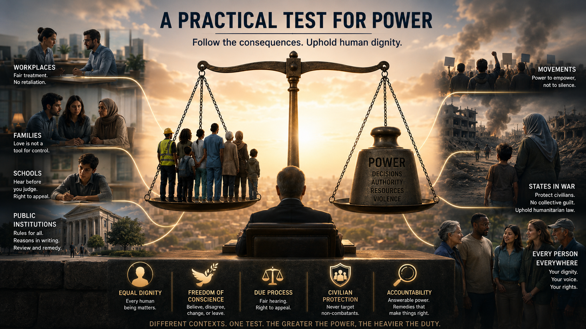

> **Status: PUBLISHED 2026-07-19** — repository source for the LinkedIn post and article *A Practical Test for Power*, published 19 July 2026. The live article was partly updated 20 July 2026; this refined source does not match every live passage verbatim.
> Canonical article: [https://www.linkedin.com/pulse/practical-test-power-robert-schaub-va1we](https://www.linkedin.com/pulse/practical-test-power-robert-schaub-va1we) · Feed post: [https://www.linkedin.com/feed/update/urn:li:ugcPost:7484672865079058433/](https://www.linkedin.com/feed/update/urn:li:ugcPost:7484672865079058433/)

---

<!-- POST COPY -->

**A Practical Test for Power**

*Power becomes visible where its consequences land:* on a worker who cannot safely refuse, a student who cannot appeal, a family member cast out for changing belief, or civilians treated as expendable.

*A practical test:* **follow every use of power to those who bear its cost.**

It begins with our own power and must also hold in war. In Israel and Palestine, **no civilian bears collective guilt. Jewish safety and Palestinian freedom are not rival goods.**

**Judge each use of power by whether it is legitimate, what it does to people, whether it remains answerable, and the limits it will not cross.**

The same test applies to AI governance: who is responsible, who bears the cost, and can those affected obtain an explanation, challenge an automated decision and secure correction?

#AIGovernance #Accountability #HumanRights #EthicalLeadership #CivilianProtection

*Full article below ↓*

---

<!-- ARTICLE -->

# A practical test for power

*From managers and families to movements and states at war, follow decisions to those who bear their costs—and ask whether each use of power is legitimate, answerable and bound by firm limits.*

## Follow the decision to those who bear it

Power sounds abstract until someone must live under a decision. A practical test begins there: follow its consequences—from one worker or student to a whole population.

The power-holder may be a manager, family, movement, public institution or state. Its convictions may be sincere and sometimes right. But sincerity does not tell us what power is doing—and power itself makes its costs harder for the holder to see. Where leaving is the only safe option, power has already failed the test.

The practical test: **judge every use of power by whether it is legitimate, what it concretely does to human beings, whether it remains answerable, and the limits it will not cross.**

Legitimacy asks what gives the power-holder authority—consent, law or responsibility for others—and whether this use serves the purpose for which that authority exists and stays within its limits.

## Four scenes—from daily life to war

A supervisor cuts a worker's shifts after she refuses unpaid weekend work. Nothing is called punishment, but everyone who depends on those wages learns that refusal has a price. Written schedules and reasons, protection against retaliation, outside review and restored pay after a wrongful cut make refusal safer.

A family or religious community responds to a member's change of belief with threats, punitive silence or withdrawn support. Emotional or material power makes belonging conditional on obedience. Care becomes coercion when “no” is unsafe. A trustworthy relationship does not use humiliation or essential care to punish disagreement or exit.

A school suspends a student after an accusation without telling him the substance of the allegation, hearing his account or allowing an appeal. The school may intend to protect others, but good intent cannot make an unreviewable punishment fair. The student loses lessons and reputation. Fairness requires notice, a chance to respond, independent review and correction of the record if the school was wrong.

The greater the power, the heavier the duty—heaviest in war, where one decision can fall on a whole population. War also raises a prior question: is the violence itself justified? My answer is defence only—when it is necessary and proportionate to defend oneself or others against aggression or grave harm, and no realistic non-violent alternative can do so.

A commander considers attacking a suspected weapons convoy in a crowded market. A mistake may be irreversible. Before proceeding, the commander must verify that the convoy is a military objective and take all feasible precautions to avoid or minimize civilian harm, including in the choice of means and timing. The attack must not proceed if expected incidental civilian harm would be excessive in relation to the concrete and direct military advantage anticipated.

## Test every use of power

Ask these questions whenever power is exercised—by you or by others—in families, workplaces, movements, institutions or governments, in peace or war:

1. Who has power over whom here, who is responsible for its use, and what gives them authority to use it this way?
2. What is being done, who benefits, who bears the cost, and is any harm necessary and proportionate to a legitimate aim that cannot be achieved with less harm?
3. Can those affected safely disagree with, refuse or challenge this use of power—or have it challenged on their behalf—and, where relevant, leave without retaliation rather than having to leave simply to be safe?
4. Have those exercising power heard those affected—beforehand where possible and afterward if not—considered the best available evidence and given reasons that can be examined?
5. Can an independent person or body stop or reverse the decision or practice—or investigate it when harm cannot be undone?
6. How will the effects be checked and unjustified harm remedied—and who can limit or remove that power after repeated failures?
7. Does this use of power respect equal dignity, freedom of conscience, due process and, in war, civilian protection—even when those limits frustrate its goal?

When power fails the test, those who can act without serious danger—especially people with influence or institutional protection—have the strongest duty to speak up: name the harm, stand with those affected and press for review, remedy and accountability.

## Consequences within firm boundaries

Consequences matter, but they are not all that matters. A popular goal does not license humiliating an employee, coercing a conscience, punishing without fair process or deliberately harming civilians. Equal dignity, freedom of conscience, non-domination, due process, civilian protection and accountability set boundaries; consequences show whether those commitments are real. Mercy sees the human being where the rule, the goal or the cause looks past them, and it spares or repairs even where power is within its rights. It keeps power answerable to those who bear its consequences.

In 1948 the UN General Assembly proclaimed the [Universal Declaration of Human Rights](https://www.un.org/en/about-us/universal-declaration-of-human-rights) as a common standard: "All human beings are born free and equal in dignity and rights" (art. 1). It is not a treaty. The [International Covenant on Civil and Political Rights](https://www.ohchr.org/en/instruments-mechanisms/instruments/international-covenant-civil-and-political-rights) binds its states parties to protect conscience, expression, fair hearings and effective remedies; in armed conflict, international humanitarian law also binds every party to the conflict.

Human-rights treaties primarily bind states; domestic law in workplaces and families varies, and my proposal goes beyond the legal minimum. Safeguards should be proportionate to the harm a power-holder can cause.

For the threat or use of force by states in international relations, the UN Charter sets a separate legal framework: it generally prohibits force, preserves individual or collective self-defence if an armed attack occurs, and authorizes Security Council enforcement action ([art. 2(4)](https://www.un.org/en/about-us/un-charter/chapter-1); [arts. 42 and 51](https://www.un.org/en/about-us/un-charter/chapter-7)). The protection owed to civilians under international humanitarian law does not depend on the justification offered.

## Israel and Palestine: protect civilians, assign responsibility precisely

Here the consequences include death, captivity, displacement and deprivation. One standard requires careful distinctions: Israeli civilians and Jewish people are not the Israeli government or forces; Palestinian civilians and the Palestinian people are not Hamas or other armed groups.

On 7 October 2023, members of Hamas's military wing and other Palestinian armed groups killed civilians and took hostages, as documented by the [UN Independent International Commission of Inquiry](https://www.ohchr.org/sites/default/files/documents/hrbodies/hrcouncil/sessions-regular/session56/a-hrc-56-crp-3.pdf). The Israeli military campaign in Gaza has killed and injured Palestinian civilians and caused immense displacement, deprivation and destruction ([Commission findings on Gaza](https://www.ohchr.org/sites/default/files/documents/hrbodies/hrcouncil/sessions-regular/session56/a-hrc-56-crp-4.pdf)). **Context can explain conduct without excusing harm.**

**No civilian bears collective guilt.** Responsibility belongs to people and institutions for what they decide, order, enable or do—not to an ethnic, religious or national population. **No cause may make civilians expendable.**

All parties must distinguish civilians and civilian objects from fighters and military objectives, take all feasible precautions and refrain from indiscriminate or disproportionate attacks. International humanitarian law also prohibits hostage-taking and collective punishment ([ICRC on civilian protection](https://www.icrc.org/en/law-and-policy/conduct-hostilities-and-protection-civilians) and [respect for IHL](https://www.icrc.org/en/law-and-policy/respect-ihl)).

**Jewish safety and Palestinian freedom are not rival goods.** Israelis and Palestinians alike deserve safety, freedom and equal dignity. Neither can be secured by treating the other's civilians as instruments, obstacles or acceptable losses. Security cannot excuse collective punishment; liberation cannot excuse attacks on civilians or hostage-taking.

**Accountability must be precise and evidence-based.** Test allegations against evidence; consider each actor's capacity to cause or prevent harm; review decisions and orders; and hold people and institutions responsible for their own conduct—even on our own side. Victims' rights must be protected, and accused people must receive due process. Depending on the facts and law, correction may require release, protection, restitution, discipline, prosecution or institutional change.

## One test for everyone

The test requires no shared religion or comprehensive worldview. It requires equal dignity, freedom of conscience and a refusal to dominate. The moral integrity of a conviction is shown partly by the limits its holders accept when another human being is in their power.

Three principles organize the seven questions. First: is this use of power legitimate, and what does it do to those who bear its consequences? Second: are those affected heard, and is power answerable through safe challenge, independent review, remedy and, after repeated failures, limitation or removal? Third: which limits will it not cross, even for a good goal? Wherever power is exercised, humanity and mercy must have the final say.

---

## Sources

- [Universal Declaration of Human Rights](https://www.un.org/en/about-us/universal-declaration-of-human-rights) (UN General Assembly resolution 217 A (III), 1948; especially arts. 1–2, 8, 10 and 18–20)
- [International Covenant on Civil and Political Rights](https://www.ohchr.org/en/instruments-mechanisms/instruments/international-covenant-civil-and-political-rights) (treaty framework for states parties, including effective remedy, fair trial, freedom of belief and expression, and equality before the law)
- [UN Independent International Commission of Inquiry, detailed findings on attacks carried out on and after 7 October 2023 in Israel](https://www.ohchr.org/sites/default/files/documents/hrbodies/hrcouncil/sessions-regular/session56/a-hrc-56-crp-3.pdf) (A/HRC/56/CRP.3, 2024)
- [UN Independent International Commission of Inquiry, detailed findings on military operations and attacks in the Occupied Palestinian Territory](https://www.ohchr.org/sites/default/files/documents/hrbodies/hrcouncil/sessions-regular/session56/a-hrc-56-crp-4.pdf) (A/HRC/56/CRP.4, 2024)
- UN Charter: [Article 2(4)](https://www.un.org/en/about-us/un-charter/chapter-1) (states' threat or use of force in international relations) and [Articles 42 and 51](https://www.un.org/en/about-us/un-charter/chapter-7) (Security Council enforcement and individual or collective self-defence)
- [ICRC: Jus ad bellum and jus in bello](https://www.icrc.org/en/law-and-policy/jus-ad-bellum-and-jus-bello) (why justification for war and rules governing its conduct must remain distinct)
- ICRC: [Conduct of hostilities and protection of civilians](https://www.icrc.org/en/law-and-policy/conduct-hostilities-and-protection-civilians) and customary rules on [proportionality](https://ihl-databases.icrc.org/en/customary-ihl/v1/rule14) and [precautions in attack](https://ihl-databases.icrc.org/en/customary-ihl/v1/rule15)
- [ICRC: Respect for international humanitarian law](https://www.icrc.org/en/law-and-policy/respect-ihl)
