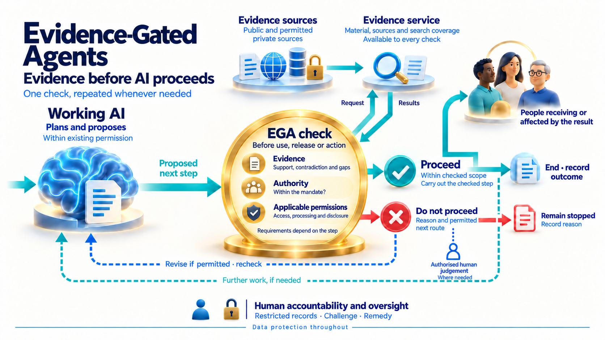
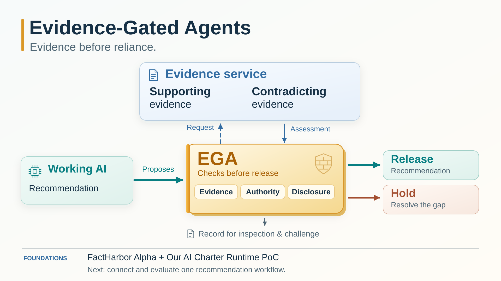

**PUBLISHED 2026-10-07 to LinkedIn [Post](https://www.linkedin.com/feed/update/urn:li:ugcPost:7513710861446873088/)**

*Revised locally for republication on 2026-10-09; this version has not been republished on LinkedIn.*

***

An AI recommendation can sound convincing—but is there enough evidence to justify following it?

Evidence-Gated Agents (EGA) is a proposed design for checking evidence, authority and permissions before AI uses information, releases output or takes action. Controls outside the acting AI keep the proposed step blocked until its requirements are met. Both permission and refusal leave a record; permitted revisions face fresh checks.

FactHarbor Alpha and the Our AI Charter Runtime proof of concept provide two existing foundations. Their integration remains to be built and evaluated, starting with checked recommendation release—not execution of the recommended action.

**Co-development and funding**

We’re seeking **experienced co-developers, sponsors and funders** to build and evaluate the first integration. Contact [Robert Schaub](https://www.linkedin.com/in/robertschaub/) or [info@factharbor.ch](mailto:info@factharbor.ch).

Explore the project:
https://robertschaub.github.io/our-ai-charter/Assurance/Concepts/evidence-gated-agents/

\#EvidenceGatedAgents #ResponsibleAI #AIAccountability

𝘍𝘶𝘭𝘭 𝘢𝘳𝘵𝘪𝘤𝘭𝘦 𝘣𝘦𝘭𝘰𝘸 ↓
***

***

# Evidence-Gated Agents: Before We Rely on an AI Recommendation

A convincing AI recommendation is not enough to justify following it. People need evidence supporting the proposed step, authority to proceed, and a way to inspect and challenge the result.

**Evidence-Gated Agents (EGA) is a proposed design that puts these checks into the workflow.** The working AI prepares a proposal; controls outside that AI keep the protected step blocked until its applicable requirements are met.

## The same check at each relevant boundary

For a protected step—such as using information, sending it to a service, releasing output or taking action—EGA asks: **may this step proceed?** Trusted rules select the checks; the acting AI cannot authorise itself. Preparation, evidence requests and revision also require permission.

*Wider design: the check recurs wherever needed. The accountability roles are responsibilities, not consecutive approvals.*

The evidence service finds permitted material and reports sources and search coverage. EGA assesses support, contradictions and gaps—including evidence of permission or authority. **Evidence supporting a recommendation does not itself grant authority to act or permission to disclose information.** Access, processing and disclosure have separate requirements; data protection also covers requests and records.

- **Proceed:** carry out only the checked step within its scope. Record the decision and actual or uncertain outcome.
- **Do not proceed:** keep the step blocked and record the reason or pending status. A permitted revision needs a fresh check; closed attempts stay closed.

Further work is optional and requires its applicable checks. Resolve uncertain outcomes before another step could duplicate work or effects.

People receiving or affected by the result need routes to inspect, challenge and seek correction, within access permissions. The wider design assigns responsibility for rules, operation, independent record custody, independent review and remedy. Human judgement can address a specific issue where needed and authorised; it cannot replace missing evidence or authority. These oversight arrangements remain design commitments, not demonstrated prototype capabilities.

## Two foundations, one concrete milestone

[FactHarbor Alpha](https://github.com/robertschaub/FactHarbor#what-is-factharbor) searches and analyses evidence, exposing sources and uncertainty. The [Our AI Charter Runtime](https://github.com/robertschaub/ai-charter-runtime#honest-limits--read-this-first) is a runnable proof of concept for controls outside the acting model, demonstrated with synthetic scenarios and local test effects.

**The first integration remains to be built and evaluated.** It will use human-defined evidence rules in one bounded recommendation workflow. Evidence examination and release permission remain separate: releasing a checked recommendation neither executes nor authorises the recommended action.

Evaluation must measure unsupported releases, unnecessary stops, missed decision components, useful answers, cost and delay. Automatically determining adequate evidence requirements for unfamiliar decisions remains a [research question](../Assurance/Concepts/evidence-requirements-research.md). The [prototype description](../Assurance/Concepts/evidence-gated-agents-prototype.md) sets out the scope and limits.

## Co-development and funding

We’re seeking **experienced co-developers, sponsors and funders** to build and evaluate this integration. Explore the [EGA project](../Assurance/Concepts/evidence-gated-agents.md) and contact [Robert Schaub](https://www.linkedin.com/in/robertschaub/) or [info@factharbor.ch](mailto:info@factharbor.ch).

<!-- Repository provenance: the post retains its original illustrated cover. The article uses the shared schematic updated 2026-10-09. The original detailed illustration remains at ../Assurance/Concepts/evidence-gated-agents-release-workflow.png; the 2026-10-07 publication text remains in Git history. -->
