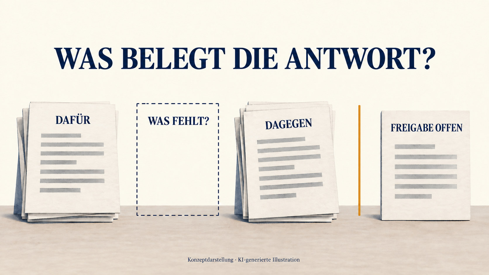

**PUBLISHED 2026-09-12 to LinkedIn [Post](https://www.linkedin.com/feed/update/urn:li:ugcPost:7504528739402301440/)**
***
### Die Schweizer F-35A-Fixpreisfalle – Würde KI heute hineintappen?

Schweiz, September 2022. Das Parlament will rund sechs Milliarden Franken für 36 F-35 bewilligen. Der Bundesrat sagt: Der Preis ist fix.

Der Kaufvertrag, ein Letter of Offer and Acceptance (LOA), verpflichtet den Käufer (Übersetzung):
«Der Käufer erklärt sich mit Folgendem einverstanden:» … «Der US-Regierung die gesamten ihr entstehenden Kosten der Vertragsgegenstände zu bezahlen, auch wenn diese die im LOA geschätzten Beträge übersteigen.»

Das separate Kommunikationsdokument «Procurement of F-35A Lightning II aircraft systems» wurde am 7. Dezember 2021 von der US Defense Security Cooperation Agency (DSCA) und armasuisse zur Kenntnisnahme unterzeichnet. Es nennt einen Fixpreis, inklusive Inflation – und denselben Preis wie für die USA. Das VBS stellte dies als absoluten Fixpreis dar.

Angenommen, ein KI-Assistent im geschützten System des VBS hat Zugang zu allen Dokumenten, auch vertraulichen. Ist der Preis fix?

Ein heutiger KI-Assistent arbeitet nach seinem Auftrag; die fragende Person wählt aus, welche Dokumente er sieht. Mit nur dem separaten Dokument vom Dezember 2021 könnte er durchaus antworten: Ja, der Preis ist fix.

Ein KI-Assistent allein löst das Problem nicht. Mit derselben einseitigen Belegauswahl könnte er erneut in die Falle tappen.

**Evidence-Gated Agents** ist ein vorgeschlagenes Konzept für KI-Assistenten: Folgenreiche Antworten und Handlungen brauchen eine Berechtigung und ausreichende Belege. Verantwortliche legen die Anforderungen fest. Eine separate Kontrolle prüft sie vor der Freigabe. Sind sie nicht erfüllt, hält die Kontrolle die Antwort oder Handlung zur Überarbeitung oder Prüfung zurück. Der Assistent kann diese Kontrolle – das **Evidence Gate** – nicht umgehen.

Klausel 4.4.1 besagt, dass die Schweiz der US-Regierung die tatsächlichen Kosten der vereinbarten Lieferungen und Leistungen erstatten muss – auch wenn diese die im LOA geschätzten Beträge übersteigen.

Auch der Vertrag nennt einen Fixpreis. Armasuisse sah einen Vorrang der ausgehandelten Bestimmungen. Das Gate würde eine begründete Beurteilung dieser Belege verlangen; ein ungeklärter Widerspruch würde eine vorbehaltlose Zusicherung blockieren.

Am 8. September 2026 kam die Geschäftsprüfungskommission des Nationalrates zum Schluss: Der Vertrag stützte die öffentlich kommunizierte Kostenobergrenze nicht.

**Evidence-Gated Agents sollen solche Fallen verhindern.** Ein ungeklärter Widerspruch würde eine vorbehaltlose Fixpreis-Zusicherung stoppen. Je nach Belegen könnte die Antwort die Aussage bestätigen, einschränken oder verwerfen – oder festhalten, dass die Belege nicht ausreichen. Jede freigegebene Antwort erhielte einen Freigabenachweis («Receipt»): die Zusammenfassung des Entscheidungsprotokolls mit Belegen, Prüfungen, Gründen und der Person, die die Freigabe erteilt hat.

\#AIGovernance #Verantwortung #Belege #Schweiz

𝘋𝘦𝘳 𝘨𝘢𝘯𝘻𝘦 𝘈𝘳𝘵𝘪𝘬𝘦𝘭 𝘶𝘯𝘵𝘦𝘯 ↓
***

***
# Die Schweizer F-35A-Fixpreisfalle – Würde KI heute hineintappen?

*Was die Schweizer F-35A-Beschaffung darüber zeigt, welche KI-Antworten wir freigeben sollten.*

*Der Streit betrifft das Zusammenspiel von Fixpreisklausel und Standardbedingungen – und damit das Kostenrisiko der Schweiz.*

Schweiz, September 2022: 36 F-35A, dazu Ausrüstung und Unterstützungsleistungen. Ein Beschaffungspaket von rund sechs Milliarden Franken. Das VBS versichert öffentlich, die Preise seien verbindlich. Es verweist auf eine Klausel und eine separate Erklärung, die den Festpreischarakter festhalten. [Mitteilung des VBS vom 19. September 2022](https://www.vbs.admin.ch/de/air2030-beschaffungsvertrag-fur-die-kampfflugzeuge-f-35a-unterzeichnet).

Für die Bevölkerung steht hinter dieser Zusicherung eine einfache Frage: **Kann die Schweiz verpflichtet werden, für die vereinbarten Flugzeuge mehr zu bezahlen?**

Die Dokumente verlangten eine sorgfältigere Antwort.

## Die Warnung lag bereits vor

Seit dem 11. Juli 2022 war der Bericht der Eidgenössischen Finanzkontrolle (EFK) zum Risikomanagement von Air2030 öffentlich zugänglich. Bis zur Vertragsunterzeichnung waren es noch mehr als zwei Monate. [Bericht der GPK-N, S. 61](https://www.parlament.ch/centers/documents/de/Bericht%20vom%2008.09.2026%20D.pdf#page=61).

Der Kaufvertrag trägt die Bezeichnung «Letter of Offer and Acceptance» (LOA). Die EFK zitierte Artikel 4.4.1 seiner Standardbedingungen: Die Schweiz muss der US-Regierung die tatsächlichen Kosten der vereinbarten Lieferungen und Leistungen erstatten – auch wenn diese die im LOA geschätzten Beträge übersteigen. [EFK-Bericht 21410, S. 27](https://www.efk.admin.ch/wp-content/uploads/publikationen/berichte/sicherheit_und_umwelt/verteidigung_und_armee/21410/21410be-endgueltige-fassung-v04.pdf#page=27).

Daneben gibt es das frühere, separate Kommunikationsdokument «Procurement of F-35A Lightning II aircraft systems». Die US Defense Security Cooperation Agency (DSCA) und armasuisse unterzeichneten es am 7. Dezember 2021 zur Kenntnisnahme. Es bezeichnet den Preis als fix, inklusive Inflation – und hält zugleich fest, dass die Schweiz die Flugzeuge zum gleichen Preis erhält wie die Vereinigten Staaten. In ihrem Bericht von 2026 kam die Geschäftsprüfungskommission des Nationalrates (GPK-N) zum Schluss: Die Vereinbarung war als absoluter Fixpreis dargestellt worden. Damit entstand der Eindruck einer Kostenobergrenze, die die Kommission im Vertrag nicht bestätigen konnte. [GPK-N-Bericht vom 8. September 2026, S. 39 und Fussnote 98; S. 58, 83](https://www.parlament.ch/centers/documents/de/Bericht%20vom%2008.09.2026%20D.pdf#page=39).

Auch eine spezifische Preisbestimmung im LOA stützte die Fixpreis-Auslegung. Die separate Erklärung war kein Bestandteil des LOA selbst. Die EFK sah keine absolute Rechtssicherheit für einen Pauschalpreis nach schweizerischem Recht. [EFK, S. 27–28](https://www.efk.admin.ch/wp-content/uploads/publikationen/berichte/sicherheit_und_umwelt/verteidigung_und_armee/21410/21410be-endgueltige-fassung-v04.pdf#page=28).

Die EFK empfahl, die finanziellen Risiken zu erfassen und Massnahmen zu ihrer Beherrschung festzulegen. Die Beschaffungsbehörde armasuisse lehnte die Empfehlung ab und argumentierte, die ausgehandelten Bestimmungen hätten Vorrang vor den Standardbedingungen. [EFK, Empfehlung 4 und Stellungnahme, S. 30–31](https://www.efk.admin.ch/wp-content/uploads/publikationen/berichte/sicherheit_und_umwelt/verteidigung_und_armee/21410/21410be-endgueltige-fassung-v04.pdf#page=30).

Die sicherheitspolitischen Kommissionen beider Räte befassten sich im August 2022 mit der Frage und sahen in der Preisbestimmung «Note 55» eine Stütze der Behördenposition. Nach Feststellung der GPK-N waren die Räte vor der Kreditbewilligung über die von der EFK benannten Risiken informiert. [GPK-N, S. 61](https://www.parlament.ch/centers/documents/de/Bericht%20vom%2008.09.2026%20D.pdf#page=61).

Am 8. September 2026 kam die GPK-N zum Schluss: Die Schweiz hatte zwar eine Fixpreisklausel ausgehandelt. Diese entsprach jedoch nicht dem pauschalen Fixpreis, der gegenüber Parlament und Öffentlichkeit kommuniziert worden war. Die Kommission hielt zugleich fest, dass US-Behörden zeitweise selbst Signale für einen pauschalen Fixpreis gesendet hatten, etwa mit einer Medienmitteilung ihrer Botschaft. Diese Feststellung stammt von der parlamentarischen Oberaufsicht; ein Gerichtsurteil ist sie nicht. [GPK-N, S. 2](https://www.parlament.ch/centers/documents/de/Bericht%20vom%2008.09.2026%20D.pdf#page=2).

Nach Einschätzung der Kommission hätte die Umsetzung der EFK-Empfehlung frühere Massnahmen und eine frühere Information des Parlaments ermöglichen können. [GPK-N, S. 3](https://www.parlament.ch/centers/documents/de/Bericht%20vom%2008.09.2026%20D.pdf#page=3).

Was muss geschehen, wenn eine dokumentierte Warnung auf eine Zusicherung trifft, auf die sich Menschen verlassen sollen?

## Dieselbe Frage an eine KI

Stellen wir uns vor, das VBS hätte einen KI-Assistenten im eigenen geschützten System, mit berechtigtem Zugang zu allen Dokumenten, auch den vertraulichen. Die Frage: Ist der Preis fix?

In diesem Beispiel wählt die fragende Person die Unterlagen für den Assistenten aus. Zeigt sie ihm nur das separate Dokument vom Dezember 2021, könnte er durchaus antworten: Ja, der Preis ist fix. Die Quellenangabe könnte korrekt sein, obwohl die Antwort die widersprechenden Vertragsbestimmungen ausblendet.

Ein KI-Assistent allein löst das Problem also nicht. Mit derselben einseitigen Auswahl an Belegen könnte er erneut in die Falle tappen.

**Evidence-Gated Agents** ist ein vorgeschlagenes Konzept für KI-Assistenten: Folgenreiche Antworten und Handlungen brauchen eine Berechtigung und ausreichende Belege. Verantwortliche legen die Anforderungen fest. Eine separate Kontrolle prüft sie vor der Freigabe. Sind sie nicht erfüllt, hält die Kontrolle die Antwort oder Handlung zur Überarbeitung oder Prüfung zurück. Der Assistent kann diese Kontrolle – das **Evidence Gate** – nicht umgehen.

Das Konzept von Evidence-Gated Agents sieht einen verbindlichen Prüfablauf vor: Der Assistent legt zunächst offen, welche entscheidungsrelevanten Aussagen eine Antwort enthält. Anhand fachlich festgelegter Prüfregeln schlägt er vor, was dafür nachgewiesen werden muss. Eine vom antwortenden Assistenten getrennte Prüfung beurteilt, ob diese Anforderungen das abdecken, was die Antwort zusichern soll.

Die Suche in zugelassenen Quellen richtet sich nach diesen Anforderungen und geht bei Bedarf über mitgelieferte Dokumente hinaus. Belege, Gegenbelege und offene Lücken werden den jeweiligen Aussagen zugeordnet; Grenzen der Recherche bleiben sichtbar. Das Gate setzt die festgelegten Anforderungen vor der Freigabe der konkreten Antwort durch. Fehlen erforderliche Belege oder bleiben entscheidende Widersprüche offen, stoppt es die vorgesehene Zusicherung. Die Antwort muss überarbeitet oder fachlich geprüft werden. Wesentliche Änderungen lösen eine erneute Prüfung aus.

Die korrigierte Antwort im F-35A-Beispiel:

> Der genannte Preis kann nicht als garantierte Kostenobergrenze behandelt werden. Klausel 4.4.1 besagt, dass die Schweiz der US-Regierung tatsächliche Kosten über den LOA-Schätzungen erstatten muss; armasuisse vertrat dagegen die Auffassung, dass die ausgehandelten Fixpreisbestimmungen Vorrang hätten. Die Dokumente rechtfertigen daher keine vorbehaltlose Zusicherung, dass für die Schweiz keine Mehrkosten entstehen können.

Die Antwort benennt das Kostenrisiko; die Entscheidung bleibt bei den Menschen.

## Welche Belege wären für die Zusicherung nötig?

*Die vorgeschlagene Belegprüfung betrachtet stützende Dokumente, Gegenbelege und offene Fragen, bevor eine Antwort freigegeben wird.*

Die Frage «Welches Dokument stützt diesen Satz?» reicht nicht aus.

Hinzu kommt: **«Was müssten wir klären, bevor wir das zusichern dürfen?»**

Im F-35A-Fall war die offene Frage konkret. Die EFK stellte fest, dass weder der LOA noch seine Standardbedingungen eine Rangfolge festlegten: Welches Vertragsdokument hat bei Widersprüchen Vorrang? Armasuisse hielt eine solche Rangfolge für unnötig, weil sich die Dokumente aus ihrer Sicht nicht widersprachen. [EFK, S. 27 und 31](https://www.efk.admin.ch/wp-content/uploads/publikationen/berichte/sicherheit_und_umwelt/verteidigung_und_armee/21410/21410be-endgueltige-fassung-v04.pdf#page=27).

Das vorgeschlagene Verfahren würde eine Suche nach den Belegen verlangen, die für die Zusicherung nötig sind. Anschliessend müssten die Fixpreis-Formulierungen, die widersprechenden Standardbedingungen und die rechtlichen Argumente zu ihrer Wirkung beurteilt werden. Rechtfertigten die Belege keine vorbehaltlose Zusicherung, würde das Gate diese Antwort zur Überarbeitung oder Prüfung zurückhalten. Eine Begründung zu protokollieren, würde allein nicht genügen, um die Anforderungen an die Belege zu erfüllen. Die fehlende Rangfolge benennt einen Klärungsbedarf; sie entscheidet für sich allein noch keine Rechtsfrage.

Software kann nicht selbstständig jedes fehlende Dokument entdecken. Ob die Beleganforderungen die Zusicherung angemessen abdecken und das verfügbare Material ausreicht, bleibt eine fachliche Beurteilung, für die Menschen verantwortlich sind. Erfasst die Belegprüfung nur die Aussagen, die der Assistent selbst zur Kontrolle vorlegt, können unbelegte Aussagen im übrigen Antworttext unentdeckt bleiben.

Diese Grenzen müssen bei der Entwicklung und beim Testen berücksichtigt werden.

## Eine Prüfung braucht jemanden, der handeln kann

Die vorgeschlagene Freigabekontrolle sollte die Berechtigung, die freigegebenen Belege und die genaue Antwort prüfen, die versendet werden soll. Schlägt ein erforderlicher Prüfschritt fehl, sollte die Antwort zurückgehalten werden. Änderungen sollten erneut geprüft werden. Die freigegebene Antwort sollte mit einem Protokoll versehen sein, das ihre Quellen, wesentliche Unsicherheiten, die Prüfung und die verantwortliche Person festhält.

Wer die Antwort erhält oder von ihren Folgen betroffen ist, sollte ihre Grundlage anfechten und eine Korrektur verlangen können. Ein Protokoll allein schafft noch keine unabhängige Überprüfung oder Abhilfe. Dafür müssen die zuständigen Institutionen sorgen.

Ein solches Konzept kann nicht versprechen, dass es den Kaufentscheid oder den Preis verändert hätte.

**Evidence-Gated Agents sollen solche Fallen verhindern.** Ein ungeklärter Widerspruch würde eine vorbehaltlose Fixpreis-Zusicherung stoppen. Je nach Belegen könnte die Antwort die Aussage bestätigen, einschränken oder verwerfen – oder festhalten, dass die Belege nicht ausreichen. Jede freigegebene Antwort erhielte einen Freigabenachweis («Receipt»): die Zusammenfassung des Entscheidungsprotokolls mit Belegen, Prüfungen, Gründen und der Person, die die Freigabe erteilt hat.

## Verwandte Artikel

- [When Should Runtime AI Governance Interrupt?](https://www.linkedin.com/pulse/when-should-runtime-ai-governance-interrupt-robert-schaub-mc2sc) — Wann die Prüfung von Belegen und Berechtigungen eine KI-gestützte Handlung stoppen sollte und was ihr Protokoll festhalten muss.
- [Runtime AI Governance Gets When Right. The Harder Question Is Who Gets to Check?](https://www.linkedin.com/pulse/runtime-ai-governance-gets-when-right-harder-question-robert-schaub-z6ahe/) — Warum Regelsetzung, Betrieb, Aufbewahrung der Belege und Entscheidungsprüfung getrennte, verantwortliche Rollen brauchen.
- [A Practical Test for Power](https://www.linkedin.com/pulse/practical-test-power-robert-schaub-va1we) — Wie sich Entscheidungen an ihren Folgen messen lassen und daran, ob Betroffene sie anfechten und Abhilfe erhalten können.
- [The Public AI We Need: Sovereign, Inspectable and Accountable](https://www.linkedin.com/pulse/public-ai-we-need-sovereign-inspectable-accountable-robert-schaub-vskve) — Wie Belege, unabhängige Überprüfung und Korrektur in den umfassenderen Vorschlag für öffentliche KI-Infrastruktur passen.
