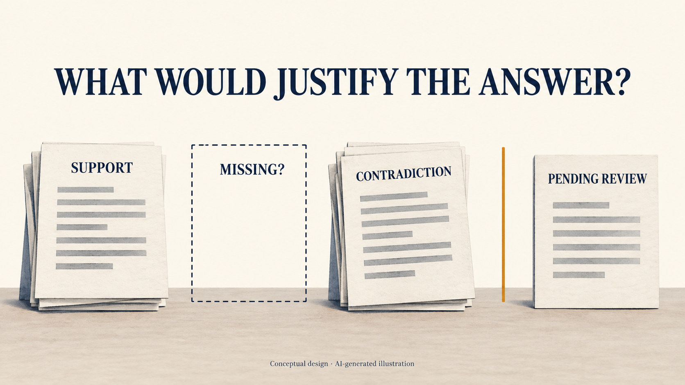
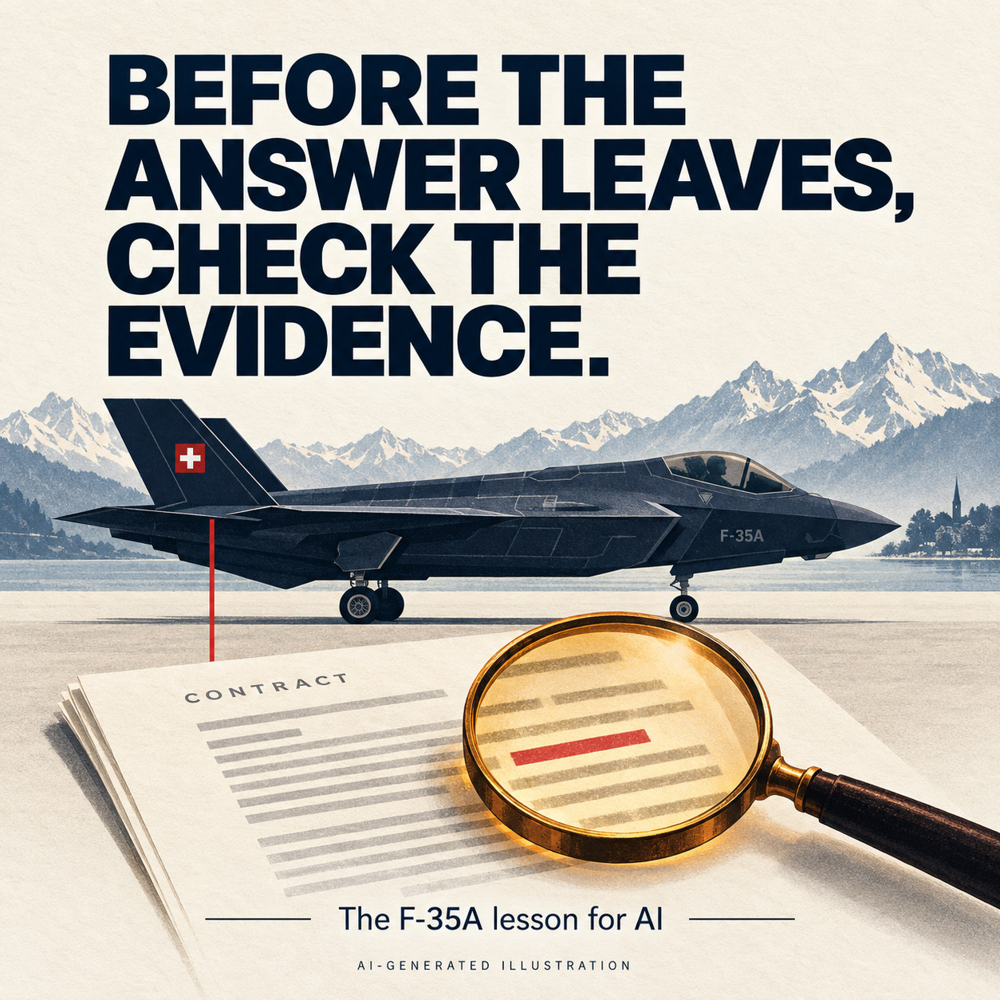

> **Status: DRAFT REVISION** — Earlier LinkedIn publication withdrawn. English article and companion post revised on 2026-09-12; not republished.

[Deutsche Fassung](f35-fixed-price-evidence.de.md)

## Accompanying feed post

### The Swiss F-35A fixed-price trap - Would AI fall into it today?

Switzerland, September 2022. Parliament is about to approve about six billion francs — sechs Milliarden Franken — for thirty-six F-35 jets. The government says the price is fixed.

This Letter of Offer and Acceptance (LOA) contract term says the opposite:
"The Purchaser agrees to the following:" ... "To pay to the USG (United States Government) the total cost to the USG of the items even if costs exceed the amounts estimated in this LOA."

There is also a separate earlier communication document, “Procurement of F-35A Lightning II aircraft systems”, signed for acknowledgement by the US Defense Security Cooperation Agency (DSCA) and armasuisse on 7 December 2021. It calls the price fixed, inflation included — and it also says Switzerland gets the jets at the same price as the United States. The department took that as an absolute fixed price, and gave the impression of a cost ceiling.

Now imagine the defence department had an AI assistant — inside its own secure system, with access to all its documents, the confidential ones included. Ask it: is the price fixed?

An AI assistant as we know it today answers on the basis of the task it is given — and the person asking decides which documents it sees. Show it only that separate document from December 2021, and it may well answer: yes, the price is fixed.

Simply adding an AI assistant does not solve this problem. Given the same selective evidence, it may fall into the same trap again.

**Evidence-Gated Agents ©** is a proposed design for AI assistants whose consequential answers and actions require both permission and sufficient evidence. A separate control checks those requirements before an answer is sent or an action is carried out. Missing permission, insufficient evidence or an unresolved contradiction puts the answer or action on hold. The assistant cannot bypass this control, called an **evidence gate**.

The contract itself contains evidence against that answer: clause 4.4.1 says the buyer must cover the US government's total costs, even above the estimates. So the answer "the price is fixed" does not pass the gate.

The evidence gate also notices what is missing. For the claim "the price is fixed", somewhere in the contract there has to be clear support for that claim. The gate searches for it — and if it cannot find such evidence, it demands it before anything goes out. Parliament's oversight committee concluded this month that the contract did not support the cost ceiling the public was told about.

**Evidence-Gated Agents © are designed to prevent such traps.** In this case, the contradictory contract terms would stop the “fixed price” assurance. Depending on the evidence, the answer could confirm, qualify or reject the claim—or explain that the available evidence is insufficient to reach a conclusion. Each released answer would come with a receipt showing the evidence used, the checks performed, the reasons for the decision and who authorised the release.

#AIGovernance #Accountability #Evidence #Switzerland

*Sources for the post’s dated findings are linked in the article.*

𝘍𝘶𝘭𝘭 𝘢𝘳𝘵𝘪𝘤𝘭𝘦 𝘣𝘦𝘭𝘰𝘸 ↓

---

# The Swiss F-35A fixed-price trap - Would AI fall into it today?

*What Switzerland’s F-35A purchase can teach us about the answers we allow AI to give.*

*The dispute concerns how the fixed-price clause and standard terms interact, and what that means for Switzerland’s cost exposure.*

Switzerland, September 2022. Thirty-six F-35A jets, with equipment and support. A procurement package worth around six billion francs. The defence department publicly said the prices were binding, pointing to a specific clause and a separate declaration that recorded the fixed-price character. [VBS announcement, 19 September 2022](https://www.vbs.admin.ch/de/air2030-beschaffungsvertrag-fur-die-kampfflugzeuge-f-35a-unterzeichnet).

For a citizen, the question behind that assurance is straightforward: **can we be required to pay more for the aircraft we have agreed to buy?**

The documents deserved a more careful answer.

## The warning was already there

By 11 July 2022, the Swiss Federal Audit Office’s report on Air2030 risk management was public, more than two months before Switzerland signed. [GPK-N report, p. 61](https://www.parlament.ch/centers/documents/de/Bericht%20vom%2008.09.2026%20D.pdf#page=61).

It quoted article 4.4.1 of the purchase agreement’s standard terms: the buyer must cover US government costs, “even if costs exceed the amounts estimated in this LOA”. The purchase agreement is called a Letter of Offer and Acceptance, or LOA. [EFK report 21410, p. 27](https://www.efk.admin.ch/wp-content/uploads/publikationen/berichte/sicherheit_und_umwelt/verteidigung_und_armee/21410/21410be-endgueltige-fassung-v04.pdf#page=27).

There is also a separate earlier communication document, “Procurement of F-35A Lightning II aircraft systems”, signed for acknowledgement by the US Defense Security Cooperation Agency (DSCA) and armasuisse on 7 December 2021. It calls the price fixed, inflation included — and it also says Switzerland gets the jets at the same price as the United States. The department took that as an absolute fixed price, and gave the impression of a cost ceiling. [GPK-N report, 8 September 2026, p. 39 and footnote 98; pp. 58, 83](https://www.parlament.ch/centers/documents/de/Bericht%20vom%2008.09.2026%20D.pdf#page=39).

A specific pricing provision in the LOA also supported the fixed-price reading. The separate declaration was not part of the LOA itself. The auditors found no absolute legal certainty for a lump-sum price as understood under Swiss law. [EFK, pp. 27–28](https://www.efk.admin.ch/wp-content/uploads/publikationen/berichte/sicherheit_und_umwelt/verteidigung_und_armee/21410/21410be-endgueltige-fassung-v04.pdf#page=28).

The auditors recommended recording the financial risks and defining measures to manage them. The procurement authority, armasuisse, rejected the recommendation, arguing that the negotiated provisions prevailed over the standard terms. [EFK, recommendation 4 and response, pp. 30–31](https://www.efk.admin.ch/wp-content/uploads/publikationen/berichte/sicherheit_und_umwelt/verteidigung_und_armee/21410/21410be-endgueltige-fassung-v04.pdf#page=30).

The security committees of both parliamentary chambers considered the issue in August 2022 and saw the pricing provision, Note 55, as supporting the federal authorities’ position. According to the National Council’s oversight committee (GPK-N), the chambers were informed of the risks identified by the auditors before approving the funding. [GPK-N, p. 61](https://www.parlament.ch/centers/documents/de/Bericht%20vom%2008.09.2026%20D.pdf#page=61).

On 8 September 2026, the GPK-N concluded that Switzerland had negotiated a fixed-price clause, but that it did not amount to the lump-sum fixed price communicated to Parliament and the public. It acknowledged that US authorities had at times sent signals supporting the lump-sum fixed-price interpretation, including in an embassy press release. This was an oversight finding, not a court judgment. [GPK-N report, p. 2](https://www.parlament.ch/centers/documents/de/Bericht%20vom%2008.09.2026%20D.pdf#page=2).

The committee also found that following the auditors’ recommendation could have allowed earlier measures and earlier information to Parliament. [GPK-N, p. 3](https://www.parlament.ch/centers/documents/de/Bericht%20vom%2008.09.2026%20D.pdf#page=3).

The question is what should happen when a documented warning meets an assurance people are expected to trust.

## Imagine the same question going to AI

Now imagine the defence department had an AI assistant — inside its own secure system, with authorised access to all its documents, the confidential ones included. Ask it: is the price fixed?

In this scenario, the person asking selects the material for the assistant. Show it only that separate document from December 2021, and it may well answer: yes, the price is fixed. A citation to that document could be accurate while the answer still omitted the conflicting contract terms.

Simply adding an AI assistant does not solve this problem. Given the same selective evidence, it may fall into the same trap again.

**Evidence-Gated Agents ©** is a proposed design for AI assistants whose consequential answers and actions require both permission and sufficient evidence. A separate control checks those requirements before an answer is sent or an action is carried out. Missing permission, insufficient evidence or an unresolved contradiction puts the answer or action on hold. The assistant cannot bypass this control, called an **evidence gate**.

For this question, the rule would require examination of the purchase agreement, the specific pricing provision, the standard terms, and the relevant legal assessments. The requestor’s chosen attachment would not define the whole evidence base.

In the F-35A example, clause 4.4.1 provides evidence against an unconditional fixed-price assurance. That unresolved conflict would stop an unqualified “yes”. A reviewer could instead approve an answer along these lines:

> The documents contain fixed-price language, but the standard terms also provide for costs above the estimates. The auditors and the procurement authority disagree about the protection this provides. The evidence reviewed here does not justify an unconditional assurance against additional costs for the agreed aircraft.

That is an illustrative answer based on the documented 2022 disagreement. It leaves the decision with people while making the uncertainty visible.

## Ask for the evidence that ought to exist

*The proposed evidence check considers supporting documents, contrary evidence and open questions before an answer is released.*

The useful question goes beyond “Which document supports this sentence?”

It also asks: **“What would we need to establish before saying this?”**

Here, the gap was specific: the auditors found that neither the agreement nor its standard terms specified which contractual document would take precedence in a conflict. Armasuisse maintained that no such hierarchy was needed because, in its view, the documents did not contradict each other. [EFK, pp. 27 and 31](https://www.efk.admin.ch/wp-content/uploads/publikationen/berichte/sicherheit_und_umwelt/verteidigung_und_armee/21410/21410be-endgueltige-fassung-v04.pdf#page=27).

The proposed workflow would require a search for the evidence needed to support the assurance: a defensible basis for concluding that the fixed-price provisions protect Switzerland from additional costs despite the standard terms. If that support could not be found, the gate would require further evidence before allowing an unconditional assurance. A reviewer would need a reasoned basis for resolving the conflict. The missing hierarchy identifies a question to resolve; it does not, by itself, settle the law.

Software cannot discover every missing document by itself. A responsible person must define the evidence requirements and assess whether the available material is sufficient. A check covering only the claims an assistant chooses to declare can miss an unsupported claim elsewhere in its answer.

Those limits belong in the design and its tests.

## A check needs someone who can act on it

The proposed release control should verify permission, the approved evidence and the exact answer being sent. Failed checks should hold the answer. Revisions should be checked again. The released answer should carry a record of its sources, material uncertainty, review and responsible decision-maker.

People receiving or affected by it should have a route to challenge the basis and seek correction. A record alone does not provide independent review or remedy; institutions must provide those.

No such design can promise that it would have changed the purchase or its price.

**Evidence-Gated Agents © are designed to prevent such traps.** In this case, the contradictory contract terms would stop the “fixed price” assurance. Depending on the evidence, the answer could confirm, qualify or reject the claim—or explain that the available evidence is insufficient to reach a conclusion. Each released answer would come with a receipt showing the evidence used, the checks performed, the reasons for the decision and who authorised the release.

## Related articles

- [When Should Runtime AI Governance Interrupt?](https://www.linkedin.com/pulse/when-should-runtime-ai-governance-interrupt-robert-schaub-mc2sc) — When evidence and permission checks should stop an AI-supported action, and what its record should preserve.
- [Runtime AI Governance Gets When Right. The Harder Question Is Who Gets to Check?](https://www.linkedin.com/pulse/runtime-ai-governance-gets-when-right-harder-question-robert-schaub-z6ahe/) — Why setting the rules, operating the system, keeping the evidence and reviewing decisions need separate accountable roles.
- [A Practical Test for Power](https://www.linkedin.com/pulse/practical-test-power-robert-schaub-va1we) — How to judge decisions by their consequences and whether those affected can challenge them and obtain remedy.
- [The Public AI We Need: Sovereign, Inspectable and Accountable](https://www.linkedin.com/pulse/public-ai-we-need-sovereign-inspectable-accountable-robert-schaub-vskve) — How evidence, independent review and correction fit into the wider proposal for public AI infrastructure.

## Alternative feed image

The published feed post uses LinkedIn’s article preview with the cover image. This additional image remains available as an alternative.

*Release should require reviewed evidence, a record of uncertainty and an accountable decision.*

[Image prompts and production details](f35-fixed-price-evidence-prompts.json).
