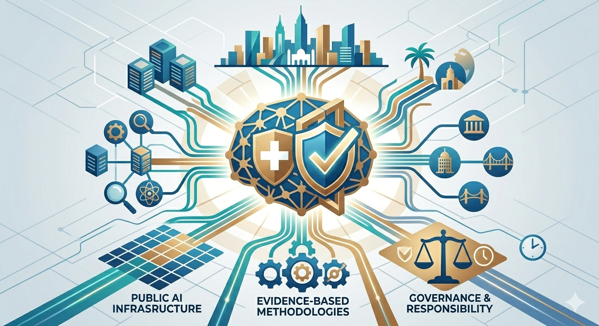

> **Status: PUBLISHED 2026-06-20** — verbatim mirror of the LinkedIn article published 20 June 2026.
> Canonical article: [https://de.linkedin.com/pulse/ki-souver%C3%A4nit%C3%A4t-und-resilienz-den-schweizer-nutzen-um-robert-schaub-aohze](https://de.linkedin.com/pulse/ki-souver%C3%A4nit%C3%A4t-und-resilienz-den-schweizer-nutzen-um-robert-schaub-aohze)

---

## Begleitender Feed-Post

_LinkedIn-Feed-Post, 19. Juni 2026 — [Original auf LinkedIn](https://de.linkedin.com/posts/robertschaub_ki-souver%C3%A4nit%C3%A4t-und-resilienz-den-schweizer-activity-7473522097890422785-R5Gd)._

Ein offenes Schweizer KI-Modell ist ein starker Impuls. Doch wie sichern wir unsere digitale Souveränität und Resilienz langfristig? Die Schweiz als internationale Brückenbauerin für eine freiheitliche und unabhängige KI-Infrastruktur. Die Bausteine stehen bereit. Zum Artikel ↓

---

# KI-Souveränität und Resilienz: Den Schweizer Innovationsstandort nutzen, um international freiheitliche Werte zu stärken

Marcel Salathé hat die Diskussion um ein offenes Schweizer KI-Modell in den vergangenen Wochen mit einem starken Beitrag neu belebt. Der Impuls, massgeblich in unsere digitale Souveränität zu investieren, ist wichtig und ich teile ihn. Damit ein solches Vorhaben seine volle Wirkung entfalten kann, möchte ich die Debatte jedoch um zwei zentrale Ziele ergänzen:

**1. Konsequente Governance als Basis für Vertrauen:** Vertrauen in Künstliche Intelligenz entsteht nicht allein durch das Label „Made in Switzerland". Wahre Souveränität und Resilienz wachsen durch konsequente Transparenz. Wir benötigen eine klare Governance-Schicht: transparente Annahmen, öffentlich nachprüfbare Methoden, evidenzbasierte Nachweise über das reale Systemverhalten (siehe dazu auch [meinen aktuellen Artikel zur Systemevaluation](trustworthy-ai-accountable-to-people.md)) und eindeutig geregelte Verantwortlichkeiten – geschützt vor politischer wie kommerzieller Vereinnahmung.

**2. Internationaler Knotenpunkt für freie Gesellschaften:** Ein solches Vorhaben darf aus meiner Sicht nicht zu eng als rein nationales Projekt konzipiert werden. Die Schweiz hat den grössten Hebel, wenn sie nicht isoliert baut, sondern den eigenen innovativen Standort als glaubwürdige Gastgeberin und Brückenbauerin nutzt — für eine international getragene und gesteuerte Public-AI-Infrastruktur, die freiheitlichen Werten dient.

Das Bemerkenswerte daran: Für diese beiden Anliegen verfügt die Schweiz bereits über hervorragende Bausteine.

- Mit **Apertus** existiert ein öffentlich finanziertes und vollständig offenes Sprachmodell (EPFL, ETH Zürich, CSCS), das genau diese technologische Transparenz bei Gewichten und Methoden bietet.
- Die **Swiss AI Initiative / SNAI** bündelt die nationale Spitzenforschung.
- Als Partnerland der Initiative **Current AI** sind wir bereits international vernetzt. Initiativen wie Expedition Zukunft, digitalswitzerland oder Akteure des internationalen Genf zeigen zudem, dass die methodische und diplomatische Expertise für solche multilateralen Prozesse im Land vorhanden ist.
- Und der **KI-Gipfel 2027 in Genf** bietet uns ein greifbares, nahendes Zeitfenster.

Die technologische und institutionelle Basis ist also beeindruckend. Die Aufgabe für die nächste Phase besteht nun darin, dieses Vorhandene durch verbindliche Regeln und klare Verantwortlichkeiten dauerhaft vertrauenswürdig und international anschlussfähig zu machen.

Eine solche Governance-Schicht muss nicht von null auf gebaut werden. Wir können direkt an die etablierten Strukturen von SNAI, den offenen Prinzipien von Current AI und der starken Basis unserer Hochschulen anknüpfen. Ich freue mich auf die Diskussionen und Gespräche zu diesen Themen und Vorhaben in den kommenden Wochen – und über jeden Impuls von Akteuren, die dieses Vorhaben gemeinsam gestalten möchten.

Denn echte digitale Souveränität und Resilienz entfalten sich erst im Netzwerk: Sie bedeuten, die Infrastruktur der Zukunft gemeinsam und international nach freiheitlichen Werten zu gestalten.

— Robert Schaub

---

_[English translation](ai-sovereignty-and-resilience.md). Companion to [Trustworthy AI, Accountable to People](trustworthy-ai-accountable-to-people.md) — the evaluation-and-accountability thread to this one's public-AI-sovereignty thread; both are facets of [Our AI Charter](../index.md)._
