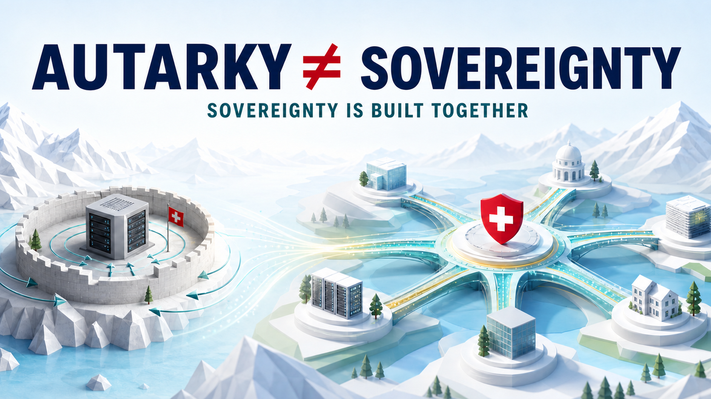

> **Status: PUBLISHED 2026-07-24** — verbatim mirror of the English LinkedIn article *The Swiss Autarky Illusion: Why Digital Sovereignty Cannot Be Built Alone*, published 24 July 2026 as the English edition of [the German original](schweizer-autarkie-illusion.md). The accompanying feed post (above the article) is mirrored in plain text; all figures were source-checked through 2026-07-24. The feed post's public comment exchange and a related NCS-policy comment are documented below through 2026-08-01.
> Canonical article: [https://www.linkedin.com/pulse/swiss-autarky-illusion-why-digital-sovereignty-cannot-robert-schaub-tiamc](https://www.linkedin.com/pulse/swiss-autarky-illusion-why-digital-sovereignty-cannot-robert-schaub-tiamc)

---

**The Swiss Autarky Illusion: Why Digital Sovereignty Cannot Be Built Alone**

*The call for digital independence is justified. "Do everything ourselves" is not the answer — what Swiss history teaches us, and the test every sovereignty policy must pass.*

Apertus 1.5 is an important Swiss building block — but it is not yet digital sovereignty.

**Autarky is not sovereignty.** Confusing the two means investing heavily in a sense of security, only to find that, in a crisis, you still lack the power to act.

The 1940 [National Redoubt](https://hls-dhs-dss.ch/de/articles/008696/) was a military emergency strategy designed to secure an Alpine core while accepting the effective abandonment of the Swiss Plateau — a warning for digital policy: retreat can be contingency planning, but it is not a sovereignty strategy.

The better answer combines domestic capabilities with shared infrastructure, open standards, and genuine exit options. Sovereignty means being able to inspect, help decide, contest, and switch.

**Why this aligns with Swiss neutrality — in the article. ↓**

`#DigitalSovereignty #PublicAI #AIGovernance #Apertus #TrustworthyAI #Switzerland`

_[Original feed post on LinkedIn](https://www.linkedin.com/posts/robertschaub_digitalsovereignty-publicai-aigovernance-ugcPost-7486430520470360065-TDNr)._

---

# The Swiss Autarky Illusion: Why Digital Sovereignty Cannot Be Built Alone

*The call for digital independence is justified. "Do everything ourselves" is not the answer — what Swiss history teaches us, and the test every sovereignty policy must pass.*

## More Than a Model

A [public comment by Angelo Richiello](https://www.linkedin.com/feed/update/urn:li:ugcPost:7473522097219223552?commentUrn=urn%3Ali%3Acomment%3A%28ugcPost%3A7473522097219223552%2C7473628756385935380%29) on my article about [AI sovereignty and resilience](https://de.linkedin.com/pulse/ki-souver%C3%A4nit%C3%A4t-und-resilienz-den-schweizer-nutzen-um-robert-schaub-aohze) provided the starting point: digital sovereignty is not only a technological question, but a geopolitical one. What matters is not so much any single model as a viable ecosystem of talent, research, governance, and international partnerships.

**Autarky is not sovereignty.** Confusing the two means investing heavily in a sense of security, only to find that, in a crisis, you still lack the power to act.

## The Reflex Is Understandable

Just how real digital dependence is became clear in June: by government order, Anthropic had to block two of its latest AI models worldwide — even though the company [publicly objected](https://www.anthropic.com/news/fable-mythos-access). A few weeks later, it was allowed to [restore access in part](https://www.anthropic.com/news/redeploying-fable-5).

The episode lays bare the balance of power. Whoever controls a model can do more than switch off access. They can also change how the system responds, for example through new rules or filters. Dependent countries have little influence over such decisions. These systems can therefore not only be switched off, but manipulated as well.

Then there is the everyday reality: public administrations and businesses operate in the clouds of a handful of foreign providers. The high-performance chips on which practically all AI training runs are subject to the export controls of a single jurisdiction. Terms of use, prices, and access can change without anyone here being consulted.

These facts trigger a familiar reflex: our own model, our own cloud, our own rules — a retreat into what is ours. The reflex is human. And Switzerland knows it better than most.

The 1940 [National Redoubt](https://hls-dhs-dss.ch/de/articles/008696/) was a military emergency strategy designed to secure an Alpine core while accepting the effective abandonment of the Swiss Plateau — a warning for digital policy: retreat can be contingency planning, but it is not a sovereignty strategy.

## Sovereignty Means the Capacity to Shape — Not Owning Everything

Terms shape strategies. That is why the distinction matters:

- **Autarky** is the ambition to get by without others.
- **Sovereignty** is the ability, despite dependencies, to help set rules, inspect systems, challenge decisions, and switch in a crisis without collapsing.

The first is unattainable for a small country in the digital realm. The second is attainable — but only together with others.

And sovereignty is not an end in itself. **Resilience and security** preserve society's room to act: they ensure that failures, coercion, and blackmail do not determine our decisions. But only values tell us whom that room serves and how power within it is constrained:

- **Human dignity, freedom, and self-determination.** Technology serves people, protects their autonomy and privacy, and does not disempower them.
- **Truth and verifiability.** Claims and decisions must be measured against evidence and remain open to scrutiny and correction.
- **Justice and the rule of law.** The same transparent rules apply to everyone; those affected can challenge decisions and seek redress.
- **Solidarity and binding commitment.** Responsibilities and obligations are clearly allocated; every partner maintains its own core capabilities, contributes to shared infrastructure, and can rely on the others when failures occur.

**Democratic accountability and independence from unilateral control** make these values enforceable. Every sovereignty policy must be measured against this standard — not by how much technology "belongs to us."

The international context is clear: the further AI advances without shared rules, [UN Secretary-General António Guterres warns](https://www.linkedin.com/feed/update/urn:li:activity:7478160520198524930), the less say governments and people retain. That is exactly the point: **those who isolate themselves no longer have a seat at the table where the rules are made.** And a [worthwhile debate of first principles](https://www.linkedin.com/posts/cktravis_aigovernance-aigovernance20-humansovereigntyai-share-7485646021276876800-azYv) is unfolding on this platform about where sovereignty ultimately resides — with people and legitimate institutions, not with the systems themselves. For me, the [test I recently proposed](https://www.linkedin.com/pulse/practical-test-power-robert-schaub-va1we) applies: every form of power — including power over digital infrastructure — must be legitimate and answerable to those who bear its consequences.

## Apertus Shows Both — Strength and Limits

The specific Swiss case makes the distinction tangible. [Apertus](https://www.swiss-ai.org/apertus) is a success: a fully open model — weights, data, and training recipe — from EPFL, ETH Zurich, and CSCS, trained on data from 1,811 languages. Since this week, [version 1.5](https://www.cscs.ch/science/computer-science-hpc/2026/apertus-15-building-the-next-generation-of-open-ai-infrastructure) has added image and audio understanding, along with a family of compact mini-models. The Canton of Ticino [now translates official documents](https://www.cscs.ch/science/computer-science-hpc/2026/apertus-powers-in-house-ai-translation-for-ticino) with a fine-tuned Apertus, without data leaving its own infrastructure. That is digital self-determination in practice.

But Apertus alone cannot bear the sovereignty expectations placed upon it in public — and the facts are no cause for shame, but an opportunity for clarity:

**First, the performance reality.** Digital agency Liip has [openly evaluated](https://www.liip.ch/en/blog/apertus-after-8-months-what-we-learned-and-look-forward-using-switzerlands-ai-model) eight months of running its Zurich public-administration chatbot in production. On the basic question "Is the answer acceptable?", Apertus-70B is effectively tied with GPT-4o-mini at 82% versus 81% — although Apertus ran on a smaller, open parallel instance while the commercial model served the large production deployment. Raise the bar to "Is the answer actually good?", and the gap opens: 55% versus 72%. On source fidelity — does the answer stay within the documents rather than invent something plausible? — the scores are 0.50 versus 0.79. And that is against an older, low-cost commercial model, not the frontier. Liip explicitly calls this a practice report, not a study, and the trend line is rising. But the scale of the difference is honestly stated. Notably, the makers of Apertus themselves [do not position the project as a frontier competitor](https://www.cscs.ch/science/computer-science-hpc/2026/apertus-15-building-the-next-generation-of-open-ai-infrastructure), but as a trustworthy, transparent foundation on which organisations can build.

**Second, the investment reality.** The next phase of Apertus has [CHF 20 million in federal funding](https://www.swissinfo.ch/eng/swiss-ai/fact-and-fiction-about-the-swiss-ai-model-apertus/90110034). The four largest US technology companies alone are planning [more than $700 billion in investment for 2026](https://www.cnbc.com/2026/02/06/google-microsoft-meta-amazon-ai-cash.html), driven largely by the expansion of AI infrastructure. This is not an argument against public investment; it marks the end of the illusion that a national budget can close this gap alone.

**Third, the data reality.** Apertus is trained to rigorous rule-of-law standards: documented provenance, honoured opt-outs, and protection of personal data. That rigour comes at a price that every open model currently pays alone. A [recent COMMUNIA study](https://communia-association.org/2026/06/30/new-study-copyright-challenges-in-open-source-ai-development-in-the-european-union/) shows that open-model teams in Europe are so cautious that they even rely on the narrower copyright exception and shoulder opt-out clearance themselves — while the open web is closing (around [45% of the content](https://www.dataprovenance.org/) in one of the most important web corpora is now restricted by terms of use) and the best-funded competitors can simply absorb legal grey areas. **Those who train in full compliance forgo data that others use. As long as every institution handles this clearance alone, legal compliance becomes a structural disadvantage.** I [raised this question publicly](https://www.linkedin.com/feed/update/urn:li:activity:7478119769771167744) with the open-model community in early July.

The conclusion from all three points is not an argument against Apertus — quite the opposite. **It is not the project that fails, but the expectation that a national model already constitutes sovereignty.** A model is an artefact. Sovereignty emerges from the ecosystem around it.

## Sovereignty Is Built Through a Network

What does the constructive answer look like? Four building blocks that no country needs to build alone — and that none can build alone:

1. **Shared standards and interoperability**, so that the public models of many countries — from [Apertus](https://www.swiss-ai.org/apertus) and [OLMo](https://allenai.org/olmo) to [EuroLLM](https://eurollm.io/) — add up to a coherent infrastructure instead of fragmenting into island solutions.
2. **A public evidence and governance layer:** trust does not arise from a "Made in Switzerland" label, but from verifiable evidence of how systems actually behave, clear responsibilities, and protection against political and commercial capture — as well as the ability of affected people to have decisions [reviewed and contested](https://www.linkedin.com/pulse/runtime-ai-governance-gets-when-right-harder-question-robert-schaub-z6ahe).
3. **Shared data foundations:** solve rights clearance, provenance, and opt-out handling once and reuse the results many times. The COMMUNIA study rightly calls for a European public training corpus as infrastructure, rather than leaving every team to climb the same legal mountain alone.
4. **Pooled compute and model pluralism:** multiple open models and computing sites that serve as mutual safeguards. If one fails — technically, politically, or economically — the network carries on. That is resilience.

Honesty also requires acknowledging a limit: no one can achieve complete independence across the entire technology stack. The critical accelerator chips are almost all subject to the export controls of a single jurisdiction. The answer is diversification and reliable partnerships, not illusion.

The Federal Council itself documents both the correct diagnosis and the lack of follow-through. Its November 2025 [report on digital sovereignty](https://cms.news.admin.ch/fileservice/sdweb-docs-prod-nsbcch-files/files/2025/11/26/271b6aa0-8b5c-4ce8-b6ef-7f2443b0d86d.pdf) aptly defines it as the state's necessary "capacity for control and action." It treats autarky as a possible but most expensive response to particularly critical dependencies — and considers it "hardly realistic," even with substantial spending, for a highly integrated country such as Switzerland to provide its own digital resources in every relevant area. As alternatives, it names multi-vendor approaches, exit strategies, legal safeguards, and measures under international law to address geopolitical risks.

Yet the political outcome falls far short of the mandate. [Postulate 22.4411](https://www.parlament.ch/de/ratsbetrieb/suche-curia-vista/geschaeft?AffairId=20224411) called for a comprehensive strategy of political, economic, and societal importance — including statements on providing the necessary resources. What emerged was mainly a temporary working group, overviews, risk analyses, and recommendations — not an investment programme for digital capacity for action, whether domestic or jointly supported.

This is where the Swiss autarky illusion begins. Anyone invoking technological self-reliance as a patriotic project would also have to state its price: enormous and sustained investment in supply chains, data centres, chips, models, skilled people, and continued development. That willingness is nowhere evident. And even with it, Switzerland could not control the entire technology stack alone. **Autarky without a willingness to bear its costs is not a strategy, but self-deception.** It does not eliminate dependencies; it conceals them until the next crisis makes them visible.

By contrast, such a network is the economic basis for success: value creation, a skilled workforce, and bargaining power arise where you help build and help decide — not where you merely buy. Motions [24.3209](https://www.parlament.ch/de/ratsbetrieb/suche-curia-vista/geschaeft?AffairId=20243209) (sovereign digital infrastructure) and [26.3221](https://www.parlament.ch/de/ratsbetrieb/suche-curia-vista/geschaeft?AffairId=20263221) (an impetus programme for digital sovereignty), which the Council of States has forwarded to the National Council, aim precisely at this gap. What matters is whether they produce viable shared infrastructure — or a digital Redoubt. **Anyone unwilling either to bear the costs of autarky or to build binding partnerships is not choosing sovereignty, but continued dependence.**

A **values-bound Public AI network** is not a bloc of states that have simply labelled themselves "free." It is open, but not without conditions: institutions may participate if they verifiably bind themselves to human rights, rule-of-law procedures, democratic accountability, transparency, and effective remedies. Distributed control, open standards, and real options to switch or exclude protect the network from capture by any one state or corporation.

This is also where neutrality finds its best interpretation: not as a wall, but as a bridge. Switzerland has a long tradition of good offices and international convening — and the [AI Summit in Geneva in June 2027](https://www.genevaaisummit.swiss/) offers a tangible window of opportunity not merely to call for such a values-bound Public AI network, but to host it: as a credible host and bridge-builder for an internationally supported, verifiable Public AI infrastructure.

## The Test

The question for every digital-sovereignty policy is therefore not: *How much of it belongs to us?* It is: **Can we inspect, help decide, contest, and switch — and does the whole system serve human dignity and freedom, self-determination and privacy, truth and verifiability, justice and the rule of law, and reciprocal reliability?**

So, once more, as a compass: **Autarky is not sovereignty. Sovereignty is built through a network — when we can help set the rules, inspect systems independently, and switch in a crisis.**

`#DigitalSovereignty #PublicAI #AIGovernance #Apertus #TrustworthyAI #Switzerland`

---

*Further reading and sources: [Our AI Charter](https://robertschaub.github.io/our-ai-charter/) — especially [The Public AI Network](https://www.linkedin.com/pulse/public-ai-network-building-sovereignty-resilience-free-robert-schaub-ggpne) (EN) and [AI Sovereignty and Resilience](https://de.linkedin.com/pulse/ki-souver%C3%A4nit%C3%A4t-und-resilienz-den-schweizer-nutzen-um-robert-schaub-aohze) (DE).*

---

_German original: [Die Schweizer Autarkie-Illusion](schweizer-autarkie-illusion.md)._

---

## Accompanying comments

_Published on the [English LinkedIn feed post](https://www.linkedin.com/posts/robertschaub_digitalsovereignty-publicai-aigovernance-ugcPost-7486430520470360065-TDNr), 24–27 July 2026._

**Angelo Richiello — summary**

Richiello welcomed the autarky/sovereignty distinction and added a further element: sovereignty also means keeping critical knowledge inside a country or alliance. Infrastructure can be procured; competence has to be built through sustained investment in education, research, and managerial capability — making digital sovereignty, in the long run, as much a question of human capital as of technology.

**Christoph Nützel — summary**

Nützel — arguing from Gaia-X and EU-consortium experience — held that the four building blocks are the easy part (Gaia-X sketched almost the same architecture years ago) and that such federations stall on the enforcement mechanics of the article's "verifiably commit" clause, the line consortium partners privately resist: submitting their own compliance claims to an audit they do not control. Solving that one clause, he wrote, unlocks the rest; skipping it reproduces the working-groups-without-investment outcome of the Federal Council report.

**Robert Schaub — reply to Nützel**

You're right: "verifiably commit" is the load-bearing clause. I'd enforce it through contractual access, not policing: assurance gates compute/corpus access and procurement preference; failure or expiry suspends status, with appeal. No consequence, no commitment.

No member controls the audit. Start lean with independent evaluators: documented → evidence observed → implementation checked → effectiveness tested. At maturity: accredited assessors; separate standard-setter, assessor, accreditor, peer review (17065/IAF).

Protect evidence, not the claim: claim, scope and result are public; internals stay assessor-confidential. Gaia-X clearing houses check signed self-descriptions against computable rules; higher stakes need evidence/testing. Your Lasers4MaaS traffic-light logic: reveal what's needed, not process IP.

Catena-X shows the incentive: independent certification gates providers/solutions into its marketplace. If either Swiss motion becomes an implementation or funding vehicle, bake this condition into programme design.

Full draft: [https://robertschaub.github.io/our-ai-charter/Assurance/Framework/certification-model/](https://robertschaub.github.io/our-ai-charter/Assurance/Framework/certification-model/)

From your consortium work: where did resistance sit — rules, evidence, assessor choice, or consequences?

**Robert Schaub — reply to Richiello** (posted 2026-07-27)

Angelo Richiello Two texts point the same way: The Public AI Network names durable ecosystems — talent, research, shared public compute, lawful data commons — as the third pillar ([https://www.linkedin.com/pulse/public-ai-network-building-sovereignty-resilience-free-robert-schaub-ggpne](https://www.linkedin.com/pulse/public-ai-network-building-sovereignty-resilience-free-robert-schaub-ggpne)), and this article argues that value creation, a skilled workforce, and bargaining power arise where you help build and help decide. Your addition goes further: "Infrastructure can be purchased. Competence cannot." — continuous investment in education, research and managerial capability.

**Angelo Richiello — follow-up (summary)**

Richiello called this the real dividing line: infrastructure can be financed, technology acquired, even regulations copied, but the ability to understand, govern, and continuously improve complex systems depends on people. Competence accumulates over years through education, research, managerial practice, and institutional learning — in the long run, he argued, perhaps the most strategic investment of all.

**Robert Schaub — follow-up** (posted 2026-07-27)

Angelo Richiello Now recorded: the network overview names competence as the condition beneath all four pillars. [https://robertschaub.github.io/our-ai-charter/network-overview/](https://robertschaub.github.io/our-ai-charter/network-overview/)

---

## Related public comment

**Robert Schaub — comment on ICT4Peace's NCS input** (posted 2026-08-01)

_Published on [Daniel Stauffacher's LinkedIn post](https://www.linkedin.com/feed/update/urn:li:activity:7487866562515861505/?dashCommentUrn=urn%3Ali%3Afsd_comment%3A%287489346736004612096%2Curn%3Ali%3Aactivity%3A7487866562515861505%29) sharing Anne-Marie Buzatu's *ICT4Peace Input to Swiss Strategic Review of the National Cyberstrategy (NCS)*._

Thank you Daniel Stauffacher and Anne-Marie Buzatu, this is an important contribution.

Its framing of “open strategic autonomy” closely matches an argument I have been developing:

Autarky is the ambition to get by without others - Sovereignty and Resilience is more:

- Sovereignty is the ability, despite dependencies, to help set rules, inspect systems, challenge decisions and switch in a crisis without collapsing.
- Resilience preserves society’s room to act; rights and democratic accountability determine whom it serves.

For AI, this means looking beyond ownership or any single national model. A model is an artefact; sovereignty emerges from the ecosystem around it:

- Shared standards and interoperability
- A public evidence-and-governance layer
- Shared data foundations
- Pooled compute with model pluralism

Under all four sits competence—the ability to understand, govern, and improve the infrastructure.

Switzerland’s strongest role is therefore not to build a digital fortress,
but to act as a credible host and bridge-builder for internationally co-stewarded public-AI infrastructure.

The next NCS could make this operational.
