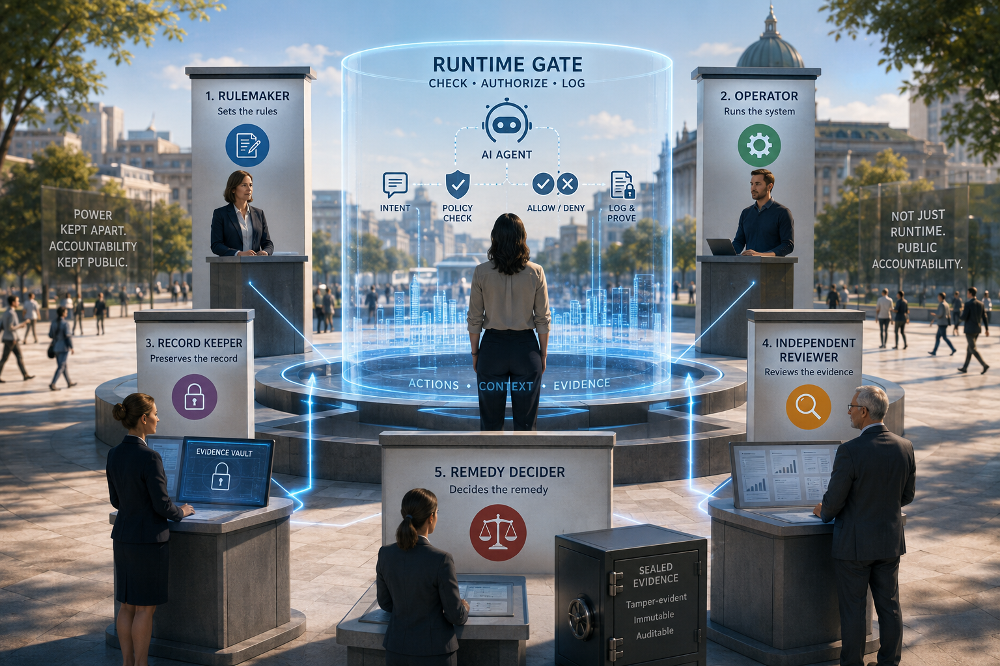

> **Status: PUBLISHED 2026-07-23** — verbatim mirror of the LinkedIn article *Runtime AI Governance Gets When Right. The Harder Question Is Who Gets to Check?*, published 23 July 2026. The accompanying feed post (above) is mirrored here; five public comments (below) are documented; source-checked through 2026-07-25.
> Canonical article: [https://www.linkedin.com/pulse/runtime-ai-governance-gets-when-right-harder-question-robert-schaub-z6ahe/](https://www.linkedin.com/pulse/runtime-ai-governance-gets-when-right-harder-question-robert-schaub-z6ahe/)

---

𝗥𝘂𝗻𝘁𝗶𝗺𝗲 𝗔𝗜 𝗚𝗼𝘃𝗲𝗿𝗻𝗮𝗻𝗰𝗲 𝗚𝗲𝘁𝘀 𝘞𝘩𝘦𝘯 𝗥𝗶𝗴𝗵𝘁. 𝗧𝗵𝗲 𝗛𝗮𝗿𝗱𝗲𝗿 𝗤𝘂𝗲𝘀𝘁𝗶𝗼𝗻 𝗜𝘀 𝘞𝘩𝘰 𝗚𝗲𝘁𝘀 𝘁𝗼 𝗖𝗵𝗲𝗰𝗸?  
  
The window from vulnerability discovery to a weaponized exploit is collapsing from weeks to hours, according to a security briefing reviewed by more than 250 CISOs.  
  
That speed is one reason governance cannot stop at deployment. Agentic AI adds a separate problem: consequential actions can be composed at runtime, so they should be checked then — not only described in advance.  
  
But a technical gate is only as trustworthy as the institutions around it. Where the same operator runs the system, sets the policy, and controls the evidence, it is still marking its own homework — just faster.  
  
𝗦𝗼 𝘄𝗵𝗼 𝗴𝗲𝘁𝘀 𝘁𝗼 𝗰𝗵𝗲𝗰𝗸? 𝗡𝗼 𝗼𝗻𝗲 𝗯𝗼𝗱𝘆 𝗴𝗲𝘁𝘀 𝘁𝗵𝗲 𝘄𝗵𝗼𝗹𝗲 𝗰𝗵𝗮𝗶𝗻.  
  
  1. 𝗥𝘂𝗹𝗲𝗺𝗮𝗸𝗲𝗿 sets the published criteria  
  2. 𝗢𝗽𝗲𝗿𝗮𝘁𝗼𝗿 runs the gate against a signed policy  
  3. 𝗥𝗲𝗰𝗼𝗿𝗱 𝗸𝗲𝗲𝗽𝗲𝗿 preserves a sealed copy  
  4. 𝗜𝗻𝗱𝗲𝗽𝗲𝗻𝗱𝗲𝗻𝘁 𝗿𝗲𝘃𝗶𝗲𝘄𝗲r assesses the evidence  
  5. 𝗥𝗲𝗺𝗲𝗱𝘆 𝗱𝗲𝗰𝗶𝗱𝗲𝗿 hears the affected person's challenge and can bind the outcome  
  
  
[**#AI**](https://www.linkedin.com/search/results/all/?keywords=%23ai&origin=HASH_TAG_FROM_FEED) [**#TrustworthyAI**](https://www.linkedin.com/search/results/all/?keywords=%23trustworthyai&origin=HASH_TAG_FROM_FEED) [**#AIGovernance**](https://www.linkedin.com/search/results/all/?keywords=%23aigovernance&origin=HASH_TAG_FROM_FEED) [**#PublicAI**](https://www.linkedin.com/search/results/all/?keywords=%23publicai&origin=HASH_TAG_FROM_FEED) [**#AgenticAI**](https://www.linkedin.com/search/results/all/?keywords=%23agenticai&origin=HASH_TAG_FROM_FEED)

𝘍𝘶𝘭𝘭 𝘢𝘳𝘵𝘪𝘤𝘭𝘦 𝘣𝘦𝘭𝘰𝘸 ↓

---

# Runtime AI Governance Gets *When* Right. The Harder Question Is *Who Gets to Check?*

*A [security briefing reviewed by more than 250 CISOs](https://www.sans.org/press/announcements/emergency-strategy-briefing-ai-driven-vulnerability-discovery-compresses-exploit-timelines) warns that AI-assisted vulnerability discovery is compressing exploit timelines. "Govern at runtime" is part of the answer. But a technical gate is not the same thing as public accountability.*

*[The AI Vulnerability Storm](https://cloudsecurityalliance.org/artifacts/the-ai-vulnerability-storm)* — a strategy briefing from SANS, the Cloud Security Alliance, the OWASP GenAI Security Project, and [un]prompted — warns that the window between vulnerability discovery and weaponization is collapsing from weeks to hours. The underlying Zero Day Clock [measures a narrower interval](https://zerodayclock.com/audit): among CVEs with confirmed in-the-wild exploitation, the median time from NVD publication to a confirmed exploit signal fell from 771 days across 273 cases in the 2018 cohort to 0.0 days — same-day or earlier under the tracker's definition — across 44 cases in its still-small 2026 cohort at the May audit.

For AI assurance, the implication is narrow but important: an earlier assessment cannot establish that a live deployment remains safe while vulnerabilities and attacks change faster than ordinary patch cycles. It is one more reason "assess once, deploy forever" fails.

But the briefing also cautions that faster exploitation has not yet meant proportionally worse damage; many consequential incidents still relied on credential abuse, social engineering, or supply-chain compromise. The tracker covers only CVEs with confirmed exploitation, and the small 2026 cohort has had little time to reveal a slow exploit. This is a leading indicator, not a loss report: the endpoint is provisional; the direction is the warning.

Speed is one pressure. Composition is another. One response is runtime governance: check each consequential action as an agent composes it, because the resulting behaviour can exceed what was described in advance.

That argument has a true core. A one-time assessment cannot establish that every later, dynamically composed action will be admissible. A pre-declared description cannot be the whole defence.

Stuart-Mueller & Woodward's preprint *The Wrong Layer* (July 2026, [DOI: 10.5281/zenodo.21397661](https://doi.org/10.5281/zenodo.21397661)) makes a detailed version of that case. After surveying current frameworks, the authors argue that none requires a record proving a particular machine action was authorized, admissible, and bounded when it occurred. The paper does not ignore *who*: it calls for structurally independent custody, separation of powers, appeal, and contestability. The unresolved question is how those principles become institutions that independently assess the evidence and hear challenges from affected people.

The paper is right that assessing a system as a class does not prove that each later action was admissible. But runtime *versus* assurance is still a false choice. For high-risk systems, the [EU AI Act](https://eur-lex.europa.eu/eli/reg/2024/1689/oj/eng) pairs pre-market conformity assessment with post-market monitoring and serious-incident reporting. [NIST's AI Risk Management Framework](https://airc.nist.gov/airmf-resources/airmf/5-sec-core/) makes risk management continuous across the lifecycle, including post-deployment monitoring, independent assessment where appropriate, and appeal mechanisms for end users and affected communities. A per-action record adds missing evidence; it does not replace lifecycle assurance, incident reporting, or redress.

Which leads to the deeper point. **A gate is only as trustworthy as the institutions around it.**

A technical gate can answer a substantial question: *may this action proceed under the configured policy?* With a sound record behind it, the gate can later show what authority and evidence it applied. That is more than raw capability. But no gate can establish its own public legitimacy. Who sets the policy, who assesses the quality of the evidence, and who hears a challenge are institutional judgments, not cryptographic ones.

Where the same operator composes the action, sets the policy, and controls the evidence, it is still marking its own homework faster. Independent custody, role-scoped access, outside review, and a real path to challenge the decision complete the loop.

**So who gets to check? No one body gets the whole chain.**

1. **Rulemaker** — sets the published criteria, but does not operate or audit the system.
2. **Operator** — runs the gate against a signed policy, but does not hold the only record.
3. **Record keeper** — preserves a sealed copy, but cannot open it or decide the case alone.
4. **Independent reviewer** — assesses the evidence, but is not selected or paid to pass by the operator.
5. **Remedy decider** — hears the affected person's challenge and, where legally or contractually empowered, can bind the outcome.

**Who checks the checkers?** Accreditation and peer review.

**What stops capture?** Disclosed, diversified funding; no funder sets the criteria; assessors are assigned through rotation, escrow, or a public pool; and fees are fixed and outcome-independent.

That structure must deliver three public-interest guarantees:

- **Evidence the right parties can inspect without creating a surveillance file** — not merely a tamper-evident log, but an action record sufficient to assess claims, sources, uncertainty, limits, and known omissions. Access is role-scoped: the affected person can inspect the basis of their own determination; an independent custodian preserves the sealed full record but cannot open it alone; deeper access requires defined authority for a genuine dispute; and every access is logged.
- **Decisions the affected can contest** — notice, review, challenge, and remedy for the people a system acts on, adjudicated by someone sitting outside any single operator.
- **Duties that don't evaporate at deployment** — a named human institution that answers for the system's claims, harms, and consequential decisions across its whole life, not just at launch.

None of that requires a new central authority. It requires role separation so no one certifies their own work. [ISO](https://www.iso.org/certification.html) writes standards, external certification bodies do the checking, and accreditation can independently confirm their competence. Journalism's [Journalism Trust Initiative](https://rsf.org/en/journalism-trust-initiative) similarly offers optional certification through external, independent auditors. Build the test, borrow the machinery.

A public option answers who can keep an AI capability available. Independent assurance answers why anyone else should rely on its behaviour. Ownership creates leverage; independently verifiable evidence makes that leverage credible. But the chain has a boundary: where no regulator, tribunal, court, or enforceable agreement can authorize access, replace a failed custodian, and bind a remedy, the assured scope should say so rather than pretend the accountability loop is closed.

And none of this means slowing every action to a crawl. Routine, rules-based checks can run in-band; ambiguous, out-of-bounds, or irreversible actions should escalate. The durable record then supports independent review and, when needed, adjudication. Check now, preserve the record, and make challenge possible. A collapsing exploit window is a reason to automate controls and preserve better evidence, not to collapse control, custody, and review into one operator.

A second honest limit cuts against my side too. No certificate can guarantee that every future AI output will be *true*. But we can evaluate whether a system *shows its work*: whether it grounds its material claims, signals its doubt, and corrects itself. Honesty-of-process is testable even when the truth of every answer is not. And the same discipline should bind the humans and institutions deploying these systems, not only the models — evidence before reliance, from people as much as from machines.

So move governance closer to the moment of action. But *when* is only half the question. The harder half is *who*: split rule, run, record, review, and remedy; make the evidence inspectable by the right parties under defined authority; and firewall the funding beneath the chain so affected people can challenge consequential decisions.

This is a working proposal from a small, unfunded, model-plural effort, intended to contribute to open-model and public-interest work already under way. Where does it break? What's missing?

**Built by many. Accountable to all.**

`#AI #TrustworthyAI #AIGovernance #PublicAI #AgenticAI`

*Source and further work: [Our AI Charter](https://robertschaub.github.io/our-ai-charter/).*

---

## Accompanying comments

_Published on the [LinkedIn feed post](https://www.linkedin.com/posts/robertschaub_runtime-ai-governance-gets-when-right-the-activity-7485969016478478336-K0gt/), 23–25 July 2026._

**Robert Schaub**

The difficult design problem is preserving independence without making runtime governance too slow. Routine checks can run automatically against signed policies, with evidence preserved independently. Only ambiguous, out-of-bounds, or irreversible cases need escalation to pre-certified human reviewers. A sector-wide pool, rotation and clear response times could make that review both independent and fast. The aim is not human approval of every action, but accountable human institutions around automated decisions.

**Robert Schaub**

Where the "checking" comes from: One test for any use of power — is it legitimate, and can those who bear it hold it answerable? The Remedy decider is where an AI decision finally answers to the person it fell on → [https://www.linkedin.com/pulse/practical-test-power-robert-schaub-va1we](https://www.linkedin.com/pulse/practical-test-power-robert-schaub-va1we)

**Angelo Richiello — summary**

Richiello argued that separating roles is necessary but insufficient: if incentives reward speed and deployment while no one is rewarded for questioning or stopping a decision, independent oversight can gradually become symbolic rather than real.

**Scott Armstrong — summary**

Armstrong (founder of AEON, a runtime-authorization infrastructure effort for physical and AI-agent autonomy) endorsed the article's separation of runtime checking from institutional legitimacy and placed his own work in its chain: AEON builds the Operator role — running the gate against a signed policy, with a signed, verifiable decision proving what was checked — while accepting that no actor, himself included, can hold multiple roles without marking its own homework faster. The gap he flagged back: role separation is easy to diagram but hard to fund without capture, especially for infrastructure still dependent on the operators it is meant to check. His question: is a credible accreditation model emerging for the Independent reviewer and Remedy decider roles, or is that still the open problem?

**Robert Schaub — reply to Armstrong**

Scott Armstrong, My answer: the reviewer and binding-remedy institutions remain the open layer.

AEON’s Operator role is clear: machine-readable authorization of who or what may act, where, when, and under what conditions, with a signed decision before the action executes.

My article offers precedents, not an existing scheme.  
ISO separates standard-setting, external certification and accreditation; JTI uses independent external auditors.

The proposed model adds published criteria, independent evidence custody, reviewer rotation or a sector-wide pool, disclosed funding, outcome-independent fees and a remedy decider with legal or contractual authority.

Applied to AEON:  
Can an outside reviewer assess the criteria, admissibility decision and signed record?  
Can an affected party take it to someone who can bind a remedy—without AEON also becoming rulemaker, custodian and judge?

The substrate may be emerging; those institutions are not yet established.
