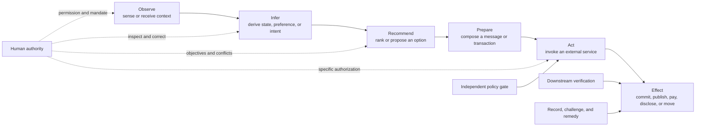
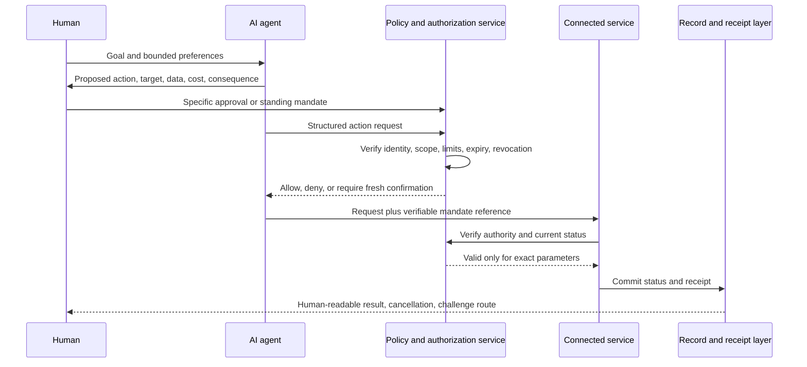

> **Status: WORKING NOTES**

# From ambient observation to accountable action

## An EU-led international rulebook for agentic AI devices

- **Research cut-off:** 2026-07-29
- **Scope:** consumer-facing ambient and agentic AI systems that can observe context, infer intent, recommend choices, or act through connected services.
- **Purpose:** identify the control gap, map the law that already applies, and specify a route from enforceable EU market rules to international adoption.

This note was prompted by [Lara Stuart-Mueller's post](https://www.linkedin.com/posts/lara-stuart-mueller-bab1172ab_breaking-openais-new-device-is-not-an-iphone-share-7488113738491899904-HsGn) about an emerging AI-native interface. The product is a useful trigger, not the object of the proposal. The rules below are capability-based and provider-neutral: they should apply whether the system is a speaker, wearable, phone, vehicle interface, robot, operating-system agent, or a service with no dedicated hardware.

This is a policy and implementation proposal, not legal advice. It distinguishes confirmed facts, attributed reporting, existing law, standards, research, and recommendations. It does not assume an unannounced product specification.

## The answer in one sentence

The human should control every escalation in authority; the provider may process and propose within declared limits; an authorization component independent of the generative model should gate every consequential action; the service carrying out the action should verify that authority; and regulators, independent assessors, and affected people should be able to reconstruct, challenge, stop, and remedy the result.

That principle needs law, not just a product promise:

> **Observation is not permission to infer; inference is not permission to recommend; recommendation is not authorization to act; and authorization for one action is not authority for the next.**

## 1. What is known—and what is not

OpenAI has confirmed that the io Products team merged with OpenAI and that Jony Ive and LoveFrom retain major design responsibilities. Its announcement speaks about moving beyond traditional interfaces but does not describe a finished device ([OpenAI, 2025](https://openai.com/sam-and-jony/)). In January 2026, an OpenAI executive said the company aimed to unveil a first device in the second half of 2026, while declining to identify its form factor or promise that it would go on sale that year ([Axios, 2026](https://www.axios.com/2026/01/19/openai-device-2026-lehane-jony-ive)).

July reporting, based on unnamed sources, described a screen-free, movable home companion that could learn about its owner and connect to personal information. OpenAI had not publicly confirmed those details at this note's cut-off ([TechCrunch's account of the Bloomberg report, 2026](https://techcrunch.com/2026/07/14/openais-first-hardware-device-is-reportedly-a-screenless-speaker-that-can-move/)).

| Claim | Evidence status | Consequence for this note |
|---|---|---|
| OpenAI and the io team are developing new AI products and interfaces | Confirmed by OpenAI | A new interface category is a legitimate policy subject |
| A device may be unveiled in the second half of 2026 | Attributed on-record statement; no sale commitment | The policy window is immediate, but no launch date is assumed |
| The first device is screen-free, mobile, sensor-rich, and connected to personal services | Press reporting based on unnamed sources | Used only as a plausible test case, not as established fact |
| It will autonomously purchase, communicate, navigate, or make other consequential decisions | Not established | The proposal applies only if and when such capabilities exist |

The regulatory question does not depend on which report proves correct. A system becomes consequential when it crosses from interpreting a person to exercising power in that person's name.

## 2. The control problem is a chain, not a single decision

An ambient agent can collapse several technically distinct events into one conversational experience:

Each arrow is a transfer of authority. Treating the whole chain as “the assistant helping” hides the moments at which a new legal or practical consequence arises.

### 2.1 Observation

Continuous microphones, cameras, location signals, application data, and nearby-device signals can capture owners and bystanders. The first questions are therefore:

- What activates sensing, and how is activation apparent to everyone exposed?
- Which processing happens locally, which data leaves the device, and for what purpose?
- Can sensing be physically disabled, not merely muted by a software preference?
- How are children, visitors, workers, and other non-users protected?
- Does the system retain raw input, extracted features, or neither?

A status light alone is insufficient if it does not distinguish local sensing, remote transmission, recording, and active agent execution.

### 2.2 Inference

Inference creates new claims that the person may never have stated: identity, mood, urgency, relationships, health state, purchasing preference, destination, or intention. Those claims can be wrong while appearing plausible.

The user therefore needs to know at least:

- which material facts and user-set preferences were used;
- what the system inferred from them;
- the confidence or material uncertainty relevant to the next step;
- whether a stored memory influenced the result;
- how to correct or delete the inference and its downstream memory.

The requirement is not disclosure of private model chain-of-thought. Raw reasoning traces can be unfaithful, privacy-invasive, or security-sensitive. The required artifact is a **faithful decision record**: the relevant inputs, derived claims, applicable rule, alternatives considered at the level needed to understand the choice, and the transition that followed.

### 2.3 Recommendation

An agent that selects what the user hears can become a gatekeeper over services, information, prices, and attention. A recommendation may reflect:

- the user's declared objective;
- the provider's commercial partnerships or own services;
- advertising or commissions;
- technical defaults and service availability;
- learned behavioural predictions;
- safety, legal, or policy constraints.

The user must be able to distinguish these influences. “Personalized” cannot serve as a blanket explanation for self-preferencing, paid placement, or an undisclosed change in objective.

### 2.4 Preparation and action

Drafting a message is not sending it. Building a basket is not buying it. Finding a route is not sharing a destination. Preparing an authorization request is not possessing authority.

Agentic systems also ingest untrusted material—web pages, emails, documents, messages, calendar invitations, and tool output. Prompt injection can turn that material into instructions. OpenAI itself says filtering alone is insufficient and that systems should constrain the impact even if manipulation succeeds ([OpenAI, 2026](https://openai.com/index/designing-agents-to-resist-prompt-injection/)). OWASP identifies excessive functionality, permissions, and autonomy as the main causes of “excessive agency” and recommends least privilege, approval for high-impact actions, and authorization checks in downstream systems rather than by the language model alone ([OWASP LLM06:2025](https://genai.owasp.org/llmrisk/llm062025-excessive-agency/)).

The safety invariant is therefore:

> A probabilistic model may request an action. It must not be the component that decides whether its own request is authorized.

### 2.5 Interruption and reversal

“Stop” has several meanings:

1. stop sensing;
2. stop model processing;
3. stop further tool calls;
4. revoke delegated credentials;
5. cancel actions prepared but not committed;
6. compensate or reverse actions already committed.

A local stop button that silences the device but leaves a cloud workflow running is not an effective stop. Nor is “undo” credible if the action was an irreversible disclosure, a public post already copied, or a completed physical movement.

Products must classify effects before execution:

- **idempotent:** safely repeatable without an additional effect;
- **reversible:** technically restorable within a stated window;
- **compensable:** not literally reversible, but subject to a defined remedy;
- **irreversible:** cannot reliably be undone or contained.

The later the category, the stronger the pre-action gate must be. “Reverse every step” is not physically possible in all cases; the enforceable rule is to prevent unauthorized irreversible effects, preserve cancellation windows where possible, and guarantee a remedy when reversal is impossible.

## 3. What existing EU law already does

The EU does not start from zero. The applicable framework is the [AI Act, Regulation (EU) 2024/1689](https://eur-lex.europa.eu/eli/reg/2024/1689/oj/eng), as amended by the [AI Omnibus, Regulation (EU) 2026/1744](https://eur-lex.europa.eu/eli/reg/2026/1744/oj/eng), together with data-protection, consumer-product, consumer-protection, competition, and cybersecurity law.

### 3.1 AI Act

| Provision | What it contributes | Why it does not close the ambient-agent gap |
|---|---|---|
| [Article 2](https://ai-act-service-desk.ec.europa.eu/en/ai-act/article-2) | Broad market reach, including non-EU providers where systems are placed on the EU market or their output is used in the EU | Territorial reach does not create a substantive control duty |
| Article 5 | Prohibits specified manipulative, exploitative, social-scoring, biometric, and other practices | It catches defined abuses, not ordinary escalation from inference to action |
| Articles 6–7 and Annex III | Classify listed systems and safety components as high-risk; Article 7 allows limited Annex III changes | A general consumer companion is not automatically high-risk; Article 7 additions must remain within areas already listed in Annex III and meet its risk test |
| Articles 9, 12–15 | For high-risk systems: risk management, logging, information, human oversight, accuracy, robustness, and cybersecurity | These are the right ingredients but are tied primarily to the high-risk category |
| Article 14 | Requires effective human oversight, including monitoring, avoiding automation bias, interpreting output, disregarding or reversing output, and interrupting operation into a safe state ([official Article 14 explorer](https://ai-act-service-desk.ec.europa.eu/en/ai-act/article-14)) | It does not establish a horizontal right for every consumer-facing agent capable of consequential action |
| Article 50 | From 2 August 2026, includes notice when people interact with an AI system and duties for certain generated or manipulated content ([official Article 50 explorer](https://ai-act-service-desk.ec.europa.eu/en/ai-act/article-50)) | Knowing that a system is AI does not reveal what it observed, inferred, recommended, authorized, or executed |
| Articles 72–73 | Post-market monitoring and serious-incident reporting for the systems in scope | Ordinary agentic consumer systems can remain outside the high-risk duties |
| Article 86 | A right to a clear and meaningful explanation for certain decisions based on high-risk output | Narrower than a general action record and usually arrives after a decision |

The 2026 AI Omnibus did not create a horizontal agentic-control class. It extended the high-risk application timetable: stand-alone high-risk rules apply from **2 December 2027**, and high-risk systems embedded in regulated physical products from **2 August 2028** ([European Commission, 27 July 2026](https://digital-strategy.ec.europa.eu/en/news/ai-omnibus-enters-force)).

The most important legal conclusion is narrow but significant:

> The AI Act already contains a strong model of human oversight, but a device that observes, recommends, and acts for a consumer is not covered by that model merely because it is ambient, highly personalized, or agentic.

Article 7 is not a complete shortcut. The Commission can amend Annex III by delegated act only where the new use case is in an area already listed there and presents equivalent or greater risk ([Article 7](https://ai-act-service-desk.ec.europa.eu/en/ai-act/article-7)). A cross-sector consumer-agent category therefore requires ordinary legislation or another valid product-law route, not creative interpretation of a delegated power.

### 3.2 The surrounding EU rulebook

| Instrument | Existing protection | Remaining gap |
|---|---|---|
| [GDPR](https://eur-lex.europa.eu/eli/reg/2016/679/oj/eng) and the [ePrivacy Directive](https://eur-lex.europa.eu/eli/dir/2002/58/oj/eng) | Lawful, fair, transparent, purpose-limited and minimized personal-data processing; privacy by design/default; access, correction, deletion, objection, and safeguards for specified automated decisions. The EDPB has applied this framework to [virtual voice assistants](https://www.edpb.europa.eu/documents/guideline/guidelines-022021-on-virtual-voice-assistants_en). | Personal-data rights do not by themselves define the authority required for every external action. Article 22 is limited to solely automated decisions producing legal or similarly significant effects; it is not a universal agent-control rule. |
| [General Product Safety Regulation](https://eur-lex.europa.eu/eli/reg/2023/988/oj/eng) | Requires safe consumer products, internal risk analysis and technical documentation. Safety assessment expressly considers cybersecurity and evolving, learning, and predictive functions; authorities can require corrective action and recalls ([official summary](https://eur-lex.europa.eu/legal-content/en/LSU/?uri=CELEX%3A32023R0988)). | “Safety” can reach some physical, health, and foreseeable-use risks, but does not clearly establish control over inference, recommendation, delegated authority, or service ranking. |
| [Cyber Resilience Act](https://digital-strategy.ec.europa.eu/en/policies/cyber-resilience-act) | Lifecycle cybersecurity, vulnerability handling, security updates, conformity marking, and market surveillance for products with digital elements; main duties apply from 11 December 2027. | It protects products against cyber threats; it does not determine when the product may exercise the user's authority. |
| Consumer and competition law | The [Unfair Commercial Practices Directive](https://eur-lex.europa.eu/eli/dir/2005/29/oj/eng) can address misleading omissions and manipulation; the [Digital Markets Act](https://eur-lex.europa.eu/eli/reg/2022/1925/oj/eng) imposes specified ranking, self-preferencing, data-access, and interoperability obligations on designated gatekeepers. | There is no general, provider-neutral duty that every personal agent disclose and respect the user's ranking objective or make action authority portable. |

These instruments should be enforced together. They should not be stretched to imply that the missing control right already exists.

## 4. The regulatory gap to close

The gap is not “AI is unregulated.” It is that regulation is divided by data processing, listed high-risk use, product safety, cybersecurity, and market role, while the ambient agent combines those layers in a single runtime chain.

Current law does not consistently require that:

1. **inferred intention never counts as consent or authorization;**
2. **each consequential action is bound to a specific, inspectable, revocable mandate;**
3. **the model cannot grant, extend, or verify its own authority;**
4. **the downstream service independently rejects an out-of-scope request;**
5. **a user can see a faithful event and decision record without demanding model chain-of-thought;**
6. **one stop command propagates across device, cloud workflow, credentials, and connected services;**
7. **recommendations disclose commercial influence and material self-preferencing;**
8. **records, permissions, and memories remain exportable and deletable when the service changes or closes;**
9. **a capability update that increases autonomy triggers renewed assessment;**
10. **people affected without being the purchaser—bystanders, household members, workers, and children—receive workable protection and complaint rights.**

Voluntary design patterns can show feasibility. They cannot decide scope, create a non-waivable right, authorize market withdrawal, or give affected people a remedy.

## 5. The proposed EU legal instrument

The cleanest route is a targeted amendment to the AI Act creating a horizontal class for **agentic AI systems capable of consequential action**. It should be capability-based, apply regardless of form factor, and coexist with the high-risk regime. A system already classified as high-risk would comply with the stricter or more specific rule where requirements overlap.

### 5.1 Why not rely only on Annex III?

Annex III is organized around use areas such as employment, education, essential services, law enforcement, migration, and justice. The agentic-control problem is cross-sectoral: the same assistant can book a restaurant, disclose medical information, purchase a product, send a dismissal message, or move a robot. Adding each use piecemeal would leave gaps at the boundary and age poorly.

### 5.2 Suggested structure

A new **Chapter IVa — Agentic AI systems capable of consequential action** could contain:

- **Article 50a — definitions and scope;**
- **Article 50b — separation of observation, inference, recommendation, preparation, and action;**
- **Article 50c — mandates, permissions, and independent authorization;**
- **Article 50d — inspectability, interruption, reversal, and records;**
- **Article 50e — provider, deployer, importer, distributor, and connected-service duties;**
- **Article 50f — conformity assessment, post-market monitoring, incidents, and standards.**

The number and placement are drafting suggestions, not claims about an existing legislative proposal.

### 5.3 Core definitions

**Ambient observation** means persistent or readily recurring collection or interpretation of environmental, behavioural, device, application, or service data beyond a discrete user submission.

**Agentic AI system** means an AI system that can select, sequence, or invoke tools or services to pursue an objective with some operational independence after the user's initial input.

**Consequential action** means an external action reasonably capable of:

- creating, changing, or ending a legal or financial obligation;
- affecting health, safety, employment, education, housing, credit, insurance, migration, public benefits, or access to an essential service;
- communicating publicly or to another person in the user's name;
- disclosing personal, confidential, privileged, or otherwise protected information;
- changing a physical system or environment in a way that can cause material harm;
- producing another material effect that is not readily reversible by the affected person.

**Mandate** means a machine-verifiable expression of authority specifying the principal, permitted action, target or recipient, data and value limits, purpose, duration, conditions, and revocation state.

**Independent authorization component** means a deterministic or separately controlled enforcement component that evaluates a proposed action against the mandate and applicable policy without relying on the acting model to declare its own request valid.

### 5.4 Model operative clauses

The amendment should establish at least these non-waivable requirements:

1. A provider must make each transition from observation to inference, recommendation, preparation, action, and external effect technically distinguishable and governable.
2. Ambient observation, inferred preference, predicted intent, silence, continued use, or a general request for assistance must not constitute consent or authorization for a consequential action.
3. Before a consequential action, the system must present, in an accessible form, the material action, target, data disclosed, price or obligation where applicable, important consequences, reversibility status, and the reason the action fits the user's declared objective.
4. Authorization must be specific, purpose-bound, time-limited, revocable, and no broader than necessary. A standing mandate is permissible only within a user-defined operating envelope with clear limits and exception gates.
5. The acting model must neither issue nor expand its own mandate. Every consequential request must be checked by an independent authorization component and again by the connected service before commitment.
6. The user must be able to inspect and correct the material observations, stored memories, derived claims, objective, recommendation basis, connected services, active mandates, and action status.
7. The user must be able to stop sensing and further execution, revoke credentials and mandates, and cancel uncommitted actions through an accessible control that remains effective during model or interface failure.
8. The provider must state whether an effect is reversible, compensable, or irreversible; expose any cancellation deadline; initiate reversal where technically available; and provide a route to human review and remedy.
9. Each consequential action must produce a tamper-evident, user-readable receipt and a protected technical record sufficient for audit, challenge, incident investigation, and remedy.
10. Commercial influence, sponsorship, commissions, provider ownership, and material self-preferencing that affect a recommendation must be clearly disclosed at the point of recommendation. User-set objectives must not be silently replaced by provider incentives.
11. Material additions to sensors, connected services, permissions, autonomy, or action classes must trigger a new risk assessment and, where required, renewed conformity assessment before activation.
12. End-of-service arrangements must preserve access to records, export of user-controlled settings and memories in an interoperable format, revocation of outstanding authority, secure deletion, and a safe degradation path.

## 6. A capability ladder for proportionate duties

Not every device operation needs a confirmation. A law that interrupts every low-risk act will train people to approve blindly. The correct rule is **trace wide, escalate narrow**: preserve inspectability across the chain, but require active escalation when authority or potential harm increases. This follows the repository's [user-workflow governance reference model](../Assurance/Concepts/user-workflow-governance.md).

| Level | Capability | Example | Default control |
|---|---|---|---|
| A — observe | Sense or retrieve context | Detect that someone entered a room; read a calendar | Visible sensing state, purpose boundary, local/off switch, retention control |
| B — infer/recommend | Derive a state or rank options | Infer travel intent; recommend a route or product | Inspectable basis, correction, uncertainty, commercial-influence disclosure |
| C — prepare | Create an uncommitted artifact | Draft a message; assemble a basket; fill a form | Clear draft state, editable parameters, no external effect |
| D — act | Invoke a service with an external effect | Send, buy, book, publish, unlock, disclose | Specific or valid standing mandate, independent policy check, downstream verification, receipt |
| E — critical or hard to reverse | Cause material or irreversible consequence | Transfer substantial funds; change medical treatment; terminate employment; control hazardous machinery | Fresh explicit confirmation, strong authentication, stricter assessment, safe cancellation where possible, human review and remedy |

The legal text should define the categories and essential rights. Harmonised standards and sector law should specify test methods and calibrated thresholds. Providers should not set their own risk category solely through marketing labels or the stated “intended purpose” where foreseeable capabilities and use show otherwise.

## 7. A compliant technical control plane

The legal duties can be implemented without requiring regulators to prescribe a particular model or user interface.

### 7.1 The mandate object

A standardized mandate should carry at least:

- principal and authorized agent identity;
- exact action class and connected service;
- target, recipient, account, resource, or device;
- permitted data fields and disclosure destination;
- amount, frequency, volume, geographic, and time limits where relevant;
- declared purpose and user objective;
- issue time, expiry, revocation endpoint, and nonce or replay protection;
- whether substitution of service, product, recipient, or material terms is allowed;
- action risk and reversibility class;
- cryptographic binding to the approved parameters.

OAuth Rich Authorization Requests show that fine-grained, structured authorization is practical, including transaction-specific details ([RFC 9396](https://datatracker.ietf.org/doc/rfc9396/)). Secure Payment Confirmation similarly demonstrates browser-controlled presentation of transaction details and cryptographic proof of confirmation, although it is a web-payment specification rather than a general agent standard ([W3C candidate specification](https://www.w3.org/TR/secure-payment-confirmation/)). These are precedents to adapt, not proof that the general problem is solved.

### 7.2 Complete mediation

Every consequential tool call must pass the gate. There must be no alternate path by which the model can call a broader tool, reuse an old token, change a recipient after approval, or ask a connected service to accept the model's assertion that “the user approved.”

The connected service shares responsibility: it must verify the mandate's signature, scope, expiry, revocation, and exact parameters. This avoids placing the entire control burden on the device provider and stops a compromised agent before commitment.

NIST's 2026 concept paper identifies agent identification, authorization, auditing, non-repudiation, and prompt-injection controls as an emerging standards problem ([NIST NCCoE](https://www.nist.gov/news-events/news/2026/02/new-concept-paper-identity-and-authority-software-agents)). It is a useful workstream, not yet a finished international solution.

### 7.3 Records without surveillance

Auditability must not become an instruction to centralize every intimate conversation. The record should separate:

- **user-facing content:** proposal, approval, status, result, and remedy;
- **integrity proof:** hashes, signatures, timestamps, version and policy identifiers;
- **access control:** who can retrieve which evidence and under what authority.

This repository's [split-custody proposal](split-custody-per-action-records.md) develops that allocation. The [public-interest control-and-evidence layer](../Infrastructure/control-and-evidence-layer.md) places the same mechanism in a broader institutional architecture.

## 8. What the human must be able to inspect and change

A screen-free device can be legitimate. An inspect-free system cannot. If the primary interface cannot display the required information, the provider must supply an accessible paired or web interface and an equivalent non-visual route.

The control surface should expose:

| Surface | Minimum content and control |
|---|---|
| Sensors | Active sensor, local/remote state, purpose, recipients, retention, hardware disable state |
| Memories and inferences | Source category, derived claim, last use, correction, deletion, “do not infer/store this again” control |
| Recommendations | User objective, material criteria, alternatives, commercial influence, policy constraints |
| Services and permissions | Connected service, read/write/action scope, last use, expiry, revoke control |
| Pending actions | Exact target, parameters, data disclosure, cost, deadline, reversibility, approve/edit/deny |
| Running workflows | Current step, remaining authority, pause/stop status, propagation to remote services |
| Completed actions | Receipt, mandate reference, service response, cancellation window, challenge and remedy route |
| System change | New capabilities, sensors, permissions, model or policy version, changed risk class, opt-in where authority expands |

Research on 22 deployed AI-agent interfaces found recurring control patterns such as visible plans and actions, control transfer, watch modes, configurable approval conditions, browsable/editable memory, and sandboxes ([Feng et al., 2025](https://arxiv.org/abs/2512.00742)). These patterns support feasibility, but regulation should require outcomes and tests rather than freezing today's interface vocabulary.

## 9. Conformity assessment and testable requirements

Rights become real only when a provider must produce evidence before market access and while the product operates.

### 9.1 Pre-market evidence

For Levels D and E, the provider should document:

- system boundary, sensors, models, tools, connected services, and responsible entities;
- foreseeable uses and misuse, including children, bystanders, shared households, and workplace deployment;
- action taxonomy and reversibility classification;
- permission and mandate architecture;
- human-factors testing for comprehension, automation bias, confirmation fatigue, accessibility, and emergency stop;
- adversarial testing, including indirect prompt injection and compromised connected services;
- update, incident, end-of-service, export, deletion, and remedy plans;
- evidence that an out-of-scope action fails closed.

Level D systems should at least undergo structured conformity assessment under harmonised requirements. Level E capabilities should require independent third-party assessment before placement on the EU market, not provider self-declaration alone.

### 9.2 Mandatory test families

Standards should define repeatable tests for:

1. **activation and bystander notice:** false activation, hidden capture, remote transmission, and physical sensor disable;
2. **data boundaries:** purpose changes, over-collection, raw-data retention, and deletion propagation from source to derived memory;
3. **inference quality:** correction, uncertainty presentation, stale memory, contradictory context, and unsupported intent;
4. **recommendation integrity:** paid influence, self-preferencing, objective substitution, alternative-provider access, and explanation fidelity;
5. **authorization:** missing, expired, revoked, replayed, broadened, or parameter-mismatched mandates;
6. **complete mediation:** attempts to bypass the gate through another tool, model, plugin, service, or fallback path;
7. **prompt injection:** malicious instructions in email, web, documents, tool output, and cross-agent messages;
8. **interrupt propagation:** device offline, model unresponsive, cloud workflow running, and connected-service delay;
9. **reversal:** pre-commit cancel, post-commit reversal, compensating action, and honest irreversible-state handling;
10. **records:** completeness, tamper evidence, user readability, selective disclosure, retention, and custodian failure;
11. **updates and drift:** added tools, wider permissions, new models, changed policies, and capability reclassification;
12. **service failure and exit:** cloud outage, provider insolvency, discontinued support, export, credential revocation, safe degradation, and deletion;
13. **accessibility and vulnerable users:** visual, hearing, speech, motor, and cognitive access needs; children and people under pressure or impaired capacity.

There should be a zero-tolerance functional invariant for executing a consequential action without valid authority. Performance thresholds for recognition, false activation, interruption latency, confirmation comprehension, and other context-dependent measures should be published through standards or delegated/implementing measures after empirical validation—not invented by each provider or hard-coded in a general manifesto.

### 9.3 Post-market enforcement

Providers should:

- monitor action failures, unauthorized attempts, overrides, reversals, complaints, and near misses;
- report serious agentic incidents to the competent authority under an extended Article 73 model;
- notify users and connected services when a vulnerability compromises mandate or record integrity;
- suspend an affected action class remotely without disabling access to records or revocation controls;
- reassess material capability changes before activation.

Authorities should be able to require logs and technical documentation, run mystery-shopping and adversarial tests, order corrective updates, suspend an action class, withdraw or recall a device, and coordinate with data-protection, consumer, cybersecurity, financial, health, or sector regulators.

## 10. Standards: necessary, but subordinate to law

The Commission has asked CEN and CENELEC to develop AI Act standards in ten areas, including records, transparency, human oversight, cybersecurity, and conformity assessment. Harmonised standards remain voluntary, but citation in the Official Journal can provide a presumption of conformity ([European Commission standardisation overview](https://digital-strategy.ec.europa.eu/en/policies/ai-act-standardisation)).

The proposed legal amendment should add a specific standardisation request for:

- the transition and capability taxonomy;
- faithful user-facing decision and event records;
- mandate schemas and revocation;
- independent authorization and downstream verification;
- interrupt propagation and safe-state semantics;
- reversibility and compensability classification;
- commercial-influence disclosure;
- end-of-service export and revocation;
- test suites and evidence formats.

Existing international work offers building blocks:

- [ISO/IEC TS 8200:2024](https://www.iso.org/standard/83012.html) covers state observability, state transitions, transfer of control, uncertainty during control transfer, and verification/validation;
- [ISO/IEC FDIS 42105](https://www.iso.org/standard/86902.html), still under development at the cut-off date, extends that work with guidance on human oversight across the lifecycle;
- the [NIST AI Risk Management Framework](https://airc.nist.gov/airmf-resources/airmf/5-sec-core/) calls for documented roles, human-AI oversight, testing, feedback, contingency planning, and safe decommissioning;
- OWASP supplies actionable security controls for least privilege, user-context execution, approval, and complete mediation.

Standards can define how to demonstrate compliance. They must not decide who receives the right, whether the right can be waived, or whether an authority may withdraw a product. Those are legislative choices.

## 11. A practical EU implementation route

### Phase 0 — use existing powers now

Before new legislation is complete, EU institutions and national authorities can:

1. issue joint AI Act/GDPR/GPSR/CRA guidance for ambient and agentic consumer products;
2. state clearly that Article 50 interaction notice is not authorization and that GDPR consent cannot be inferred from ambient behaviour;
3. apply the GPSR's risk-analysis duties to foreseeable harms from learning and predictive product functions;
4. use consumer law against misleading claims about autonomy, deletion, neutrality, reversibility, or “local” processing;
5. ask CEN, CENELEC, and ETSI to develop a voluntary agentic-control profile using the test families above;
6. run supervised pilots in regulatory sandboxes without treating sandbox entry as approval;
7. coordinate an EU incident taxonomy for unauthorized action, failed interruption, mandate bypass, and irreversible disclosure.

This phase can clarify and test. It cannot manufacture a general mandatory right beyond the legal bases already in force.

### Phase 1 — legislate the horizontal control class

The European Commission should propose the targeted AI Act amendment after an evidence call focused on agentic capabilities rather than brands. The impact assessment should compare:

- a horizontal AI Act chapter;
- additions to product-safety law;
- sector-only rules;
- voluntary standards alone.

The horizontal AI Act route is preferable because software-only agents and the same agent running across several devices must remain in scope. GPSR and CRA duties should continue to apply to the hardware and cybersecurity layers.

The Parliament's IMCO and LIBE committees and the Council should test the proposal against consumer protection, fundamental rights, accessibility, innovation, and enforceability. The final law should empower the Commission to update technical categories without allowing essential rights or scope to be delegated to private standards bodies.

### Phase 2 — operationalize market access

The Commission, AI Office, European AI Board, national market-surveillance authorities, data-protection authorities, and consumer authorities should agree:

- a single intake route for cross-regime complaints and incidents;
- lead-authority and cooperation rules;
- conformity-assessment modules by capability level;
- an EU database entry for Level D/E systems and material capability changes;
- standard machine-readable mandate and receipt profiles;
- common recall, suspension, and remedy procedures.

Non-EU providers placing a covered system on the EU market should identify the responsible EU economic operator and supply the same evidence. The requirement attaches to market access, not the provider's place of incorporation.

### Phase 3 — build international equivalence

The goal should not be a nominal “global law” with no common test. Use three connected routes:

1. **Treaty implementation.** The [Council of Europe Framework Convention on AI](https://www.coe.int/en/web/artificial-intelligence/the-framework-convention-on-artificial-intelligence) is the first legally binding international AI treaty. It requires principles including autonomy, privacy, transparency and oversight, accountability, remedies, sufficient information to challenge AI-supported decisions, and iterative risk assessment. Parties should adopt the transition-control duties through a model implementation protocol or recommendation.
2. **International standards.** Feed the EU mandate, record, interruption, and test profiles into ISO/IEC JTC 1/SC 42 and align them with ISO/IEC TS 8200 and the emerging human-oversight standard. An “international first” approach can then support adoption as European harmonised standards where the international text satisfies EU legal requirements.
3. **Market, procurement, and mutual recognition.** Governments and large buyers should require the profile in procurement. Mutual recognition should depend on equivalent rights, independent assessment, incident reporting, regulator access, and remedy—not on a provider's self-attestation or a label alone.

The Council of Europe Convention is technology-neutral and allows different approaches to private-sector implementation. That makes it an important legal bridge, but it does not itself supply the detailed mandate schema, conformity test, or consumer-device market-surveillance system proposed here.

The OECD AI Principles provide a further soft-law bridge: they call for meaningful information about AI capabilities and limits, understandable information enabling affected people to challenge output, human agency and oversight, traceability across data and decisions, safe override or decommissioning, and accountability by AI actors ([OECD human-centred values](https://oecd.ai/en/dashboards/ai-principles/P6), [transparency and explainability](https://oecd.ai/en/dashboards/ai-principles/P7), [robustness and traceability](https://oecd.ai/en/dashboards/ai-principles/P8), [accountability](https://oecd.ai/en/dashboards/ai-principles/P9)). They can align policy language across participating economies, but cannot substitute for enforceable market rights.

## 12. Who must do what

| Actor | Concrete responsibility |
|---|---|
| European Commission | Propose the horizontal amendment; coordinate the impact assessment; issue interim cross-regime guidance; request standards; adopt technical measures within a bounded delegation |
| European Parliament and Council | Establish the non-waivable rights, scope, enforcement powers, and institutional accountability |
| AI Office and European AI Board | Coordinate classification, guidance, incident taxonomy, cross-border cases, and consistent enforcement |
| National market-surveillance authorities | Inspect evidence, test products, require correction, restrict capabilities, withdraw or recall unsafe/non-compliant products |
| Data-protection and consumer authorities | Enforce sensing, lawful processing, dark-pattern, misleading-claim, commercial-influence, complaint, and remedy duties |
| Standards bodies and conformity assessors | Turn essential requirements into testable controls and independently evaluate the higher capability levels |
| Device and agent provider | Minimize sensing and permissions; separate transitions; supply the control surface; request rather than self-grant authority; maintain records, updates, exit, and remedy |
| Connected service and tool provider | Verify the mandate independently; reject parameter mismatch; return commit/reversal status and a receipt |
| User or represented principal | Define objectives and bounded mandates; approve consequential exceptions; inspect, correct, revoke, and challenge |
| Affected non-user | Receive appropriate notice and a route to object, complain, obtain information, and seek remedy |
| Council of Europe, ISO/IEC, OECD and public procurers | Translate the EU baseline into treaty implementation, international standards, policy alignment, and purchasing requirements |

## 13. A regulator's practical checklist for the mentioned device

Before any reported OpenAI device—or an equivalent competitor—can act through personal services, regulators should require public, testable answers to these questions:

### Observation

- Which sensors exist, and which have physical disconnection or unmistakable hardware state?
- What is processed locally, transmitted remotely, retained, and used for training?
- How are bystanders and children notified and protected?
- Can the owner prohibit a category of inference, not only delete the raw recording?

### Inference and memory

- Which derived claims are stored, for how long, and with what source link?
- Can the user inspect, correct, delete, export, and prevent re-creation of a disputed memory?
- Does correction propagate to profiles, caches, and connected services?

### Recommendation

- What objective is optimized?
- When do ownership, commissions, sponsorship, service availability, or provider policy affect ranking?
- Can the user select a different service or recommendation provider without losing the device?

### Action

- Which action classes are supported?
- What exact parameters are bound to the user's authorization?
- Is authorization enforced outside the generative model and verified by the destination service?
- Can the model acquire broader permissions, create standing authority, or change a target after approval?

### Stop, reverse, and remedy

- Does one stop control halt local sensing, remote execution, future tool calls, and credential use?
- What happens when the device is offline or the cloud workflow is unreachable?
- Which actions are reversible, compensable, or irreversible, and how is that shown before execution?
- Who can order restoration, refund, deletion, correction, or compensation?

### Evidence and lifecycle

- What receipt does the user receive for each consequential action?
- Who holds content, integrity proofs, and access rights?
- Which updates trigger re-assessment?
- What is the minimum support period, and what happens to permissions, records, memories, and core functions when support ends?

An inability to answer should block the affected capability, not necessarily the entire product. This supports innovation while refusing silent transfers of authority.

## 14. Open design and policy questions

The proposal still requires evidence and public decision on:

1. where the boundary between ordinary and consequential action should sit in low-value but high-frequency transactions;
2. when a standing mandate is safer than repeated confirmation, and how to measure confirmation fatigue;
3. how bystander notice and objection can work in homes, public spaces, vehicles, and workplaces without normalizing ambient surveillance;
4. whether recommendation integrity should become a duty of loyalty, a conflict-disclosure duty, a user-objective duty, or a combination;
5. which entity should hold evidence when the provider, connected service, user, and affected third party need different access;
6. how long cancellation windows should be for each action class;
7. which Level E capabilities should be prohibited for consumer agents rather than merely gated;
8. how to preserve accessibility when strong confirmation is required;
9. how mutual recognition can avoid both duplicative assessment and weak-jurisdiction shopping;
10. how open-source components should be treated where a commercial integrator turns them into an action-capable consumer system.

These questions are reasons to run public, measurable pilots. They are not reasons to leave the authority transition unregulated.

## 15. Bottom line

The policy target is not a particular speaker, model, or company. It is the emerging control layer between human intention and external effect.

The EU already has the core vocabulary: risk management, records, transparency, human oversight, interruption, cybersecurity, conformity assessment, market surveillance, and remedy. The missing move is to apply a precise subset horizontally when an AI system can exercise consequential authority for a person—whether or not that system appears in today's high-risk sectors.

The implementation rule is simple enough to test:

> **The model may infer and propose. Only a valid human mandate, enforced outside the model and verified at the point of effect, may authorize consequential action. Every action must remain inspectable, interruptible until commitment, reversible where possible, and challengeable with an effective remedy.**

That is a practical demand legislators can place on any ambient AI device before convenience hardens into invisible power.

## Selected sources

### Primary EU and international law

- [EU AI Act — Regulation (EU) 2024/1689](https://eur-lex.europa.eu/eli/reg/2024/1689/oj/eng)
- [AI Omnibus — Regulation (EU) 2026/1744](https://eur-lex.europa.eu/eli/reg/2026/1744/oj/eng)
- [AI Act Article 7 — amendments to Annex III](https://ai-act-service-desk.ec.europa.eu/en/ai-act/article-7)
- [AI Act Article 14 — human oversight](https://ai-act-service-desk.ec.europa.eu/en/ai-act/article-14)
- [AI Act Article 50 — transparency](https://ai-act-service-desk.ec.europa.eu/en/ai-act/article-50)
- [GDPR — Regulation (EU) 2016/679](https://eur-lex.europa.eu/eli/reg/2016/679/oj/eng)
- [ePrivacy Directive — Directive 2002/58/EC](https://eur-lex.europa.eu/eli/dir/2002/58/oj/eng)
- [General Product Safety Regulation — Regulation (EU) 2023/988](https://eur-lex.europa.eu/eli/reg/2023/988/oj/eng)
- [Cyber Resilience Act — Regulation (EU) 2024/2847](https://eur-lex.europa.eu/eli/reg/2024/2847/oj/eng)
- [Unfair Commercial Practices Directive — Directive 2005/29/EC](https://eur-lex.europa.eu/eli/dir/2005/29/oj/eng)
- [Digital Markets Act — Regulation (EU) 2022/1925](https://eur-lex.europa.eu/eli/reg/2022/1925/oj/eng)
- [Council of Europe Framework Convention on Artificial Intelligence](https://www.coe.int/en/web/artificial-intelligence/the-framework-convention-on-artificial-intelligence)

### Standards and technical control sources

- [European Commission — standardisation of the AI Act](https://digital-strategy.ec.europa.eu/en/policies/ai-act-standardisation)
- [ISO/IEC TS 8200:2024 — controllability of automated AI systems](https://www.iso.org/standard/83012.html)
- [ISO/IEC FDIS 42105 — guidance for human oversight, under development](https://www.iso.org/standard/86902.html)
- [NIST AI Risk Management Framework Core](https://airc.nist.gov/airmf-resources/airmf/5-sec-core/)
- [NIST NCCoE — identity and authority of software agents concept paper](https://www.nist.gov/news-events/news/2026/02/new-concept-paper-identity-and-authority-software-agents)
- [OECD AI Principles — transparency, robustness, and accountability](https://oecd.ai/en/ai-principles)
- [OWASP LLM06:2025 — Excessive Agency](https://genai.owasp.org/llmrisk/llm062025-excessive-agency/)
- [IETF RFC 9396 — OAuth 2.0 Rich Authorization Requests](https://datatracker.ietf.org/doc/rfc9396/)
- [W3C Secure Payment Confirmation](https://www.w3.org/TR/secure-payment-confirmation/)
- [Feng et al. — *On the Regulatory Potential of User Interfaces for AI Agent Governance*](https://arxiv.org/abs/2512.00742)

### Device and threat evidence

- [OpenAI — *A letter from Sam & Jony*](https://openai.com/sam-and-jony/)
- [Axios — OpenAI aims to debut its first device in 2026](https://www.axios.com/2026/01/19/openai-device-2026-lehane-jony-ive)
- [TechCrunch — reported screen-free companion concept](https://techcrunch.com/2026/07/14/openais-first-hardware-device-is-reportedly-a-screenless-speaker-that-can-move/)
- [OpenAI — designing AI agents to resist prompt injection](https://openai.com/index/designing-agents-to-resist-prompt-injection/)
