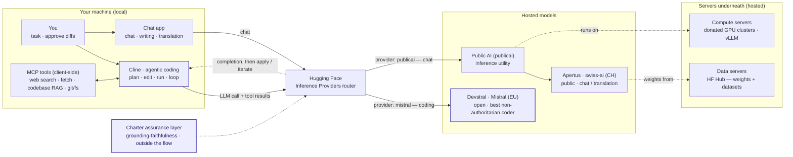
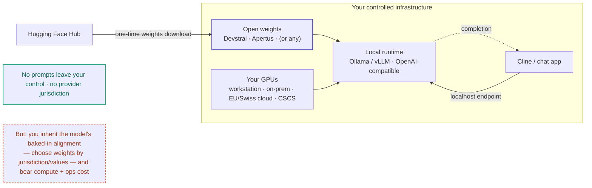

> **Status: WORKING NOTES** - grounded strategy note, prepared 2026-07-02 from web research plus three parallel assistant reviews; updated 2026-07-03 with the LinkedIn prompt, question-routing research, an agentic-coding capability snapshot, and a hosted-vs-self-host + cost section; updated 2026-07-07 with a grounded actor & mechanism map from primary sources (COMMUNIA study PDF read in full, Apertus technical report). Re-verify legal, model-performance, and initiative-status claims before external use.

# Copyright-clean open/public LLMs - competitiveness strategy

*Working notes - 2026-07-02; routing update 2026-07-03. Public-safe. Related: [Apertus fit & engagement plan](apertus-fit-and-engagement-plan.md), [Marcel Salathé actor note](public-ai-people-and-pathways.md), [public-interest control & evidence layer](../Infrastructure/control-and-evidence-layer.md), [initiation strategy](../Strategy/initiation-strategy.md), [actors & landscape](../Evidence/actors-and-landscape.md).*

## In one line

Copyright-clean open/public LLMs will not become frontier-competitive through clean training data alone. The credible route is a **rights-clean public frontier flywheel**: lawful data, pooled compute, open model-flow releases, strong post-training, public inference, domain adoption, and one legally usable feedback loop.

## Reality check

The first-pass answer - a public data trust plus provenance - is necessary but probably insufficient. Closed frontier labs have advantages that a clean corpus does not neutralize: proprietary product telemetry, private post-training data, larger compute budgets, faster iteration, integrated distribution, and the ability to absorb legal uncertainty.

The stronger answer is therefore not "out-scrape closed labs." It is: **out-institutionalize them where trust, sovereignty, auditability, local language quality, and procurement legitimacy matter.** Open/public LLMs do not need to beat the best closed model on every general benchmark to matter. They need to become the default trusted layer for public administration, research, education, cultural and language infrastructure, regulated workflows, and SMEs that need portability.

Stanford's 2026 AI Index is the best current reality check: as of March 2026, the top closed model led the top open model by 3.3%, up from 0.5% in August 2024 - the gap reopened in 2025 after briefly closing in 2024; it also notes that leading model performance is clustering and that competition is shifting toward cost, reliability, and domain performance ([Stanford AI Index 2026](https://hai.stanford.edu/ai-index/2026-ai-index-report/technical-performance)).

## 2026-07-07 — how the field actually answers this (grounded map)

*From primary sources read directly: the [COMMUNIA study](https://communia-association.org/2026/06/30/new-study-copyright-challenges-in-open-source-ai-development-in-the-european-union/) (full PDF), the [Apertus technical report](https://arxiv.org/abs/2509.14233), and dataset/org primary pages. Lower-confidence items are in Open questions.*

The field has effectively abandoned "each team clears copyright alone." It splits into two philosophies, over four shared "solve-once" layers.

**Two philosophies.** *Avoid* — train only on public-domain / open / directly-licensed data, so there is little to clear (pleias·Common Corpus, GPT-NL, largely Apertus); pleias: *"an Open Data approach means that a project does not need to invest resources in copyright vetting."* *Manage* — train on web-crawl under the DSM TDM exceptions and honour opt-outs (OpenEuroLLM, PLLUM, SOOFI, GAMS); notably most shift from Art. 3 to the *narrower* Art. 4 because open weights allow commercial use, inheriting the opt-out burden.

**Four "solve-once" layers (maturity varies):**

1. **Shared clean corpora** — Common Corpus (≈2T tokens, public-domain + permissive, per-document provenance; AI Alliance Open Trusted Data Initiative) and EleutherAI **Common Pile** (8 TB), whose **"Comma" 7B models are competitive with Llama 1/2** — the strongest proof the *Avoid* path can work; KL3M (legal/finance, CC-BY data + MIT tooling). *Caveat: FineWeb is openly licensed (ODC-By) but is filtered Common Crawl — not copyright-clean; don't lump it in.*
2. **Shared provenance / audit tooling** — the **Data Provenance Initiative**'s Explorer (over 1,800 datasets) lets builders filter for license/consent instead of re-auditing; its own audit found *"license omission of 70%+ and error rates of 50%+"* on hosting sites, and its *Consent in Crisis* study found **~45% of C4 now Terms-of-Service-restricted** (the open web is closing fast).
3. **Shared opt-out signalling — still fragmented.** robots.txt (REP), W3C **TDMRep** (a Community-Group report, *not* a standard), **Spawning**'s Do-Not-Train registry + API (Shutterstock alone added 444M+ URLs), Creative Commons **signals** (alpha ~Nov 2025, "may range in enforceability"), IPTC guidance. None is a binding standard; IPTC and CC both point to a missing **IETF** unifier.
4. **Shared legal + compliance scaffolding** — EU AI Act **Art. 53(1)(c)/(d)** (a copyright policy honouring Art. 4(3) reservations + a public training-content summary on a common AI-Office template) and the **GPAI Code of Practice**; **Fairly Trained**'s "Licensed Model" label (a shared badge, but the licensing work stays per-team).

**The policy prescription — COMMUNIA (Drabczyk & Tarkowski, June 2026), four recommendations:** (1) confirm AI training is legitimate TDM under Art. 3 *and* 4, and open-sourcing model weights doesn't forfeit Art. 3; (2) a statutory, un-waivable **right to host/share/republish** curated training datasets for verification; (3) a **good-faith safe harbor** for good-faith compliers; (4) *"Europe needs a European public training corpus as digital infrastructure."* Open Future's Jan-2026 *European Public AI* brief adds **"data labs"** stewarding a **"European data commons"** with a *"gatekeeping role"* and *"public-interest-oriented licensing."*

**Two real "clear once, reuse many" precedents** (these upgrade the *Collective licensing / data compacts* and *Public data trust* rows below from theory to precedent):

- **Slovenian National Library** — shares its in-copyright collection *on condition that datasets "will be reshared back to the National Library, so that it can further make them available for new research projects."*
- **GPT-NL "Content Board"** — Dutch data providers *"collectively agreed on the terms and conditions of data sharing,"* with revenue-sharing proportional to contribution and use.

**The killer datapoint for the collective-action thesis:** HPLT spent *"6 million Euro to clean up, deduplicate and refine Common Crawl … 50 terabytes … in 200 languages. Yet there is legal uncertainty whether this can be shared, leading to a waste of resources, as researchers have to each work with crawl data on their own"* — while these burdens *"fall hardest on open-source AI developers … while well-resourced global competitors can absorb legal ambiguity."* This is the empirical backbone for the network's *clear once, reuse many* framing.

**Charter angle.** These commons proposals are strong on *what* and *why*, thin on the trustworthy *how* — stewardship, anti-capture, tiered access, checkable provenance. That governance/assurance skin is this initiative's [data-and-provenance-commons](../network-overview.md) contribution — **not** a rival corpus, and **not** a collecting society: none exists, so the "credible public counterpart rightsholders can license to" must read as *design intent*, not fact.

**Name-adjacent watch (resolved 2026-07-27):** the Apertus values document was renamed the **"Apertus Charter (formerly known as the Swiss AI Charter)"** with the 1.5 release ([release story](https://publicai.co/stories/apertus-1-5)) — the name-adjacency is largely defused; it remains a model-alignment values doc, categorically different from *Our AI Charter*. Whether the promised democratized-refinement process has opened is still unverified.

## Capability snapshot: agentic coding (mid-2026)

Agentic coding — an agent (Cline, Aider, OpenHands) that reads a repo, plans, edits across files, and iterates — is one of the highest-demand LLM uses, and it sharpens the *open ≠ public* distinction this note turns on.

**The strongest open-weight coding models are not the publicly-governed ones.** The current open leaders are a few families, mostly Chinese-lab or Mistral, released open-weight under permissive licences (Apache-2.0 / MIT / modified-MIT) but **not** open-data or publicly governed:

| Open-weight family | Origin | Note |
|---|---|---|
| **GLM** (4.6 / 5.x) | Z.ai / Zhipu (CN) | Top open agentic-coding all-rounder; strong Cline / Claude-Code fit |
| **Qwen3-Coder** | Alibaba (CN) | Dedicated agentic-coding line (large MoE + small variants) |
| **DeepSeek** (V3.x / V4) | DeepSeek (CN) | Strong reasoning + coding, cost-efficient |
| **Kimi K2** | Moonshot (CN) | Agentic tool-use / long-horizon tasks |
| **Devstral** | Mistral + All Hands (EU/US) | Purpose-built for coding agents; best option runnable on one GPU |

Open models now reach roughly **~70–80% on SWE-bench Verified** (harness-dependent), closing on but still behind the best proprietary (~88%). *Versions and scores churn monthly — treat as directional and re-verify against a live leaderboard ([SWE-bench](https://www.swebench.com/), [kilo.ai open-source models](https://kilo.ai/open-source-models)).*

**The fully-open / publicly-governed models trail on code.** Apertus, SEA-LION, and OLMo — the most transparent (open weights **+ data + recipe**) and the "public AI" ones — are general-purpose, not code-specialised; **there is no top-tier public-AI coding model.** Via the Public AI utility (`publicai` on Hugging Face) you reach these public models; the strong open coders run through other inference providers (commercial), not the public utility.

**Implication for this strategy:** agentic coding is a domain where copyright-clean / public models will *not* win on raw capability soon. It reinforces the core move — compete on **trust, sovereignty, auditability, domain fit, and lawful provenance**, not benchmark rank — and means a competitive *public* coding model would be a deliberate build (the model-factory, post-training, and agent-tuning layers of the flywheel below), not an off-the-shelf option today.

## Running it in practice — hosted, self-hosted, and cost

Competitiveness is not only capability — it is whether an institution can actually **run** a public/open model for real work, **affordably** and **sovereignly**. That is the activation gap, made concrete for the two everyday uses (agentic coding and chat). The diagrams render on the site and extend the [actor-map stack diagram](../Evidence/actors-and-landscape.md).

### Hosted — via an inference provider

Web search and RAG are added **client-side** (MCP tools for the agent; app retrieval for chat) before the model call; the router sends coding to **Devstral (Mistral, EU)** or, via the **Public AI** utility, chat to **Apertus (CH)**. Your prompts leave your device to the provider. *Caveat:* those same tools open a **prompt-injection** surface — retrieved web content or a rogue MCP server can steer an agent that edits files and runs commands — so tool/retrieval safety, not only grounding-faithfulness, is part of what an assurance layer must cover.

### Self-hosted / on-prem — the sovereignty path

Download the open weights once and serve them yourself; point Cline at the local endpoint. This is the strongest sovereignty position — **no data egress, no provider jurisdiction** — but the model's alignment still travels with the weights (so weight *choice* by jurisdiction still matters), and you carry the compute and operations cost.

### Cost — the factor that often decides

Agentic coding is **token-heavy** (long context plus many tool-call round-trips), so cost weighs as much as capability:

| How you run it | Cost shape | Notes |
|---|---|---|
| **Hosted API** (per-token) | Pay per token; open models are far cheaper than frontier APIs. | **Public AI routing is currently free but rate-limited / best-effort** (donated GPU) — good to prototype, not a guaranteed SLA. |
| **Self-hosted** (your GPUs) | No per-token fee; you pay **capital or rental GPU + ops**. | Economical at volume or when data cannot leave; small models (Devstral Small, Apertus-8B) run on modest GPUs. |

Rule of thumb: prototype on the free/hosted tier, move heavy or sensitive workloads to self-host, escalate only the hardest tasks to a frontier API. This is the note's **"no durable funding model"** counter-thesis made concrete — a free public-inference tier still costs someone real GPU money, so sustainable public AI needs institutional funding, not only donated compute.

## Strongest objections

Three counter-theses this strategy must answer rather than assume away:

- **US fair-use asymmetry.** If US courts keep permitting model training on copyrighted data as fair use (unsettled, but the direction of several 2025 rulings), closed labs can train on everything while rights-clean public models accept opt-out friction. "Copyright-clean" is then a deliberate trade of capability ceiling for trust, legitimacy, and EU-market access, not a free win, and it pays off only where that trade is the buyer's binding constraint.
- **Open weights get distilled.** Rights-clean purity also forecloses distillation from frontier outputs, one of the most effective open catch-up levers. The constraint cuts both ways.
- **No durable funding model.** Pooled public compute and a public inference utility have no proven long-run funding path; treat this as a counter-thesis, not only a risk line.

## Source anchors

| Source / initiative | What it contributes | What it does not solve |
|---|---|---|
| [COMMUNIA copyright study](https://communia-association.org/2026/06/30/new-study-copyright-challenges-in-open-source-ai-development-in-the-european-union/) | Strongest legal diagnosis found for open-source AI in the EU: TDM uncertainty, opt-out friction, safe-harbor/public-corpus need. | Capability, compute, product, and adoption gaps. |
| [LinkedIn prompt, 3 Jul 2026](https://www.linkedin.com/posts/robertschaub_a-new-communia-research-study-that-i-co-authored-activity-7478119769771167744-UrMO) | Public prompt asking how open LLMs can solve the copyright/TDM dilemma without every team separately carrying opt-out parsing, dataset review, and legal-risk work. | A question, not evidence that any tagged person or institution owns the answer. |
| [EU GPAI Code of Practice](https://digital-strategy.ec.europa.eu/en/policies/contents-code-gpai) and [training-content template FAQ](https://digital-strategy.ec.europa.eu/en/faqs/template-general-purpose-ai-model-providers-summarise-their-training-content) | Practical EU compliance baseline: copyright policy, transparency, training-content summaries, opt-out handling. | Compliance does not create frontier capability. |
| [DSM Copyright Directive](https://eur-lex.europa.eu/legal-content/EN/TXT/?uri=CELEX%3A32019L0790) | Legal foundation for EU text and data mining exceptions, especially Articles 3 and 4. | Article 4 depends on fragmented rights reservations; Article 3 is narrow. |
| [Apertus](https://www.apertus-ai.org/) / [ETH release](https://ethz.ch/en/news-and-events/eth-news/news/2025/09/press-release-apertus-a-fully-open-transparent-multilingual-language-model.html) | Strong proof point for public, fully open, multilingual, opt-out-aware model development and deployment. | Strong but not a general frontier leader across all tasks. |
| [Public AI: "If open source is to win, it must go public"](https://openreview.net/forum?id=zN7zY1UVru) (latest formal version, ICML 2026) | Strong diagnosis of the activation gap: open weights need compute, inference, post-training, deployment, and oversight. | Needs a harder commercial and institutional execution path. |
| [Current AI Gap Map](https://map.currentai.org/) | Maps open-source AI stack gaps; notably shows training/synthetic data and product adoption as weak points. | A map, not an operating model. |
| [OpenEuroLLM](https://openeurollm.eu/) | European route for transparent, compliant, multilingual foundation models for public and commercial services. | Still early; needs model releases, adoption, and feedback loops. |
| [OSI Open Source AI Definition](https://opensource.org/ai/open-source-ai-definition) | Helps distinguish real openness from open-weight marketing by requiring enough data information, code, and parameters to modify/recreate. | Does not itself clear copyright or fund compute. |
| [Common Corpus](https://huggingface.co/blog/Pclanglais/two-trillion-tokens-open) and [Common Pile](https://arxiv.org/abs/2506.05209) | Show that large public-domain/open-license corpora are possible and can train competitive smaller models. | Scale and breadth remain below frontier private data and telemetry loops. |

## LinkedIn prompt and question route

The 3 July 2026 LinkedIn post is now registered here as a public prompt, not as a separate published article mirror. It asks how open LLMs can solve the dilemma surfaced by the COMMUNIA study: copyright uncertainty, opt-out parsing, dataset review, and legal risk fall repeatedly on public-interest model teams.

Grounded answer: **do not route the question first to Marcel Salathé, EPFL AI Center, or ETH AI Center as generic addressees.** They are useful Swiss/Apertus-orbit orientation channels, but the public evidence does not show that they own the copyright/TDM answer. Route the question by layer:

| Route | Public evidence | Best question |
|---|---|---|
| **[COMMUNIA](https://communia-association.org/publication/copyright-challenges-in-open-source-ai-development-in-the-european-union-2/) / [Open Future](https://openfuture.eu/) / [Centrum Cyfrowe](https://centrumcyfrowe.pl/)** | The study is authored by Maria Drabczyk and Alek Tarkowski for COMMUNIA and identifies TDM uncertainty, dataset-sharing uncertainty, and non-standard opt-out information as the core legal bottlenecks. | "Which intervention would most reduce legal friction for open/public LLM builders: Article 3 clarification, Article 4 opt-out standardisation, dataset-sharing rights, safe harbors, or a public corpus?" |
| **[OpenEuroLLM](https://openeurollm.eu/launch-press-release)** | Its launch release names a 20-partner consortium coordinated by Jan Hajič and co-led by Peter Sarlin, aiming for fully open models including data, software, and evaluation under EU rules. | "What shared compliance infrastructure would save effort across European open-model teams?" |
| **[Pleias / Common Corpus](https://thealliance.ai/blog/pleias-releases-common-corpus-open-multilingual-dataset-for-llm-training)** | Common Corpus is a permissively licensed, provenance-documented multilingual corpus for auditable LLM training. | "How far can public-domain/open-license corpora scale before lawful TDM or licensing compacts become unavoidable?" |
| **[Apertus / Swiss AI Initiative](https://arxiv.org/abs/2509.14233) technical orbit** | Apertus is a concrete Swiss compliance pattern: open artifacts, retroactive opt-out filtering, PII filtering, and memorization reduction; the technical report names Antoine Bosselut, Martin Jaggi, and Imanol Schlag as leads. | "Which parts of the Apertus compliance pipeline are reusable infrastructure, and what remains Swiss/project-specific?" |
| **[GPT-NL](https://github.com/GPT-NL)** | GPT-NL documents a legally conservative path built from permissive/public data plus licensed material; its [public corpus paper](https://arxiv.org/abs/2604.00920) explains strict license filtering and the release of corpus metadata. | "What did the opt-in/licensing route make possible, and where did it cap model capability or openness?" |
| **[SOOFI](https://www.iis.fraunhofer.de/en/pr/2026/press-release-soofi-industrial-ai-europe.html)** | SOOFI is a German/EU sovereign open-source foundation-model effort with federal funding and an industrial/public-sector focus; its first release is positioned for transparent, adaptable deployment. | "Which legal-data constraints become binding at 30B/100B-class European model scale?" |
| **[PLLuM](https://www.alt-edic.eu/news/poland-launches-a-polish-large-language-model-pllum/) and [GaMS / Slovenian LLM routes](https://slovenia.si/business-and-innovation/slovenian-in-the-age-of-artificial-intelligence)** | PLLuM and GaMS show national-language public-model paths; GaMS explicitly uses a public text-collection campaign where contributors must hold the necessary copyrights. | "Which national-language corpus models are legally and operationally reusable across Europe?" |
| **[EU policy addressees](https://opensourcellms.eu/)** | The open-source LLM builders' letter asks the Commission for TDM clarity, a safe harbor, machine-readable opt-out recognition, and derived-dataset sharing clarity. | "Can the Commission turn the recurring project-level risk into a shared legal and technical safe harbor?" |

Updated LinkedIn wording, 3 July 2026 (plain Markdown normalization):

> **How can open/public LLMs comply with copyright law without falling permanently behind closed frontier models?**
>
> How can open LLMs solve this dilemma?
>
> *As far as I know*
>
> Most open LLMs trying to compete through a different stack: transparent training data, provenance, opt-out handling, public/open/licensed corpora, PII filtering, memorization reduction, and auditability.
>
> *But this path is costly*
>
> If every open LLM team has to solve copyright uncertainty, opt-out parsing, dataset review, and legal risk on its own, public-interest AI will move slower than closed models with far deeper resources.
>
> *My question goes to open LLM builders and copyright-policy teams*
>
> *and particularly to*
>
> [@COMMUNIA](https://communia-association.org/), [@Open Future Foundation](https://www.linkedin.com/company/open-future-foundation), [@OpenEuroLLM](https://www.linkedin.com/company/open-euro-llm), and [@pleias](https://www.linkedin.com/company/pleias),
> and, for the Swiss open-model path, [@ETH AI Center](https://www.linkedin.com/company/eth-ai-center/), [@EPFL AI Center](https://www.linkedin.com/company/epfl-ai-center/), and Swiss National Supercomputing Centre (CSCS).

Use Salathé / EPFL AI Center / ETH AI Center only as a **Swiss orientation or correction route** for the Apertus/SNAI part, preferably after a bounded artifact exists. For technical detail, ask the Apertus technical orbit or Swiss AI Initiative operational contacts; for EU legal-policy detail, ask COMMUNIA/Open Future/Centrum Cyfrowe and the open-model teams named above.

## Strategy comparison

Scores use 1-5: **maturity** = usable now; **potential** = ability to close the practical frontier gap under copyright constraints.

| Strategy | Maturity | Potential | Comments | Main risks |
|---|---:|---:|---|---|
| Public-domain / permissive corpus only | 4 | 3 | Cleanest legal base; Common Corpus/Common Pile prove feasibility. | Not enough for broad frontier performance by itself. |
| Lawful TDM plus opt-out pipeline | 3 | 4 | Required for scale in Europe; aligns with EU AI Act and DSM Article 4. | Opt-out standards remain fragmented; rightsholder disputes persist. |
| Collective licensing / data compacts | 2 | 5 | Could unlock books, media, education, legal, science, and culture at scale. | Slow, politically contested, expensive, sector-specific. |
| Public data trust / corpus institution | 2 | 5 | Creates a durable public data moat and shared provenance infrastructure. | Governance-heavy; needs funding, rights process, quality control. |
| Open model factory: Apertus/OLMo/OpenEuroLLM pattern | 3 | 4 | Data, code, recipes, checkpoints, evals, and model cards build trust and scientific leverage. | One-off model releases decay quickly without recurring compute. |
| Synthetic data and permitted distillation | 4 | 4 | Critical for instruction following, reasoning, domain scarcity, and smaller model quality. | Teacher-license constraints, inherited bias, quality collapse. |
| Reasoning RL and test-time compute | 4 | 5 | Best current lever for math, code, STEM, and verification-heavy workflows. | Less useful for factual breadth and subjective judgment. |
| Sparse MoE and efficient scaling | 4 | 4 | Needed to compete on cost/capacity; common among leading open-weight systems. | Hard training and serving engineering. |
| Public inference utility | 3 | 5 | Turns open weights into usable services and creates a lawful feedback channel. | Needs long-term operational funding and reliability. |
| Domain-specialized models plus RAG/tools | 5 | 4 | Best near-term wedge; can beat frontier models in bounded workflows. | Does not create general frontier capability. |
| Procurement-driven public market | 2 | 5 | Demand-side lever: public buyers can reward transparency, portability, and lawful provenance. | Public procurement is slow unless packaged as concrete service offers. |
| **Rights-clean public frontier flywheel** | **2** | **4** | Combines lawful data, compute, open model factory, post-training, inference utility, domain adoption, and a feedback loop. | Hard institution-building; failure mode is becoming only a policy slogan. |

## Persona and market assessment

The main market mistake is to position copyright-clean open/public LLMs as a generic replacement for the best frontier model. The strongest wedges are buyers whose binding constraint is not raw benchmark rank but **control, auditability, lawful data, procurement legitimacy, cost, language fit, or avoidance of vendor lock-in**.

| Segment / persona | Why they might choose open/public | Capability threshold | Best-fit strategy | Maturity / potential |
|---|---|---|---|---|
| Public-sector CIO | Sovereignty, auditability, lawful provenance, data control. | Reliable "good enough" service, hosted or on-prem, with documentation and support. | Public inference + domain RAG + procurement clauses. | 3 / 5 |
| Public procurement officer | Avoid opaque lock-in and supplier concentration. | Clear license, training summary, switching rights, inspection rights. | Procurement framework and evidence package. | 2 / 5 |
| Education ministry / university | Student privacy, local curriculum, public accountability. | Safe tutoring, teacher support, local-language quality. | Local model + curriculum data + safeguards. | 3 / 5 |
| Research lab | Reproducibility, inspectability, open science. | Open weights, code, data information, checkpoints. | Apertus/OLMo-style model flow. | 4 / 5 |
| Cultural or language institution | Minority languages, archives, dialects, cultural legitimacy. | Must outperform generic frontier models on local language/culture. | Data trust + community consent + multilingual model. | 3 / 5 |
| SME / startup CTO | Cost, portability, no API lock-in, customization. | Easy hosted API, deployment templates, predictable pricing. | Managed public inference + fine-tuning templates. | 3 / 4 |
| Regulated enterprise | Audit logs, privacy, liability chain, local deployment. | High reliability in narrow workflows. | VPC/on-prem domain models + evaluations. | 3 / 4 |
| Publisher / media organization | Rights, attribution, archive tools, licensing revenue. | Provenance, retrieval-first design, no unlicensed memorization. | Licensing pool + rights-aware model/service. | 2 / 5 |
| Developer / civic technologist | Hackability, local control, permissive reuse. | Docs, APIs, quantized models, eval harnesses. | Open model factory + inference stack. | 4 / 4 |
| Civil-society watchdog | Auditability, independent evaluation, public-interest governance. | Low-cost access and transparent artifacts. | Public inference + open evals + governance participation. | 2 / 4 |

## Recommended strategy

Build the **rights-clean public frontier flywheel** - an *ecosystem* agenda, not a to-do list for one actor. This initiative contributes one part of it: the rights, governance, evidence, procurement, and accountability layer (see [control & evidence layer](../Infrastructure/control-and-evidence-layer.md)); the compute, model-factory, and inference-utility layers belong to partners:

1. **Data layer:** combine public-domain/open corpora, lawful TDM with opt-out compliance, public-sector data, cultural archives, and negotiated licensing pools — where an **international network multiplies bargaining power** and spreads cost across members and jurisdictions (a credible public counterpart rightsholders can license to once, for open-compatible use), rather than each public model negotiating alone.
2. **Rights layer:** maintain crawler logs, provenance metadata, opt-out registries, takedown/update workflows, model training summaries, and source-domain reporting.
3. **Compute layer:** pool national/public compute through Swiss AI, EuroHPC, AI Factories, universities, and trusted commercial partners.
4. **Model factory:** release reproducible model flows: data recipes, training code, checkpoints, post-training data, evals, safety tests, and deployment configs.
5. **Post-training layer:** invest heavily in reasoning RL, permitted distillation, synthetic data, tool use, domain fine-tuning, long-context document work, and multilingual balancing.
6. **Inference utility:** provide public APIs and deployable hosted/on-prem packages so users do not need to become infrastructure teams.
7. **Market wedge:** win first in public administration, education, research, cultural/language infrastructure, regulated workflows, and SMEs.
8. **Feedback loop:** collect opt-in institutional feedback, eval traces, domain corrections, and task-specific telemetry under lawful governance; feed that back into post-training and benchmarks.

## What this means for Our AI Charter

This is directly relevant to the public-AI governance and infrastructure track. The network should not be framed as "another model" or a general claim that open models will automatically win. The more credible contribution is the **governance, evidence, rights, procurement, and accountability layer** that makes a public model ecosystem adoptable by real institutions.

Near-term artifacts that would fit this strategy:

- A rights/provenance checklist for public/open model builders.
- A procurement clause pack for public buyers: transparency, switching rights, lawful data, audit evidence, and feedback-data governance.
- A compact "public inference utility governance" note: how public deployment can gather feedback without becoming extractive telemetry.
- A worked evaluation case on an open/public model deployment, linked to the [evaluation proof-of-concept](evaluation-poc-scope.md).

## Open questions

- Can public institutions create feedback loops fast enough to match private product telemetry?
- Which rightsholders would join a licensing/data compact if the buyer were a public model utility rather than a private lab?
- Is the first proof point a model, an inference service, a procurement package, or a domain evaluation?
- How much compute is required for a public/open model to be "frontier-competitive enough" in the target segments?
- Should this be positioned under the Public AI Network name, or under a narrower functional label such as "public-AI rights and evidence layer"?
- Who could credibly be the "public counterpart that rightsholders license to once"? No pan-European collecting society exists; the only working precedents are a national library (Slovenia) and a national data-provider pool (GPT-NL Content Board) — so is the realistic first step national/sectoral rather than European?
- Which single opt-out standard should the network back (robots.txt / TDMRep / CC signals / a future IETF standard), given all are currently non-binding and fragmented — and does the Charter stay standard-neutral and require *some* documented machine-readable adherence instead?
