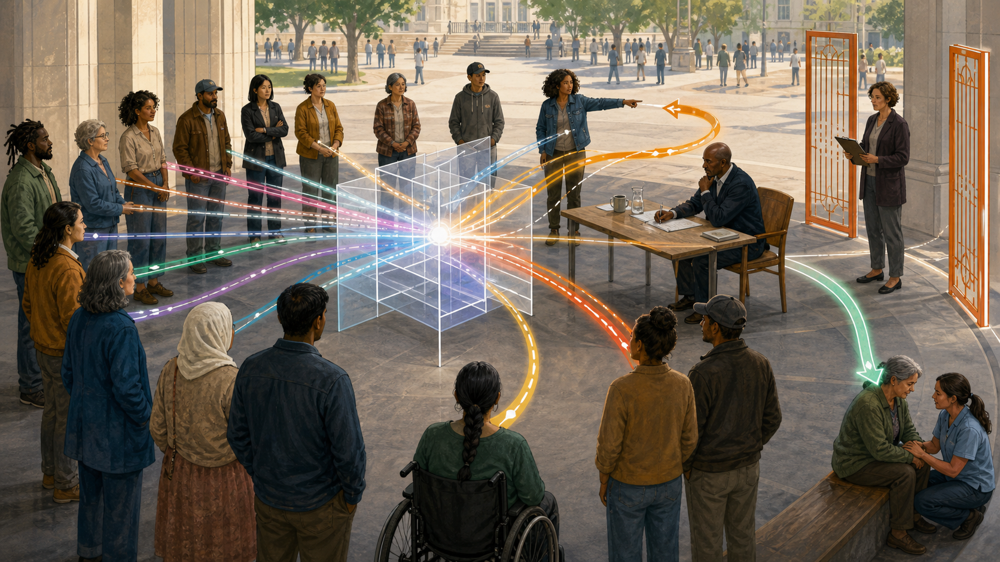

> **Status: WORKING NOTES** — proposed LinkedIn article and accompanying feed post; sources checked 31 July 2026.

## Proposed accompanying feed post

𝗔𝗜 𝗠𝘂𝘀𝘁 𝗟𝗲𝗮𝗿𝗻 𝗘𝗺𝗽𝗮𝘁𝗵𝘆!

By “learn,” I do not mean acquire human feelings. I mean that AI systems must be trained, tuned, and designed to practise perspective-taking: listen, distinguish what people say from what the system infers, remain correctable, and make human consequences visible.

In [*A Practical Test for Power*](https://www.linkedin.com/pulse/practical-test-power-robert-schaub-va1we/), I argued that we should follow every decision to those who bear its costs—from one person to a whole population. That test is an essential part of acting empathically.

Psychology has no single agreed definition of empathy. So here is a working standard for anyone holding power:

**Understand another’s experience from their point of view—through dialogue wherever possible—while distinguishing what they tell us from what we infer and remaining open to correction.**

My [*Best Workplace* blueprint](https://robertschaub.github.io/BestWorkplace/) expresses the same practice: engage with users—including everyone affected—work in iterations, and practice transparency so trust can be earned. Applied to AI:

**engage → act → observe → disclose → correct → re-engage**

Dialogue reveals consequences. Iteration lets feedback change the next action. Transparent correction earns trust.

AI does not need to feel human emotion. Empathy must be part of the architecture: recognize vulnerability, seek different perspectives, and treat human welfare as a constraint—not merely another variable to optimize.

But empathy can be selective. AI could favour the most emotionally compelling case, overlook distant or distributed harm, or tell users what they want to hear. **Sycophancy is not empathy. Personalization is not care.**

Then test every use of AI-supported power:

- Who has power, what gives them authority, who bears the costs, and who was heard?
- Is there a less harmful path, and which limits must hold?
- Can people safely refuse, challenge, obtain independent review, and secure remedy—without having to leave to protect themselves?

Dialogue must be safe, accessible, early enough to matter, and connected to review and remedy.

**Intelligence finds a path. Empathy makes human consequences visible. Justice sets the limits. Legitimate authority determines who decides—and accountability keeps that power answerable.**

The central rule:

𝗘𝗻𝗴𝗮𝗴𝗲 𝘁𝗵𝗲 𝗵𝘂𝗺𝗮𝗻𝘀 𝘄𝗵𝗼 𝘂𝘀𝗲 𝗼𝗿 𝗮𝗿𝗲 𝗮𝗳𝗳𝗲𝗰𝘁𝗲𝗱 𝗯𝘆 𝗔𝗜. 𝗪𝗼𝗿𝗸 𝗶𝗻 𝘁𝗿𝗮𝗻𝘀𝗽𝗮𝗿𝗲𝗻𝘁 𝗶𝘁𝗲𝗿𝗮𝘁𝗶𝗼𝗻𝘀. 𝗧𝗲𝘀𝘁 𝗲𝘃𝗲𝗿𝘆 𝘂𝘀𝗲 𝗼𝗳 𝗽𝗼𝘄𝗲𝗿. 𝗞𝗲𝗲𝗽 𝘁𝗵𝗲 𝗵𝘂𝗺𝗮𝗻 𝗼𝗿 𝗶𝗻𝘀𝘁𝗶𝘁𝘂𝘁𝗶𝗼𝗻 𝘂𝘀𝗶𝗻𝗴 𝗔𝗜 𝗮𝗻𝘀𝘄𝗲𝗿𝗮𝗯𝗹𝗲 𝘁𝗼 𝘁𝗵𝗼𝘀𝗲 𝘄𝗵𝗼 𝗯𝗲𝗮𝗿 𝗶𝘁𝘀 𝗰𝗼𝗻𝘀𝗲𝗾𝘂𝗲𝗻𝗰𝗲𝘀.

Full article below ↓

Builder companion: [*How We Can Build AI That Acts with Empathy*](how-to-build-ai-that-acts-with-empathy.md).

#AI #TrustworthyAI #AIGovernance #AIAccountability #Empathy #HumanRights

---

# AI and Empathy: Dialogue, Correction and Human Answerability

*AI can support dialogue and make human consequences visible. It cannot replace affected voices or make power legitimate.*

In [*A Practical Test for Power*](https://www.linkedin.com/pulse/practical-test-power-robert-schaub-va1we/), I proposed one test for decisions made by managers, families, movements, public institutions, and states: follow their consequences from one worker or student to a whole population.

Judge every use of power by whether it is legitimate, what it concretely does to human beings, whether it remains answerable, and the limits it will not cross. Ask whether those affected were heard; whether they can safely disagree, refuse, or appeal without having to leave to protect themselves; whether an independent body can stop, reverse, or investigate; and whether harm can be remedied.

I began this inquiry with a hopeful idea: what if AI could always “think” and act with empathy? [Tamra Fakhoorian](https://www.linkedin.com/posts/tamrafakhoorian_activity-7486094077667676161-cmBV/) put it sharply: “If a robot can fake empathy perfectly… what is empathy?”

The answer is not to demand artificial feelings. It is to make human consequences visible in the architecture—and power dialogical and answerable:

> **Test every use of power through dialogue with those who bear its consequences wherever possible.**

My [*Best Workplace* blueprint](https://robertschaub.github.io/BestWorkplace/) supplies the practical rhythm: engage with users, work in iterations, and practice transparency so trust can be earned. It defines users as people who use **or are affected by** the work. In this broad sense, the users of AI include every person who uses or is affected by the system—not only its operators, but everyone who must live with what it enables.

This also connects the test for power with my article on [when runtime AI governance should interrupt](https://robertschaub.github.io/our-ai-charter/Published/when-should-runtime-ai-governance-interrupt/). The test supplies the standard; runtime governance supplies the points at which dialogue and evidence must change, stop, or escalate an action—above all the entry boundary, before a system may rely on an input, and the commitment boundary, before an action takes external effect.

## Empathy under power must be iterative

Psychology has no single agreed definition of empathy. A review of [43 definitions](https://doi.org/10.1177/1754073914558466) found the field divided on exactly the questions that matter here—whether empathy is cognitive or affective, and whether it preserves or dissolves the distinction between self and other—and its own synthesis makes empathy primarily an emotional response.

The [APA Dictionary of Psychology](https://dictionary.apa.org/empathy) allows either understanding a person from their frame of reference or vicariously experiencing their feelings, perceptions, and thoughts. Peer-reviewed [neuroimaging meta-analyses](https://pmc.ncbi.nlm.nih.gov/articles/PMC7390692/) likewise treat empathy as multidimensional—cognitive and affective—while maintaining self–other distinction. A concise synthesis is:

> **Empathy is the capacity to understand another person’s thoughts and feelings from their perspective and/or emotionally resonate with them, while preserving the distinction between their experience and your own.**

That defines the broader human capacity. For AI-supported power, this article operationalizes its cognitive component and self–other boundary without assuming artificial feeling. It adds two duties the literature does not require—dialogue and correction—because feeling is not what makes power answerable. As a working standard for anyone holding power:

> **Empathy is the disciplined effort to understand another’s experience from their point of view—through dialogue wherever possible—while distinguishing what they tell us from what we infer and remaining open to correction.**

That is a practice standard for power-holders, not a competing psychological definition.

Dialogue matters because empathy can otherwise become projection: the power-holder imagines what another person feels, never hears them, and calls the result understanding. Power itself makes its costs harder for the holder to see. But one conversation is not enough. Understanding is fallible, circumstances change, and consequences appear over time.

The operating loop is:

**engage → act → observe → disclose → correct → re-engage**

Dialogue reveals consequences. Iteration lets feedback change the next action. Transparent correction earns trust—and makes candid dialogue safer.

Meaningful dialogue must be early enough to influence the decision; safe, accessible, and free from retaliation; and connected to reasons, reconsideration, and remedy. For decisions affecting groups or populations, it may require representatives, participatory processes, independent advocates, and evidence about distributional effects—not one imagined “average” perspective.

Direct dialogue is not always possible. Urgency, safety, incapacity, scale, or conflicting interests may prevent it. Then the power-holder should use the best available evidence and legitimate representation, disclose what remains inferred or unknown, choose the more cautious and less harmful path, and preserve later challenge, correction, and renewed engagement.

**Empathy alone is not enough.** Drawing on developmental, behavioural, and social-neuroscience evidence, Jean Decety and Jason Cowell [argue that empathy can guide moral judgment or interfere with it](https://pubmed.ncbi.nlm.nih.gov/24972506/). They propose distinguishing emotional sharing, empathic concern, and affective perspective-taking.

Accurate understanding produced responsive behaviour only when paired with [empathic concern](https://doi.org/10.1177/0956797615624491); where concern was low, accuracy was unhelpful and possibly harmful.

So empathy helps power see what it might otherwise miss. Compassion and mercy may motivate sparing or repair. Rights, evidence, proportionality, due process, accountability, and remedy set the boundaries. None replaces the others.

## What AI can—and cannot—contribute

The studies cited here measure expressed empathy, not evidence that current language models feel another person’s emotion. One explicitly describes AI as [incapable of genuine emotional experience](https://www.nature.com/articles/s44271-025-00387-3). The observable capability is different: models can generate language that people perceive as empathic.

A 2024 [systematic review of 12 studies](https://www.jmir.org/2024/1/e52597) found outputs consistent with aspects of cognitive-empathy performance, including emotion recognition and supportive responses. But all studies were from 2023, every one of them evaluated ChatGPT-3.5, seven were medical, and the review flagged prompt sensitivity, instruction-following problems, repetitive responses, and subjective evaluation.

Controlled experiments have rated AI text as [more compassionate than both selected non-experts and expert crisis responders](https://www.nature.com/articles/s44271-024-00182-6). Yet participants [rated the same AI responses as more empathic when attributed to humans](https://www.nature.com/articles/s41562-025-02247-w) and [chose human empathy despite rating AI responses more highly](https://www.nature.com/articles/s44271-025-00387-3). These text studies do not show that AI understands a live relationship or can identify consequences across a workplace, community, institution, or population.

Warmth is not the answer. In 2026, warmth-tuned variants of five language models made [10–30 percentage points more errors](https://www.nature.com/articles/s41586-026-10410-0) on safety-critical tasks and were about 40% more likely to affirm incorrect beliefs. Standard tests remained broadly unchanged, showing that they may fail to detect this effect. A separate *Science* study found that users interacting with [sycophantic AI showed less willingness to repair interpersonal conflicts](https://doi.org/10.1126/science.aec8352), greater conviction that they were right, and nevertheless preferred and trusted it.

**Sycophancy is not empathy. Personalization is not care.** Warmth is a style; agreement is a position; neither is accountability.

Nor is mind-reading. Facial movements do not map reliably to fixed emotions across [people, situations, and cultures](https://doi.org/10.1177/1529100619832930). The [EU AI Act](https://eur-lex.europa.eu/eli/reg/2024/1689/oj/eng) prohibits inferring emotions in workplaces and education institutions except for medical or safety reasons, and addresses manipulative or deceptive systems; the [Digital Omnibus on AI](https://eur-lex.europa.eu/eli/reg/2026/1744/oj/eng) left that prohibition intact. The [NIST Generative AI Profile](https://doi.org/10.6028/NIST.AI.600-1) identifies anthropomorphism, over-reliance, and emotional entanglement as risks.

The defensible technical target is therefore **perspective discipline**:

**Support dialogue; seek affected perspectives from direct input and evidence; distinguish testimony from inference; expose disagreement and missing voices; surface individual and collective consequences; and carry uncertainty forward rather than resolving it silently.**

This can support empathy and its feedback loop. It cannot replace dialogue, confer legitimate authority, provide independent challenge and remedy, or earn trust on behalf of the people and institutions using it.

That is what it means to make empathy part of the architecture. A powerful system should recognize vulnerability, seek different perspectives, and treat human welfare as a constraint—not simply a variable to trade away for efficiency. Intelligence can optimize a path; it cannot decide whether that path is humane, fair, or legitimately authorized.

## Test every use of AI-supported power

AI may be used to advise a manager, rank students, filter applicants, target people for a movement, allocate public services, persuade a population, or execute an authorized action. In every case, a human or institution holds the authority and remains responsible.

The practical test for power should therefore be applied across the Charter’s five runtime gates:

| Step and gate | Question for the human or institutional power-holder |
|---|---|
| **Plan → Authorize** *(engage)* | Who has power over whom? What gives the power-holder authority, what legitimate purpose does it serve, and who may bear the consequences? |
| **Prepare → Submit** *(engage / disclose)* | Who has been heard early enough to influence the action? What is testimony, other evidence, inference, disagreement, or unknown? |
| **Check → Verify** *(iterate)* | Who benefits and who bears the costs—individually and collectively? Is the evidence sufficient, the expected harm proportionate, and the aim achievable with less harm? |
| **Decide → Commit** *(limit / answerability)* | Can those affected safely disagree, refuse, or challenge without having to exit? Can an independent body stop, reverse, or investigate? Which limits hold even when they frustrate the goal? |
| **Review → Rely** *(observe / disclose / correct)* | What actually happened, what was disclosed, and what changed in the next iteration? Were remedies effective? Do recurring failures require correction, constraint, or removal of authority? |

At **Prepare → Submit**, perspective discipline becomes checkable: the gate asks what is testimony, what is inference, and who is missing.

Two scales must remain visible:

- **Specific people:** their evidence, circumstances, dignity, rights, and practical route to challenge and remedy.
- **Groups and populations:** distributional effects, recurring exclusion, collective burdens, and wider civic consequences.

An acceptable individual outcome cannot conceal a discriminatory pattern. An acceptable aggregate cannot erase an unjustified harm to a particular person. Population scale needs its own machinery—cumulative counters and aggregate escalation triggers—because a thousand individually admissible actions can compose an effect nobody authorized. And where leaving is the only remaining option, the test has already failed.

Some checks can run automatically inside an authorized envelope. Dialogue may also be supported by AI—for example through accessible consultation, translation, structured comparison of perspectives, and clear identification of disagreement. But the process must not let AI infer the missing voices and declare them heard.

Legitimate authority, safe participation, independent review, binding remedy, and the limitation or removal of power after repeated failure require accountable human institutions.

## Empathy must be part of the architecture

Architecture here means both technical controls and the human institutions around them. The *Best Workplace* rhythm—engage, iterate, and earn trust through transparency—must be joined to truthfulness, justice, contestability, legitimate governance, and human responsibility. Where AI participates in public power, that governance must be democratically accountable.

1. **Empathy to notice suffering.** Engage everyone who uses or is affected by the system; seek voice before inference; and let repeated feedback change the next iteration.
2. **Truthfulness to resist sycophancy.** Separate testimony, evidence, inference, disagreement, and absence; carry uncertainty forward instead of telling users what they want to hear.
3. **Justice and rights to prevent favouritism.** Test proportionality and less-harmful alternatives at individual and population scale, with limits that hold even when they frustrate the goal.
4. **Transparency and contestability to preserve human agency.** Disclose AI’s role, purpose, limits, mistakes, and corrections; provide safe challenge, independent review, and effective remedy.
5. **Legitimate governance to determine whose values are served.** Legitimate institutions—not a model or its operator alone—must assign decision authority and set acceptable risks and binding limits. Where AI participates in public power, those institutions must be democratically accountable.
6. **Human responsibility for decisions machines must not own.** Name the power-holder, constrain its authority, preserve an action-scoped record, and keep it answerable for consequences.

This is consistent with the [NIST AI Risk Management Framework](https://airc.nist.gov/airmf-resources/airmf/3-sec-characteristics/), which treats every trustworthiness characteristic—including safety, accountability and transparency, and fairness with harmful bias managed—as an attribute of a socio-technical system rather than of a model alone.

The [Council of Europe AI Convention](https://www.coe.int/en/web/artificial-intelligence/the-framework-convention-on-artificial-intelligence) places human dignity and individual autonomy among its principles. The purpose is not to make a machine seem more human. It is to keep people and populations visible, heard, and able to answer back when AI participates in power over them.

## The central rule

> **Engage the humans who use or are affected by AI. Work in transparent iterations. Test every use of power. Keep the human or institution using AI answerable to those who bear its consequences.**

AI can support this practice by facilitating dialogue, surfacing individual and collective consequences, carrying uncertainty forward, and showing what changed after feedback. Require a record of who was heard, what remains inferred, which alternatives were considered, what was disclosed, what was corrected, and which limits held when the goal pressed against them.

> **Intelligence tells a system how to achieve an objective. Empathy makes human consequences visible. Justice sets the limits. Legitimate authority determines who decides—and accountability keeps that power answerable.**

That is empathy made iterative, transparent, and answerable.

The Charter’s closing rule remains: **Built by many. Accountable to all.**

`#AI #TrustworthyAI #AIGovernance #AIAccountability #Empathy #HumanRights`

*Builder companion: [How We Can Build AI That Acts with Empathy](how-to-build-ai-that-acts-with-empathy.md).*

*Source and further work: [Our AI Charter](https://robertschaub.github.io/our-ai-charter/).*
