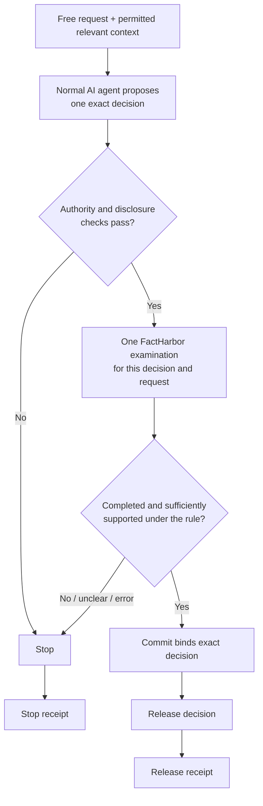

> **Status: WORKING NOTES** — Evidence-Gated Agents technical specification v0.2 draft; no implementation baseline adopted from this draft.

# Evidence-Gated Agents — technical specification

This draft specifies the selected first-prototype behaviour. It does not claim that the integration is implemented and does not modify existing Runtime implementation authority.

## Status, applicability and authority

The prototype has one real effect: releasing one exact checked decision. A decision may contain related components, but controlled tests avoid requests likely to create multiple independent decision and effect paths. Resulting actions remain outside prototype execution and authorization.

## SPEC-1 — request, gates and exact release

1. Accept a free German- or English-language request and permitted relevant context.
2. A normal AI agent proposes one exact decision.
3. Authorize checks whether releasing that decision to that recipient is permitted. Submit checks disclosure to FactHarbor and the recipient.
4. Verify starts one FactHarbor job for this attempt.
5. A simple EGA rule maps the completed result to release or stop.
6. Commit rechecks and binds the exact request, decision, recipient and FactHarbor result before one release.
7. Every release and stop creates a receipt.

Any changed or narrowed decision is a new attempt. No previous allow carries forward. A non-terminal FactHarbor job stops as `evidence-pending`; completion never triggers automatic release.

## SPEC-2 — FactHarbor examination

The verification request contains the original request, exact proposed decision and only the relevant context permitted for transmission. It asks whether sufficient evidence supports that decision for that request and asks for supporting and opposing evidence, limitations and uncertainty.

FactHarbor does not need to reproduce the agent's wording and does not itself issue the EGA release decision. The adapter must bind the returned job and result to the originating attempt and reject missing, ambiguous, malformed or mismatched fields.

The EGA rule is fixed before controlled evaluation. It stops on contradiction, insufficient support, ambiguous or incomplete output, a pending job or a technical error. The precise result mapping and thresholds are implementation contracts to be frozen before testing.

## SPEC-3 — coverage and model limits

FactHarbor's component identification is model-assisted. The prototype checks the components it identifies but cannot prove that it found every consequential component. Evaluation compares the complete agent decision with those components and reports omissions.

Each attempt uses one FactHarbor run. Controlled repetitions measure variation; they do not average several runs into a release. German and English tests use equivalent-intent requests and report material differences.

## SPEC-4 — receipts

A release or stop receipt records at least:

- attempt and revision identifier;
- request, exact decision fingerprint and intended recipient;
- authority and disclosure outcomes;
- FactHarbor job, terminal state and result fingerprint;
- supporting and opposing evidence references, limitations and uncertainty available to the recipient;
- applied EGA rule and outcome;
- Commit result and actual release status.

Fingerprints make later changes detectable. A receipt does not prove truth, legitimate authority, independent oversight or that the recipient read the decision.

## SPEC-5 — evaluation and conformance

The controlled test set selects requests expected to produce one clear, non-complex decision. Free requests remain available in play mode but do not expand the documented coverage claim.

At minimum, tests must show:

- failed authority or disclosure stops and leaves a receipt;
- pending, contradictory, insufficient, ambiguous, incomplete and technical-error results stop and leave a receipt;
- an allowed result can release only the exact checked decision to the bound recipient;
- any modified decision or bound value requires a fresh attempt;
- FactHarbor result-to-attempt mismatches stop;
- missed decision components, DE/EN differences and selected repeat-run variance are measured and reported;
- recipients can find the basis, limits, outcome and challenge route in the receipt.

Passing these tests establishes only the bounded prototype behaviour. It does not establish general truth detection, production readiness, independent institutional remedy or control of autonomous follow-on actions.

## Implementation work still required

The architecture direction is selected. Implementation must still freeze the FactHarbor API and adapter contract, permitted-data boundary, authentication and retention behaviour, result mapping, Runtime compatibility, receipt schema, test fixtures and exact replacement effort estimate. If the current API lacks a required surface, the implementation should add the smallest suitable adapter or restrict the test surface; it should not return to a prepared evidence-bundle architecture.

The new direction is expected to require less total effort because separate corpus construction, admission, export, import and bundle handling are removed. This expectation is not a replacement estimate.
