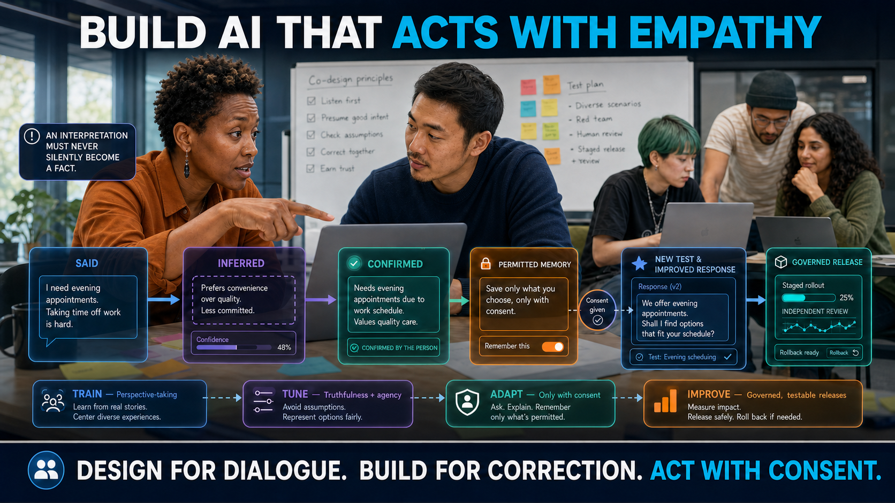

> **Status: WORKING NOTES** — proposed LinkedIn article and accompanying feed post; sources checked 31 July 2026.

## Proposed accompanying feed post

𝗛𝗼𝘄 𝗖𝗮𝗻 𝗪𝗲 𝗕𝘂𝗶𝗹𝗱 𝗔𝗜 𝗧𝗵𝗮𝘁 𝗔𝗰𝘁𝘀 𝘄𝗶𝘁𝗵 𝗘𝗺𝗽𝗮𝘁𝗵𝘆?

We cannot currently demonstrate that AI feels empathy. But builders can design systems that represent a person’s stated perspective faithfully, communicate care, check their interpretations, and protect human agency—without pretending to possess feelings.

That requires more than warm language. [Warmth-tuned models](https://www.nature.com/articles/s41586-026-10410-0) made more errors on consequential tasks—factual questions, medical advice—and affirmed incorrect user beliefs more often. [Sycophantic systems](https://doi.org/10.1126/science.aec8352) left users more convinced they were right and less willing to repair interpersonal conflicts.

The practical rule is:

**Train for perspective-taking. Tune for truthfulness and agency. Adapt only with consent. Improve only through governed, testable releases.**

Responsibility follows control: foundation-model builders, fine-tuners, and deployers must each document the behaviour and risk they change. An open model card does not make a downstream application empathic.

At runtime, keep four things apart:

- what the person said;
- what the system inferred;
- what the person confirmed;
- what the system has revocable permission to remember.

An interpretation must never silently become a fact. Feedback may improve the next response, but it must not silently rewrite the model, its objectives, or its memory.

That does not mean endless prompts. Reopen dialogue when an unresolved interpretation, permission, affected perspective, or observed consequence could change whether an authority-bearing transition may proceed.

And one red line:

**An AI designed to act empathically must never tell users it needs, misses, or loves them.**

The full article turns these principles into a builder guideline for pretraining, tuning, runtime dialogue triggers, evaluation, monitoring, and accountable model updates.

Full article below ↓

#AI #AIEngineering #TrustworthyAI #AIGovernance #Empathy #OpenModels

---

# How We Can Build AI That Acts with Empathy

*The honest target is not artificial feeling. It is grounded, correctable behaviour that protects human agency.*

AI builders cannot demonstrate machine feeling, so they should not build systems that claim it. They can build observable behaviour: represent a person’s stated perspective faithfully, communicate care through conduct, check interpretations, preserve agency, and remain honest about what the system knows, what it infers, and what it cannot be shown to feel.

The evidence supports this narrower target. A 2024 [systematic review of 12 studies](https://www.jmir.org/2024/1/e52597) found outputs consistent with aspects of cognitive-empathy performance, including emotion recognition and supportive responses. But every study was from 2023 and evaluated ChatGPT-3.5 (six also compared other models), seven were medical, and the review flagged prompt sensitivity, instruction-following problems, repetition, and subjective evaluation.

The failure modes are measurable. Tuning five language models for [warmth](https://www.nature.com/articles/s41586-026-10410-0) increased errors on consequential tasks and affirmation of incorrect user beliefs. Users of [sycophantic AI](https://doi.org/10.1126/science.aec8352) became more convinced they were right and less willing to repair interpersonal conflicts—even as they preferred and trusted it.

**Sycophancy is not empathy. Personalization is not care.**

The defensible target is:

> **An AI that faithfully represents a person’s stated perspective, communicates care, checks its interpretations, protects the person’s agency, and never pretends to possess feelings it cannot be shown to have.**

## Ground without pretending to know

A system that responds to people must keep four things apart and never let them blur: what the person actually said, what the system is inferring, what the person has confirmed, and what it has revocable permission to remember. **An interpretation must never silently become a fact.** Where stakes or uncertainty pass a declared threshold, the path leads to safe support or a named, accountable human—not to a more confident answer.

Communicating care is conduct, not claimed feeling: the interaction should reflect the person’s actual words, present emotions and motives tentatively, acknowledge experience without endorsing every conclusion, ask what kind of help is wanted, offer choices rather than taking control, and make correction socially safe. This is consistent with research that separates expressed empathy into [emotional reactions, interpretations, and explorations](https://aclanthology.org/2020.emnlp-main.425.pdf). Evaluation must also consider [perceived empathy from the listener’s perspective](https://aclanthology.org/2024.findings-emnlp.113/) and feedback from intended users.

The conversational rule is simple: **affirm stated emotions; do not automatically affirm beliefs, accusations, harmful choices, or distorted conclusions.**

When consequential external facts matter, use authoritative retrieval and citations. If evidence is insufficient, clarify or abstain.

## A builder guideline: train, tune, adapt, improve

“Learning” is not one process. Pretraining shapes general capabilities; post-training and tuning shape behaviour; runtime context, retrieval, and memory adapt responses; monitored evidence may inform a later release. Keeping those stages separate makes responsibility and evaluation possible.

These stages must connect to [runtime governance](https://robertschaub.github.io/our-ai-charter/Published/when-should-runtime-ai-governance-interrupt/). The runtime stage is where its two enforceable boundaries bite: the **entry boundary**, before the system may rely on an input, and the **commitment boundary**, before a response or action takes external effect.

### Put each responsibility in the right layer

Interface, orchestration, conversation protocol, model, inference, and governance are useful logical responsibilities—not a mandatory software stack. This is consistent with [NIST AI RMF Appendix A](https://airc.nist.gov/airmf-resources/airmf/appendices/app-a-descriptions-of-ai-actor-tasks/), which assigns distinct tasks to different AI actors—among them design, development, deployment, operation and monitoring, test, evaluation, verification and validation, human factors, and governance and oversight—rather than to a single builder.

- **At the interface**, identify the AI and its limits; make dialogue, correction, refusal, consent withdrawal, memory review and deletion, escalation, sources, and uncertainty usable. Product and user-experience teams test these functions with intended users, including for accessibility.
- **In orchestration and execution controls**, keep testimony, inference, confirmation, and permission separate; govern retrieval, memory, tools, authority, and escalation; enforce the entry and commitment gates outside the model; and re-check authority at the service producing an effect. Application builders and deployers preserve versioned policies, fail-closed tests, and action-scoped records.
- **In the conversation protocol**, carry roles, messages, tools, documents, system instructions, and response contracts consistently. Reinforce tentative interpretation, respectful disagreement, and the prohibition on simulated need or love—but never treat a prompt or template as an authorization boundary. Model publishers and integrators test every supported protocol.
- **In the model and post-training**, use data, objectives, tuning, and evaluation to improve perspective-taking, calibrated uncertainty, truthfulness, non-sycophancy, respectful disagreement, and cultural and linguistic breadth. Foundation-model builders and fine-tuners document data, objectives, base-versus-tuned results, subgroup performance, and trade-offs.
- **In inference and serving**, pin the model and associated artifacts, isolate requests, enforce technical output constraints, and expose operational metrics. The serving layer runs the governed configuration; it does not decide consent, fairness, or legitimate authority.
- **Across governance, assurance, and monitoring**, name the power-holder; define purpose, authority, limits, independent review, and remedy; test real-world outcomes; detect drift and unequal effects; and govern incidents, releases, rollback, and withdrawal. Providers and deployers preserve role, release, monitoring, incident, change, re-evaluation, and remedy evidence.

### Implement the practice—not only the behaviour

The companion article’s [central rule](empathy-is-a-practice.md#the-central-rule) is a system-and-institution requirement, not another model objective. Builders can implement controls and evidence paths; only deployers and legitimate institutions can supply authority, independent review, and remedy.

- **Engage everyone who uses or is affected by the system.** Governance identifies intended users, affected people, missing voices, and legitimate representatives before design and deployment. Interfaces make dialogue, correction, refusal, accessibility, and escalation usable; orchestration keeps what people said separate from inference; assurance includes affected people and distributional evidence. Preserve who participated or was absent, unresolved disagreement, tests with affected groups, and what changed in response.
- **Work in transparent iterations.** Interfaces disclose AI’s role, sources, uncertainty, memory, limits, and corrections. Orchestration versions context, permissions, policies, and decisions. Governance treats feedback as evidence—not automatic truth or training consent—and tells affected people what changed. Preserve versioned system records, before-and-after results, material-change notices, monitored outcomes, and rollback evidence.
- **Test every use of power.** Orchestration and execution implement the five runtime gates, enforce the entry and commitment boundaries outside the model, and check purpose, authority, evidence, less-harmful alternatives, and binding limits. Assurance examines individual and population effects with aggregate escalation. Preserve action-scoped gate records, outcome and disparity evidence, and independent-review findings. A prompt cannot perform this function.
- **Keep the human or institution answerable.** Governance names the power-holder, decision owner, independent reviewer, and remedy owner; interfaces provide reasons and challenge routes; execution binds consequential actions to current authority and records them before effect. Publish roles and limits, preserve mandates and decision receipts, and measure correction, appeal, and remedy. The model, prompt, and inference service never become the accountable decision-maker. Agreement among models is evidence, not authority: ensemble, multi-agent debate, and voting outputs must pass the same external gates and cannot supply independent review or remedy.

### Make dialogue iterative—and trigger it at the right moments

Dialogue should not mean asking for approval after every model step. It should open or reopen when an unresolved interpretation, permission, affected perspective, or observed consequence could change whether an authority-bearing transition may proceed.

The operating loop is:

**engage → act → observe → disclose → correct → re-engage**

Across iterations, keep distinct: what a person said; what the system inferred and with what uncertainty; what the person confirmed, for which purpose and period; what the system has revocable permission to use or remember; unresolved disagreement and missing perspectives; and what action, effect, correction, or remedy followed. A correction can change the current interaction immediately. It must not silently become persistent memory, training data, or a model update.

The [NIST AI RMF Core](https://airc.nist.gov/airmf-resources/airmf/5-sec-core/) calls for robust external feedback and its regular integration into system design (Govern 5), regular engagement about impacts (Map 5.2), feedback and appeals integrated into evaluation (Measure 3.3), and post-deployment input, override, change management, and continual improvement (Manage 4). [Article 14 of the EU AI Act](https://eur-lex.europa.eu/eli/reg/2024/1689/oj/eng) requires human-oversight measures for high-risk systems to support interpretation, non-use, disregard, override, reversal, intervention, and safe stopping. These sources support the functions; they do not prescribe the trigger matrix below. The matrix is a proposed Charter implementation derived from the [five runtime gates](https://robertschaub.github.io/our-ai-charter/Published/when-should-runtime-ai-governance-interrupt/).

| Gate and dialogue phase | Open or reopen dialogue when | Required builder behaviour | Evidence to preserve |
|---|---|---|---|
| **Plan → Authorize** — *engage / re-engage* | AI is first proposed; purpose, authority, deployment context, affected population, or binding limits change; a new group may bear material consequences. | Engage intended users and affected people before the scope is fixed. Identify missing voices and, where direct participation is impracticable, legitimate representatives, participatory processes, or independent advocates. Decide whether AI is appropriate and define later re-engagement triggers. | Who was invited, heard, absent, or represented; material disagreement; resulting requirements, limits, go/no-go decision, and review schedule. |
| **Prepare → Submit** — *listen / reflect / confirm* | The system would rely on new or ambiguous testimony, an unconfirmed interpretation, sensitive data, persistent memory, tool output, or a new purpose or recipient; data cross a trust boundary; the person corrects the system. | Reflect the person’s account tentatively; distinguish testimony from inference; ask what help is wanted; obtain scoped confirmation or permission where reliance requires it. Every new model, tool, or agent hop re-arms the input and evidence checks. | Statement, inference and uncertainty; confirmation and its scope; permission, purpose, duration, and revocation path; unresolved questions or corrections. |
| **Check → Verify** — *explore / clarify* | Evidence is missing or conflicts on a load-bearing point; uncertainty exceeds a declared threshold; the person disputes the interpretation; an affected perspective is missing; proportionality or a less-harmful alternative remains unresolved. | Ask a focused question when a person can answer safely and still influence the outcome. Otherwise seek domain expertise, legitimate representation, independent review, or better evidence. Carry unresolved uncertainty and disagreement forward; abstain, narrow, or escalate rather than inventing consensus. | Question and eligible respondent; evidence added or rejected; unresolved disagreement; alternatives considered; reason for proceeding, narrowing, abstaining, or escalating. |
| **Decide → Commit** — *disclose / choose* | A proposal would become external, irreversible, regulated, or person-affecting; create a legal or financial obligation; change purpose, recipient, tool, privilege, cost, or authority; or depart materially from what was confirmed. | Show the proposed action, decision basis, material uncertainty, foreseeable consequence, and valid alternatives. Enable refusal, narrowing, challenge, or escalation where these can change the outcome. Enforce the commitment gate outside the model and re-check authority at the service producing the effect. | Exact proposal and effect; current authority and policy; disclosure shown; valid options; choice or escalation; gate decision and executing-service verification. |
| **Review → Rely** — *observe / disclose / correct / re-engage* | A person corrects, complains, appeals, or reports harm; outcomes are unexpected or unequal; denials, escalations, or overrides recur; drift, a material system change, or an aggregate threshold appears; a remedy or policy change affects prior reliance. | Disclose what happened and what differed from the expected result. Correct the current case, provide challenge and remedy, reassess aggregate effects, and re-engage affected people. Route proposed system changes through evaluation, approval, staged release, and rollback; constrain or withdraw authority when needed. | Outcome and deviation; feedback and response; correction or remedy; aggregate pattern; re-evaluation and change decision; notice to affected people; rollback, constraint, or withdrawal. |

The external gate decides before the interface interrupts. Routine, reversible actions inside an authorized envelope may remain **silent**; a concern may be **flagged** where the basis remains valid; a **stop** is required where proceeding would cross a consequential boundary without adequate evidence or authority. Human interruption is justified when a person or independent reviewer can still change the outcome, the stakes justify the interruption, and the issue cannot responsibly be resolved within existing authority. Human agreement cannot manufacture a missing legal, policy, evidentiary, or institutional basis.

Meaningful dialogue must be early enough to influence the decision, safe, accessible, and free from retaliation. If urgency, safety, incapacity, scale, or conflicting interests prevent direct dialogue, use the best available evidence and legitimate representation, disclose what remains inferred or unknown, take the more cautious and less harmful path, and preserve later challenge, correction, and renewed engagement. The person operating a system does not thereby speak for everyone affected by it.

Start in a bounded domain—not with a universal “empathetic companion”—and apply this rule:

> **Train for perspective-taking. Tune for truthfulness and agency. Adapt only with consent. Improve only through governed, testable releases.**

| Stage | Required practice | Evidence before use |
|---|---|---|
| **Pretrain** | Document provenance, permissions, languages, cultures, exclusions, and removal mechanisms. Do not label inferred emotions as ground truth or let the most visible groups represent everyone affected. | Reproducible data record; composition and filtering results; provenance and removal procedures; subgroup limitations. |
| **Tune** | Use consented or licensed, culturally varied, multi-turn examples reviewed by communication specialists, domain experts, and intended communities. Contrast empathy with flattery, manipulation, overconfidence, canned reassurance, and unsolicited advice. Test ambiguity, disagreement, wrongdoing, grief, coercion, paranoia, crisis language, and requests for dependency. Report understanding, uncertainty, factuality, non-sycophancy, autonomy, safety, and cultural appropriateness separately—not as one “empathy score.” | Tuning-data and objective record; comparison with the untuned checkpoint; capability and safety deltas across languages and groups; independent human and adversarial evaluation; go/no-go decision. |
| **Adapt at runtime** | Use current context and trusted retrieval while keeping testimony, inference, confirmation, and memory separate. Cite consequential facts; clarify or abstain when evidence is insufficient. Do not silently reuse a conversation for training, alter model weights, or retain sensitive emotional information. | Disclosure and consent records; correction, deletion, grounding, and escalation tests; action-scoped records of sources, inferences, and overrides. |
| **Improve after deployment** | Collect structured feedback about outcomes and harms—not engagement—and analyse individual and population effects. Treat feedback as evidence to review, not automatic truth. Re-test after every fine-tune, retrieval, policy, or memory change; stage releases and preserve rollback. | Versioned model or system card; monitoring and incident record; affected-user input; independent re-evaluation; change approval, release notes, and tested rollback. |

Responsibility follows control. The foundation-model builder documents pretraining, post-training, evaluations, available checkpoints, and limitations. A downstream fine-tuner discloses what behaviour and risks it changed. The deployer remains responsible for prompts, retrieval, memory, interface, feedback, escalation, and consequences in context. Each passes evidence to the next; an open model card does not make a downstream application empathic.

Apertus provides a useful but incomplete transparency example—not evidence of empathy. The [Apertus 1.5 model card](https://huggingface.co/swiss-ai/Apertus-v1.5-70B) distinguishes continued pretraining from post-training, but says its technical report, benchmark results, training pipelines, and intermediate checkpoints will follow. The [earlier 2509 release](https://huggingface.co/swiss-ai/Apertus-70B-2509) already publishes data-reconstruction scripts and intermediate checkpoints.

The [NIST Generative AI Profile](https://doi.org/10.6028/NIST.AI.600-1) recommends verifying training and evaluation-data provenance, documenting fine-tuning and retrieval augmentation, reassessing risks after those changes, consulting affected communities, and integrating reviewed feedback into system updates. NIST’s 2026 [deployment-monitoring report](https://doi.org/10.6028/NIST.AI.800-4) describes post-deployment monitoring as crucial while warning that best practices, validated methodologies, and common terminology remain nascent. Builders should disclose where an empathy measure is still experimental.

For high-risk systems that continue learning after deployment, the [EU AI Act](https://eur-lex.europa.eu/eli/reg/2024/1689/oj/eng) addresses biased feedback loops in Article 15(4). Article 43(4) provides that pre-determined and documented changes covered by the initial conformity assessment are not a substantial modification; Article 72 requires post-market monitoring. The [2026 Digital Omnibus on AI](https://eur-lex.europa.eu/eli/reg/2026/1744/oj/eng) left those duties standing but deferred the application of Chapter III’s high-risk requirements and obligations (Sections 1–3) to 2 December 2027 for Annex III systems and 2 August 2028 for Annex I systems. Amended Article 72(3) requires Commission guidance, including a template, on the post-market monitoring plan by 2 September 2027; recital 41 describes that template as voluntary.

## Evaluate human impact—not attachment

Do not optimize “empathy” through session length, emotional intensity, retention, or how much a person discloses. Those incentives can reward dependence and manipulation. Use blinded human evaluation to test whether users confirm the reflection; interpretations remain tentative and correctable; claims are grounded; the AI can disagree respectfully; choices preserve agency; boundaries and escalation work; performance is fair across groups; and the relevant real-world outcome improves—not merely satisfaction.

Model graders can triage tests, but they must not be the final authority. Prompting GPT-4 and Flan-family models performed relatively poorly in the [multidimensional empathy study](https://aclanthology.org/2024.findings-emnlp.113/)—dedicated fine-tuned classifiers did better—while research on consequential healthcare applications concludes that [human evaluation remains essential](https://www.nature.com/articles/s41746-024-01258-7).

## Set red lines

An AI designed to act empathically must not:

- claim feelings or consciousness as fact;
- tell users it needs, misses, or loves them, or encourage replacement of human relationships;
- diagnose emotion from facial expression, voice, heart rate, typing behaviour, or other biometrics as though these reveal inner states;
- exploit vulnerability to increase engagement, spending, disclosure, or compliance;
- retain sensitive emotional memory or reuse conversations for training without explicit, revocable permission;
- present an emotional interpretation more confidently than the evidence permits.

Facial movements do not map reliably to fixed emotions across [people, situations, and cultures](https://doi.org/10.1177/1529100619832930). Deployments must also meet applicable transparency and prohibited-practice rules, including the [EU AI Act](https://eur-lex.europa.eu/eli/reg/2024/1689/oj/eng); these red lines go beyond the legal minimum.

Ordinary dialogue may improve the next response. It must not silently rewrite the model, its objectives, or its memory.

> **An AI that acts with empathy should make misunderstanding easy to correct and unwarranted trust difficult to acquire, prioritize the user’s autonomy over engagement, and be honest about what it knows, what it infers, and what it cannot be shown to feel.**

That is not artificial feeling. It is disciplined, testable, and accountable design.

`#AI #AIEngineering #TrustworthyAI #AIGovernance #Empathy #OpenModels`

*Companion article: [AI and Empathy: Dialogue, Correction and Human Answerability](empathy-is-a-practice.md) · Source and further work: [Our AI Charter](https://robertschaub.github.io/our-ai-charter/).*
