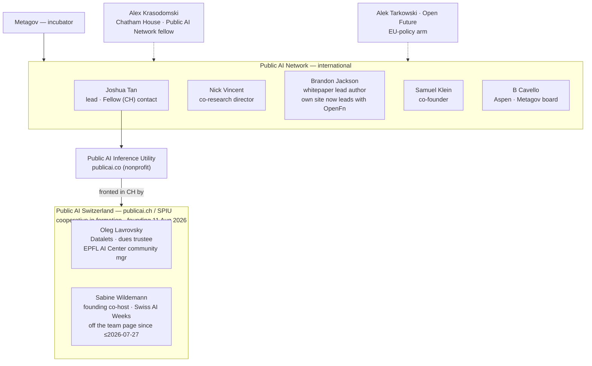
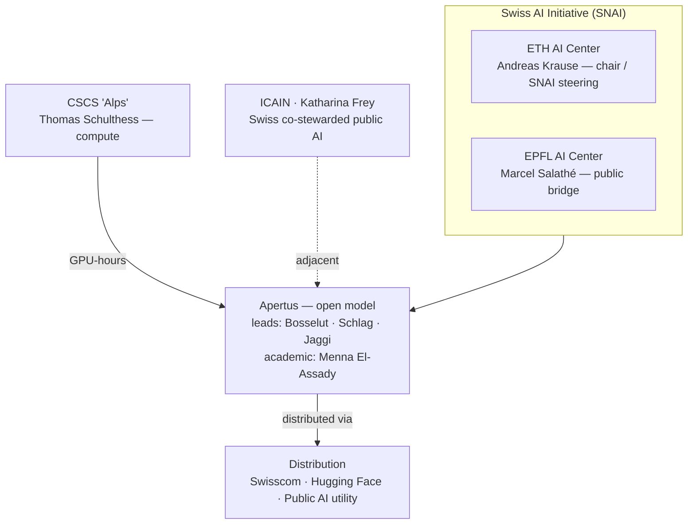
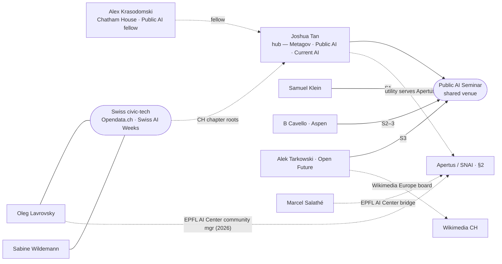
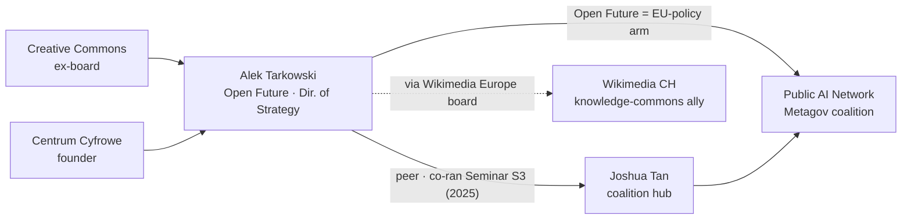
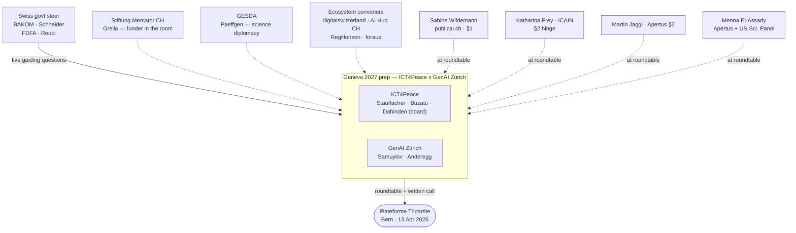

> **Status: WORKING NOTES** — session synthesis (primary sources, verified 2026-07-03); assessments labelled. The **visual + connection capstone** for the Public AI + Apertus-ecosystem mapping: it carries the stakeholder maps and connection findings, and points to where each detail already lives. Companions: [Apertus fit & engagement](apertus-fit-and-engagement-plan.md) (coalition roles, Bosselut, Ticino), [Metagov & Public AI landscape](metagov-public-ai-landscape.md) (Metagov org, assurance adjacency, Klein).

# Public AI — stakeholder & connection map (Swiss ecosystem)

*Visual map for the **Public AI coalition (international + Swiss)** and the **Apertus / Swiss-AI ecosystem** — including the [Public AI Fellow (Switzerland)](https://metagov.org/join/jobs/public-ai-fellow-switzerland) role (posting still listed 2026-07-27; no public appointee announcement) — and how the key people connect. The stable actor directory is [actors-and-landscape.md](../Evidence/actors-and-landscape.md); this note keeps the diagrams and relationship guardrails. Diagrams render on the site.*

## TL;DR

- **Joshua Tan is the coalition's connective node**, and the contact for the Fellow (Switzerland) role (`josh@publicai.co`; posting still listed 2026-07-27, no public appointee announcement) — a role **funded by Current AI, offered with Metagov**. That role is **operational** — grow Public AI Switzerland / SPIU, advance Apertus deployment, build Swiss relationships, prep the 2027 summit — so **independent assurance is a Charter differentiator, distinct from that remit**.
- **Alek Tarkowski is a peer of Tan's, not a gatekeeper.** They co-ran the Public AI Seminar's **Season 3 only**; Open Future is the coalition's **European-policy arm**. A credible bridge into Tan's orbit, but decisions route through Tan.
- **Samuel Klein** is the co-founder whose work (verification / provenance) sits **closest to the Charter's assurance building block**.
- **Swiss side:** the Public AI chapter is **publicai.ch / SPIU**, a cooperative in formation (statutory founding assembly **11 Aug 2026**; team listed 2026-07-27: Sotnikova, Wolfenstädter, Höhener, Tan, Lavrovsky, Kanduri — **Wildemann, the founding co-host, is no longer listed**); **Apertus** sits in the **Swiss AI Initiative** (ETH + EPFL AI Centers, CSCS) with leads **Bosselut / Schlag / Jaggi**, and **Lavrovsky is now also EPFL AI Center community manager** — a direct chapter↔Apertus-cluster tie.
- **Geneva 2027 prep already overlaps this map (§6):** the Apr 2026 ICT4Peace × GenAI Zürich roundtable feeding the government's tripartite platform included publicai.ch's **Wildemann** and the Apertus cluster (**Frey/ICAIN, Jaggi, El-Assady**) — the Charter's target venue and its open-model allies in one room.

## 1. Public AI — international + Swiss chapter (map)

Detail on the role's remit and framing cautions is in the [Apertus note](apertus-fit-and-engagement-plan.md) (§5). Dashed = bridges into the coalition. *State 2026-07-27:* the publicai.ch team page lists Sotnikova, Wolfenstädter, Höhener, Tan, Lavrovsky, Kanduri; Wildemann (founding co-host) no longer appears — no reason stated publicly. Jackson's own site now leads with Head of Product at OpenFn; current Public AI pages put product & strategy with Tan.

## 2. Apertus & the Swiss AI ecosystem (CH)

*Apertus is built under the Swiss AI Initiative (ETH + EPFL AI Centers) on CSCS compute, then distributed; the **Public AI utility** node is the hinge back to §1. Salathé is a bridge/interpreter, not a technical lead (§5).*

## 3. Connective ties — who bridges the clusters

*Not the structure (that is §1–2) — the ties that cross it: the shared venue, one-person org-bridges, and the hinges into the Apertus cluster.*

- **Joshua Tan — the nucleus.** Metagov co-founder; co-author of the founding paper *[An Alternative to Regulation: The Case for Public AI](https://arxiv.org/abs/2311.11350)* (Vincent, Bau, Schwettmann, Tan; Nov 2023); leads product/strategy; ran the seminar **Seasons 1–3**; operates the inference utility.
- **Alek Tarkowski / Open Future — the EU-policy arm.** Co-organised the seminar **Season 3 only** (Apr–Jun 2025) with Tan; authored Open Future's [White Paper on Public AI](https://openfuture.eu/publication/white-paper-on-public-ai/) and the [Jan 2026 *European Public AI* brief](https://openfuture.eu/publication/european-public-ai-policy-brief/). **Not** a co-author of the founding paper — a well-placed peer, not Tan's principal.
- **Samuel Klein — co-founder, verification thesis.** Public AI Network co-founder; co-author of the *Infrastructure for the Common Good* whitepaper; seminar **Season 1** co-organiser; Berkman Klein affiliate, ex–Wikimedia Foundation trustee, works on Underlay / Omnipedia. Full profile in the [landscape note](metagov-public-ai-landscape.md).
- **B Cavello / Aspen Digital** — seminar Seasons 2–3; Metagov board — the convening backbone.
- **Cross-cluster bridges** — **Tan** spans Metagov · Public AI · Current AI; the **Public AI utility serves Apertus** and **Salathé** bridges EPFL ↔ Apertus (§2); **Lavrovsky + Wildemann** tie the CH chapter into Swiss civic-tech (Opendata.ch, Swiss AI Weeks), and **Lavrovsky is now also EPFL AI Center community manager** supporting the Swiss AI Initiative ([EPFL page](https://people.epfl.ch/oleg.lavrovsky?lang=en), noted 2026-07-27) — the map's first *institutional* chapter↔Apertus-cluster tie; **Krasodomski** is a Public AI fellow; **Tarkowski** also bridges to Wikimedia.

**Reading:** same movement, different lanes — Tan the intellectual/organisational core, Tarkowski the Brussels policy flank, Klein the verification/provenance founder. They intersect through the coalition and, for Tan × Tarkowski, through one seminar season. Treat these as professional peer ties, not proven close partnerships.

### Alek Tarkowski — one bridge, close up

*A focused lens on a single bridge — Alek's ties from §1 and §3 in one person-centric view (structural, publicly-sourced links only).*

Alek is a **bridge, not a decision-maker** — his leverage is Open Future (the coalition's EU-policy arm) and his Wikimedia Europe board seat; coalition decisions route through Tan. (Wikimedia CH appears as a public knowledge-commons ally via Alek's Wikimedia Europe board seat; any specific Geneva 2027 engagement is unconfirmed — see the [actor map](../Evidence/actors-and-landscape.md).)

## 4. Apertus grounding confirmed this session

Both folded into the [Apertus note §1](apertus-fit-and-engagement-plan.md); recorded here so the people-map stays self-contained.

- **Antoine Bosselut co-leads Apertus *and* the Swiss AI Initiative** and sits on its Steering Committee (ETH + EPFL, equal voting power) — [swiss-ai.org](https://www.swiss-ai.org/team-3).
- **First government production use — canton Ticino** runs in-house document translation on a fine-tuned **Apertus-8B** (Artificialy-built; ~100 staff; in-canton data centre; no data leaves Swiss infrastructure) — [CSCS](https://www.cscs.ch/science/computer-science-hpc/2026/apertus-powers-in-house-ai-translation-for-ticino), [EPFL](https://actu.epfl.ch/news/apertus-powers-in-house-ai-translation-for-ticin-3/). *Sensitive-document translation in real government use is exactly where independent assurance would matter.*

## 5. Actor note — Marcel Salathé (bridge, not a role-holder)

*Public-source; re-verify before outreach. Salathé appears in §2 as the EPFL AI Center bridge, not a coalition member — this note is the guardrail against overclaiming him.*

- **What he is** — EPFL Associate Professor and **co-director / founder of the EPFL AI Center** ([EPFL](https://people.epfl.ch/marcel.salathe?lang=en), [AI Center](https://ai.epfl.ch/about/)); a visible public interpreter of **Apertus** (hosted the Inside AI episode with Bosselut / Jaggi / Schlag; argued ["AI sovereignty is a spectrum, not a switch"](https://engineeringprompts.substack.com/p/ai-sovereignty-is-a-spectrum-not)); close to **SNAI** / the Swiss AI Initiative; linked to democratic-legitimacy work (the EPFL [Citizens' Assembly on AI](https://ai.epfl.ch/innovation/citizens-assembly-on-ai/), the [Geneva AI Initiative](https://ai.epfl.ch/innovation/geneva-ai-initiative/), CH++, AMLD, AIcrowd, Swiss {ai} Weeks). A high-leverage EPFL / SNAI / Apertus **ecosystem bridge**.
- **What he is *not* (don't overclaim)** — not an Apertus *technical* lead (that is Schlag / Bosselut / Jaggi); not a verified **PublicAI / publicai.ch / SPIU / Metagov / Current AI** role-holder; no control over Apertus governance, SNAI decision rights, or the official Geneva 2027 process. Public posts and podcasts show interest and influence — not partnership or endorsement.
- **How to use him** — best as an **orientation / correction / framing** contact *once a concrete artifact exists*; weak as a first ask for adoption or governance ownership. Keep the Public AI / Metagov route (Tan, direct) separate. Natural ask: *"We're drafting a public governance-and-evidence layer for open public-AI deployments — Apertus as a motivating case, not a client. What is technically wrong, politically unhelpful, or duplicative from the EPFL / SNAI view?"* For technical detail, El-Assady / Schlag / Bosselut / Jaggi are better routes.
- **Name him as** — "Marcel Salathé, EPFL AI Center co-director and public Apertus/SNAI-adjacent voice." Avoid "Apertus lead," "Public AI / Metagov bridge," or "supporter / partner / endorser."

## 6. Geneva 2027 prep cluster — who is in the room

*Where the Charter's assurance layer most naturally docks (channel mechanics: [geneva-2027-channel-demand.md](../Evidence/geneva-2027-channel-demand.md); assurance angle: [geneva-2027-assurance-questions-note.md](geneva-2027-assurance-questions-note.md)). The connective finding: the Apr 2026 prep roundtable already contained this map's Public AI and Apertus nodes.*

- **The venue already overlaps this map.** The prep roundtable (1 Apr 2026) included **Sabine Wildemann** (publicai.ch, §1), **Katharina Frey / ICAIN** (§2 hinge), **Martin Jaggi** (Apertus, §2), **Menna El-Assady** (Apertus + UN Scientific Panel) and **Daniel Dobos** (Swisscom) — the Charter's target venue and its open-model allies in one room.
- **The process is government-owned.** BAKOM's **Thomas Schneider** authored the five guiding questions; **Markus Reubi** (FDFA) leads substantive prep; ICT4Peace × GenAI Zürich run the civil-society input into the *Plateforme Tripartite*.
- **A top funder is engaged.** **Stiftung Mercator CH** (via **Lukas Grella**) submitted to the prep call and co-funds the Swissnex "Geneva Loading" 2027 fellowship — consistent with the [cost-bearer read](../Strategy/funder-and-collaborator-engagement.md).
- **Door, not open call.** The April written call is **closed**; the next input window is not yet dated. Engage via ICT4Peace / GenAI Zürich or the tripartite workstreams as they form. *Roles from the report appendices — re-verify before outreach.*

## Reading

- The role's decisions route through **Tan**; the Charter's distinct contribution is **independent assurance**, where **Klein** and **Miyazono / Atlas** are the nearest allies.
- The Swiss relationships the role builds run through **Salathé** (ecosystem bridge), the **Apertus leads** (Bosselut / Schlag / Jaggi), and **ICAIN / Frey** (co-stewarded angle).
- Tan, Tarkowski (Open Future / EU policy), Klein (verification), and Cavello (Aspen) are the coalition's connective figures — peers in one movement, not a hierarchy.

## Provenance

Built 2026-07-03 from primary sources: [Public AI Seminar](https://publicai.network/seminar.html), [The Case for Public AI (arXiv 2311.11350)](https://arxiv.org/abs/2311.11350), [Open Future](https://openfuture.eu/), [Berkman Klein — SJ Klein](https://cyber.harvard.edu/people/sklein), the [Fellow posting](https://metagov.org/join/jobs/public-ai-fellow-switzerland), [swiss-ai.org team](https://www.swiss-ai.org/team-3), [CSCS](https://www.cscs.ch/science/computer-science-hpc/2026/apertus-powers-in-house-ai-translation-for-ticino) and [EPFL](https://actu.epfl.ch/news/apertus-powers-in-house-ai-translation-for-ticin-3/) on Ticino. Facts cited inline; assessments labelled. Added Swiss/coalition names (Wildemann, Krasodomski, Krause, El-Assady, Schulthess) are carried from the match-rated [actor map](../Evidence/actors-and-landscape.md). The Salathé actor note (§5) folds a former standalone profile; its public EPFL / AI Center / Apertus-commentary / citizens'-assembly sources are linked inline.

**Update 2026-07-06:** the open Fellow (Switzerland) role is **funded by Current AI** (offered with Metagov) — confirmed from the [posting](https://metagov.org/join/jobs/public-ai-fellow-switzerland).

**Update 2026-07-06 (b):** added §6 — the Geneva 2027 prep cluster — from the [ICT4Peace × GenAI Zürich report](https://ict4peace.org/wp-content/uploads/2026/04/Geneva-2027-AI-Summit-Roadmap-Ge-nAI-Zurich-Checkpoint-Report.pdf) appendices (roundtable + form respondents). New individuals were added to the [actor directory](../Evidence/actors-and-landscape.md); relationship detail is kept here.

**Update 2026-07-27:** people-state refresh from the [what-they-build deep-dive](public-ai-what-they-build.md): the cooperative's statutory founding assembly is set for **11 Aug 2026** (statutes published; no register entry yet); the publicai.ch team page changed (Wildemann no longer listed, no reason stated; new names Sotnikova, Wolfenstädter, Höhener, Kanduri); **Lavrovsky is also EPFL AI Center community manager** (new chapter↔Apertus institutional tie, reflected in §1/§3); Jackson's own site leads with OpenFn; the Fellow (Switzerland) posting was still listed with no public appointee announcement — earlier "open role" phrasings in this note now carry that date.
