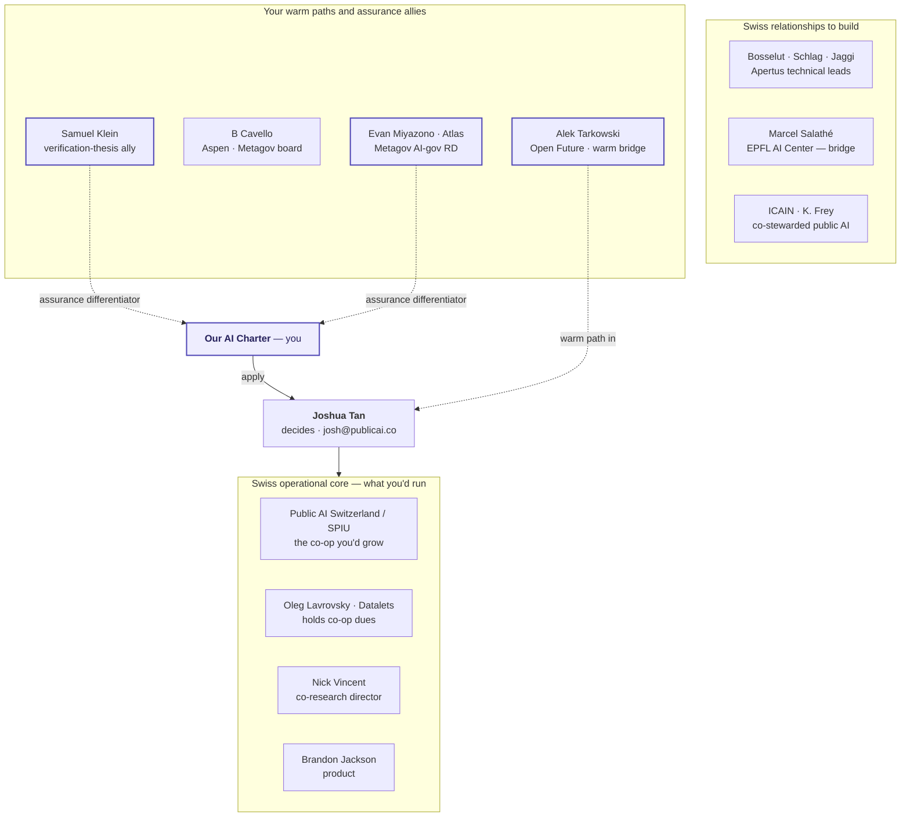
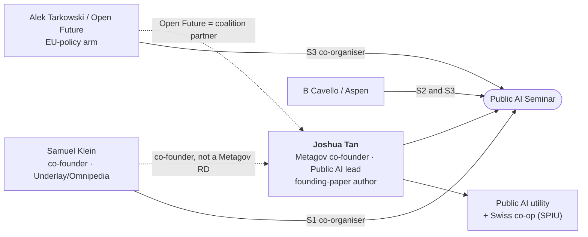

> **Status: WORKING NOTES** — session synthesis (primary sources, verified 2026-07-03); assessments labelled. The **visual + connection capstone** for the Public AI / fellowship work: it carries the maps and the people-connection findings, and points to where each detail already lives. Companions: [Apertus fit & engagement](apertus-fit-and-engagement-plan.md) (fellowship tiers, Bosselut, Ticino), [Metagov & Public AI landscape](metagov-public-ai-landscape.md) (Metagov org, assurance adjacency, Klein), [Salathé map](marcel-salathe-stakeholder-map.md).

# Public AI — people, connections & the Swiss fellowship pathway

*Who matters for the [Public AI Fellow (Switzerland)](https://publicai.network/jobs/fellow-switzerland) application, how the key people actually connect, and where the detail lives. Diagrams render on the site; polished chat versions exist for decks.*

## TL;DR

- **The gate is Joshua Tan** (`josh@publicai.co`). The role is **operational** — grow Public AI Switzerland / SPIU, advance Apertus deployment, build Swiss relationships, prep the 2027 summit — so **assurance is your differentiator, not the job description**.
- **Alek Tarkowski is a peer of Tan's, not a gatekeeper.** They co-ran the Public AI Seminar's **Season 3 only**; Open Future is the coalition's **European-policy arm**. A warm intro from him is credible framing; the decision still routes through Tan.
- **Samuel Klein** is the co-founder whose work (verification / provenance) sits **closest to the Charter's assurance building block** — the natural ally on the differentiator.

## 1. Fellowship — who matters (map)

Detailed tiers, the full remit, and the framing cautions live in the [Apertus note](apertus-fit-and-engagement-plan.md)'s *Fellow, Switzerland — who matters* subsection (§5). Violet = your assets; dashed = a warm path in.

## 2. How the key people actually connect (network)

- **Joshua Tan — the nucleus.** Metagov co-founder; co-author of the founding paper *[An Alternative to Regulation: The Case for Public AI](https://arxiv.org/abs/2311.11350)* (Vincent, Bau, Schwettmann, Tan; Nov 2023); leads product/strategy; ran the seminar **Seasons 1–3**; operates the inference utility.
- **Alek Tarkowski / Open Future — the EU-policy arm.** Co-organised the seminar **Season 3 only** (Apr–Jun 2025) with Tan; authored Open Future's [White Paper on Public AI](https://openfuture.eu/publication/white-paper-on-public-ai/) and the [Jan 2026 *European Public AI* brief](https://openfuture.eu/publication/european-public-ai-policy-brief/). **Not** a co-author of the founding paper — a well-placed peer, not Tan's principal.
- **Samuel Klein — co-founder, verification thesis.** Public AI Network co-founder; co-author of the *Infrastructure for the Common Good* whitepaper; seminar **Season 1** co-organiser; Berkman Klein affiliate, ex–Wikimedia Foundation trustee, works on Underlay / Omnipedia. Full profile in the [landscape note](metagov-public-ai-landscape.md).
- **B Cavello / Aspen Digital** — seminar Seasons 2–3; Metagov board — the convening backbone and a second entry point.

**Reading:** same movement, different lanes — Tan the intellectual/organisational core, Tarkowski the Brussels policy flank, Klein the verification/provenance founder. They intersect through the coalition and, for Tan × Tarkowski, through one seminar season. Treat these as professional peer ties, not proven close partnerships.

## 3. Apertus grounding confirmed this session

Both folded into the [Apertus note §1](apertus-fit-and-engagement-plan.md); recorded here so the people-map stays self-contained.

- **Antoine Bosselut co-leads Apertus *and* the Swiss AI Initiative** and sits on its Steering Committee (ETH + EPFL, equal voting power) — [swiss-ai.org](https://www.swiss-ai.org/team-3).
- **First government production use — canton Ticino** runs in-house document translation on a fine-tuned **Apertus-8B** (Artificialy-built; ~100 staff; in-canton data centre; no data leaves Swiss infrastructure) — [CSCS](https://www.cscs.ch/science/computer-science-hpc/2026/apertus-powers-in-house-ai-translation-for-ticino), [EPFL](https://actu.epfl.ch/news/apertus-powers-in-house-ai-translation-for-ticin-3/). *Sensitive-document translation in real government use is exactly where independent assurance would matter.*

## Bottom line / next steps

- **Route through Tan**; use a Tarkowski intro as warm framing — currently *requested, unconfirmed* (kept out of public docs; internal state only).
- **Lead operational, add assurance** as the differentiator — **Klein** and **Miyazono / Atlas** are the allies who will get it fastest.
- For the Swiss relationships the role exists to build: **Salathé** (ecosystem bridge), **Bosselut / Schlag / Jaggi** (Apertus), **ICAIN / Frey** (co-stewarded angle).

## Provenance

Built 2026-07-03 from primary sources: [Public AI Seminar](https://publicai.network/seminar.html), [The Case for Public AI (arXiv 2311.11350)](https://arxiv.org/abs/2311.11350), [Open Future](https://openfuture.eu/), [Berkman Klein — SJ Klein](https://cyber.harvard.edu/people/sklein), the [Fellow posting](https://publicai.network/jobs/fellow-switzerland), [swiss-ai.org team](https://www.swiss-ai.org/team-3), [CSCS](https://www.cscs.ch/science/computer-science-hpc/2026/apertus-powers-in-house-ai-translation-for-ticino) and [EPFL](https://actu.epfl.ch/news/apertus-powers-in-house-ai-translation-for-ticin-3/) on Ticino. Facts cited inline; assessments labelled; no private correspondence (the Tarkowski intro state is internal-only).
