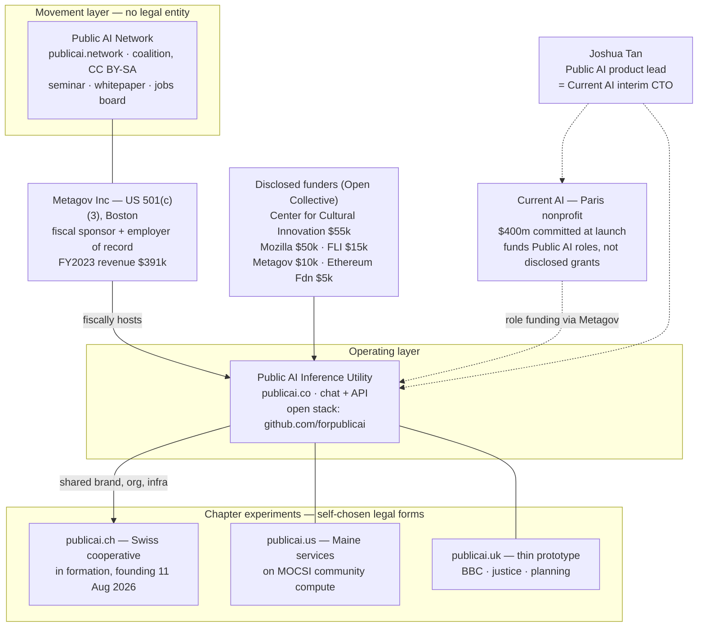
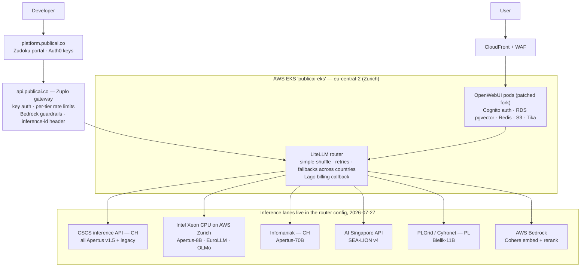
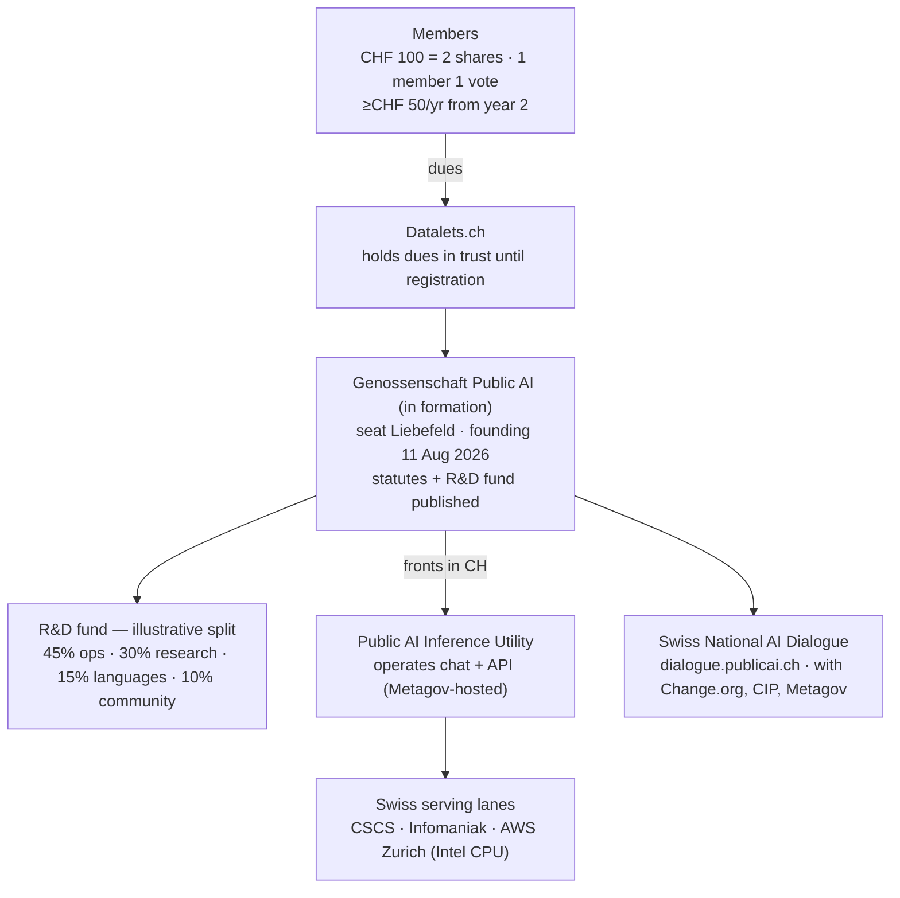
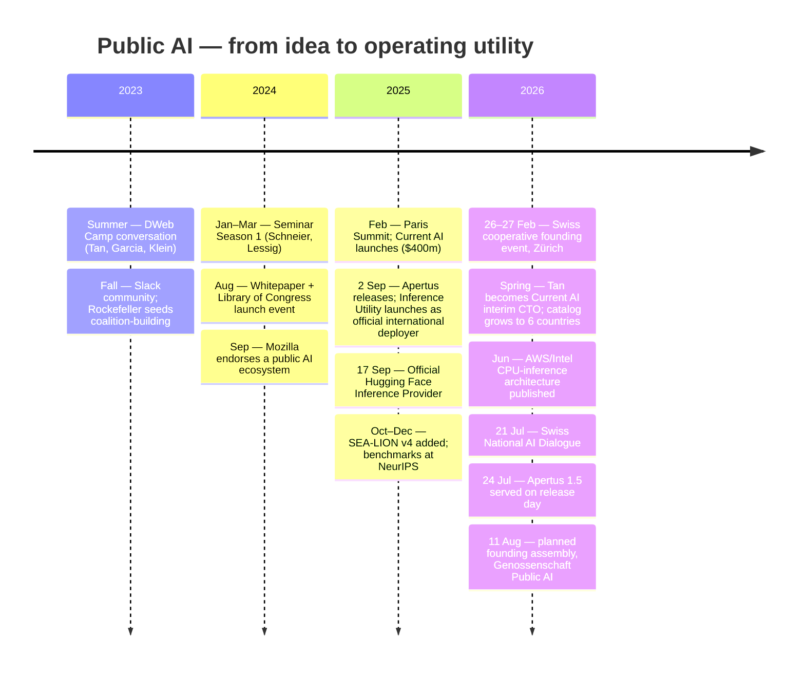

> **Status: WORKING NOTES** — deep-dive on the Public AI organisation itself (primary sources, verified 2026-07-27); facts cited inline, self-reported figures labelled, assessments labelled. Scope: what the Public AI family **actually builds and operates** — products, code, infrastructure, legal vehicles, money, traction, roadmap. Companions: [Apertus fit & engagement](apertus-fit-and-engagement-plan.md) (engagement plan, naming overlaps), [Metagov & Public AI landscape](metagov-public-ai-landscape.md) (Metagov the org, assurance adjacency), [people & pathways](public-ai-people-and-pathways.md) (people and connection maps), [actor directory](../Evidence/actors-and-landscape.md).

# Public AI — what they are really building

*The "Public AI" family (publicai.network · publicai.co · publicai.ch) presents itself as a movement to make AI public infrastructure. Underneath sits a specific, inspectable build: one small nonprofit-hosted inference service with open-source plumbing, a handful of national experiments around it, and — in Switzerland — a customer-owned cooperative that is still being incorporated. This note reconstructs each layer from primary sources: their sites, statutes, GitHub configs, funding ledger, and third-party records.*

## TL;DR

- **Three operating layers, one thin legal core.** The *network* (publicai.network) is a coalition with no legal entity; the *Inference Utility* (publicai.co) is a nonprofit open-source project fiscally sponsored by [Metagov](https://projects.propublica.org/nonprofits/organizations/853442527) (US 501(c)(3), FY2023 revenue <$400k); the *chapters* (CH/US/UK) are three unlike experiments, with only Switzerland building its own legal vehicle ([§1](#1-the-shape-of-the-thing-one-movement-three-operating-layers)).
- **The utility is real and running** — chat + OpenAI-compatible API serving open national models from six countries, official [Hugging Face Inference Provider](https://huggingface.co/blog/inference-providers-publicai), entire stack open source under [`forpublicai`](https://github.com/forpublicai) ([§3](#3-what-actually-runs-the-product-surface)–[§6](#6-the-model-catalog-as-of-2026-07-27)).
- **But it is smaller than it reads:** disclosed lifetime cash ≈ **$126k** on the [Open Collective ledger](https://opencollective.com/publicai); compute is donated or credit-funded; one lead engineer carries most commits; usage counters are self-reported ([§5](#5-compute-who-serves-vs-who-donated), [§9](#9-the-money-complete-picture), [§11](#11-claims-audit)).
- **Public AI Switzerland is legally a pre-cooperative:** published statutes name a founding date of **11 Aug 2026** (still ahead); no commercial-register entry was findable as of 2026-07-27; dues sit in trust with Datalets.ch; the site's "52,293 registered users" most plausibly counts utility-wide chat users, not Swiss members ([§7](#7-public-ai-switzerland-the-cooperative-precisely)).
- **The build has visibly shifted from advocacy to operations** — 2024 whitepaper → Sep 2025 utility launch with Apertus → 2026 deployment surface: Apertus 1.5 served on release day (24 Jul 2026), US library kiosks, a Maine deployment, a Swiss "National AI Dialogue" ([§8](#8-the-rest-of-the-build-chapters-and-programs), [§10](#10-timeline)).
- **Assurance-relevant:** their own issue tracker holds an unanswered request (Oct 2025) for *proof* that sovereign models run inside claimed jurisdictions; today's only mechanism is a self-declared response header. No status page, no SLA, no third-party attestation. The trust story is open code + self-reporting — precisely the seam an independent assurance layer would close ([§4](#4-under-the-hood-the-verified-serving-architecture), [§12](#12-my-read-what-they-are-really-building)).

## 1. The shape of the thing: one movement, three operating layers

Facts behind the diagram:

- **The network is explicitly not an organisation.** Its own contributing page describes an open coalition — no membership, no formal chapters; country sites are semi-autonomous sibling projects ([publicai.network/contributing](https://publicai.network/contributing)). Supporting orgs credited include Metagov, Aspen Digital, Open Future, Public Knowledge, Mozilla, Rockefeller Foundation, Internet Archive, Chatham House, Berkman Klein, Bertelsmann and McGovern foundations ([publicai.network](https://publicai.network/)).
- **The utility's legal skin is Metagov.** publicai.co/about states it is a nonprofit open-source project fiscally sponsored by Metagov and funded by Mozilla, the Future of Life Institute, and the Center for Cultural Innovation ([publicai.co/about](https://publicai.co/about)); the [Open Collective ledger](https://opencollective.com/publicai) (fiscal host: Metagov) confirms the amounts. Metagov Inc: EIN 85-3442527, tax-exempt since 2022, FY2023 revenue $391,471 ([ProPublica Nonprofit Explorer](https://projects.propublica.org/nonprofits/organizations/853442527)).
- **Current AI money enters as role funding, not disclosed grants.** The public jobs board attributes a Founding Infrastructure Engineer ($50k/3 months), a Research Engineer ($20k/3 months) and fellowship stipends to Current AI funding ([publicai.network/jobs](https://publicai.network/jobs)); Joshua Tan is simultaneously Public AI's product lead and Current AI's interim CTO ([joshuatan.com/research](https://www.joshuatan.com/research/)). No grant agreement or amount between the two organisations is public, and TechCrunch's July 2026 profile of Current AI does not mention Public AI at all ([TechCrunch, 2026-07-19](https://techcrunch.com/2026/07/19/nonprofit-current-ai-is-racing-to-build-the-world-wide-web-of-ai-free-for-all/)).
- Disambiguation: `publicai.io` (Web3 token) and the LinkedIn companies "PublicAI" (Seoul IT firm) and "Public AI" (ad-tech) are **unrelated**; the family is publicai.network / publicai.co / publicai.ch / publicai.us / publicai.uk. The network has **no findable LinkedIn company page** — its channels are the [Substack](https://publicai.substack.com/), GitHub, and email.

## 2. The blueprint, and how much of it exists

The founding whitepaper — *[Public AI: Infrastructure for the Common Good](https://zenodo.org/records/13914560)* (Aug 2024, rev. Oct 2024; eight authors across Metagov, Aspen, Public Knowledge, Berkman Klein, Chatham House) — defines public AI by three "essential features" (public access · public accountability · permanent public goods) and lays out a build taxonomy. Mapping blueprint → built reality, two years on:

| Whitepaper category | What it calls for | What exists (2026-07-27) |
|---|---|---|
| **Vertical platforms** — end-to-end public *utilities* (Post/BBC analogies; the stack diagram marked this slot "None, Yet") | Vertically integrated consumer AI service | The **Inference Utility** (chat + API) — the slot the coalition filled itself, launched 2 Sep 2025 with Apertus ([launch post](https://publicai.substack.com/p/we-launched-the-inference-utility)) |
| **Horizontal platforms** — public options per stack layer (compute, data, models, standards) | Public compute programs, data trusts, public models | Mostly *pointed at*, not built: the utility rides national compute (CSCS, PLGrid…) and others' models; own horizontal work = **data flywheel** datasets ([flywheel_v1](https://huggingface.co/publicai)) and **Community-Aligned Benchmarks** with Aspen ([project page](https://www.aspendigital.org/project/ai-benchmarks/)) |
| **New public goods** — moonshots (public tutor, "Doctor AI", scientific AI) | Market-underserved applications | Early: **Public AI Libraries** kiosks in US public libraries ([publicai.network/libraries](https://publicai.network/libraries)); Maine "community agents" beta ([publicai.us](https://publicai.us/)) |
| **Funding models** — state capital, philanthropy with anti-capture terms, at-cost usage fees, cooperative structures | Sustainable public financing | Experiments only: donated compute + ~$126k disclosed cash + wallet-credit billing + CHF-100 cooperative shares + $1,000/yr kiosk fees ([§9](#9-the-money-complete-picture)) |
| **Governance models** — regulators, data cooperatives/trusts, citizens' assemblies, contestation rights | Public control mechanisms | Thinnest layer: one cooperative in formation (CH), a "National AI Dialogue" survey ([dialogue.publicai.ch](https://dialogue.publicai.ch/)), no oversight body, no published accountability mechanism for the utility itself |

The intellectual lineage is real and consistent — the 2023 position paper *[An Alternative to Regulation: The Case for Public AI](https://arxiv.org/abs/2311.11350)* (Vincent, Bau, Schwettmann, Tan) argued that public institutions should *build* AI rather than only regulate it; the whitepaper turned that into an infrastructure taxonomy; the utility is the taxonomy's "None, Yet" slot filled by its own authors. **My read:** execution has concentrated on the *access* feature; the *accountability* and *permanence* features remain, by their own evidence, declared rather than built — the same gap the [Metagov landscape note](metagov-public-ai-landscape.md) §3 reaches from the ecosystem side.

## 3. What actually runs: the product surface

All verified 2026-07-27 unless noted.

- **Chat** — [chat.publicai.co](https://chat.publicai.co/): OpenWebUI-based (a [patched fork](https://github.com/forpublicai/open-webui)), AWS Cognito sign-in, document upload (Apache Tika extraction), national system prompts and community toggles (Schwiizerdütsch, Singlish); web search exists in the config but is **disabled** in production values ([chat repo](https://github.com/forpublicai/chat.publicai.co)). A **no-login guest chat** runs at publicai.co/chat serving Apertus v1.5-8B.
- **API** — `api.publicai.co`: OpenAI-compatible (`/v1/chat/completions`, `/v1/models`), self-service keys via the [developer portal](https://platform.publicai.co/) (Auth0). Four rate tiers: Free 100 req/min · Plus 200 (via Open Collective contribution) · Pro 300 · Enterprise 10,000 (by email). Token usage draws down **wallet credits** (Lago billing + top-up); new accounts get starter credits ([platform repo docs](https://github.com/forpublicai/platform.publicai.co)). This is a shift from the launch posture (free, 20 req/min — [HF blog, Sep 2025](https://huggingface.co/blog/inference-providers-publicai)): metering and monetisation are now real.
- **Hugging Face route** — official **Inference Provider since 17 Sep 2025**; the verified [HF org](https://huggingface.co/publicai) shows **56,244 monthly requests** (HF-computed), 4 members, and two datasets (opt-in usage-donation "flywheel" data); model weights live with the makers (e.g. [swiss-ai](https://huggingface.co/swiss-ai)), not with Public AI.
- **MCP server** — a [FastMCP repo](https://github.com/forpublicai/publicai-mcp-server) exposing community "wiki tools" (Swiss transit, Singapore carparks, OSM); designed for local use, **dormant since 2025-12-30**, and its backing wiki (wiki.publicai.co) refused connections on 2026-07-27.
- **What does not exist:** a status page (status.publicai.co does not resolve), an SLA (terms disclaim availability), published uptime or incident history, a mobile app (a Flutter-client fork exists as exploration only).

## 4. Under the hood: the verified serving architecture

Reconstructed from the utility's own deployment configs (Helm values, Zuplo policies, LiteLLM model files — all public in [`forpublicai`](https://github.com/forpublicai)) and the joint [AWS APN engineering write-up](https://aws.amazon.com/blogs/apn/how-public-ai-delivers-sovereign-llm-inference-on-aws-and-intel/) (15 Jun 2026):

What the configs show, beyond the diagram:

- **Routing is federated and weighted.** The same model name is declared across several providers with weights (CSCS preferred for Apertus); failures cool a lane down for 60s and retry elsewhere; **fallbacks cross borders** (e.g. Apertus-70B → Qwen-SEA-LION-32B) — a resilience feature that sits in tension with jurisdiction promises ([model YAMLs in the chat repo](https://github.com/forpublicai/chat.publicai.co)).
- **The GPU story became a CPU story.** The Sep–Nov 2025 launch ran sharded Apertus-70B on ~$124,000 of AWS credits (3× 8-GPU p4d pods, self-reported ~70–80% utilisation); when credits ended, serving shifted to **Intel Xeon (EC2 R8i) CPU inference** in the same Zurich region, "tuned for the 8B class that most sovereign initiatives produce" ([publicai.co/stories/amazon-intel](https://publicai.co/stories/amazon-intel), [AWS APN blog](https://aws.amazon.com/blogs/apn/how-public-ai-delivers-sovereign-llm-inference-on-aws-and-intel/)). In-cluster vLLM GPU charts are still maintained in the repo; whether any self-operated GPU pods still run is not determinable from public sources.
- **Guardrails and attribution.** The gateway applies AWS Bedrock guardrails (PII/abuse/prompt-injection, self-reported ~5–8% latency cost) and adds a response header disclosing which lane served the request — the basis of the "served from Zurich" attribution in chat.
- **Assurance-relevant observations (facts, then my read).** An open, unanswered issue on their own tracker — [chat.publicai.co#35](https://github.com/forpublicai/chat.publicai.co/issues/35), opened 23 Oct 2025 — asks for "proofs that the sovereign public models are running inference within chosen jurisdictional bounds". Today's only mechanism is that self-declared header. Two lanes are configured with `ssl_verify: false`; there is no status page, no SLA, and no third-party attestation of any operational claim. *My read:* the utility's trust story is open code plus self-reporting — strong transparency of *design*, no independent evidence of *operation*. That seam is exactly the [assurance layer](../About.md) this initiative proposes, and their tracker documents user demand for it.

## 5. Compute: who serves vs who donated

The partner banner and the live router differ, and the difference matters for any claim about the utility's resilience:

| Lane | Country | Status 2026-07-27 | Evidence |
|---|---|---|---|
| CSCS inference API | CH | **Live** (preferred Apertus lane; a July issue notes lane instability) | router config |
| Intel Xeon on AWS (R8i, Zurich) | CH region | **Live** (Apertus-8B, EuroLLM, OLMo) | router config, AWS blog |
| Infomaniak | CH | **Live** (Apertus-70B, low weight) | router config |
| AI Singapore API | SG | **Live** (SEA-LION v4) | router config |
| PLGrid / ACK Cyfronet | PL | **Live** (Bielik) | router config |
| AWS Bedrock | EU (Frankfurt) | **Live** (Cohere embed/rerank for RAG) | router config |
| Jülich JSC, NCI Australia, Cudo, Exoscale | DE/AU/—/AT | **Credited as launch donors; no live endpoint in today's config** | partner banner vs config |

- Launch-period scale (self-reported): >115,000 GPU-hours across 20 clusters in 5+ countries for September 2025 ([publicai.co/stories/apertus](https://publicai.co/stories/apertus)); Exoscale's donated capacity was located **in Austria**, and Jülich carried a significant share of launch volume ([amazon-intel story](https://publicai.co/stories/amazon-intel)).
- An **inference-partner program** now formalises donations: partners contribute compute, receive attribution, onboard via a runbook ([platform repo FAQ](https://github.com/forpublicai/platform.publicai.co)).
- **My read:** "has donated" ≠ "is serving." The live federation today is CH-heavy (three of six lanes) plus Singapore and Poland; the launch's five-country GPU pool was a moment, not a steady state — and the pivot to CPU inference is the honest economic signature of donation-shaped compute.

## 6. The model catalog (as of 2026-07-27)

From the router config and the developer portal's catalog data ([platform repo](https://github.com/forpublicai/platform.publicai.co)); prices are the utility's own, per 1M tokens in/out:

| Model | Origin | Context | Price | Note |
|---|---|---|---|---|
| Apertus v1.5 8B / 70B (± thinking) | CH — Swiss AI Initiative | 262k | $0.10/$0.20 · $0.82/$2.92 | Multimodal; served since release day 24 Jul 2026 |
| Apertus 8B / 70B Instruct (2509) | CH | 65k | as above | Sep-2025 generation, still served |
| Gemma-SEA-LION-v4-27B / Qwen-SEA-LION-v4-32B | SG — AI Singapore | 128k | $0.20/$0.40 · $0.25/$0.50 | Via AI Singapore's own API |
| OLMo-3-7B-Instruct | US — Ai2 | 65k | $0.10/$0.20 | Fully open incl. data |
| Bielik-11B-v3.0-Instruct | PL — SpeakLeash/Cyfronet | 32k | $0.40/$0.40 | Polish national model |
| EuroLLM-22B-Instruct | EU — UTTER project | 32k | $0.10/$0.20 | EU-funded multilingual |
| Cohere embed-multilingual + rerank | — | — | $0.10 embed | RAG plumbing via Bedrock, not chat |

- **Day-one national-model serving is their operational signature:** Apertus 1.5 (multimodal, 262,144-token context, optional reasoning) went live on the utility on its 24 Jul 2026 release day; the same story says "Apertus 2" is expected in months and notes the model's value charter is now the **"Apertus Charter (formerly known as the Swiss AI Charter)"** ([publicai.co/stories/apertus-1-5](https://publicai.co/stories/apertus-1-5)) — a rename other notes in this repo should pick up.
- **Catalog drift is visible:** Spain's ALIA/Salamandra were served earlier on the Intel CPU layer and still appear in front-page copy, but are absent from the current router config — either parked or quietly dropped. Historical lanes (Llama-3.2 via Bedrock, Mistral) have been removed. [Self-reported copy vs config; discrepancy noted.]

## 7. Public AI Switzerland: the cooperative, precisely

The Swiss chapter is the family's most institutionalised experiment — and, as of today, a **pre-cooperative**:

- **Legal status.** The site self-describes as "the world's first cooperative for AI", to be a Genossenschaft under Art. 828 ff. OR; the published [statutes](https://publicai.ch/statuten.html) name **"Genossenschaft Public AI", seat Liebefeld** (Köniz BE), and state the statutes were fixed at the founding on **11 Aug 2026 — a date still ahead** at verification time. The [impressum](https://publicai.ch/impressum.html) carries no UID and says formal establishment is under way; terms and privacy pages are marked drafts pending registration. A query against the federal LINDAS mirror of the Zefix commercial register on 2026-07-27 returned **no entity containing "public ai"** — consistent with the site's own "still being set up". Founding dues are held in trust by [Datalets.ch](https://datalets.ch/) (Oleg Lavrovsky's Bern open-data practice; publicai.ch calls it a Swiss nonprofit association, a characterisation Datalets' own site does not make).
- **Membership economics.** CHF 100 = two CHF-50 shares; **from year two, ≥CHF 50/yr** into an R&D fund; one member, one vote; board admits members without stating reasons; exit on 3-month notice without share reimbursement; on dissolution, surplus goes to a similar Swiss tax-exempt institution ([join](https://publicai.ch/join.html), [statutes](https://publicai.ch/statuten.html)). The [fund page](https://publicai.ch/fonds.html) sketches an illustrative split: 45% platform/operations, 30% research & models, 15% national languages & data, 10% community & education — the general assembly decides the real allocation yearly. Member perks are planned; **chat and API access are identical for non-members** ([join page](https://publicai.ch/join.html)). The pitch contrasts CHF 100 ownership with "CHF 240 a year for ChatGPT".
- **What it operationally is:** a Swiss front for the utility. The service (chat + API) is operated by the Metagov-hosted utility; the cooperative adds Swiss framing, membership, and a governance promise. ETH's Apertus release positioned the utility as access **for people outside Switzerland** (Swisscom being the Swiss business channel) ([ETH press release](https://ethz.ch/en/news-and-events/eth-news/news/2025/09/press-release-apertus-a-fully-open-transparent-multilingual-language-model.html)); publicai.ch markets the same utility **inside** Switzerland to consumers and SMEs — a niche no institutional partner has explicitly endorsed on their own pages.
- **Activity record since founding event** (26–27 Feb 2026, Zürich; board voted per the [meeting page](https://publicai.ch/meeting/27.2.2026/), minutes never published; the public [Luma page](https://luma.com/3fwdxk84) shows 10 RSVPs for day two): founding-membership reservations opened 20 May; **venture.ch Spotlight Award finalist** (theme: Apertus applications; [venture.ch/spotlight](https://www.venture.ch/spotlight)) in June; notary engagement announced 17 Jul; **Swiss National AI Dialogue** launched 21 Jul ([dialogue.publicai.ch](https://dialogue.publicai.ch/) — anonymous public input on Swiss AI, partners incl. Change.org, Collective Intelligence Project, Metagov; explicitly not a government project; 788 participants self-reported); Mesh Festival Basel appearance announced for 16 Oct 2026 ([news](https://publicai.ch/news.html)).
- **Claims vs verifiable.** The homepage counters — **52,293 registered users, 2,166 API developers, 9.58B tokens** — are self-reported and most plausibly utility-wide, not Swiss-member counts (the founding event's public RSVP list held 10 names; no membership number has ever been published). Older copy ("#1 global deployer of Apertus", "35,000+ users", "trillions of tokens") survives in the repo README and search snippets, internally inconsistent with the live counters. The claimed Swiss {ai} Weeks partnership is not mirrored on [ai-weeks.ch](https://ai-weeks.ch/) (checked 2026-07-27), though the utility did supply free Apertus API keys to 2025 hackathon participants. **No dedicated Swiss press coverage of the cooperative was found** — the closest is Sanders & Schneier's newsletter piece calling SPIU founded ([democracyrenovator.com, 21 Feb 2026](https://www.democracyrenovator.com/p/rewiring-democracy-now-switzerland)), five months before the register entry exists.
- **Team (as listed 2026-07-27):** Anna Sotnikova, Cornelia Wolfenstädter, Daria Höhener, Joshua Tan, Oleg Lavrovsky, Prashanth Kanduri ([about](https://publicai.ch/about.html)); the earlier co-founder listing of Sabine Wildemann no longer appears there (she hosted the founding event and leads aiLights/Swiss {ai} Weeks); a Swiss Hugging Face org ([huggingface.co/spiu](https://huggingface.co/spiu)) exists alongside the utility's.

## 8. The rest of the build: chapters and programs

- **publicai.us — Maine.** Pivoted from a generic chapter to a regional deployment: free/subsidised chat, a small-business permitting assistant, library kiosks, a planned Maine AI Dialogue, beta "community agents" that watch town halls and grants — on **MOCSI** (Maine Open Compute Services Initiative), community-governed compute seeking co-investors ([publicai.us](https://publicai.us/)).
- **publicai.uk.** A minimal site claiming a working prototype for BBC, justice, and planning use cases; no team or legal information published ([publicai.uk](https://publicai.uk/)).
- **Public AI Libraries Project.** AI "kiosks" in US public libraries at $1,000/yr per kiosk; pilots named in New Jersey, Utah, Texas, Massachusetts, with Georgia added and federal grant pathways explored; three-phase vision ending in community-governed local models ([publicai.network/libraries](https://publicai.network/libraries), [Q4 roundup](https://publicai.substack.com/p/public-ai-network-q4-2025-roundup)); kiosk software v2 in active development ([librarieskiosk repo](https://github.com/forpublicai)).
- **Community-Aligned Benchmarks** (with Aspen Digital, Siegel-funded): reframing benchmarks around public goals, first domain food security; "Feeding the Future" report (Jan 2026); NeurIPS and MozFest appearances ([Aspen project page](https://www.aspendigital.org/project/ai-benchmarks/)).
- **AI Evaluator Forum + Weval:** convening independent-evaluation actors (METR, RAND, SecureBio, Transluce, HAL) and maintaining open evaluation infrastructure ([Q4 roundup](https://publicai.substack.com/p/public-ai-network-q4-2025-roundup)). *Adjacency for the Charter's evaluation protocol — see the [Metagov landscape note](metagov-public-ai-landscape.md) §2.*
- **Data commons / flywheels:** opt-in usage-data donation (flywheel datasets on HF), an agriculture data-commons pilot, and Vincent's "Data Flywheels for Public AI" design work ([Q4 roundup](https://publicai.substack.com/p/public-ai-network-q4-2025-roundup)).
- **Seminar Season 4** (summer 2026, in planning): "the business of public AI" — funding models including cooperatives, infrastructure case studies ([seminar page](https://publicai.network/seminar)). Seasons 1–3 brought Schneier, Bengio, Lessig, Kim Stanley Robinson into the orbit.
- **Culture track:** Protopian AI Fiction Prize (submissions to 31 Jul 2026) and a Creative Fellowship (3 × $5,000, CCI-funded) ([Metagov June update](https://metagov.substack.com/p/metagov-community-update-june-2026)).
- **Policy proposal:** "An Airbus for AI" — a consortium-model public frontier lab built from existing national institutions (Tan, Jackson, Berjon, Coyle; [essay](https://publicai.substack.com/p/an-airbus-for-ai), Project Syndicate [op-ed](https://www.project-syndicate.org/commentary/public-ai-can-be-the-basis-of-new-international-cooperation-by-jacob-taylor-3-and-joshua-tan-1-2025-10)). A proposal, not a build.
- **Side experiment:** `safemolt`, a social network for AI agents — early exploration, not a product ([repo](https://github.com/forpublicai/safemolt)).

## 9. The money, complete picture

| Source | Amount / structure | Evidence |
|---|---|---|
| Center for Cultural Innovation | $55,000 | [Open Collective](https://opencollective.com/publicai) (verified ledger) |
| Mozilla Foundation | $50,000 | ledger + [publicai.co/about](https://publicai.co/about) |
| Future of Life Institute | $15,000 | ledger |
| Metagov | $10,000 | ledger |
| Ethereum Foundation | $5,000 | ledger |
| **Lifetime disclosed cash** | **$126,300 raised · $112,833 spent · $13,468 balance · est. $59k/yr budget** | ledger, 2026-07-27 |
| Current AI | Role funding via Metagov: $50k + $20k engineering contracts, €5k/CHF 5k fellowships; no disclosed org-to-org grant | [jobs board](https://publicai.network/jobs) |
| Rockefeller Foundation | Early coalition-building (late 2023), amount not public | [Aspen, "Two Years of Public AI"](https://www.aspendigital.org/blog/two-years-of-public-ai/) |
| Compute | Donated/credited: ~$124k AWS credits (Sep–Nov 2025), CSCS/Jülich/NCI/Exoscale/Cudo/AI-Singapore/Intel donations | [amazon-intel story](https://publicai.co/stories/amazon-intel) (self-reported) |
| Revenue experiments | API wallet credits + "Plus" tier; cooperative CHF 100 + CHF 50/yr; kiosk $1,000/yr | platform docs, publicai.ch, libraries page |

**My read:** the disclosed cash is strikingly small against the infrastructure ambition — roughly one mid-level engineer-year of money spent over the project's life, with sustainability resting on in-kind compute, credits, a young metering system, and partner institutions' goodwill. The Current AI relationship (personal union through Tan + role funding) is the single most consequential and least documented financial fact; it is also a key-person dependency. The utility's own about page jokes it is "three toddlers in a trench coat" — the public ledger largely corroborates the self-deprecation.

## 10. Timeline

## 11. Claims audit

| Claim (as published) | Status | Basis |
|---|---|---|
| Official Hugging Face Inference Provider | **Verified** | [HF org page + blog](https://huggingface.co/publicai) |
| Entire serving stack open source | **Verified** | [forpublicai org](https://github.com/forpublicai), 23 repos |
| Fiscally sponsored 501(c)(3) project; named funders | **Verified** | [Open Collective](https://opencollective.com/publicai), [ProPublica](https://projects.propublica.org/nonprofits/organizations/853442527) |
| "Official international deployer for Apertus" | **Partner-corroborated once** — ETH's release names the utility as an access route (for people outside CH); the "official deployer" title itself is self-conferred | [ETH release](https://ethz.ch/en/news-and-events/eth-news/news/2025/09/press-release-apertus-a-fully-open-transparent-multilingual-language-model.html) vs [publicai.co](https://publicai.co/) |
| 52,293 users · 2,166 devs · 9.58B tokens | **Self-reported**, no third-party confirmation; scope (Swiss vs global) unstated | [publicai.ch](https://publicai.ch/) counters |
| >115k GPU-hours / 20 clusters / 5+ countries (Sep 2025) | **Self-reported** | [stories/apertus](https://publicai.co/stories/apertus) |
| "World's first cooperative for AI" | **Unverifiable superlative**; the cooperative itself not yet registered | [statutes](https://publicai.ch/statuten.html), LINDAS/Zefix query 2026-07-27 |
| ETH AI Center / EPFL AI Center / Swiss {ai} Weeks partnerships | **Asymmetric** — claimed on publicai.ch; not mirrored on the partners' own pages checked | [ai-weeks.ch](https://ai-weeks.ch/) et al. |
| "Services and data are hosted in Switzerland" (privacy draft) | **In tension** with the utility's multi-country lanes and cross-border fallbacks; no primary source resolves it | [privacy](https://publicai.ch/privacy.html) vs router config |
| 56,244 monthly requests via HF | **Third-party-computed** (HF) | [HF org page](https://huggingface.co/publicai) |

## 12. My read: what they are *really* building

Labelled assessment, grounded in §1–§11:

1. **A movement with one working proof-point.** The durable asset is not the coalition (which is deliberately structureless) but the utility: a genuinely running, genuinely open, multi-country inference service that gives national open models a day-one public front door. That is a real, novel institution-in-miniature — and it is the *only* part of the whitepaper's taxonomy the coalition itself has built.
2. **An operating model of borrowed everything.** Borrowed legal skin (Metagov), borrowed compute (donations, credits, national HPC), borrowed models (Apertus, SEA-LION, OLMo…), tiny cash. This makes the achievement more impressive and the permanence claim weaker: the whitepaper's third feature — *permanent* public goods — is the one the current structure least supports.
3. **Switzerland is the institutionalisation test.** The cooperative is the first attempt to give the movement a self-sustaining legal and revenue form. Until the 11 Aug 2026 founding and a register entry, it remains a membership campaign wrapped around the utility — worth re-checking within weeks, because a registered Genossenschaft with real members would change its weight in the Swiss landscape.
4. **Accountability is the declared-but-unbuilt layer — by their own evidence.** The unanswered jurisdiction-proof issue, the self-declared serving attribution, the absent status page, the self-reported counters, the asymmetric partner claims: none of this is scandalous for a project this size, but it means the "publicly accountable" pillar currently rests on openness alone. For this repo's purposes that is the documented, primary-source version of the gap the Charter's [assurance & certification building block](../About.md) addresses — an ally's gap, not a competitor's ([positioning](metagov-public-ai-landscape.md) §4, [engagement plan](apertus-fit-and-engagement-plan.md) §5).

## 13. Open questions & watch items

- **11 Aug 2026:** does the founding assembly happen, and does a Zefix entry for "Genossenschaft Public AI" (Liebefeld/Köniz) follow? (Check Zefix/SHAB from mid-August.)
- **Membership reality:** first published member count or board names for the cooperative (promised post-founding, still absent).
- **Current AI ↔ Public AI:** any formal grant/agreement disclosure; duration of Tan's interim-CTO dual role; whether Current AI's "Build" pillar absorbs or scales the utility.
- **"Swiss AI Summit, February 2027":** the jobs board still tasks a Switzerland fellow with preparing participation in it; no public event by that name/date exists yet (the intergovernmental Geneva summit is 21–22 Jun 2027; swissaisummit.com is an unrelated commercial event, next edition Nov 2026). Unresolved — same open question as the [Apertus note](apertus-fit-and-engagement-plan.md) §6.
- **ALIA/Salamandra:** parked or dropped? (Front-page copy vs router config.)
- **Sustainability signals:** whether wallet-credit revenue or the promised burn-rate series ([amazon-intel story](https://publicai.co/stories/amazon-intel) announced it) ever publish real numbers.
- **Fellowship:** the Switzerland fellow posting was still listed on 2026-07-27; no public appointee announcement found.
- **publicai.ch privacy:** whether "hosted in Switzerland" gets specified (Swiss-lane routing for Swiss users?) once the cooperative formalises.

## What changed vs this repo's July-3 baseline (for companion-note maintenance)

- Apertus 1.5 released 24 Jul 2026 (multimodal, 262k context) and served by the utility same day; "Apertus 2 in months, not years"; the model's values charter is renamed **Apertus Charter** (ex "Swiss AI Charter") — affects the [Apertus note](apertus-fit-and-engagement-plan.md) §1 and the [copyright-clean note](copyright-clean-open-llm-strategy.md)'s watch item.
- The Apertus project domain now resolves to **apertus-ai.org** (apertvs.ai redirects).
- Catalog grew from 2 to ~6 national model families (+OLMo, Bielik, EuroLLM; ALIA earlier); Intel-CPU-on-AWS became the main non-CSCS lane; monetisation (wallet credits, tiers) replaced the flat free posture.
- publicai.ch: counters now 52,293 users (was "45,000+"); homepage lead is the cooperative superlative rather than "#1 deployer"; statutes, R&D-fund rules, impressum published; founding assembly set for 11 Aug 2026; team list changed (Wildemann no longer listed).
- The utility's MCP server has gone dormant (backing wiki down).

## Provenance

Built 2026-07-27 from four parallel primary-source research passes (Swiss chapter; global network and blueprint; technical stack from the `forpublicai` org and deployment configs; people/press/funding/timeline), with load-bearing figures re-verified directly the same day: publicai.ch counters and [statutes](https://publicai.ch/statuten.html), the [Open Collective ledger](https://opencollective.com/publicai), the [Hugging Face org](https://huggingface.co/publicai), the [GitHub org](https://github.com/forpublicai), [issue #35](https://github.com/forpublicai/chat.publicai.co/issues/35), and the [Apertus 1.5 story](https://publicai.co/stories/apertus-1-5). Facts are cited inline; self-reported figures are labelled; §12 is assessment. Negative findings (no register entry, no status page, no LinkedIn company page, no dedicated Swiss press coverage) are scoped to what was searched on 2026-07-27 and listed with their check method. Third-party texts are paraphrased; the few verbatim fragments are short and attributed.
