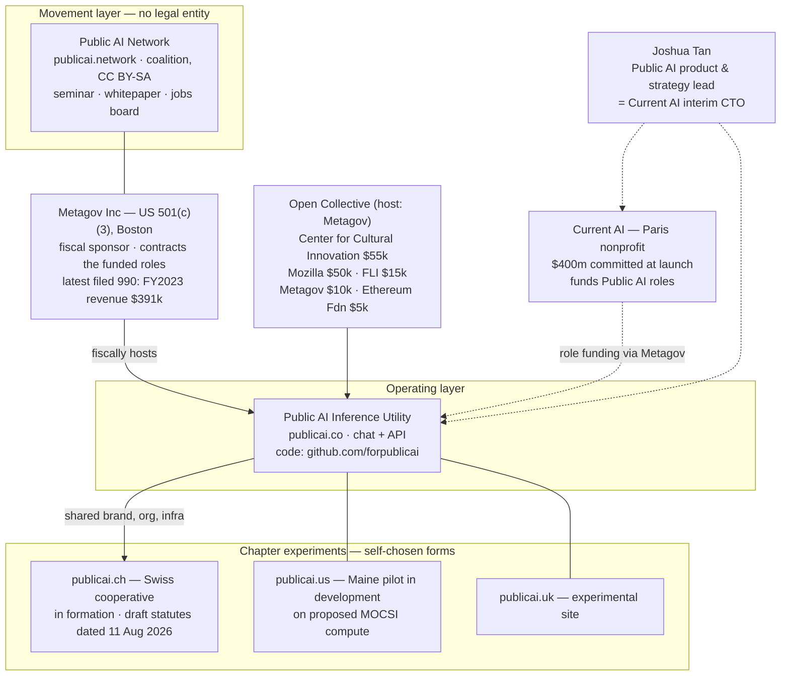
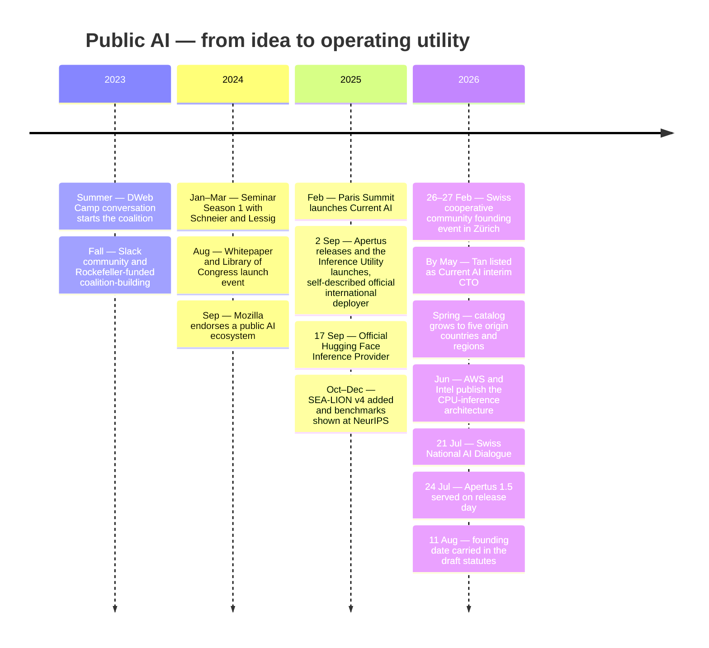
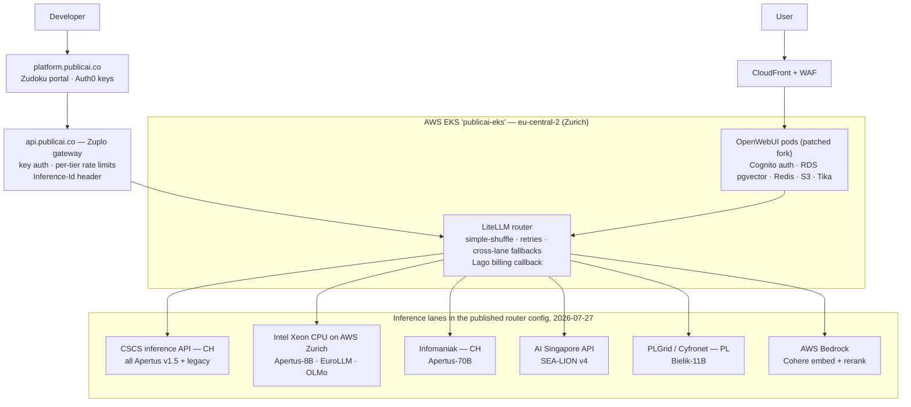
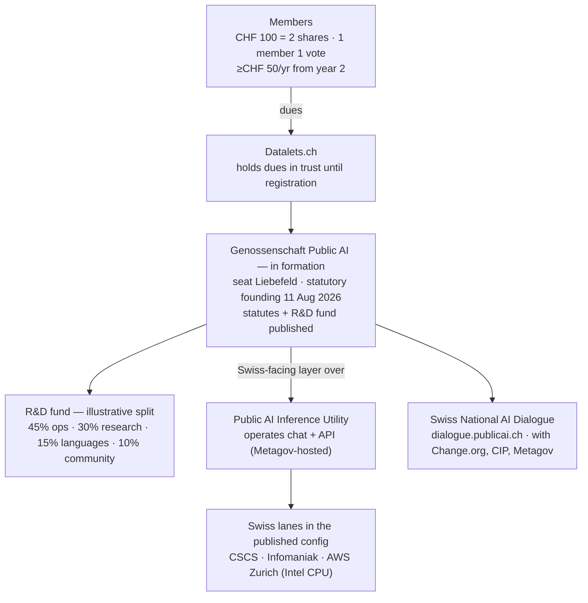

> **Status: WORKING NOTES** — dated snapshot, not a current-state report. Core research was verified 2026-07-27/28. On 2026-09-22, technical source paths were refreshed and removed publicai.ch pages were relinked to the exact historical repository revision. The current publicai.ch site has since been simplified, so legal, team, counter, and programme claims below must be re-verified before reuse. Companions: [Apertus fit & engagement](apertus-fit-and-engagement-plan.md), [Metagov & Public AI landscape](metagov-public-ai-landscape.md), and [verified findings](../Evidence/verified-findings.md).

# Public AI — what they build and operate

*The "Public AI" family (publicai.network · publicai.co · publicai.ch) presents itself as a movement to make AI public infrastructure. This note reconstructs the July 2026 source picture: one nonprofit-hosted inference service with substantially open code, a set of national experiments around it, and a then-proposed Swiss cooperative. It is preserved as a dated research record, not a current organisational profile.*

**Evidence grades used throughout:** **[configured]** — present in the published deployment config; deployed state unverified · **[self-reported]** / **[partner-stated]** — the org's or a partner's own statement · **[corroborated]** — third-party register, ledger, or platform data · **[unverified]** — no public evidence found. Negative findings state their check method and date.

## TL;DR

- **Three layers in the July 2026 snapshot, one thin legal core.** The *network* (publicai.network) was described as a coalition without a separate legal entity; the *Inference Utility* (publicai.co) as a nonprofit open-source project fiscally sponsored by [Metagov](https://projects.propublica.org/nonprofits/organizations/853442527); and the CH/US/UK chapters as unlike experiments. The Swiss site published a proposed cooperative form with draft statutes dated **11 Aug 2026**. Its current legal state is not established by this note ([§1](#1-organisational-and-legal-map), [§4](#4-the-swiss-cooperative-initiative)).
- **The utility runs.** Chat + OpenAI-compatible API serving open models from five national or regional origins (CH · SG · US · PL · EU); official [Hugging Face Inference Provider](https://huggingface.co/blog/inference-providers-publicai); substantial integration and deployment code published under [`forpublicai`](https://github.com/forpublicai) ([§3](#3-product-serving-configuration-and-operational-evidence)).
- **Operational evidence is the weak layer.** Published configuration is not deployed state; no operative lane-provenance mechanism was identified (Public AI's own [infrastructure-engineer posting](https://metagov.org/join/jobs/public-ai-founding-infrastructure-engineer) lists verifiable backend attribution and observability as work to build); the published gateway config does not attach the described guardrails to the active endpoint; the published router config disables TLS verification globally; there is no status page or SLA ([§3](#3-product-serving-configuration-and-operational-evidence)).
- **The recorded cash is small and partial.** ≈$126k lifetime through the [Public AI Open Collective](https://opencollective.com/publicai) — one fiscal-hosting channel covering several programmes, not a project-wide budget; compute is donated or credit-funded; Current AI funds roles via Metagov with no disclosed org-to-org grant ([§6](#6-financial-evidence-and-its-scope)).
- **Charter-relevant:** for the utility's own operational claims, today's evidence is published code plus self-reporting — and the maintainers have publicly welcomed third-party sovereignty verification (an integration PoC is referenced in their tracker). That is the assurance seam this initiative's [building block](../About.md) addresses, in an ally's stack ([§7](#7-conclusions-and-watch-list)).

## 1. Organisational and legal map

- **The network is explicitly not an organisation.** Its contributing page describes an open coalition — no membership, no formal chapters; country sites are semi-autonomous sibling projects ([publicai.network/contributing](https://publicai.network/contributing)) **[self-reported]**. Supporting orgs credited include Metagov, Aspen Digital, Open Future, Public Knowledge, Mozilla, Rockefeller Foundation, Internet Archive, Chatham House, Berkman Klein, Bertelsmann and McGovern foundations ([publicai.network](https://publicai.network/)) **[self-reported]**.
- **The utility's legal host is Metagov.** publicai.co/about states it is a nonprofit open-source project fiscally sponsored by Metagov, funded by Mozilla, the Future of Life Institute, and the Center for Cultural Innovation ([publicai.co/about](https://publicai.co/about)) **[self-reported]**; the [Open Collective ledger](https://opencollective.com/publicai) (fiscal host: Metagov) confirms those contributions **[corroborated]**. Metagov Inc: EIN 85-3442527, tax-exempt since 2022, FY2023 revenue $391,471 — the most recent public filing, so ~2 years stale as a size signal ([ProPublica](https://projects.propublica.org/nonprofits/organizations/853442527)) **[corroborated]**.
- **Current AI money enters as role funding, not disclosed grants.** Current AI is the Paris-launched public-interest AI partnership ($400m committed at the Feb 2025 AI Action Summit — [Philanthropy News Digest](https://philanthropynewsdigest.org/news/france-funders-launch-400-million-public-interest-ai-initiative)) **[corroborated]**. Public AI's jobs board attributes an infrastructure engineer ($50k/3 months), a research engineer ($20k/3 months) and fellowship stipends to Current AI funding ([publicai.network/jobs](https://publicai.network/jobs)) **[self-reported]**; Joshua Tan is simultaneously Public AI's product & strategy lead and Current AI's interim CTO, disclosed on [his own page](https://www.joshuatan.com/research/) **[self-reported]**. No org-to-org agreement is public, and TechCrunch's July 2026 Current AI profile does not mention Public AI ([TechCrunch, 2026-07-19](https://techcrunch.com/2026/07/19/nonprofit-current-ai-is-racing-to-build-the-world-wide-web-of-ai-free-for-all/)) **[corroborated absence]**.
- **Channels and disambiguation.** The network's channels are the [Substack](https://publicai.substack.com/), GitHub, email, and a LinkedIn page at [linkedin.com/company/pubai](https://www.linkedin.com/company/pubai/) ("AI as Public Infrastructure", linking the GitHub org; its self-selected size metadata is not treated as evidence here). `publicai.io` (Web3 token) and the LinkedIn companies "PublicAI" (Seoul IT firm) and "Public AI" (ad-tech) are unrelated; the family is publicai.network / .co / .ch / .us / .uk.

## 2. The blueprint, and how much of it exists

The founding whitepaper — *[Public AI: Infrastructure for the Common Good](https://zenodo.org/records/13914560)* (Aug 2024, rev. Oct 2024; eight authors across Metagov, Aspen, Public Knowledge, Berkman Klein, Chatham House) — defines public AI by three "essential features" (public access · public accountability · permanent public goods; the website adds a fourth, action pillar — being designed and built *now*) and lays out a build taxonomy. Mapping blueprint → built reality, two years on:

| Whitepaper category | What it calls for | What exists (2026-07-27) |
|---|---|---|
| **Vertical platforms** — end-to-end public *utilities* (Post/BBC analogies; the stack diagram marked this slot "None, Yet") | Vertically integrated consumer AI service | The **Inference Utility** (chat + API) — the slot the coalition filled itself, launched 2 Sep 2025 with Apertus ([launch post](https://publicai.substack.com/p/we-launched-the-inference-utility)) |
| **Horizontal platforms** — public options per stack layer (compute, data, models, standards) | Public compute programs, data trusts, public models | Mostly *pointed at*, not built: the utility rides national compute (CSCS, PLGrid…) and others' models; own horizontal work = **data flywheel** datasets ([flywheel_v1](https://huggingface.co/publicai)) and **Community-Aligned Benchmarks** with Aspen ([project page](https://www.aspendigital.org/project/ai-benchmarks/)) |
| **New public goods** — moonshots (public tutor, "Doctor AI", scientific AI) | Market-underserved applications | Early: **Public AI Libraries** kiosks in US public libraries ([publicai.network/libraries](https://publicai.network/libraries)); Maine "community agents" in beta ([publicai.us](https://publicai.us/)) |
| **Funding models** — state capital, philanthropy with anti-capture terms, at-cost usage fees, cooperative structures | Sustainable public financing | Experiments only: donated compute + ~$126k recorded cash + wallet-credit billing + CHF-100 cooperative shares + $1,000/yr kiosk fees ([§6](#6-financial-evidence-and-its-scope)) |
| **Governance models** — regulators, data cooperatives/trusts, citizens' assemblies, contestation rights | Public control mechanisms | Thinnest layer: one cooperative in formation (CH), a "National AI Dialogue" survey ([dialogue.publicai.ch](https://dialogue.publicai.ch/)), no oversight body, no published accountability mechanism for the utility itself |

The intellectual lineage is consistent — the 2023 position paper *[An Alternative to Regulation: The Case for Public AI](https://arxiv.org/abs/2311.11350)* (Vincent, Bau, Schwettmann, Tan) argued that public institutions should *build* AI rather than only regulate it; the whitepaper turned that into an infrastructure taxonomy; the utility is the taxonomy's "None, Yet" slot filled by its own authors. **My read:** execution has concentrated on the *access* feature; the *accountability* and *permanence* features remain, on their own evidence, declared rather than built — the same gap the [Metagov landscape note](metagov-public-ai-landscape.md) §3 reaches from the ecosystem side.

## 3. Product, serving configuration, and operational evidence

### What a user or developer gets (verified 2026-07-27)

- **Chat** — [chat.publicai.co](https://chat.publicai.co/): OpenWebUI-based (a [patched fork](https://github.com/forpublicai/open-webui)), AWS Cognito sign-in, document upload (Tika extraction), national system prompts and community toggles; web search exists in the config but is disabled in production values **[configured]**. A no-login guest chat runs at publicai.co/chat.
- **API** — `api.publicai.co`: OpenAI-compatible, self-service keys via the [developer portal](https://platform.publicai.co/) (Auth0). Four rate tiers (Free 100 req/min · Plus 200 via Open Collective contribution · Pro 300 · Enterprise 10,000 by email); token usage draws down wallet credits (Lago billing + top-up) **[configured/self-reported]**. Metering is a later addition — the Sep 2025 [HF launch post](https://huggingface.co/blog/inference-providers-publicai) still described free access at 20 req/min for the route it announced.
- **Hugging Face route** — official Inference Provider since 17 Sep 2025 **[corroborated]**; the verified [HF org](https://huggingface.co/publicai) publishes two opt-in "flywheel" datasets and no models (weights live with the makers, e.g. [swiss-ai](https://huggingface.co/swiss-ai)). Its request counter is rolling and volatile — see appendix.
- **MCP server** — a [FastMCP repo](https://github.com/forpublicai/publicai-mcp-server) (Swiss transit, Singapore carparks, OSM tools), designed for local use; dormant since 2025-12-30, backing wiki unreachable 2026-07-27 **[corroborated]**.
- **Not offered:** a status page (status.publicai.co does not resolve, 2026-07-27), an SLA (the [global terms](https://publicai.co/tc) disclaim one explicitly: services "as is", may be suspended without liability), published uptime or incident history.

### Published serving configuration

Reconstructed from the published deployment configs (Helm values, Zuplo policies, LiteLLM model files in [`forpublicai`](https://github.com/forpublicai)) and the joint [AWS APN write-up](https://aws.amazon.com/blogs/apn/how-public-ai-delivers-sovereign-llm-inference-on-aws-and-intel/) (15 Jun 2026). **Configuration is not deployed state**: it shows intent and design, not current availability, health, routing shares, or that production matches the repo.

| Lane | Country | Evidence state (2026-07-27) |
|---|---|---|
| CSCS inference API | CH | Configured (preferred Apertus lane); a July issue notes lane instability — operational use partner-stated |
| Intel Xeon on AWS (R8i, Zurich) | CH region | Configured; described as deployed by AWS + Public AI ([APN blog](https://aws.amazon.com/blogs/apn/how-public-ai-delivers-sovereign-llm-inference-on-aws-and-intel/)) |
| Infomaniak | CH | Configured (Apertus-70B, low weight) |
| AI Singapore API | SG | Configured; AI Singapore named as model provider in the [global terms](https://publicai.co/tc) |
| PLGrid / ACK Cyfronet | PL | Configured (Bielik) |
| AWS Bedrock (Frankfurt) | EU | Configured (Cohere embed/rerank — RAG plumbing, not chat) |
| Jülich JSC, NCI Australia, Cudo, Exoscale | DE/AU/—/AT | Credited launch donors **[self-reported]**; no endpoint in the current published config |

Notable in the July configs: the same model was declared across providers with weights, and **fallbacks crossed both borders and models** (e.g. Apertus-70B → Qwen-SEA-LION-v4-32B in the pinned [apertus-70b-instruct.yaml](https://github.com/forpublicai/chat.publicai.co/blob/92ea81752cc9205ceb0b8862e7bbe2e7d4797ee2/charts/platform/charts/litellm/models/swiss-ai/apertus-70b-instruct.yaml#L29-L30)) — resilience by design, in tension with jurisdiction and which-model expectations **[configured]**; whether a response disclosed the substitute (stock LiteLLM behaviour suggests its `model` field may) was not tested against the live API **[unverified]**. The GPU story became a CPU story: the Sep–Nov 2025 launch ran on ~$124k of AWS credits (3× 8-GPU p4d pods); when credits ended, serving shifted to Intel Xeon CPU inference in the same region ([amazon-intel story](https://publicai.co/stories/amazon-intel)) **[self-reported/partner-stated]**. Whether any self-operated GPU pods still run is **[unverified]**.

### Models in the published catalog (2026-07-27)

Prices are the utility's own, per 1M tokens in/out ([platform repo](https://github.com/forpublicai/platform.publicai.co)):

| Model | Origin | Context | Price |
|---|---|---|---|
| Apertus v1.5 8B / 70B (± thinking) | CH — Swiss AI Initiative | 262k | $0.10/$0.20 · $0.82/$2.92 |
| Apertus 8B / 70B Instruct (2509) | CH | 65k | as above |
| Gemma-SEA-LION-v4-27B / Qwen-SEA-LION-v4-32B | SG — AI Singapore | 128k | $0.20/$0.40 · $0.25/$0.50 |
| OLMo-3-7B-Instruct | US — Ai2 | 65k | $0.10/$0.20 |
| Bielik-11B-v3.0-Instruct | PL — SpeakLeash/Cyfronet | 32k | $0.40/$0.40 |
| EuroLLM-22B-Instruct | EU — UTTER project | 32k | $0.10/$0.20 |

Day-one national-model serving is the operational signature: Apertus 1.5 (multimodal, 262,144-token context, optional reasoning) was served on its 24 Jul 2026 release day; the same story expects "Apertus 2" in months and notes the model's values charter is now the **"Apertus Charter (formerly known as the Swiss AI Charter)"** ([stories/apertus-1-5](https://publicai.co/stories/apertus-1-5)) **[self-reported]**. Catalog drift is visible: Spain's ALIA/Salamandra still appear in front-page copy but are absent from the current router config — parked, dropped, or served outside the public config; the sources don't say.

### Operational evidence — the assurance-relevant findings

- **No operative lane-provenance mechanism was identified in the reviewed public sources.** The gateway's `Inference-Id` header copies the upstream completion ID; it does not disclose backend, location, operator, or lane ([header module](https://github.com/forpublicai/platform.publicai.co/blob/main/modules/add-inference-id-header.ts)) **[configured]**. The chat UI's "served by" sponsor attribution is derived from the *requested model name* — for Apertus via a weighted random choice among sponsors — not from runtime serving data ([sponsor_attribution.py](https://github.com/forpublicai/chat.publicai.co/blob/main/community/owui_functions/sponsor_attribution.py)); whether that exact function is deployed cannot be confirmed from source alone **[configured]**.
- **Jurisdiction proof is acknowledged, unresolved work.** [Issue #35](https://github.com/forpublicai/chat.publicai.co/issues/35) (Oct 2025) asks for proof that sovereign models run within claimed jurisdictions; maintainers engaged — inviting suggestions, noting about half the compute is self-managed with partners running the rest, and referencing a third-party verification PoC (nopinkypromises.ai) they'd like to integrate — but no production implementation is linked (thread read via API, 2026-07-27). The current [infrastructure-engineer posting](https://metagov.org/join/jobs/public-ai-founding-infrastructure-engineer) lists routing transparency and endpoint provenance, integrated observability, and downtime warnings as work still to be built — in its own words, users "should be able to see — and verify — which backend served their inference" (checked 2026-07-27) **[self-reported]**.
- **Guardrails: description and published config conflict.** AWS and Public AI describe Bedrock Guardrails (PII/abuse/prompt-injection, ~5–8% latency) in the June 2026 architecture ([APN blog](https://aws.amazon.com/blogs/apn/how-public-ai-delivers-sovereign-llm-inference-on-aws-and-intel/)) **[partner-stated]**; the current published [route config](https://github.com/forpublicai/platform.publicai.co/blob/main/config/routes.oas.json) attaches the `bedrock-guardrail-policy` only to an internal `/deprecated/chat/completions` route — the active `/v1/chat/completions` route does not carry it (checked 2026-07-27). Live deployment state could not be verified; the conflict is the finding **[configured vs partner-stated]**.
- **TLS verification was disabled in the reviewed July router config** — `ssl_verify: false` sat in the global `litellm_settings` of the pinned [ConfigMap template](https://github.com/forpublicai/chat.publicai.co/blob/92ea81752cc9205ceb0b8862e7bbe2e7d4797ee2/charts/platform/charts/litellm/templates/configmap.yaml#L33-L64), with additional per-model settings. Effective deployed scope **[unverified]**; security-relevant either way.
- **Staffing is thin and public.** Contributor graphs of the three core repos show most commits from a single engineer with a small ops rotation ([chat](https://github.com/forpublicai/chat.publicai.co/graphs/contributors) · [platform](https://github.com/forpublicai/platform.publicai.co/graphs/contributors) · [site](https://github.com/forpublicai/publicai.co/graphs/contributors), 2026-07-27) **[corroborated]**.
- **Openness, precisely stated:** Public AI publishes substantial integration and deployment code (23 public repos), while the operated service also relies on closed managed components — Zuplo, Auth0, Cognito, Bedrock, and AWS services generally. Source availability ≠ deployment visibility ≠ openness of the underlying services.

## 4. The Swiss cooperative initiative

The Swiss chapter is the family's most institutionalised experiment — a **proposed cooperative in formation**:

- **Legal status (July 2026 snapshot).** publicai.ch positioned itself as "the world's first cooperative for AI" and as customer-owned **[self-reported]**; the then-published draft [statutes](https://github.com/forpublicai/publicai.ch/blob/35f73958fe3910558c084ccc01b1e90201719c9b/statuten.html) named **"Genossenschaft Public AI", seat Liebefeld** (Köniz BE), under Art. 828 ff. OR, with a founding date of **11 Aug 2026 — still ahead at verification**. (The informal label **"SPIU"** — *Swiss Public Inference Utility* — predates the statutory name and survives in third-party text and a Hugging Face handle.) The [impressum](https://publicai.ch/impressum.html) carried no UID; terms and privacy were drafts pending registration. A name-substring query against the federal LINDAS mirror of Zefix (2026-07-27) returned no entity containing "public ai" — a check that did not exclude one-word spellings or mirror lag. Under Swiss cooperative law, formation requires at least seven founders (Art. 831 OR), a **publicly notarised founding** and commercial-register entry. The then-published [news page](https://github.com/forpublicai/publicai.ch/blob/35f73958fe3910558c084ccc01b1e90201719c9b/news.html) said the incorporation date was being coordinated with the notary. No notice of a notarial constitutive assembly, founder list, or membership number was identified in the surfaces checked by 2026-07-28. The public site has since been simplified; this note does **not** establish the cooperative's current legal status.
- **Membership economics (July 2026 snapshot)** ([join page](https://github.com/forpublicai/publicai.ch/blob/35f73958fe3910558c084ccc01b1e90201719c9b/join.html), [statutes](https://github.com/forpublicai/publicai.ch/blob/35f73958fe3910558c084ccc01b1e90201719c9b/statuten.html)): CHF 100 = two CHF-50 shares; ≥CHF 50/yr from year two into an R&D fund; one member, one vote; natural and legal persons admitted; the board **may reject applications without stating reasons**; exit only at fiscal-year-end on three months' notice, with no share reimbursement; on dissolution, surplus goes to a similar Swiss tax-exempt institution. The archived [fund page](https://github.com/forpublicai/publicai.ch/blob/35f73958fe3910558c084ccc01b1e90201719c9b/fonds.html) sketched an illustrative split; the general assembly would decide yearly. These pages are no longer on the current site and are cited as historical source evidence only.
- **Operational relationship (my read):** a Swiss-facing membership and governance layer over the utility, today — the service itself is operated by the Metagov-hosted utility. ETH's Apertus release positioned the utility as access for people *outside* Switzerland (Swisscom being the Swiss business channel) ([ETH release](https://ethz.ch/en/news-and-events/eth-news/news/2025/09/press-release-apertus-a-fully-open-transparent-multilingual-language-model.html)); publicai.ch markets it *inside* Switzerland — a divergence in framing between the two pages, not a documented conflict.
- **Activity record** (community founding event 26–27 Feb 2026, Zürich — distinct from the statutory assembly; the pre-published [agenda](https://publicai.ch/meeting/27.2.2026/) included a board vote, but no minutes or board names are published as of 2026-07-27; the [Luma page](https://luma.com/3fwdxk84) shows 10 RSVPs for day two): membership reservations opened 20 May 2026; **venture.ch Spotlight finalist** in June 2026 ([venture.ch/spotlight](https://www.venture.ch/spotlight)) **[corroborated]**; notary engagement announced 17 Jul 2026; **Swiss National AI Dialogue** launched 21 Jul 2026 ([dialogue.publicai.ch](https://dialogue.publicai.ch/), with Change.org, Collective Intelligence Project, Metagov; explicitly not a government project; 788 participants **[self-reported]**); Mesh Festival Basel appearance announced for 16 Oct 2026.
- **Counters and claims (July 2026 snapshot).** The homepage counters — 52,293 registered users · 2,166 API developers · 9.58B tokens — were identical across the 2026-07-27/28 checks and therefore hardcoded snapshot figures, not live counters. Their scope was unstated. The homepage also used **"#1 Apertus deployer worldwide"**, while the site's then-current [translation strings](https://github.com/forpublicai/publicai.ch/blob/35f73958fe3910558c084ccc01b1e90201719c9b/scripts/i18n_en.json) said "over 45'000 registered users and trillions of tokens processed" — inconsistent with the 9.58B figure. The wording was not found on the live pages checked then. The current simplified site no longer supports treating those July figures or comparisons as current.
- **Team (July 2026 snapshot).** The then-published [About page](https://github.com/forpublicai/publicai.ch/blob/35f73958fe3910558c084ccc01b1e90201719c9b/about.html) listed Anna Sotnikova, Cornelia Wolfenstädter, Daria Höhener, Joshua Tan, Oleg Lavrovsky, and Prashanth Kanduri. The page has since been removed from the simplified site; do not use this list as current staffing evidence.

**Data residency, decomposed.** publicai.ch's draft privacy states "Services and data are hosted in Switzerland"; the utility's [global terms](https://publicai.co/tc) describe a US-based nonprofit, name Swiss AI Initiative and AI Singapore as model providers ("your Prompt will be sent directly to an AI developer"), and list AWS, Exoscale, CSCS, NCI Australia, Cudo and Vercel as subprocessors. Treating "data" as one object hides the real picture:

| Data object | What public sources say | State |
|---|---|---|
| Account & identity | AWS Cognito, EKS in eu-central-2 (Zurich) | Configured |
| Stored chat history | RDS Postgres in the Zurich cluster | Configured |
| Prompt/response processing | Routed per model + weights; cross-border fallbacks configured; "sent directly to an AI developer" (terms) | Configured / self-reported |
| Operational logs | Raw technical logs ≤90 days; deleted chats purged ≤30 days (terms) | Self-reported |
| Model-provider retention | External providers named; their retention not specified in Public AI's terms | Unverified |
| Physical inference location | CH/SG/PL/EU lanes configured; no runtime proof mechanism exists yet (§3) | Unverified at runtime |

## 5. Other programmes, classified

Relationship key: **operator** (coalition/utility runs it) · **fiscal-hosted** (runs under Metagov via the collective) · **partner** (another org operates) · **network-member** (a member's own project) · **proposal** · **experimental repo**.

- **Public AI Libraries** — *operator, with state-library partners; pilot.* AI kiosks in US public libraries at $1,000/yr; pilot states named across its pages have shifted (New Jersey, Utah, Texas, Massachusetts at launch; Georgia added in the Q4 roundup; an external check of the live page adds Kentucky) — the live list is on [libraries.publicai.co](https://libraries.publicai.co/), which blocks automated fetch (403, 2026-07-27); kiosk software v2 in active development ([repo](https://github.com/forpublicai/librarieskiosk)).
- **publicai.us / Maine + MOCSI** — *chapter experiment; pilot in development.* The current site describes MOCSI (Maine Open Compute Services Initiative) as a planned community-scale data centre while also presenting services as running on MOCSI compute and soliciting partners and investors ([publicai.us](https://www.publicai.us/), checked 2026-09-22). "Proposed pilot in development" remains the supportable classification.
- **publicai.uk** — *experimental site.* Claims a working prototype for BBC, justice and planning; no team or legal information published ([publicai.uk](https://publicai.uk/)).
- **Community-Aligned Benchmarks** — *partner programme* (Aspen Digital operates; Siegel-funded): public-goal benchmarks, first domain food security; "Feeding the Future" (Jan 2026) ([Aspen](https://www.aspendigital.org/project/ai-benchmarks/)).
- **AI Evaluator Forum** — *convening*; **Weval** — *network-member project* (Collective Intelligence Project's): independent-evaluation standards work with METR, RAND, SecureBio, Transluce, HAL ([Q4 roundup](https://publicai.substack.com/p/public-ai-network-q4-2025-roundup)). *Adjacency for the Charter's evaluation protocol — [Metagov landscape note](metagov-public-ai-landscape.md) §2.*
- **Data commons / flywheels** — *operator + partner pilot*: opt-in usage-data donation datasets ([HF](https://huggingface.co/publicai)); agriculture data-commons pilot with OpenTeam.
- **Public AI Seminar** — *operator (network)*: Seasons 1–3 brought Schneier, Bengio, Lessig, Kim Stanley Robinson into the orbit; Season 4 ("the business of public AI") in planning for summer 2026 ([seminar page](https://publicai.network/seminar)).
- **Culture track** — *fiscal-hosted*: Protopian AI Fiction Prize (to 31 Jul 2026); Creative Fellowship (3 × $5,000, CCI-funded) ([Metagov June update](https://metagov.substack.com/p/metagov-community-update-june-2026)).
- **"An Airbus for AI"** — *proposal*: consortium-model public frontier lab (Tan, Jackson, Berjon, Coyle; [essay](https://publicai.substack.com/p/an-airbus-for-ai), [Project Syndicate](https://www.project-syndicate.org/commentary/public-ai-can-be-the-basis-of-new-international-cooperation-by-jacob-taylor-3-and-joshua-tan-1-2025-10)).
- **safemolt** — *experimental repo*: a social network for AI agents ([repo](https://github.com/forpublicai/safemolt)).

## 6. Financial evidence and its scope

The one open ledger is the [Public AI Open Collective](https://opencollective.com/publicai) (fiscal host: Metagov). It records **cash moving through that fiscal-hosting channel across several Public AI programmes** — it is not a project-wide budget, and it cannot capture externally paid staff (e.g. Current-AI-funded roles) or donated compute.

| Source | Amount / structure | Evidence |
|---|---|---|
| Center for Cultural Innovation | $55,000 | ledger **[corroborated]** |
| Mozilla Foundation | $50,000 | ledger + [publicai.co/about](https://publicai.co/about) |
| Future of Life Institute | $15,000 | ledger |
| Metagov | $10,000 | ledger |
| Ethereum Foundation | $5,000 | ledger |
| **Ledger lifetime totals** | **$126,300 raised · $112,833 spent · $13,468 balance · est. $59k/yr** (displayed 2026-07-27) | ledger |
| Current AI | Role funding via Metagov ($50k + $20k contracts, €5k/CHF 5k fellowships); no disclosed org-to-org grant | [jobs board](https://publicai.network/jobs) **[self-reported]** |
| Rockefeller Foundation | Early coalition-building (late 2023), amount not public | [Aspen](https://www.aspendigital.org/blog/two-years-of-public-ai/) **[self-reported]** |
| Compute | Donated/credited: ~$124k AWS credits (Sep–Nov 2025); CSCS/Jülich/NCI/Exoscale/Cudo/AI-Singapore/Intel contributions | [amazon-intel story](https://publicai.co/stories/amazon-intel) **[self-reported]** |
| Revenue experiments | API wallet credits + "Plus" tier; cooperative CHF 100 + CHF 50/yr; kiosk $1,000/yr | platform docs, publicai.ch, libraries page |

Reconciliation notes: the itemised organisational contributions sum to $135k, above the displayed $126,300 lifetime total — the ledger does not break out pledged-vs-received or fees; treat its displayed totals as authoritative and per-contributor figures as posted amounts. Programme money also flows outside this channel (Siegel funds the benchmarks via Aspen; compute in kind; Current AI pays roles), hence "recorded", not "complete".

**My read:** the recorded cash is small against the infrastructure ambition, and sustainability rests on in-kind compute, credits, a young metering system, and partner institutions' goodwill. The most consequential financial fact is the Current AI relationship: Tan's dual role (disclosed on his own page) plus role funding routed via Metagov, with no org-to-org agreement published — whether one exists, and how the dual role is governed, is a question to ask, not a finding; either way it is a key-person dependency. The utility's own about page jokes it is "three toddlers in a trench coat"; the public record is consistent with the self-deprecation.

## 7. Conclusions and watch list

Labelled assessment, grounded in §1–§6:

1. **A movement with one working proof-point.** The durable asset is not the coalition (deliberately structureless) but the utility: a running, multi-origin inference service that gives national open models a day-one public front door — by far the most complete part of the whitepaper's taxonomy the coalition itself has built (kiosks and benchmarks are early seedlings by comparison).
2. **An operating model of hosted and donated inputs.** Metagov's legal host, donated/credited compute, others' models, small recorded cash. Each arrangement is normal and deliberate on its own — fiscal sponsorship is a standard nonprofit form; serving Apache-2.0 models is their intended use; it is the *stack* of dependencies that makes the permanence claim (the whitepaper's third feature) the least supported one.
3. **Switzerland was the institutionalisation test in the July 2026 snapshot.** At that time, without a notarised founding and a register entry (the draft statutes carried 11 Aug 2026), the evidence supported describing the cooperative as a membership campaign plus a governance promise — which is also what ordinary Swiss pre-incorporation looks like (draft statutes published, notary engaged, dues in trust). A later notarised founding, register entry, and demonstrated membership would change its weight in the Swiss landscape; current status was not re-established in this update.
4. **Accountability instruments for the utility's own claims are not yet built — by their own account.** No operative provenance mechanism; a guardrails description that the published config does not currently corroborate on the active route; global `ssl_verify: false` in the published router config; no status page; self-reported counters. The coalition's accountability-flavoured programmes (dialogue, benchmarks, evaluator forum, cooperative governance) sit *beside* the service rather than *over* it. Two constructive signals: the infrastructure job spec names attribution/observability as build targets, and the maintainers welcomed a third-party sovereignty-verification tool in the issue-#35 thread. For this repo's purposes that is primary-source demand for exactly the [assurance & certification building block](../About.md) — an ally's gap, with the door already ajar ([positioning](metagov-public-ai-landscape.md) §4, [engagement plan](apertus-fit-and-engagement-plan.md) §5). A forwardable distillation of these gaps, with neutral closures, is the [gaps table](public-ai-gaps-table.md).

**Watch list**

- **Swiss legal status:** after the draft statutes' 11 Aug 2026 date, is there now a Zefix/SHAB entry for "Genossenschaft Public AI" (Liebefeld/Köniz), and have founders, board names or a member count been published? Current status was not re-established in this snapshot update.
- **Provenance work:** does the sovereignty-verification integration (nopinkypromises.ai PoC) or the job-spec observability/attribution work land in production?
- **Guardrails:** does the `bedrock-guardrail-policy` (re)appear on the active `/v1/chat/completions` route in the published config?
- **Current AI ↔ Public AI:** any formal agreement disclosure; duration of the dual role; whether Current AI's "Build" pillar absorbs or scales the utility.
- **"Swiss AI Summit, February 2027":** still tasked to the Switzerland fellow in the posting; no public event by that name/date exists (the intergovernmental Geneva summit is 21–22 Jun 2027; swissaisummit.com is an unrelated commercial event). Same open question as the [Apertus note](apertus-fit-and-engagement-plan.md) §6. The fellowship posting was marked "Filled" on the [jobs index](https://publicai.network/jobs/) on 2026-09-15, with no public appointee announcement.
- **ALIA/Salamandra** (copy vs config), the promised burn-rate series, and whether publicai.ch's "hosted in Switzerland" gets specified once the cooperative formalises.

## Appendix — volatile metrics and provenance

**Volatile metrics** (rolling counters; timestamp everything): publicai.ch homepage 52,293 users · 2,166 developers · 9.58B tokens (2026-07-27, self-reported, scope unstated); Hugging Face org "monthly requests": two same-day checks read 56,244 and 58,525 (2026-07-27), and an external check in the same period read ~51,040 — a rolling, platform-computed counter; never cite it as a durable figure.

**Provenance & method.** Built 2026-07-27 from four primary-source research passes (Swiss chapter; global network and blueprint; technical stack; people/press/funding), with load-bearing figures re-verified directly on 2026-07-27/28. Sources included the publicai.ch site snapshot preserved at repository revision [`35f7395`](https://github.com/forpublicai/publicai.ch/tree/35f73958fe3910558c084ccc01b1e90201719c9b), [Open Collective](https://opencollective.com/publicai), [HF org](https://huggingface.co/publicai), [GitHub org](https://github.com/forpublicai), [issue #35](https://github.com/forpublicai/chat.publicai.co/issues/35), [Apertus 1.5 story](https://publicai.co/stories/apertus-1-5), [route config](https://github.com/forpublicai/platform.publicai.co/blob/main/config/routes.oas.json), pinned July [LiteLLM ConfigMap snapshot](https://github.com/forpublicai/chat.publicai.co/blob/92ea81752cc9205ceb0b8862e7bbe2e7d4797ee2/charts/platform/charts/litellm/templates/configmap.yaml#L33-L64), [header module](https://github.com/forpublicai/platform.publicai.co/blob/main/modules/add-inference-id-header.ts), [sponsor attribution](https://github.com/forpublicai/chat.publicai.co/blob/main/community/owui_functions/sponsor_attribution.py), and [global terms](https://publicai.co/tc). Review rounds corrected technical, legal, financial, programme, and tone overstatements; facts carry evidence grades, assessments are marked, and negative findings are scoped to the surface and date checked. On 2026-09-22, broken source paths were repaired and the note was explicitly marked as a dated snapshot; its underlying operational findings were not rerun against a live deployment.
