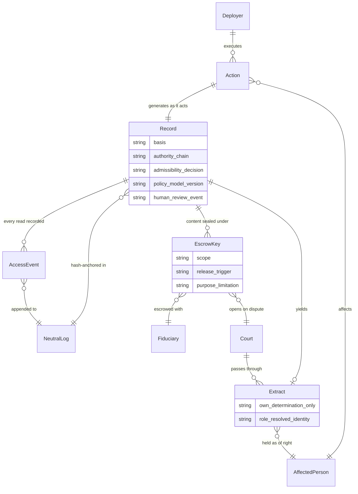

> **Status: WORKING NOTES** — design note answering one open question raised by Stuart-Mueller & Woodward's *The Wrong Layer* (July 2026): how custody of per-action AI records should work when the liability-bearing institution and the harmed person are different parties.

# Split custody for per-action records

*Working notes — 2026-07-18 · public-safe. Companions: [Charter Commitments](../Assurance/Framework/charter-commitments.md) (operational duty 6, contestability), [evaluation protocol](../Assurance/Protocol/grounding-faithfulness-and-contestability.md), [control-and-evidence layer](../Infrastructure/control-and-evidence-layer.md).*

## The question

[*The Wrong Layer*](https://doi.org/10.5281/zenodo.21397661) (Stuart-Mueller & Woodward, July 2026; [accompanying article](https://www.linkedin.com/pulse/every-ai-framework-earth-regulates-same-layer-andrew-woodward-4nmzc)) argues that every surveyed AI-governance regime misses a per-action, court- and underwriting-grade record proving that basis, authority, and admissibility existed before a consequential machine action executed. On custody it gives two rules: the record belongs to **the party bearing consequence** (Part V, "owner-held keys"), and to **the party the record protects, or a custodian independent of the party it constrains** (Part XIV, "the worker's tribunal, not only the employer's server").

**Assessment:** in the split-consequence case — an agency or employer carries the liability while a claimant or worker bears the harm — those two rules point at *different parties*. The paper names the tension and expressly does not resolve it (it lists "the hardest privacy and custody tensions" among what it has not established). This note sketches a resolution from mechanisms that already run elsewhere.

## Design answer: custody decomposes

Custody should not pick a side. Split the record into three separable concerns — **integrity, content, access** — and allocate each to a different party:

> Content stays with the liability-bearer; integrity hashes go to a neutral append-only log; the affected person always holds the scoped extract about their own determination; an independent fiduciary holds escrowed keys that open on dispute triggers under purpose limitation; courts hold the override.

| Concern | Allocation | Working precedent |
|---|---|---|
| Record content | Liability-bearing deployer (needs it to operate and defend) | Standard operator record-keeping; [EU AI Act Art. 12](https://artificialintelligenceact.eu/article/12/) logging |
| Integrity | Neutral append-only log holding hash anchors only — alteration/deletion detectable by anyone, content readable by no one | [Certificate Transparency (RFC 6962)](https://datatracker.ietf.org/doc/html/rfc6962); tamper-evident audit-log practice |
| Affected person's access | Scoped extract on their own determination, held as of right: basis, policy version in force, authority chain, bounds, human-review event — role-resolved, not biographic | [Tachograph driver card](https://eur-lex.europa.eu/legal-content/EN/TXT/?uri=CELEX%3A32014R0165) (worker holds own record; authority card overrides company locks); [AI Act Art. 86](https://artificialintelligenceact.eu/article/86/) explanation right; [Platform Work Directive 2024/2831](https://www.etui.org/publications/eu-platform-work-directive) (transparency to workers *and* representatives) |
| Full-content depth | Keys escrowed with a fiduciary independent of the party the record constrains; released on defined triggers (dispute, regulator demand, audit) under purpose limitation | [Data trusts](https://theodi.org/insights/explainers/what-is-a-data-trust/) (fiduciary stewardship); [ICAO Annex 13](https://skybrary.aero/sites/default/files/bookshelf/5876.pdf) (investigators take flight-recorder custody on a trigger; misuse for blame/discipline barred) |
| Secrets / third-party privacy conflicts | Court or supervisory authority receives the material, balances, passes through what the person needs | [CJEU C-203/22 *Dun & Bradstreet*](https://www.dpcuria.eu/case?reference=C-203%2F22) (2025), following [C-634/21 *SCHUFA*](https://www.dpcuria.eu/case?reference=C-634%2F21) |
| Verification without disclosure | Cryptographic commitments + zero-knowledge proofs: confirm properties of a decision (registered policy applied; protected attribute unused) without revealing policy or data | [Kroll et al., *Accountable Algorithms*](https://papers.ssrn.com/sol3/papers.cfm?abstract_id=2765268), 165 U. Pa. L. Rev. 633 (2017) |

Two guards keep the instrument from becoming a surveillance file: **data minimisation at capture** (the record's subject is the action and its authority, resolved no finer than accountability requires — the paper's own rule, and capture-side prohibitions are already statute in the Platform Work Directive), and **watching the watchers** — every read of the record is itself a recorded access event, appended to the same neutral log.

## Conceptual model

Reading: the deployer executes and carries liability; the affected person bears the consequence. The record never travels whole — hashes to the log, the scoped extract to the person, sealed content opened by the fiduciary's keys only for a court on dispute.

## Charter tie-in

- **Contestability with teeth.** Operational duty 6's notice/review/remedy and the contestability module get a concrete custody mechanism: a right to challenge is ceremonial if the challenger can never reach the evidence (the paper's own point about "the evidence the worker never gets").
- **Who accredits the custodian** is an assurance-chain question — standard → assessor → accreditor → peer, no one checking their own work — i.e. exactly the [certification model's](../Assurance/Framework/charter-commitments.md) territory. The custodian role slots into that chain rather than requiring a new authority.
- **Capture resistance.** Purpose limitation needs statute, not scheme rules — a US court has [declined to let Annex 13 block discovery](https://condonlaw.com/2021/02/texas-federal-court-rules-that-boeing-cannot-withhold-otherwise-discoverable-documents-and-information-based-on-the-icao-annex-13/) — matching the Charter's position that material control interventions must be attributable and reviewable, never secret and unilateral.

## Open questions

1. **Custodian accreditation recursion.** Who evidences the evidence-holder? The paper calls this "attribution under capture" and offers plural observance as mitigation, not solution. Assessment: an accreditation chain bounds but does not close the regress.
2. **Aggregation risk.** Many scoped extracts plus integrity metadata can still profile a person or a workforce; access logging mitigates, does not eliminate.
3. **The two clocks.** Erasure rights run short, liability tails run long; layered retention with cryptographic erasure reconciles most cases, but the residue is a genuine conflict of laws that legislatures must rank sector by sector (the paper flags this; nothing found resolves it).
4. **Adoption where insurance pressure is absent.** The paper's enforcement engine is underwriting; benefits scoring, humanitarian allocation, and algorithmic management sit where that engine is weakest. Candidate substitutes — procurement conditions, administrative and labour law, funder mandates — are noted in the sources above but no regime yet mandates the record there.
