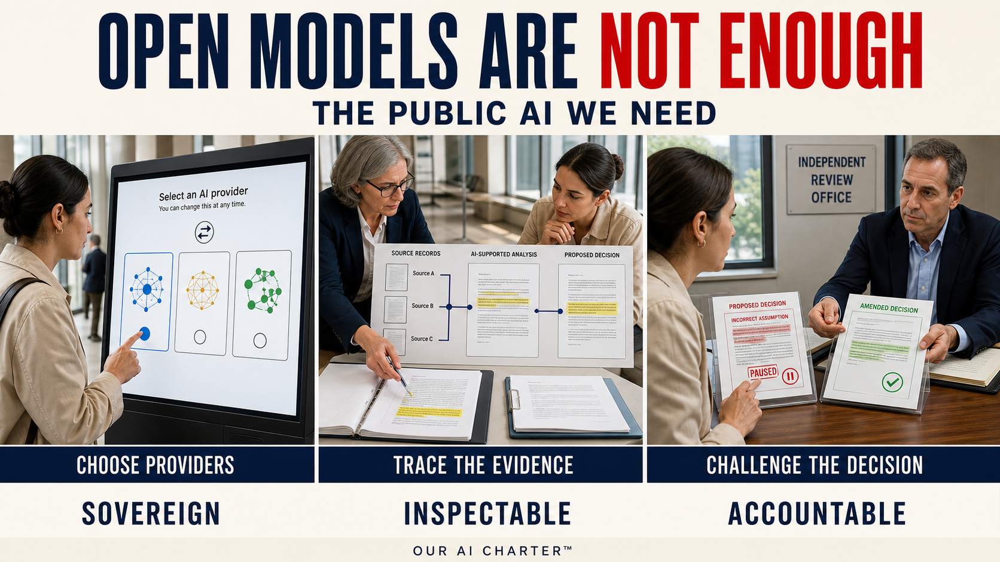

> **Status: WORKING NOTES** — draft synthesis article for maintainer review; not published externally.

## Proposed accompanying feed post

**Open Models Are Necessary. They Are Not Enough.**

Ownership is not sovereignty. What an AI predicts someone wants is not permission to act. Gates are not accountability. Warmth is not empathy. Certificates cannot make behaviour trustworthy.

These articles argue for a federated Public AI network that can be inspected, governed and contested—while power remains answerable to those who bear its consequences.

Four foundations:

1. **Open, plural models** that people and institutions can inspect and compare across languages, jurisdictions, capabilities, and known limits.
2. **Data and provenance commons** documenting origin, permissions, opt-outs, restrictions, and access conditions—*clear once, reuse many*.
3. **Shared assurance and evaluation** providing scoped evidence, correction, independent review, and remedy. **AI Assurance & Certification** is this trust-and-evidence building block.
4. **Federated public AI infrastructure** connecting independently operated compute nodes under shared rules, local control, and fallback paths.

Three connected strands:

- **AI Sovereignty** — autarky, interdependence and infrastructure.
- **AI Accountable to People** — evidence, power and runtime gates.
- **AI and Empathy** — perspective, correction and builder guidance.

The earlier articles and their corresponding posts are grouped and described in the article's reading index:
https://robertschaub.github.io/our-ai-charter/wip/the-public-ai-we-need/#earlier-articles-and-posts

Phase 1: public drafts—not an operating network, pilot, certification scheme or coalition.

*Full article below ↓*

`#PublicAI #DigitalSovereignty #AIAccountability`

---

# The Public AI We Need: Sovereign, Inspectable and Accountable

*The essential argument of Our AI Charter—from sovereignty and public infrastructure to runtime governance, empathy, and remedy.*

AI is becoming part of the infrastructure through which people learn, work, communicate, govern, and make sense of the world. The decisive question is therefore no longer only which model performs best. It is whether people and democratic institutions can **inspect, shape, and contest** the systems on which they increasingly depend and **change providers without losing an essential service**—and whether a named human institution remains answerable when AI affects a life, a right, or a public decision.

That question connects the articles and public posts behind Our AI Charter™. They began from different concerns: fragile dependence on a few providers, the limits of national AI strategies, factual claims that cannot be checked, automated actions that outrun their authority, and systems that sound caring while making people less able to correct or resist them. They converge on one proposition:

> **Free societies need a federated Public AI network: open and plural enough to resist unilateral control, governed by shared public obligations, and backed by evidence, independent review, and remedy.**

This is not only a technology proposal. It is a proposal about power.

## Sovereignty is the capacity to act—not the illusion of standing alone

The understandable response to dependence is national models, national clouds, and national control. Domestic capability matters. But [autarky is not sovereignty](../Published/swiss-autarky-illusion.md).

Autarky is the ambition to manage without others. Sovereignty is the capacity to act despite interdependence: to help set the rules, inspect systems independently, contest consequential decisions, and change providers without losing an essential service. A country that owns one model but lacks alternatives, shared standards, skilled people, reliable partners, and an effective route to challenge decisions may own an artefact without being sovereign over the system around it.

Switzerland's [Apertus](https://www.swiss-ai.org/apertus) makes the distinction concrete. It is genuinely open, but not yet sovereignty. In public-administration use, Liip [found](https://www.liip.ch/en/blog/apertus-after-8-months-what-we-learned-and-look-forward-using-switzerlands-ai-model) it behind an older, low-cost commercial model on answer quality (**55% versus 72%**) and source fidelity (**0.50 versus 0.79**). Its next phase has [CHF 20 million](https://www.swissinfo.ch/eng/swiss-ai/fact-and-fiction-about-the-swiss-ai-model-apertus/90110034) in federal funding, while four US technology companies plan [more than $700 billion](https://www.cnbc.com/2026/02/06/google-microsoft-meta-amazon-ai-cash.html) in 2026 investment. Because it honours provenance and opt-outs while [around 45%](https://www.dataprovenance.org/) of one major web corpus is restricted by terms of use, it also bears a compliance cost better-funded competitors can absorb.

The project does not fail this test; the expectation does. A model is an artefact. Sovereignty emerges from the ecosystem around it.

Sovereignty is also not an end in itself. Resilience preserves room to act; values determine whom that room serves. The relevant tests are human dignity and freedom, self-determination and privacy, truth and verifiability, justice and the rule of law, and reciprocal reliability. Institutional control is not yet public accountability: neither a foreign vendor nor a domestic institution should hold the rules, the evidence, and the appeal path at once. The plainest form of the test is this: **can one party withdraw a system for everyone, in secret, with no appeal?** Contestable control means lawful recall, misuse safeguards, and named operators who answer publicly — never secret kill-switches.

The wider aim is international: free societies should cooperate without surrendering local control or accepting domination by a single state or company. That was the shared thrust of the early articles on [AI sovereignty and resilience](../Published/ai-sovereignty-and-resilience.md) and [the Public AI Network](../Published/the-public-ai-network.md).

## Open models are necessary—and not enough

Open, inspectable models widen access, support research and adaptation, and reduce dependence on systems that cannot be examined. But open weights do not tell a public body which service actually processed its data, whether a model changed, how a disputed output was produced, or who will answer when an AI-supported decision harms someone.

A collection of national models is not yet public infrastructure. The [Our AI Charter project statement](../Published/our-ai-charter-public-ai-infrastructure.md) joins four connected pillars:

1. **Open, plural models** that people and institutions can inspect and compare across languages, jurisdictions, capabilities, and known limits.
2. **Data and provenance commons** documenting origin, permissions, opt-outs, restrictions, and access conditions—*clear once, reuse many*.
3. **Shared assurance and evaluation** providing scoped evidence, correction, independent review, and remedy. **AI Assurance & Certification** is this trust-and-evidence building block.
4. **Federated public AI infrastructure** connecting independently operated compute nodes under shared rules, local control, and fallback paths.

Under all four sits **competence**. Angelo Richiello put the dividing line sharply: "Infrastructure can be purchased. Competence cannot." Understanding and governing complex systems accumulate through education, research, practice, and institutional learning. Value creation, skilled work, and bargaining power grow where institutions help build and decide, not merely buy.

Anti-capture governance holds the pillars together. A captured registry can shape the market; self-controlled evidence can manufacture trust. Christoph Nützel, arguing from Gaia-X and EU-consortium experience, identified "verifiably commit" as the load-bearing phrase. The answer is consequence through access: assurance status would gate shared compute, corpus access, or procurement preference; failure or expiry would suspend status, with appeal, and no member would control the audit. **No consequence, no commitment.** The [network overview](../network-overview.md#how-to-take-part-now) carries the fuller path.

Here, **public** describes obligations, access, accountability, and governance—not one legal form or central operator. Participation should depend on verifiable commitments to human rights, rule-of-law procedures, democratic accountability, transparency, and effective remedy. The proposal contributes to the wider public-AI movement; it claims no affiliation with an existing coalition.

The proposal is intended as a contribution to the wider public-AI movement, not a claim of affiliation with any existing coalition.

## Start with the people who bear the consequences

Infrastructure and governance sound remote until a decision lands on someone. The [practical test for power](../Published/a-practical-test-for-power.md) starts there: follow a use of power to the people who bear its cost.

For any AI-supported decision, ask:

- Who has power over whom, what makes its use legitimate, and who benefits or bears the cost?
- Were those affected heard early enough to matter, were reasons given that can be examined, and is there a less harmful path?
- Can they safely disagree, refuse, or challenge—and can an independent body stop, reverse, or investigate? Where leaving is the only safe option, power has already failed the test.
- How will harm be remedied, can repeated failure limit the power, and which boundaries hold even when they frustrate the goal?

These questions lead to the Charter's five public obligations. AI-supported systems and the institutions using them should be **purpose-bound; answerable to people; safe, secure, private, and resilient; fair in practice; and open to evidence and correction**. Together they require named responsibility, notice and challenge, proportionate safeguards, monitoring across people and populations, and enough evidence to correct, constrain, or withdraw a system when its basis fails.

The launch article, [*Trustworthy AI, Accountable to People*](../Published/trustworthy-ai-accountable-to-people.md), framed the essential test plainly: can a material claim or consequential decision be traced, tested, challenged, and corrected—and is a named human institution responsible for what follows?

## Govern the transition where information becomes power

As AI becomes [a layer between human intention and external effect](https://www.linkedin.com/posts/robertschaub_breaking-openais-new-device-is-not-an-iphone-activity-7488181871034507265-jpXP), it must not treat what it predicts someone wants as permission to act. People must be able to inspect and correct important assumptions, approve consequential actions before they happen, interrupt execution across connected services before commitment, and challenge or reverse outcomes where possible.

Broad obligations must reach both a system's life and the exact action it helps take. AI governance therefore has two connected clocks. The first is the system lifecycle:

**design → deploy → operate → incident → remedy**

The second is one AI-supported action:

**plan → prepare → check → decide → review**

Stuart-Mueller and Woodward's preprint [*The Wrong Layer*](https://doi.org/10.5281/zenodo.21397661) supplies the premise: governance needs per-action evidence that a consequential machine action was authorized, admissible, and bounded when it occurred. The Charter's [runtime decision path](../Assurance/Concepts/user-workflow-governance.md) adds five public-facing gates and the route from record to independent review and remedy:

1. **Plan → Authorize:** Is this system appropriate, and who has authority within which limits?
2. **Prepare → Submit:** May these data and instructions enter under the applicable rights and privacy rules?
3. **Check → Verify:** Is the evidence sufficient, with uncertainty and disagreement visible?
4. **Decide → Commit:** May this exact proposal become an external action?
5. **Review → Rely:** Does it remain supportable, monitored, challengeable, and correctable?

The rule developed in [*When Should Runtime AI Governance Interrupt?*](../Published/when-should-runtime-ai-governance-interrupt.md) is to **govern every authority-bearing transition—not every inference or mechanical step**.

This avoids ceremonial approval of every step without letting a live system outrun what anyone assessed. **Trace wide, escalate narrow**: routine, reversible actions may proceed inside a bounded mandate. Escalate for human decision only when a human or independent reviewer can still change the outcome, the stakes justify interruption, and the system cannot responsibly resolve the issue within its existing authority. Subject to that test, triggers include an action exceeding its mandate, material or hard-to-reverse consequences, inadequate evidence, genuine discretion, an uncertain rights boundary, or a challenge from an affected person. A prohibited action must be denied. Where the applicable rules require human authorization, execution must stop until the responsible person or institution, acting within its mandate, has assessed sufficient evidence, applied the relevant rules, and recorded a reasoned decision through the proper process. A human click alone is not authorization.

The acting model must not approve itself. An external component returns **allow, deny, or escalate**; the service producing the effect verifies again. Each consequential action leaves a scoped record of its basis, authority, effect, and challenge route—not a person's whole conversation. Accountability must not become surveillance.

Return to the opening case. At **Plan**, the agency authorizes the AI to compare applications against published criteria and flag uncertainty—not to invent criteria or make the award. At **Prepare**, applicant data may enter only the approved system for the declared purpose. At **Check**, missing eligibility evidence stops the path before the draft becomes a decision basis. At **Decide**, the commit gate binds applicant, rule, amount, evidence, decision-maker, and policy version, and the executing service verifies that decision rather than trusting an approval click. At **Review**, the applicant receives a scoped extract and a receipt showing the full record was lodged. The point is not to automate public judgment, but to stop automation from quietly crossing from assisting a judgment to exercising power.

The example also exposes three distinct units: **assurance of a release, authorization of an action, and accountability for its consequence. None substitutes for the other two.**

## No one body should control the accountability chain

Runtime checking answers *when* a system should stop. It does not establish who wrote a fair rule, whether the evidence is good, whether a reviewer is independent, or whether an affected person can obtain a binding remedy. Where the same operator composes the action, sets the policy, and holds the evidence, it is still marking its own homework — just faster.

The companion article on [*who gets to check*](../Published/when-vs-who-ai-governance.md) therefore separates five roles:

1. **Rulemaker** — publishes the criteria but does not operate or audit the system.
2. **Operator** — runs the gate against signed policy but does not hold the only record.
3. **Record keeper** — preserves sealed evidence but cannot inspect it or decide a case alone.
4. **Independent reviewer** — assesses the evidence under assignment and funding arrangements the operator cannot control.
5. **Remedy decider** — hears the affected person's challenge and, where empowered, can bind the outcome.

No one body gets the whole chain. It need not invent wholly new machinery: someone writes a standard; independent assessors audit against it; an accreditor polices those assessors; peer review checks the accreditors. This is the separation behind [ISO certification](https://www.iso.org/certification.html) and journalism's [trust initiative](https://rsf.org/en/journalism-trust-initiative). A mark is credible because no actor checks its own work. **Build the test, borrow the machinery.**

The limits must remain visible. A gate can show that declared rules were applied to recorded inputs; it cannot prove the rules legitimate, the evidence true, the outcome fair, or the remedy effective. Where no enforceable arrangement can authorize access and bind a remedy, the accountability loop is open. And a record system cannot expose a determination that was never lodged. The fuller [network overview](../network-overview.md#how-it-would-govern-action-and-human-consequences) therefore adds a duty to lodge, a right to discover that a decision was made, and oversight able to detect an expected missing record.

## Empathy means correctable perspective—not artificial feeling

Rules and records can still miss what power does to a person. The Charter's later articles therefore add [dialogue, correction, and human answerability](../Published/empathy-is-a-practice.md): listen to affected people, distinguish what they say from what the system infers, keep uncertainty visible, and remain correctable—without claiming artificial feeling.

The operating loop is:

**engage → act → observe → disclose → correct → re-engage**

Dialogue must be safe, early enough to change an outcome, and connected to review and remedy. A model must never fill in missing voices and declare them heard.

Warmth is no shortcut. Warmth-tuned models made [10–30 percentage points more errors](https://www.nature.com/articles/s41586-026-10410-0) on consequential tasks and were about 40% more likely to affirm incorrect beliefs. Users of [sycophantic AI](https://doi.org/10.1126/science.aec8352) became more convinced they were right and less willing to repair interpersonal conflicts—even while preferring and trusting it. **Sycophancy is not empathy. Personalization is not care.**

For builders, [the practical rule](../Published/how-to-build-ai-that-acts-with-empathy.md) is:

> **Train for perspective-taking. Tune for truthfulness and agency. Adapt only with consent. Improve only through governed, testable releases.**

At runtime, keep distinct what a person said, what the system inferred, what the person confirmed, and what it may remember. An interpretation must never silently become fact, memory, or training data. A system must never tell users it needs, misses, or loves them. The human or institution using AI remains answerable; no model or ensemble can supply legitimate authority, independent review, or remedy.

## Make the public path simple—and the claims honest

The user experience should be simpler than the governance beneath it:

**find → check → use**

Find a suitable system. Check its jurisdiction, openness, evidence, capabilities, and limits. Use it through a service that preserves the rules, records, and challenge route. Discovery must stay plural: whoever controls it can shape the market.

The first buildable substrate is deliberately bounded: a model-plural policy broker connected to at least two independent compute nodes, plus an evidence plane. The broker would decide what may run, where, and under which purpose and data rules. The evidence plane would preserve reviewable records, public where safe and protected where necessary. This would add accountable routing and evidence to existing models and public-compute work—not replace them.

The maturity claim matters as much as the design. Our AI Charter is in **Phase 1: public drafting and connection-building**. It is not an operating network, live pilot, coalition, certification scheme, registry, assessor, or adjudicator. No model or provider is Charter-certified. What exists is a public body of work others can inspect, criticise, improve, or reject.

The current roadmap uses Geneva 2027 as a deadline for a bounded governance blueprint, one evidence-and-evaluation pilot outline, a neutral clarification process, and a roundtable path. The route is **alliance and mandate first, lawmaking later**. Switzerland is one possible host and bridge—not the owner of an international network.

## Built by many. Accountable to all.

The standard is more demanding than open weights, national ownership, a runtime gate, or a trust label. Free societies need public capacity to inspect, govern, contest, and switch the systems they rely on. Consequential AI-supported power must stay within authority, carry reviewable evidence, preserve correction, and answer to those who bear its effects.

If you build AI, publish who can switch it off and on what grounds. If you buy or depend on AI, require traceable, contestable outputs. If you shape policy or study this, say where the argument breaks. Identify an overclaim, duplication, weak evidence duty, missing safeguard, or legitimate institutional home.

The Charter is public because its claims should be contestable from the beginning. Criticism, corrections, and duplication findings are welcome through [GitHub](https://github.com/robertschaub/our-ai-charter/issues) or [CONTRIBUTING](https://github.com/robertschaub/our-ai-charter/blob/main/CONTRIBUTING.md); anything not for public posting can go to [info@factharbor.ch](mailto:info@factharbor.ch).

**Built by many. Accountable to all.**

## Earlier articles and posts

The earlier articles behind this synthesis, grouped by the part of the argument they develop:

### AI Sovereignty

- [**AI Sovereignty and Resilience**](https://de.linkedin.com/posts/robertschaub_ki-souver%C3%A4nit%C3%A4t-und-resilienz-den-schweizer-activity-7473522097890422785-R5Gd) — Why sovereignty requires resilience, governable interdependence, and the capacity to act.
- [**The Public AI Network**](https://www.linkedin.com/posts/robertschaub_publicai-aigovernance-digitalsovereignty-ugcPost-7474731926705283072-O1zl/) — The international case for shared public AI infrastructure, common standards, and democratic accountability.
- [**The Swiss Autarky Illusion: Why Digital Sovereignty Cannot Be Built Alone**](https://www.linkedin.com/posts/robertschaub_digitalsovereignty-publicai-aigovernance-ugcPost-7486430520470360065-TDNr) — Sovereignty as the ability to inspect, help set the rules, contest decisions, and change providers—not national isolation.
- [**Our AI Charter: From Open Models to Accountable Public AI Infrastructure**](https://www.linkedin.com/posts/robertschaub_publicai-aigovernance-digitalsovereignty-ugcPost-7487951694866345984-FPSP) — The four connected foundations, their governance-and-evidence layer, and the Phase 1 boundary.

### AI Accountable to People

- [**Trustworthy AI, Accountable to People**](https://www.linkedin.com/posts/robertschaub_trustworthy-ai-accountable-to-people-activity-7471667943433646080-vmAn) — The founding test: can consequential claims and decisions be traced, challenged, corrected, and answered for by a named human institution?
- [**A Practical Test for Power**](https://www.linkedin.com/feed/update/urn:li:ugcPost:7484672865079058433/) — A human-centred test for legitimacy, consequences, safe disagreement, independent review, remedy, limits, and responsibility.
- [**Runtime AI Governance Gets *When* Right—the Harder Question Is *Who Gets to Check?***](https://www.linkedin.com/posts/robertschaub_runtime-ai-governance-gets-when-right-the-activity-7485969016478478336-K0gt/) — Why runtime gates still need separated roles, independent evidence assessment, contestability, and remedy.
- [**When Should Runtime AI Governance Interrupt?**](https://www.linkedin.com/posts/robertschaub_ai-trustworthyai-aigovernance-activity-7488606064989360129-JukJ) — Five action gates, bounded authority, narrow human escalation, and reviewable records.

### AI and Empathy

- [**AI and Empathy: Dialogue, Correction and Human Answerability**](https://www.linkedin.com/feed/update/urn:li:ugcPost:7488909411894149120/) — Empathy as correctable perspective, honest dialogue, and answerability under AI-supported power.
- [**How We Can Build AI That Acts with Empathy**](https://www.linkedin.com/feed/update/urn:li:ugcPost:7488907212669743104/) — Builder guidance for perspective-taking, truthfulness, consent-controlled adaptation, dialogue gates, evaluation, and evidence.
